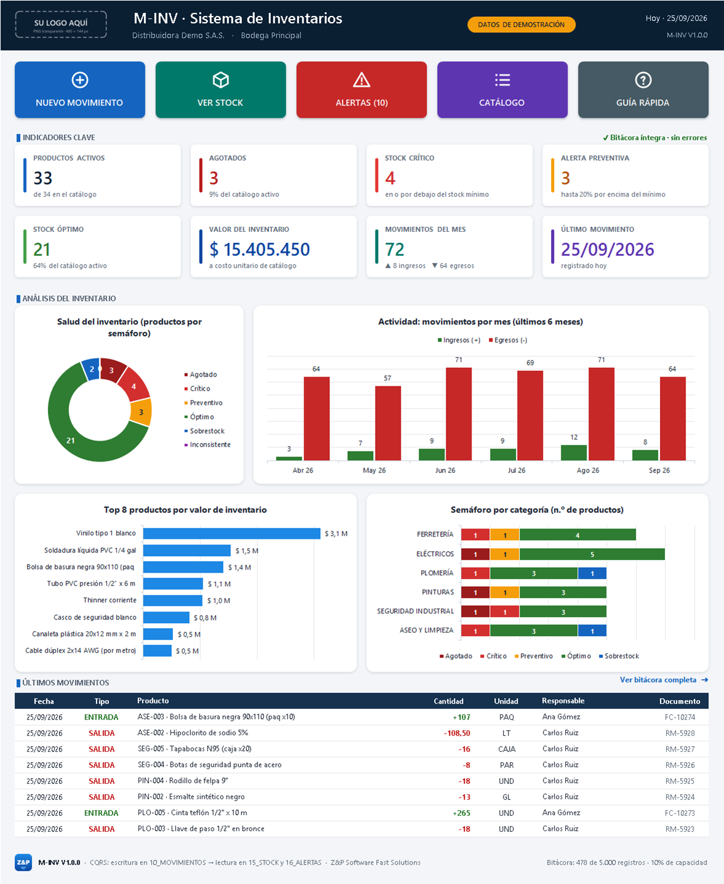

# ZP-MINV-Platform · M-INV V1

**Sistema de inventarios B2B de Z&P Software Fast Solutions.** La V1 corre en **Excel local**, pero está
arquitectada como una aplicación transaccional inmutable (CQRS, *append-only*) con experiencia tipo app, lista
para migrar a SQL/.NET en la V2.



## Entregables de la rama `Inventario-V1`

| Archivo | Para quién | Contenido |
|---|---|---|
| [`src/M-INV_V1_Core.xlsx`](src/M-INV_V1_Core.xlsx) | Equipo Z&P (maestro de desarrollo) | Sistema completo con **datos de demostración** (34 productos, ~480 movimientos). Capas de configuración ocultas (no bloqueadas). |
| [`releases/M-INV_V1_Produccion_Bloqueado.xlsx`](releases/M-INV_V1_Produccion_Bloqueado.xlsx) | Cliente final | Plantilla **limpia**: fórmulas ocultas, configuración y motor en *muy oculto*, estructura del libro bloqueada. |

Ambos libros se **generan** desde código (`tools/build_minv.py`) y se **verifican** en Excel real
(`tools/verify_minv.ps1`). No se editan a mano.

## Estructura del repositorio

```text
ZP-MINV-Platform/
├── .claude/
│   └── excel-architecture-rules.md   Reglas estrictas CQRS para Excel (normativas para agentes)
├── CLAUDE.md                          Contexto que Claude Code carga automáticamente (importa las reglas)
├── docs/
│   ├── product/
│   │   ├── ux-ui-guidelines.md        Paleta, tipografía, retícula, navegación, microcopy, accesibilidad
│   │   └── capturas/                  Vistas previas exportadas desde Excel por el verificador
│   └── architecture/
│       └── data-dictionary.md         Entidades, campos, reglas, ER y mapeo a SQL
├── assets/
│   ├── icons/                         Iconos de navegación (SVG fuente + PNG @2x blanco/tinta)
│   └── branding/                      Marca Z&P y placeholder del logo del cliente (SVG + PNG)
├── src/
│   ├── macros/                        VBA opcional (modo app: ocultar barra de fórmulas) — requiere .xlsm
│   └── M-INV_V1_Core.xlsx             Archivo maestro del sistema
├── releases/
│   └── M-INV_V1_Produccion_Bloqueado.xlsx
├── tools/
│   ├── build_minv.py                  Generador del libro (Excel-as-code)
│   ├── demo_data.py                   Catálogos base + simulación de datos demo
│   ├── make_assets.py                 Generador de iconos y branding
│   ├── verify_minv.ps1                Verificación en Excel real (COM)
│   └── requirements.txt
└── README.md
```

## Arquitectura en un minuto

```text
05_PRODUCTOS ──listas──► 10_MOVIMIENTOS ──SUMAR.SI.CONJUNTO──► 15_STOCK ──► 16_ALERTAS ──► 00_PORTADA
 (maestro)               (escritura, append-only)              (proyección)  (priorizada)   (tablero)
                          Cantidad × FactorStock (+1/−1)
01_CONFIG · 03_CATEGORIAS · 06_UNIDADES (configuración oculta) · 90_LISTAS · 91_KPIS (motor oculto)
```

- **Escritura:** el inventario solo cambia agregando filas a `10_MOVIMIENTOS`. Nunca se borra ni se edita una fila;
  los errores se corrigen con un `AJUSTE (+/-)` justificado.
- **Lectura:** `15_STOCK`, `16_ALERTAS` y el tablero se calculan solos a partir de la bitácora.
- **Integridad:** el operador nunca escribe un SKU ni un nombre de producto: listas en cascada
  *Categoría → Producto*, búsquedas `INDICE+COINCIDIR` y una columna `Estado` que valida cada registro.

Detalle normativo en [`.claude/excel-architecture-rules.md`](.claude/excel-architecture-rules.md) y modelo de datos en
[`docs/architecture/data-dictionary.md`](docs/architecture/data-dictionary.md).

## Uso (operador)

1. Abra el libro: inicia en la **portada** (tablero).
2. **Nuevo movimiento** lleva a la siguiente fila libre de la bitácora (resaltada en azul).
3. Diligencie solo las celdas blancas (✎): Fecha (`Ctrl + ;`), Tipo, Categoría, Producto, Cantidad, Responsable.
4. Revise que `Estado` diga **✔ Registrado**. El stock, las alertas y el tablero se actualizan solos.

La hoja **99_AYUDA** explica todo el flujo con ejemplos, colores y preguntas frecuentes.

## Desarrollo

Requisitos: Windows, Python 3.11+ y Excel 2016 o superior (para verificar).

```powershell
python -m venv .venv
.venv\Scripts\python -m pip install -r tools\requirements.txt
.venv\Scripts\python tools\build_minv.py                      # genera Core y Release
powershell -ExecutionPolicy Bypass -File tools\verify_minv.ps1 -Path src\M-INV_V1_Core.xlsx -PreviewDir docs\product\capturas -Save
powershell -ExecutionPolicy Bypass -File tools\verify_minv.ps1 -Path releases\M-INV_V1_Produccion_Bloqueado.xlsx -Save
```

`verify_minv.ps1` recalcula en Excel y falla si encuentra errores de fórmula, diferencias entre el stock proyectado y
la suma independiente de la bitácora, productos fuera de su lista en cascada o botones que no navegan. Con `-Save`
guarda el libro recalculado (así las vistas previas de Outlook, Teams o el móvil muestran valores).

### Contraseñas de protección

| Variable | Uso | Por defecto |
|---|---|---|
| `MINV_PASSWORD` | Hojas del Core | `minv-dev` (solo desarrollo) |
| `MINV_RELEASE_PASSWORD` | Hojas y estructura del Release | si no se define, usa la del Core y lo avisa |

Defina `MINV_RELEASE_PASSWORD` antes de generar un entregable real. La protección de Excel evita daños
accidentales; no es un mecanismo de seguridad de la información.

### Compatibilidad

Excel 2016 o superior en Windows (probado en Microsoft 365, build 16.0.20326, configuración en español). No se
usan funciones exclusivas de 365 (`BUSCARX`, `FILTRAR`, `LET`…) ni `TEXTO()` con códigos dependientes del idioma.

## Decisiones clave de esta fase

- **Excel-as-code**: el libro es reproducible y revisable en Git (diffs del generador, no de binarios).
- **Tablas pre-asignadas** (500 productos, 5.000 movimientos) porque Excel no expande tablas en hojas protegidas.
- **`INDICE+COINCIDIR` en lugar de `BUSCARX`/`BUSCARV`**: misma función, compatible con Excel 2016 e inmune al
  orden de columnas.
- **Barra de fórmulas**: es una opción de aplicación que un `.xlsx` no puede guardar; se entrega el módulo VBA
  opcional en `src/macros/` y, en el Release, las fórmulas quedan ocultas.

## Hoja de ruta

- **V1.1** · Libro `.xlsm` opcional: modo app (barra de fórmulas), sellado de filas registradas, cierre de período asistido.
- **V1.2** · Multi-bodega (`02_BODEGAS`) y traslados (`11_TRASLADOS`), kardex por producto (`17_KARDEX`).
- **V2** · Migración a SQL + .NET siguiendo el mapeo del diccionario de datos.

---
© Z&P Software Fast Solutions · M-INV V1.0.0
