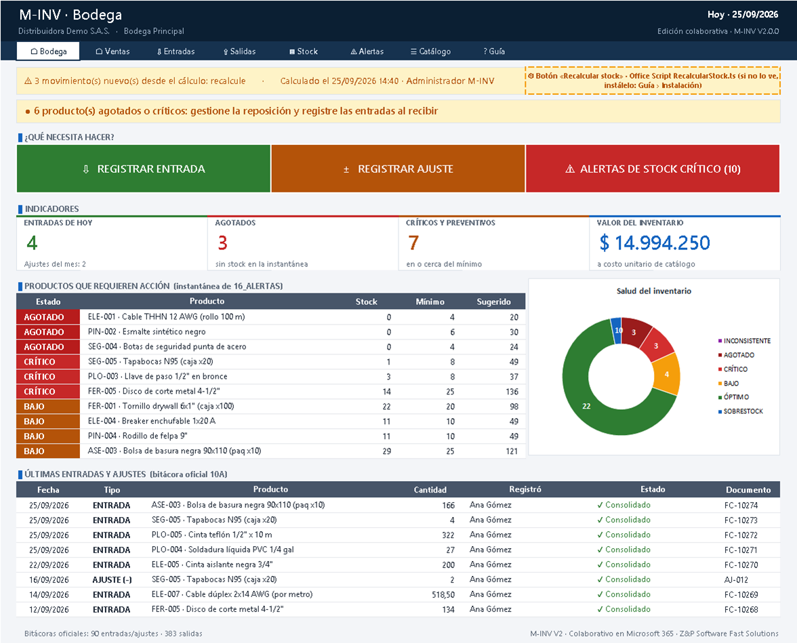

# ZP-MINV-Platform · M-INV V2 (colaborativo)

**Sistema de inventarios B2B de Z&P Software Fast Solutions.** La **V2** lleva M-INV a la nube: un solo libro en
SharePoint/OneDrive que Bodega y Ventas usan **al mismo tiempo** desde Excel para la web, sin pisarse, con registros
auditados por correo de Microsoft 365 y lógica en **Office Scripts** (TypeScript). La edición local **V1.2**
(`.xlsx`/`.xlsm`) sigue disponible para quien trabaja sin conexión.



## Entregables de la rama `Inventario-V2`

| Archivo | Para quién | Contenido |
|---|---|---|
| [`src/M-INV_V2_Colaborativo.xlsx`](src/M-INV_V2_Colaborativo.xlsx) | Equipo Z&P | Libro colaborativo con **datos de demostración** (6 usuarios, 34 productos, 90 entradas/ajustes, 383 salidas) |
| [`releases/M-INV_V2_Colaborativo_Produccion.xlsx`](releases/M-INV_V2_Colaborativo_Produccion.xlsx) | Cliente | Plantilla limpia y blindada para subir a SharePoint |
| [`src/office-scripts/`](src/office-scripts/) | Administrador | `RegistrarEntrada.ts`, `RegistrarSalida.ts`, `RecalcularStock.ts`, `DiagnosticoInstalacion.ts` |
| [`docs/deployment/sharepoint-rbac-policies.md`](docs/deployment/sharepoint-rbac-policies.md) | Administrador | Roles, permisos de SharePoint, protección de rangos y publicación paso a paso |
| [`.claude/v2-concurrency-rules.md`](.claude/v2-concurrency-rules.md) | Equipo / agentes | Reglas de coautoría: fragmentación, auditoría, lectura a demanda |
| `src/M-INV_V1_Core.xlsx/.xlsm`, `releases/M-INV_V1_*` | Uso local | Edición V1.2 (Estándar sin macros y Plus con VBA) |

## Cómo evita la V2 los choques de coautoría

La coautoría de Excel fusiona cambios **por celda**: si dos personas escriben en la misma celda, gana la última. Por eso
la V2 fragmenta la escritura en tres niveles y saca los cálculos pesados del tiempo real:

```text
 POR DOMINIO                  POR USUARIO                         POR OPERACIÓN
 10A_ENTRADAS (Bodega)  ──►   zona de CAPTURA: una fila por  ──►   BITÁCORA OFICIAL (tblEntradas / tblSalidas)
 10B_SALIDAS  (Ventas)        persona (nadie comparte celdas)      solo la escribe el Office Script: Table.addRow
                              validación y disponible en vivo      (atómico), ID sin contador, Usuario_O365, Timestamp
                                                                            │
                                                  RecalcularStock.ts ◄──────┘  15_STOCK · 16_ALERTAS = instantánea
```

1. **Fragmentos por dominio**: Bodega y Ventas no comparten hoja, tabla ni fila.
2. **Filas de captura por usuario**: cada persona escribe solo en su fila (asignada por su correo en `02_USUARIOS`).
3. **Consolidación por script**: el botón agrega el movimiento al final de la bitácora oficial con una inserción atómica
   del servidor y un ID que no depende de un contador compartido; dos registros simultáneos son dos filas.
4. **Doble control de stock**: el formato condicional tiñe de **rojo sangre con texto blanco tachado** una salida mayor
   que el disponible y el script la **bloquea**; si otra persona se adelantó, el script marca su propio registro
   «✖ Rechazado» y no suma.
5. **Lectura a demanda**: stock y alertas son una instantánea de valores que se recalcula con un botón; las portadas
   avisan cuándo hay movimientos nuevos. El libro no se pone lento aunque muchos trabajen a la vez.

## Hojas del libro colaborativo

| Hoja | Rol | Para qué sirve |
|---|---|---|
| `00_PORTADA_BODEGA` | Bodega | Registrar entrada, registrar ajuste, alertas de stock crítico, indicadores, últimos movimientos |
| `00_PORTADA_VENTAS` | Ventas | Registrar salida, consultar disponibilidad, agotados, salidas de los últimos 7 días |
| `02_USUARIOS` | Admin | Correos autorizados y rol (ADMIN, BODEGA, VENTAS, CONSULTA) |
| `04_PROVEEDORES`, `05_PRODUCTOS` | Admin | Maestros (los de la V1.2) |
| `10A_ENTRADAS` | Bodega | Captura por usuario + bitácora oficial de entradas, saldo inicial y ajustes |
| `10B_SALIDAS` | Ventas | Captura por usuario + bitácora oficial de salidas |
| `15_STOCK`, `16_ALERTAS` | Todos | Instantánea de stock y alertas priorizadas (botón «Recalcular stock») |
| `99_AYUDA` | Todos | Guía por rol, primeros pasos (se marcan solos) e instalación |

Ocultas: `01_CONFIG`, `03_CATEGORIAS`, `06_UNIDADES`, `90_LISTAS`, `91_KPIS` y `92_SESION` (técnica, sin proteger:
los scripts la usan para identificar al usuario).


## Publicar en Microsoft 365 (resumen)

1. Generar el Release con su contraseña: `$env:MINV_RELEASE_PASSWORD='…'; powershell -ExecutionPolicy Bypass -File tools\build_v2.ps1`.
2. Subirlo a una biblioteca de SharePoint (Editar: Admin, Bodega, Ventas; Leer: Consulta).
3. Registrar a cada persona en `02_USUARIOS` con su correo y rol.
4. Pegar los scripts de `build/office-scripts/release/` en *Automatizar › Nuevo script* y ejecutar
   `DiagnosticoInstalacion`.
5. Agregar los botones sobre los recuadros amarillos `⚙` y pulsar «Recalcular stock».

Guía completa: [`docs/deployment/sharepoint-rbac-policies.md`](docs/deployment/sharepoint-rbac-policies.md).

## Estructura del repositorio

```text
ZP-MINV-Platform/
├── .claude/
│   ├── excel-architecture-rules.md      Reglas CQRS para Excel (V1.x)
│   └── v2-concurrency-rules.md          Reglas de coautoría y fragmentación (V2; prevalecen en el libro colaborativo)
├── CLAUDE.md · CHANGELOG.md · README.md
├── docs/
│   ├── architecture/data-dictionary.md       Modelo V1.2
│   ├── architecture/data-dictionary-v2.md    Modelo V2 (usuarios, captura, bitácoras, instantáneas)
│   ├── deployment/sharepoint-rbac-policies.md Matriz de roles, protección de rangos y publicación
│   └── product/                               Guía UX y capturas (v2/ = libro colaborativo)
├── src/
│   ├── office-scripts/                  Office Scripts (TypeScript) + lib/comun.ts (bloque compartido)
│   ├── macros/                          VBA de la edición Plus V1.2
│   ├── M-INV_V2_Colaborativo.xlsx       Libro colaborativo · Core (demo)
│   └── M-INV_V1_Core.xlsx/.xlsm         Edición local V1.2
├── releases/                            Release V2 y Releases V1.2
├── tests/office-scripts/                Simulador de ExcelScript y pruebas de los scripts (Node)
└── tools/
    ├── build_minv_v2.py + minv2/        Generador del libro colaborativo
    ├── office_scripts.py                Sincroniza el bloque común y genera los scripts instalables
    ├── verify_minv_v2.ps1               Verificación del libro V2 en Excel real
    ├── build_v2.ps1                     Ciclo completo V2 (definición de terminado)
    └── build_minv.py + minv/ …          Generador, verificadores y ciclo de la V1.2 (build_all.ps1)
```

## Desarrollo

Requisitos: Windows con Excel 2016+ (para verificar), Python 3.11+ y Node.js 22.18+ (pruebas de los scripts).

```powershell
python -m venv .venv
.venv\Scripts\python -m pip install -r tools\requirements.txt
powershell -ExecutionPolicy Bypass -File tools\build_v2.ps1 -Capturas     # V2: generar, probar y verificar (≈ 5 min)
powershell -ExecutionPolicy Bypass -File tools\build_all.ps1 -Capturas    # V1.2 local (Estándar y Plus)
```

`build_v2.ps1`: genera Core y Release, comprueba el bloque común de los scripts, ejecuta las pruebas de los Office
Scripts contra el simulador de `ExcelScript`, verifica ambos libros en Excel real (errores de fórmula, auditoría e IDs,
instantánea = recálculo independiente, disponible exacto, poka-yoke, protección, navegación) y genera los scripts
instalables en `build/office-scripts/`.

### Contraseñas

| Variable | Uso | Por defecto |
|---|---|---|
| `MINV_PASSWORD` | Hojas del Core y scripts del Core | `minv-dev` (solo desarrollo) |
| `MINV_RELEASE_PASSWORD` | Hojas y estructura del Release y sus scripts instalables | si falta, la del Core (con aviso) |
| `MINV_V2_PWD_BODEGA` / `MINV_V2_PWD_VENTAS` | Contraseña opcional de los rangos de captura por rol | sin contraseña |

La protección de Excel evita errores, no ataques; la seguridad real es el permiso de SharePoint y la trazabilidad
(`Usuario_O365`, `Timestamp`, historial de versiones).

## Decisiones clave de la V2

- **Fragmentación triple** (dominio, usuario, operación) en lugar de una tabla compartida: elimina las colisiones de
  celda que corrompen datos en la coautoría.
- **Instantánea a demanda en lugar de cálculo manual del libro**: el modo manual en Excel es por libro y por sesión (no
  por hoja) y congelaría el disponible y el poka-yoke; la instantánea logra el objetivo (nada pesado en vivo) sin ese
  costo. `RecalcularStock` además dispara un recálculo completo.
- **Identidad por comentario temporal**: la API de Office Scripts no expone el usuario; el autor de un comentario sí.
- **RBAC en capas**: Excel para la web no restringe rangos por correo, así que el correo lo valida el script contra
  `02_USUARIOS`; SharePoint decide quién edita el archivo.
- **Interfaz de celdas**: en la web los vínculos de formas no son fiables; botones y navegación son celdas.

## Hoja de ruta

- **V2.1** · Consulta por producto y pedido por proveedor con Vistas de hoja; conteo físico colaborativo.
- **V3** · Migración a SQL + .NET: las dos bitácoras tienen el mismo esquema y se unen sin transformación
  (ver los diccionarios de datos).

---
© Z&P Software Fast Solutions · M-INV V2.0.0 (edición local V1.2.0)
