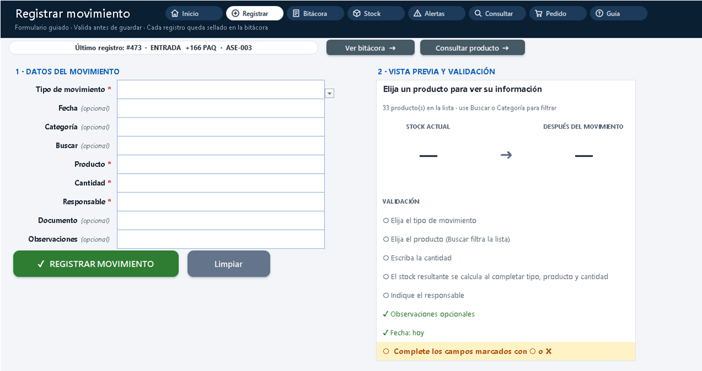

# ZP-MINV-Platform · M-INV V1.2

**Sistema de inventarios B2B de Z&P Software Fast Solutions.** La V1 corre en **Excel local**, pero está
arquitectada como una aplicación transaccional inmutable (CQRS, *append-only*) con experiencia tipo app, lista
para migrar a SQL/.NET en la V2. La **V1.2** agrega consulta de productos, pedido sugerido, proveedores, toma física,
un asistente de «próximo paso» y, en la edición Plus, un formulario guiado con registros sellados.


## Entregables de la rama `Inventario-V1.2`

| Archivo | Edición | Para quién | Contenido |
|---|---|---|---|
| [`src/M-INV_V1_Core.xlsx`](src/M-INV_V1_Core.xlsx) | Estándar | Equipo Z&P | Sistema completo con **datos de demostración** (34 productos, 6 proveedores, 473 movimientos). |
| [`releases/M-INV_V1_Produccion_Bloqueado.xlsx`](releases/M-INV_V1_Produccion_Bloqueado.xlsx) | Estándar | Cliente | Plantilla **limpia y blindada**: fórmulas ocultas, configuración y motor en *muy oculto*, estructura bloqueada. |
| [`src/M-INV_V1_Core.xlsm`](src/M-INV_V1_Core.xlsm) | **Plus** | Equipo Z&P | Core + formulario guiado, sellado, ajustes automáticos del conteo, doble clic y modo app (bitácora demo sellada). |
| [`releases/M-INV_V1_Produccion_Bloqueado.xlsm`](releases/M-INV_V1_Produccion_Bloqueado.xlsm) | **Plus** | Cliente | Release blindado con las automatizaciones de la edición Plus. |

Todos se **generan** desde código y se **verifican** en Excel real (`tools/build_all.ps1`). No se editan a mano.

### ¿Estándar o Plus?

| Función | Estándar `.xlsx` | Plus `.xlsm` |
|---|:---:|:---:|
| Tablero con asistente «Próximo paso», mosaicos y navegación con iconos | ✔ | ✔ |
| Bitácora con listas en cascada y validación por fila (`Estado`) | ✔ | ✔ |
| Consulta de producto (kardex), pedido sugerido, proveedores, alertas | ✔ | ✔ |
| Toma física: diferencias, valor y ajuste sugerido | ✔ | ✔ |
| **Formulario guiado** con búsqueda, vista previa y validación en vivo | — | ✔ |
| **Sellado**: los registros correctos quedan bloqueados (en gris) | — | ✔ |
| **Generar ajustes** del conteo con un clic | manual | ✔ |
| **Doble clic**: alerta/pedido → reposición · stock/bitácora → consulta | — | ✔ |
| Barra de fórmulas oculta en la portada (modo app) | — | ✔ |
| Funciona con las macros deshabilitadas o bloqueadas por la empresa | ✔ | parcial¹ |

¹ Sin macros, el `.xlsm` funciona como la edición Estándar y el formulario muestra un aviso para habilitarlas.



Más capturas en [`docs/product/capturas/`](docs/product/capturas/) (edición Plus en `plus/`).

## Qué hace cada hoja

| Hoja | Para qué sirve |
|---|---|
| `00_PORTADA` | Tablero: próximo paso, 8 accesos, 8 indicadores, 4 gráficos y últimos movimientos. |
| `04_PROVEEDORES` | Maestro de proveedores (contacto, correo, días de entrega) con productos y alertas por proveedor. |
| `05_PRODUCTOS` | Catálogo (SKU, categoría, unidad, mínimos/máximos, costo, proveedor, ubicación). |
| `10_MOVIMIENTOS` | **Bitácora**: única hoja donde cambia el inventario (entradas, salidas, ajustes, saldo inicial). |
| `12_REGISTRO` | *(Plus)* Formulario guiado que escribe y sella en la bitácora. |
| `13_CONTEO` | Toma física: conteo contra sistema y ajustes. |
| `15_STOCK` | Stock por producto: semáforo, valor, último movimiento, días sin rotación. |
| `16_ALERTAS` | Productos que requieren acción, priorizados, con proveedor y cantidad sugerida. |
| `17_KARDEX` | Consulta de un producto: ficha, gráfico de evolución e historial. |
| `18_PEDIDO` | Pedido sugerido por proveedor, listo para imprimir o enviar. |
| `99_AYUDA` | Guía por perfil, primeros pasos (se marcan solos), colores, atajos y preguntas frecuentes. |

Capas ocultas: `01_CONFIG`, `03_CATEGORIAS`, `06_UNIDADES` (configuración) y `90_LISTAS`, `91_KPIS` (motor).

## Estructura del repositorio

```text
ZP-MINV-Platform/
├── .claude/excel-architecture-rules.md   Reglas estrictas CQRS para Excel (normativas para agentes)
├── CLAUDE.md                              Contexto que Claude Code carga automáticamente (importa las reglas)
├── CHANGELOG.md                           Historial de versiones
├── docs/
│   ├── product/ux-ui-guidelines.md        Paleta, tipografía, retícula, navegación, componentes, microcopy
│   ├── product/capturas/                  Vistas previas exportadas desde Excel (plus/ = hojas de la edición Plus)
│   └── architecture/data-dictionary.md    Entidades, campos, reglas, ER y mapeo a SQL
├── assets/icons · assets/branding         Iconos (SVG + PNG @2x) y marca
├── src/
│   ├── macros/                            VBA de la edición Plus (UTF-8) — ver src/macros/README.md
│   ├── M-INV_V1_Core.xlsx                 Core · Estándar
│   └── M-INV_V1_Core.xlsm                 Core · Plus
├── releases/
│   ├── M-INV_V1_Produccion_Bloqueado.xlsx Release · Estándar
│   └── M-INV_V1_Produccion_Bloqueado.xlsm Release · Plus
└── tools/
    ├── build_minv.py                      Generador (Excel-as-code); el código vive en tools/minv/ (un módulo por capa)
    ├── demo_data.py                       Catálogos base + simulación de datos demo
    ├── make_assets.py                     Generador de iconos y branding
    ├── build_xlsm.ps1                     Construye la edición Plus e instala/prueba el VBA en Excel
    ├── verify_minv.ps1                    Verificación del motor de fórmulas en Excel real (COM)
    ├── build_all.ps1                      Ciclo completo: generar → Plus → verificar → capturas
    └── requirements.txt
```

## Arquitectura en un minuto

```text
04_PROVEEDORES ─┐
05_PRODUCTOS ───┴─listas─► 10_MOVIMIENTOS ──SUMAR.SI.CONJUNTO──► 15_STOCK ──► 16_ALERTAS ──► 18_PEDIDO
 (maestros)          ▲     (escritura, append-only)              (proyección) │              (compra sugerida)
                     │      Cantidad × FactorStock (+1/−1)                    ├──► 17_KARDEX (consulta)
 12_REGISTRO (Plus) ─┤                                                        └──► 00_PORTADA (tablero)
 13_CONTEO ──────────┘ ajustes (comandos que escriben en la bitácora)
01_CONFIG · 03_CATEGORIAS · 06_UNIDADES (configuración oculta) · 90_LISTAS · 91_KPIS (motor oculto)
```

- **Escritura:** el inventario solo cambia agregando filas a `10_MOVIMIENTOS`. El formulario y el conteo son
  *comandos* que escriben ahí; nunca tocan el stock. Los errores se corrigen con un `AJUSTE (+/-)` justificado.
- **Lectura:** stock, alertas, consulta, pedido y tablero se calculan solos a partir de la bitácora.
- **Integridad:** el operador nunca escribe un SKU ni un nombre de producto (listas en cascada y búsqueda por texto);
  la columna `Estado` valida cada registro y, en Plus, los registros correctos quedan sellados.

Detalle normativo en [`.claude/excel-architecture-rules.md`](.claude/excel-architecture-rules.md) y modelo de datos en
[`docs/architecture/data-dictionary.md`](docs/architecture/data-dictionary.md).

## Uso diario

| Perfil | Empiece en | Qué hace |
|---|---|---|
| Bodega | **Registrar** | Registra entradas y salidas (Plus: formulario; Estándar: siguiente fila libre de la bitácora). |
| Compras | **Pedido** | Revisa el pedido sugerido, filtra por proveedor e imprime o envía. |
| Gerencia | **Portada** | Lee el próximo paso, los indicadores y los productos sin rotación. |
| Administración | **Guía → Primeros pasos** | Configura empresa, catálogo, proveedores y saldo inicial; hace la toma física. |

La portada siempre muestra el **próximo paso** recomendado con un botón que lleva al lugar exacto.
La hoja **99_AYUDA** explica todo con ejemplos, colores, atajos y preguntas frecuentes.

### Habilitar las macros (edición Plus)

Si el formulario muestra el aviso amarillo, las macros están bloqueadas: cierre el libro, clic derecho en el archivo →
*Propiedades* → marque **Desbloquear** → *Aceptar*, y ábralo pulsando **Habilitar contenido**. Mientras tanto puede
registrar directamente en la bitácora (todo lo demás funciona igual).

## Desarrollo

Requisitos: Windows, Python 3.11+ y Excel 2016 o superior. Para construir la edición Plus active temporalmente
*Archivo → Opciones → Centro de confianza → Configuración → Configuración de macros → Confiar en el acceso al modelo
de objetos de proyectos de VBA* (desactívelo al terminar).

```powershell
python -m venv .venv
.venv\Scripts\python -m pip install -r tools\requirements.txt
powershell -ExecutionPolicy Bypass -File tools\build_all.ps1 -Capturas     # ciclo completo (≈ 10 min)
```

`build_all.ps1` ejecuta en orden:

1. `tools/build_minv.py` — genera la edición Estándar (Core y Release) y las bases de la edición Plus en `build/`.
2. `tools/build_xlsm.ps1` — instala el VBA, guarda los `.xlsm` y **prueba el VBA en Excel** (registro válido e
   inválido, sellado, reposición, consulta, conteo → ajustes, guardado, cierre y reapertura sin macros).
3. `tools/verify_minv.ps1` sobre los 4 entregables — recalcula en Excel y falla ante errores de fórmula, diferencias
   entre el stock y la suma independiente de la bitácora, listas en cascada o búsquedas incorrectas, kardex, pedido o
   conteo inconsistentes y botones que no navegan.
4. Con `-Capturas`, exporta las vistas previas a `docs/product/capturas/`.

Opciones: `-FinDemo AAAA-MM-DD` fija la fecha final de la simulación demo; `-SinPlus` omite la edición Plus.

### Contraseñas de protección

| Variable | Uso | Por defecto |
|---|---|---|
| `MINV_PASSWORD` | Hojas del Core (y del VBA del Core) | `minv-dev` (solo desarrollo) |
| `MINV_RELEASE_PASSWORD` | Hojas, estructura y VBA del Release | si no se define, usa la del Core y lo avisa |

Defina `MINV_RELEASE_PASSWORD` antes de generar un entregable real. La protección de Excel evita daños
accidentales; no es un mecanismo de seguridad de la información. En la edición Plus la contraseña queda en el
proyecto VBA (lo necesita para escribir en hojas protegidas): antes de entregar un Release Plus, bloquee el proyecto
en el Editor de VBA (*Herramientas → Propiedades de VBAProject → Protección*).

### Compatibilidad

Excel 2016 o superior en Windows (probado en Microsoft 365, build 16.0.20326, configuración en español). No se
usan funciones exclusivas de 365 (`BUSCARX`, `FILTRAR`, `LET`…) ni `TEXTO()` con códigos dependientes del idioma.
La edición Plus requiere Excel de escritorio para Windows (las macros no corren en Excel web ni en móviles; ahí el
libro funciona como la edición Estándar).

## Decisiones clave

- **Excel-as-code**: el libro es reproducible y revisable en Git (diffs del generador, no de binarios).
- **Tablas pre-asignadas** (500 productos, 100 proveedores, 5.000 movimientos) porque Excel no expande tablas en
  hojas protegidas.
- **`INDICE+COINCIDIR` y `AGREGAR`** en lugar de `BUSCARX`/`FILTRAR`: compatibles con Excel 2016.
- **Dos ediciones desde un mismo generador**: la Estándar funciona donde las macros están prohibidas; la Plus agrega
  comodidad sin cambiar el modelo (el formulario escribe en la misma bitácora con las mismas validaciones).
- **Sellado en VBA**: una hoja protegida no distingue filas «nuevas» de «registradas»; la edición Plus bloquea cada
  registro correcto al guardarlo y lo muestra en gris.

## Hoja de ruta

- **V1.3** · Multi-bodega (`02_BODEGAS`) y traslados (`11_TRASLADOS`); cierre de período asistido.
- **V2** · Migración a SQL + .NET siguiendo el mapeo del diccionario de datos.

---
© Z&P Software Fast Solutions · M-INV V1.2.0
