# ZP-MINV-Platform · M-INV V4 (multi-sucursal en la nube) · V3.1 (escritorio + PostgreSQL) · V2.1 (colaborativo)

> **¿Por dónde empiezo?** Lea la [guía de inicio de las cuatro ediciones](GUIA-DE-INICIO.md): Excel local, Excel
> compartido, escritorio con base local y escritorio con base en la nube y facturación SIAT (V4.1, en desarrollo).

**Sistema de inventarios y punto de venta B2B de Z&P Software Fast Solutions.** La **V4** convierte M-INV en una
plataforma **multi-sucursal en la nube**: cada sucursal ve y opera solo lo suyo, la mercadería viaja entre sucursales
con **transferencias en tránsito**, el escritorio trabaja **por internet** contra un servidor M-INV y la tienda en línea
o el ERP se integran por un **API Gateway B2B** con API Keys y **webhooks firmados** (PostgreSQL gestionado en
DigitalOcean, AWS RDS o Supabase; **110 tablas** en 8 esquemas). La **V3** llevó M-INV de Excel a una arquitectura
cliente-servidor: solución **.NET 8** en Clean Architecture (dominio rico, CQRS con MediatR), base de datos
**PostgreSQL** multi-empresa normalizada hasta 5FN, cliente de escritorio **WPF** y módulo de hardware **ESC/POS**,
construida sobre el modelo de la **V2.1** (su importador migra el libro colaborativo y verifica la paridad). La V2.1
(Excel en Microsoft 365) y la V1.2 (Excel local) siguen en el repositorio.

> **¿Cómo la ejecuto?** V4: siga [`docs/deployment/inicio-rapido-v4.md`](docs/deployment/inicio-rapido-v4.md): base
> local con 3 sucursales y datos de prueba (`tools\bd_local.ps1 -Accion recrear`), `M-INV.exe` en modo «Base local»,
> la nube simulada en su equipo (`tools\servidores_locales.ps1 -Accion iniciar`) y el API con `curl`; para una nube
> real, [`docs/deployment/despliegue-nube-v4.md`](docs/deployment/despliegue-nube-v4.md). V3.1:
> [`docs/deployment/inicio-rapido-v3.md`](docs/deployment/inicio-rapido-v3.md). Interfaz:
> [`docs/product/escritorio-v3.1.md`](docs/product/escritorio-v3.1.md). Modelo de datos (V3 y V4):
> [`docs/database/ERD-MINV-V3.md`](docs/database/ERD-MINV-V3.md).

## M-INV V4 · rama `Inventario-V4.-BaseDeDatosNube` (4.0.0-alpha.1) · multi-sucursal en la nube

Construida sobre `Inventario-V3.-BaseDeDatosLocal`. Arquitectura completa:
[`docs/architecture/arquitectura-v4.md`](docs/architecture/arquitectura-v4.md).

```text
  M-INV.exe «Base local» ── PostgreSQL (minv_app) ─────────────────────────────┐
  M-INV.exe «Nube» ── https ──► MINV.CloudServer (login · RPC · idempotencia) ──┤  mismos casos de uso,
  Tienda / ERP ── API Key ───► MINV.ApiGateway (/v1 · webhooks · reportes) ─────┤  rol minv_server (sin BYPASSRLS)
                                                                                 ▼
             PostgreSQL gestionado: 110 tablas · RLS por empresa Y por sucursal · outbox · réplica de lectura
```

| Parte | Contenido |
|---|---|
| Multi-sucursal | `IBranchScoped` / `IInterBranch`: stock, documentos, cajas y asientos de cada sucursal aislados por filtros de EF Core, guardas, FK compuestas con la sucursal y Row Level Security RESTRICTIVA; gerencia global (`corporate.branches.all`) con «Todas las sucursales»; sucursal activa en la barra superior |
| Transferencias | Pendiente → despachada (**en tránsito**) → recibida (faltantes con motivo) o anulada; manifiesto por lote, bitácora, asientos 1.1.06 / 2.1.04 y stock consolidado que cuenta lo que viaja una sola vez |
| `src/3. Presentation/MINV.CloudServer` | Servidor del escritorio en modo nube: `POST /api/v1/session/login`, `POST /api/v1/rpc`, `POST /api/v1/session/logout`, `GET /api/v1/health` |
| `src/3. Presentation/MINV.ApiGateway` | API B2B `/v1` (catálogo, stock, pedidos idempotentes, transferencias, webhooks, reportes), API Keys con alcances, ProblemDetails, OpenAPI en `/docs`, despachador de webhooks firmados |
| Modelo de lectura | `MinvReadDbContext` + esquema `reporting` (vistas materializadas) para el tablero gerencial, opcionalmente en una réplica (`MINV_DB_READ`) |
| Base de datos | Migración `V4MultiBranchCloud`: 110 tablas, 8 esquemas (`integration`), 108 políticas por empresa, 40 por sucursal, 15 libros append-only, funciones SECURITY DEFINER mínimas |
| Módulos comerciales | `CLOUD_HA` (Bs 12.000 + 1.500/mes), `MULTI_BRANCH` (8.000 + 500), `API_INTEGRATIONS` (6.000 + 400), `GLOBAL_AUDIT` (5.000 + 300) |
| `tests/MINV.Integration.Tests` | Servidor en la nube y gateway reales (Kestrel en loopback) sobre la base en memoria con la empresa multi-sucursal |
| [`.claude/v4-architecture-rules.md`](.claude/v4-architecture-rules.md) | Reglas B-01 a B-17 (alcance, transferencias, outbox, idempotencia, roles, SECURITY DEFINER, migraciones, DoD) |

```powershell
powershell -ExecutionPolicy Bypass -File tools\bd_local.ps1 -Accion recrear              # base local V4: 3 sucursales + datos de prueba
powershell -ExecutionPolicy Bypass -File tools\servidores_locales.ps1 -Accion iniciar    # nube simulada: :5080 (servidor) y :5090 (API)
powershell -ExecutionPolicy Bypass -File tools\bd_nube.ps1 -Accion preparar -Conexion "<cadena del rol dueño>"   # PostgreSQL gestionado
dotnet run --project "src/3. Presentation/MINV.CloudServer" -- --urls http://localhost:5080   # servidor en la nube (MINV_DB = rol minv_server)
dotnet run --project "src/3. Presentation/MINV.ApiGateway" -- --urls http://localhost:5090    # API Gateway (+ MINV_INTEGRATION_KEYS)
dotnet test tests/MINV.Integration.Tests                                                   # pruebas de extremo a extremo de ambos servidores
docker compose -f deploy/docker-compose.yml up -d --build                                  # ambos servidores en contenedores
```

Documentación V4: paso a paso [`docs/deployment/inicio-rapido-v4.md`](docs/deployment/inicio-rapido-v4.md) ·
interfaz del escritorio [`docs/product/escritorio-v4.md`](docs/product/escritorio-v4.md) ·
despliegue [`docs/deployment/despliegue-nube-v4.md`](docs/deployment/despliegue-nube-v4.md) · integradores
[`docs/integration/api-gateway-v1.md`](docs/integration/api-gateway-v1.md) · migraciones
[`.claude/database-migration-guide.md`](.claude/database-migration-guide.md).

## M-INV V3.1 · rama `Inventario-V3.-BaseDeDatosLocal` · base de datos local, más funciones e imágenes (versión anterior)

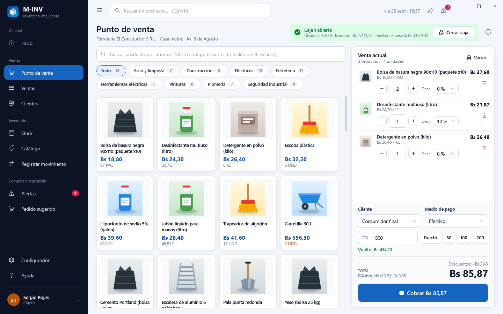

PostgreSQL **local** con las 97 tablas y una empresa de prueba (**MINV**) con 60 días de operación, 9 usuarios de los 6
roles y 61 productos **con imagen**. Cada rol tiene su menú: **punto de venta** (caja, carrito, cobro, ticket, arqueo),
**ventas** con anulación, **clientes**, **catálogo** en galería con editor (combos de categoría, unidad, proveedor,
posición y margen), **stock en galería**, **órdenes de compra** (pedido sugerido → aprobar → recibir), **proveedores**,
**reportes** (ventas, utilidad, compras, movimientos, inventario), **contabilidad** automática (estado de resultados,
libro diario, plan de cuentas, asientos) y **usuarios y roles**.

```powershell
powershell -ExecutionPolicy Bypass -File tools\bd_local.ps1 -Accion recrear   # base local + datos de prueba nuevos
Get-Content $env:LOCALAPPDATA\M-INV\usuarios-prueba.txt                      # empresa, correos y contraseñas de prueba
```

| | |
|---|---|
| 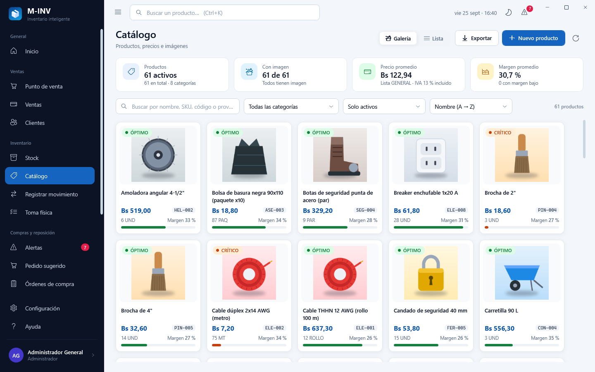 | 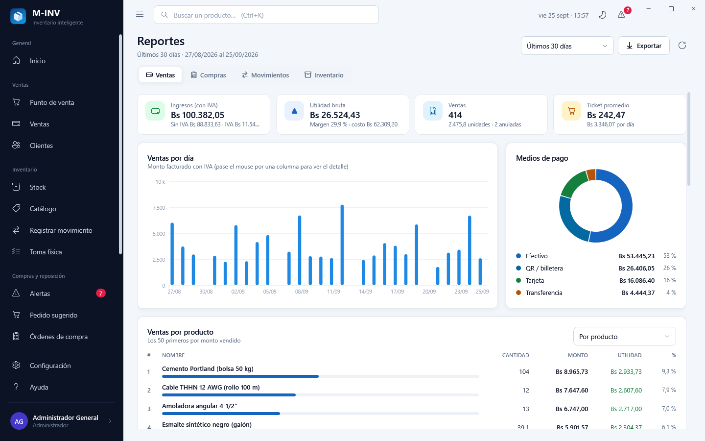 |
| 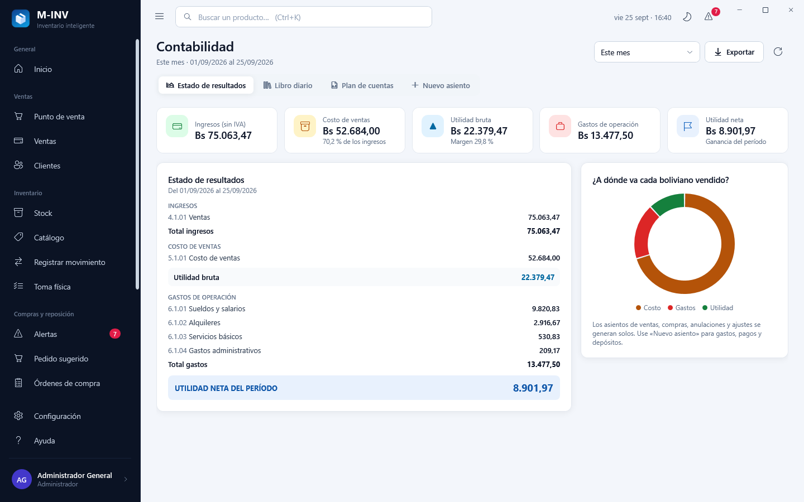 | 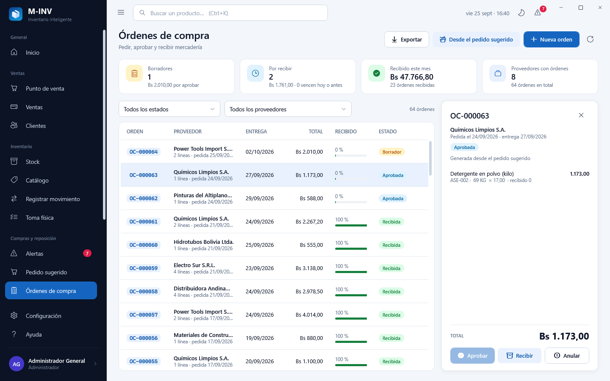 |

## M-INV V3.1 · rama `Inventario-V3.1` (3.1.0-alpha.1) · cliente de escritorio completo

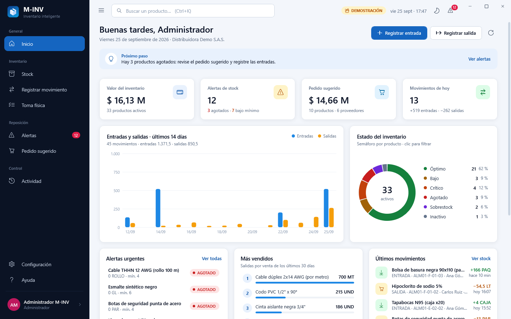

`M-INV.exe` deja de parecer una hoja de cálculo: **pantalla de carga** que comprueba la base de datos, **inicio de
sesión** con demostración y elección de rol, **menú lateral** según los permisos, **tablero** con indicadores y gráficos,
**stock** con chips por estado y exportación a Excel, **registro guiado** con vista previa y el **poka-yoke** rojo sangre
de la V2.1, **toma física** con confirmación, **alertas** y **pedido sugerido** por proveedor, **ficha del producto** con
kardex y gráfico, **actividad**, **configuración** (tema, impresora con página de prueba, escáner) y **ayuda**; tema
**claro y oscuro**, atajos de teclado y lector de códigos en todas las pantallas. Guía con todas las capturas:
[`docs/product/escritorio-v3.1.md`](docs/product/escritorio-v3.1.md).

| | |
|---|---|
| 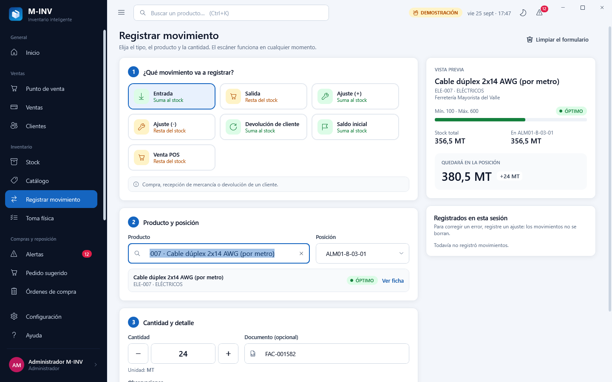 | 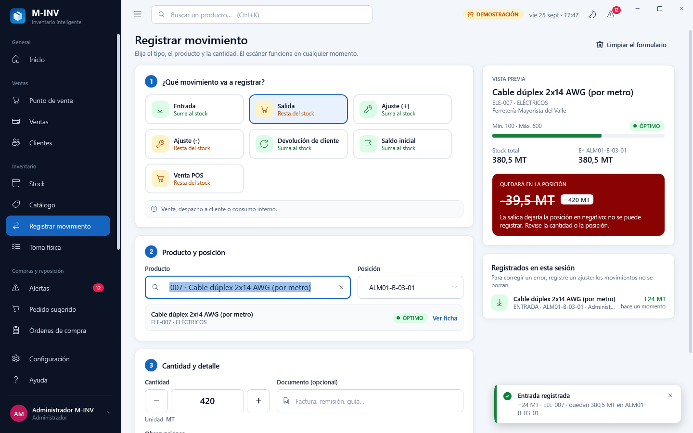 |
| 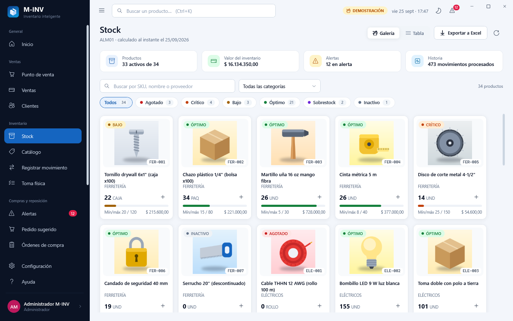 | 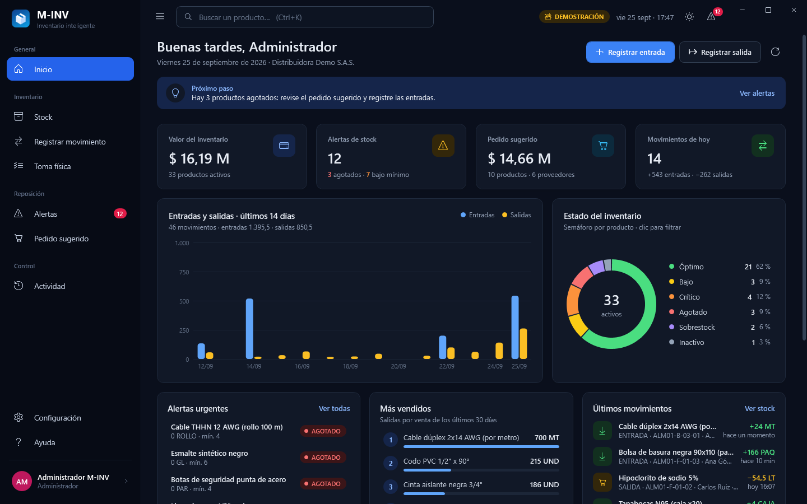 |

```powershell
powershell -ExecutionPolicy Bypass -File tools\publicar_escritorio.ps1          # dist\M-INV-<versión>-win-x64\M-INV.exe
powershell -ExecutionPolicy Bypass -File tools\build_v3.ps1 -Capturas -Publicar # ciclo completo + capturas + ejecutable
```

## M-INV V3 · rama `Inventario-V3` (3.0.0-alpha.1)

| Parte | Contenido |
|---|---|
| [`MINV.sln`](MINV.sln) | Solución .NET 8 (`Directory.Build.props` y `Directory.Packages.props` centralizan marco y versiones) |
| `src/1. Core/MINV.Domain` | 97 entidades en 7 contextos (IAM, catálogo, almacén, inventario, compras, ventas/POS, contabilidad); reglas de stock en `StockLevel`, `Product`, `PhysicalCount`…; cero dependencias |
| `src/1. Core/MINV.Application` | Casos de uso CQRS (MediatR): registrar movimiento con reintento optimista, toma física, stock/alertas/pedido, login, caja POS; tubería validación → RBAC y licencias → auditoría |
| `src/2. Infrastructure/MINV.Infrastructure` | `MINVDbContext` (EF Core + Npgsql), FK compuestas por tenant, `xmin`, filtros globales, interceptores, migraciones, aprovisionamiento e importador de la V2.1 |
| `src/2. Infrastructure/MINV.Hardware` | ESC/POS (acentos PC858, CODE128, QR, cajón, corte), impresoras COM/USB/red y lectores de códigos |
| `src/3. Presentation/MINV.DesktopClient` | Cliente WPF/MVVM `M-INV.exe` (V3.1): pantalla de carga, login y demostración, tablero, stock, registro, toma física, alertas, pedido, ficha, actividad, configuración y ayuda, tema claro/oscuro |
| `src/4. Tools/MINV.Cli` | `minv`: migrate, tenant create, import-v21, user password, verify |
| [`scripts/db_init.sql`](scripts/db_init.sql) | Script idempotente de la base completa (generado) |
| `tests/MINV.*.Tests` | 135 pruebas (128 sin base de datos, incluidas las pantallas del cliente y los datos de prueba en memoria, + 7 contra PostgreSQL real con `MINV_TEST_PG`) y la paridad con la V2.1 |
| [`.claude/v3-architecture-rules.md`](.claude/v3-architecture-rules.md) · [`.claude/database-migration-guide.md`](.claude/database-migration-guide.md) | Reglas A-01 a A-13 y guía de migraciones (esquema y datos V2.1 → V3) |

```powershell
powershell -ExecutionPolicy Bypass -File tools\build_v3.ps1        # compilar, probar, verificar migraciones, regenerar db_init.sql
```

Garantías de diseño: **multi-tenant** (filtro global + FK compuestas `(tenant_id, x_id)` + Row Level Security),
**concurrencia optimista** (`xmin`: dos cajas no pueden vender la misma última unidad), **append-only** (movimientos,
pagos y auditoría inmutables en EF Core y en PostgreSQL), **auditoría** de cada comando (también los rechazados) y
**licencias** por módulo comercial (motor de datos, cliente de escritorio, POS y hardware, RBAC, SLA).

---

# M-INV V2.1 (colaborativo en Microsoft 365)

## Entregables de la rama `Inventario-V2.1`

| Archivo | Para quién | Contenido |
|---|---|---|
| [`src/M-INV_V2_Colaborativo.xlsx`](src/M-INV_V2_Colaborativo.xlsx) | Equipo Z&P / demo | Libro colaborativo con **datos de demostración** (6 usuarios, 34 productos, 90 entradas/ajustes, 383 salidas, 478 ejecuciones auditadas, conteo y consultas de ejemplo) |
| [`releases/M-INV_V2_Colaborativo_Produccion.xlsx`](releases/M-INV_V2_Colaborativo_Produccion.xlsx) | Cliente | Plantilla limpia y blindada para subir a SharePoint |
| [`src/office-scripts/`](src/office-scripts/) | Administrador | `RegistrarEntrada`, `RegistrarSalida`, `RecalcularStock`, `GenerarAjustesConteo`, `ResumenDiario`, `DiagnosticoInstalacion` |
| [`docs/deployment/inicio-rapido.md`](docs/deployment/inicio-rapido.md) | Todos | Paso a paso para entrar, instalar y usar |
| [`docs/deployment/sharepoint-rbac-policies.md`](docs/deployment/sharepoint-rbac-policies.md) | Administrador | Roles, permisos de SharePoint, protección de rangos, publicación y Power Automate |
| [`.claude/v2-concurrency-rules.md`](.claude/v2-concurrency-rules.md) | Equipo / agentes | Reglas de coautoría C-01 a C-16 |
| `src/M-INV_V1_Core.xlsx/.xlsm`, `releases/M-INV_V1_*` | Uso local | Edición V1.2 (Estándar sin macros y Plus con VBA) |

## Cómo evita la V2 los choques de coautoría

La coautoría de Excel fusiona cambios **por celda**: si dos personas escriben en la misma celda, gana la última. Por eso
la V2 fragmenta la escritura en tres niveles y saca los cálculos pesados del tiempo real:

```text
 POR DOMINIO                  POR USUARIO                         POR OPERACIÓN
 10A_ENTRADAS (Bodega)  ──►   zona de CAPTURA: una fila por  ──►   BITÁCORA OFICIAL (tblEntradas / tblSalidas)
 10B_SALIDAS  (Ventas)        persona (nadie comparte celdas)      solo la escribe el Office Script: Table.addRow
                              validación y disponible en vivo      (atómico), ID sin contador, Usuario_O365, Timestamp
                                                                            │
                                     RecalcularStock.ts ◄──────┘  15_STOCK · 16_ALERTAS · 18_PEDIDO = instantánea

 LECTURA Y CONTEO POR PERSONA: 17_CONSULTA (una fila y un selector por usuario) · 13_CONTEO (una celda por producto)
 AUDITORÍA: 14_ACTIVIDAD (cada ejecución de un script, también los bloqueos)
```

1. **Fragmentos por dominio**: Bodega y Ventas no comparten hoja, tabla ni fila.
2. **Filas de captura por usuario**: cada persona escribe solo en su fila (asignada por su correo en `02_USUARIOS`).
3. **Consolidación por script**: el botón agrega el movimiento al final de la bitácora oficial con una inserción atómica
   del servidor y un ID que no depende de un contador compartido; dos registros simultáneos son dos filas.
4. **Doble control de stock**: el formato condicional tiñe de **rojo sangre con texto blanco tachado** una salida mayor
   que el disponible y el script la **bloquea**; si otra persona se adelantó, el script marca su propio registro
   «✖ Rechazado» y no suma.
5. **Lectura a demanda**: stock, alertas y pedido son una instantánea de valores que se recalcula con un botón; las
   portadas avisan cuándo hay movimientos nuevos. El libro no se pone lento aunque muchos trabajen a la vez.
6. **Consulta y conteo sin choques**: cada persona consulta en su propia fila y cuenta en las celdas de su zona; el
   script del conteo compara contra el stock exacto y registra todos los ajustes en una sola inserción.
7. **Todo queda auditado**: cada ejecución de un script (incluidos los intentos bloqueados) deja una fila en
   `14_ACTIVIDAD` con correo, hora, resultado y detalle.

## Hojas del libro colaborativo

| Hoja | Rol | Para qué sirve |
|---|---|---|
| `00_PORTADA_BODEGA` | Bodega | Registrar entrada, registrar ajuste, toma física, alertas de stock crítico, indicadores, últimos movimientos |
| `00_PORTADA_VENTAS` | Ventas | Registrar salida, consultar producto, stock completo, agotados, salidas de los últimos 7 días |
| `00_PORTADA_GERENCIA` | Admin / Consulta | Indicadores, pedido sugerido, gráficos, 10 más vendidos, actividad por usuario |
| `02_USUARIOS` | Admin | Correos autorizados y rol (ADMIN, BODEGA, VENTAS, CONSULTA) |
| `04_PROVEEDORES`, `05_PRODUCTOS` | Admin | Maestros (los de la V1.2) |
| `10A_ENTRADAS` | Bodega | Captura por usuario + bitácora oficial de entradas, saldo inicial y ajustes |
| `10B_SALIDAS` | Ventas | Captura por usuario + bitácora oficial de salidas |
| `13_CONTEO` | Bodega | Toma física colaborativa: cada quien cuenta su zona; el script genera los ajustes |
| `14_ACTIVIDAD` | Admin | Auditoría: cada ejecución de un script con correo, hora, resultado y detalle |
| `15_STOCK`, `16_ALERTAS` | Todos | Instantánea de stock (con salidas de 30 días, cobertura y ranking) y alertas priorizadas |
| `17_CONSULTA` | Todos | Ficha de producto al instante en la fila de cada persona |
| `18_PEDIDO` | Bodega / Admin | Pedido sugerido agrupado por proveedor, listo para imprimir |
| `99_AYUDA` | Todos | Cómo entrar, guía por rol y por pantalla, primeros pasos (se marcan solos) e instalación |

Ocultas: `01_CONFIG`, `03_CATEGORIAS`, `06_UNIDADES`, `90_LISTAS`, `91_KPIS` y `92_SESION` (técnica, sin proteger:
los scripts la usan para identificar al usuario).

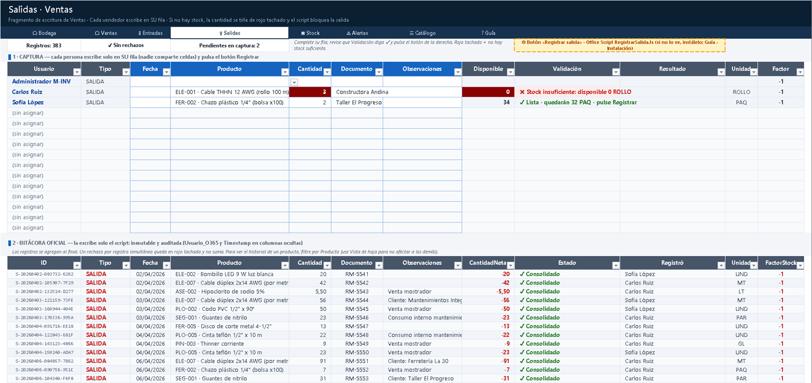

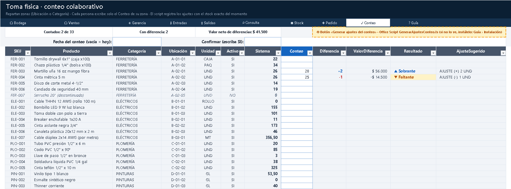

## Publicar en Microsoft 365 (resumen)

1. Generar el Release con su contraseña: `$env:MINV_RELEASE_PASSWORD='…'; powershell -ExecutionPolicy Bypass -File tools\build_v2.ps1`.
2. Subirlo a una biblioteca de SharePoint (Editar: Admin, Bodega, Ventas; Leer: Consulta).
3. Registrar a cada persona en `02_USUARIOS` con su correo y rol.
4. Pegar los 6 scripts de `build/office-scripts/release/` en *Automatizar › Nuevo script* y ejecutar
   `DiagnosticoInstalacion`.
5. Agregar los botones sobre los recuadros amarillos `⚙`, pulsar «Recalcular stock» y cargar el saldo inicial (una
   toma física completa en `13_CONTEO` lo genera).
6. Opcional: flujo de Power Automate con `ResumenDiario` para recibir el resumen del día por correo.

Paso a paso: [`docs/deployment/inicio-rapido.md`](docs/deployment/inicio-rapido.md) · Detalle de permisos:
[`docs/deployment/sharepoint-rbac-policies.md`](docs/deployment/sharepoint-rbac-policies.md).

## Estructura del repositorio

```text
ZP-MINV-Platform/
├── .claude/
│   ├── excel-architecture-rules.md      Reglas CQRS para Excel (V1.x)
│   ├── v2-concurrency-rules.md          Reglas de coautoría y fragmentación (V2; prevalecen en el libro colaborativo)
│   ├── v3-architecture-rules.md         Reglas A-01 a A-13 de la solución .NET (V3)
│   ├── v4-architecture-rules.md         Reglas B-01 a B-17: multi-sucursal, nube, integraciones (V4)
│   └── database-migration-guide.md      Migraciones de esquema y de datos (V2.1 → V3 → V4)
├── CLAUDE.md · CHANGELOG.md · README.md
├── deploy/                                    V4: docker-compose.yml, Dockerfiles de los servidores, .env.example
├── docs/
│   ├── architecture/arquitectura-v4.md        Arquitectura V4 (sucursales, transferencias, nube, API, webhooks)
│   ├── architecture/data-dictionary.md       Modelo V1.2
│   ├── architecture/data-dictionary-v2.md    Modelo V2 (usuarios, captura, bitácoras, instantáneas)
│   ├── database/ERD-MINV-V3.md                Modelo relacional V3 y V4 (110 tablas)
│   ├── deployment/inicio-rapido-v4.md         V4: paso a paso en un solo equipo (base local, nube simulada, API)
│   ├── deployment/despliegue-nube-v4.md       V4: DigitalOcean, AWS RDS y Supabase, servidores, TLS, respaldos
│   ├── deployment/inicio-rapido-v3.md         V3.1: base local, escritorio y demostración
│   ├── deployment/inicio-rapido.md            Paso a paso: demo, producción, uso diario, Power Automate
│   ├── deployment/sharepoint-rbac-policies.md Matriz de roles, protección de rangos y publicación
│   ├── integration/api-gateway-v1.md          V4: guía del integrador B2B (endpoints, errores, webhooks, firmas)
│   └── product/                               Guía UX y capturas (v2/ = libro colaborativo, v3.1/ = escritorio)
├── MINV.sln                             Solución .NET (V3 y V4)
├── src/
│   ├── 1. Core/                         MINV.Domain · MINV.Application (casos de uso, contrato RPC)
│   ├── 2. Infrastructure/               MINV.Infrastructure (EF Core, migraciones, servidores, webhooks) · MINV.Hardware
│   ├── 3. Presentation/                 MINV.DesktopClient (M-INV.exe) · MINV.CloudServer (V4) · MINV.ApiGateway (V4)
│   ├── 4. Tools/                        MINV.Cli (minv)
│   ├── office-scripts/                  Office Scripts (TypeScript) + lib/comun.ts (bloque compartido)
│   ├── macros/                          VBA de la edición Plus V1.2
│   ├── M-INV_V2_Colaborativo.xlsx       Libro colaborativo · Core (demo)
│   └── M-INV_V1_Core.xlsx/.xlsm         Edición local V1.2
├── releases/                            Release V2 y Releases V1.2
├── scripts/db_init.sql                  Script idempotente de la base PostgreSQL (generado)
├── tests/MINV.*.Tests                   Pruebas .NET (V4: MINV.Integration.Tests, servidores reales)
├── tests/office-scripts/                Simulador de ExcelScript y pruebas de los scripts (Node)
└── tools/
    ├── bd_local.ps1 · servidores_locales.ps1 · bd_nube.ps1   V3/V4: base local, nube simulada, nube gestionada
    ├── build_v3.ps1 · publicar_escritorio.ps1                V3/V4: compilar, probar, db_init.sql, M-INV.exe
    ├── build_minv_v2.py + minv2/        Generador del libro colaborativo
    ├── office_scripts.py                Sincroniza el bloque común y genera los scripts instalables
    ├── verify_minv_v2.ps1               Verificación del libro V2 en Excel real
    ├── build_v2.ps1                     Ciclo completo V2 (definición de terminado)
    └── build_minv.py + minv/ …          Generador, verificadores y ciclo de la V1.2 (build_all.ps1)
```

## Desarrollo

Requisitos: Windows con Excel 2016+ (para verificar), Python 3.11+ y Node.js 22.18+ (pruebas de los scripts).

```powershell
python -m venv .venv
.venv\Scripts\python -m pip install -r tools\requirements.txt
powershell -ExecutionPolicy Bypass -File tools\build_v2.ps1 -Capturas     # V2: generar, probar y verificar (≈ 5 min)
powershell -ExecutionPolicy Bypass -File tools\build_all.ps1 -Capturas    # V1.2 local (Estándar y Plus)
```

`build_v2.ps1`: genera Core y Release, comprueba el bloque común de los scripts, verifica sus tipos con TypeScript
estricto (si hay `tsc`: PATH o `MINV_TSC`), ejecuta las 22 pruebas de los Office Scripts contra el simulador de
`ExcelScript`, verifica ambos libros en Excel real (errores de fórmula, auditoría e IDs, instantánea, cobertura,
ranking y pedido = recálculo independiente, conteo, consulta, actividad, Gerencia, disponible exacto, poka-yoke,
protección, navegación) y genera los scripts instalables en `build/office-scripts/`.

### Contraseñas

| Variable | Uso | Por defecto |
|---|---|---|
| `MINV_PASSWORD` | Hojas del Core y scripts del Core | `minv-dev` (solo desarrollo) |
| `MINV_RELEASE_PASSWORD` | Hojas y estructura del Release y sus scripts instalables | si falta, la del Core (con aviso) |
| `MINV_V2_PWD_BODEGA` / `MINV_V2_PWD_VENTAS` | Contraseña opcional de los rangos de captura por rol | sin contraseña |

La protección de Excel evita errores, no ataques; la seguridad real es el permiso de SharePoint y la trazabilidad
(`Usuario_O365`, `Timestamp`, historial de versiones).

## Decisiones clave de la V2

- **Fragmentación triple** (dominio, usuario, operación) en lugar de una tabla compartida: elimina las colisiones de
  celda que corrompen datos en la coautoría.
- **Instantánea a demanda en lugar de cálculo manual del libro**: el modo manual en Excel es por libro y por sesión (no
  por hoja) y congelaría el disponible y el poka-yoke; la instantánea logra el objetivo (nada pesado en vivo) sin ese
  costo. `RecalcularStock` además dispara un recálculo completo.
- **Identidad por comentario temporal**: la API de Office Scripts no expone el usuario; el autor de un comentario sí.
- **RBAC en capas**: Excel para la web no restringe rangos por correo, así que el correo lo valida el script contra
  `02_USUARIOS`; SharePoint decide quién edita el archivo.
- **Interfaz de celdas**: en la web los vínculos de formas no son fiables; botones y navegación son celdas.
- **Consulta y conteo por persona** (2.1): en vez de un selector o formulario común, cada persona tiene su fila o sus
  celdas; los cálculos exactos en vivo se limitan a esas filas.
- **Auditoría que no estorba** (2.1): `14_ACTIVIDAD` registra cada ejecución, pero si no puede escribir nunca bloquea
  el registro del movimiento.
- **Resumen de solo lectura** (2.1): el script para Power Automate no escribe nada, así puede programarse sin riesgo.

## Hoja de ruta

- **V2.1** ✔ · Gerencia, consulta por usuario, toma física colaborativa, pedido sugerido, actividad y resumen diario.
- **V3 / V3.1** ✔ (ramas `Inventario-V3`, `Inventario-V3.1`, `Inventario-V3.-BaseDeDatosLocal`): .NET 8 + PostgreSQL +
  WPF, escritorio completo y base local con datos de prueba.
- **V4** · En curso (rama `Inventario-V4.-BaseDeDatosNube`, 4.0.0-alpha.1): multi-sucursal, transferencias en
  tránsito, servidor en la nube, API Gateway B2B y webhooks; ver la sección M-INV V4 al inicio.

---
© Z&P Software Fast Solutions · M-INV V4.0.0-alpha.1 · V3.1.0-alpha.1 · V2.1.0 colaborativa · V1.2.0 local
