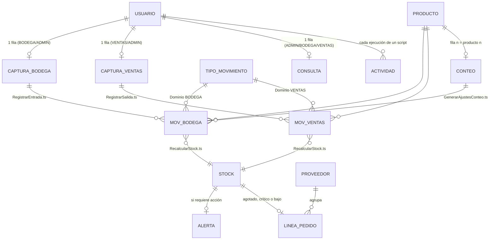

# Diccionario de datos · M-INV V2 (colaborativo)

Versión del modelo: **2.1.0** · Fuente de verdad: `tools/build_minv_v2.py` (paquete `tools/minv2/`) y
`src/office-scripts/` · Reglas: `.claude/v2-concurrency-rules.md`. Catálogo, proveedores, categorías, unidades y
semáforo son los de la V1.2 (`data-dictionary.md`), salvo lo indicado aquí.

Convenciones: ✎ ingreso · ƒx fórmula · ⚙ lo escribe un Office Script · 🔒 oculto.

## Modelo

## 1. Configuración (`01_CONFIG`, oculta)

Parámetros de la V1 (`cfgEmpresa`, `cfgNIT`, `cfgBodega`, `cfgMoneda`, `cfgMargenAlerta`, `cfgDiasSinRotacion`,
`cfgFechaMin`, `cfgVersion` = 2.1.0, `cfgEdicion` = «Colaborativa (Microsoft 365)», `cfgFechaBuild`, `cfgProveedor`) y
metadatos de la instantánea, que escribe `RecalcularStock.ts`:

| Nombre | Tipo | Contenido |
|---|---|---|
| `stkActualizado` | Fecha y hora | Momento del último cálculo (número de serie local) |
| `stkActualizadoPor` | Texto | Correo de Microsoft 365 de quien recalculó |
| `stkActualizadoNombre` | Texto | Nombre visible de quien recalculó |
| `stkMovimientos` | Entero | Movimientos consolidados procesados |

**TIPO_MOVIMIENTO** (`tblTiposMov`): `Tipo`, `FactorStock` (±1), **`Dominio`** (`BODEGA` → 10A, `VENTAS` → 10B),
`Descripción`. Valores: SALDO INICIAL (+1, BODEGA), ENTRADA (+1, BODEGA), AJUSTE (+) (+1, BODEGA), AJUSTE (-) (−1,
BODEGA), SALIDA (−1, VENTAS).

## 2. USUARIO · `tblUsuarios` (`02_USUARIOS`, 50 filas)

| Campo | Origen | Regla | SQL |
|---|---|---|---|
| `Correo` (PK) | ✎ | Correo de Microsoft 365, único, con `@`, sin espacios | `usuario.correo` UK |
| `Nombre` | ✎ | 2–60 caracteres | `nombre` |
| `Rol` | ✎ | `ADMIN`, `BODEGA`, `VENTAS`, `CONSULTA` (`lstRoles`) | `rol` |
| `Activo` | ✎ | `NO` retira el acceso (la fila se conserva para auditoría) | `activo` |
| `OrdenBodega` | ƒx | Posición entre los activos BODEGA/ADMIN = fila de captura en 10A | derivado |
| `OrdenVentas` | ƒx | Posición entre los activos VENTAS/ADMIN = fila de captura en 10B | derivado |
| `OrdenConsulta` | ƒx | Posición entre los activos ADMIN/BODEGA/VENTAS = fila en 17_CONSULTA | derivado |
| `Validación` | ƒx | `✔ Autorizado` · `⚠ Faltan datos` · `✖ Correo no válido` · `✖ Correo duplicado` · `✖ Rol no válido` · `● Inactivo` | — |

Las celdas ✎ están bloqueadas: solo el ADMIN las edita (desprotegiendo la hoja).

## 3. Captura por usuario (`tblCapturaEntradas` en 10A, `tblCapturaSalidas` en 10B; 15 filas cada una)

| Campo | Origen | Regla |
|---|---|---|
| `Usuario` | ƒx | Nombre del usuario cuya posición coincide con la fila (`(sin asignar)` si no hay) |
| `Tipo` | ✎ (10A) / ƒx (10B = `SALIDA`) | 10A: lista `lstTiposBodega` |
| `Fecha` | ✎ | Opcional (vacía = hoy); entre `cfgFechaMin` y hoy |
| `Producto` | ✎ | Lista `lstProductos` (etiqueta del catálogo; filtrable escribiendo) |
| `Cantidad` | ✎ | > 0; entera si la unidad no admite decimales |
| `Documento` | ✎ | ≤ 30 caracteres |
| `Observaciones` | ✎ | ≤ 250; obligatoria en AJUSTES |
| `Disponible` | ƒx | Σ `CantidadNeta` consolidada (✔) del SKU en **las dos** bitácoras: exacto en vivo |
| `Validación` | ƒx | `✔ Lista · quedarán N` · `○ …` falta un dato · `✖ …` (stock insuficiente, producto inactivo, tipo de otro dominio, SALDO INICIAL repetido, fecha, decimales) |
| `Resultado` | ⚙ | `✔ Registrado <ID> · hh:mm · stock N` o `✖ Bloqueado: <motivo>` |
| `Unidad`, `Factor` | ƒx | Del catálogo y del tipo |
| `Correo` | ƒx 🔒 | Correo del dueño de la fila (lo busca el script) |
| `SKU` | ƒx 🔒 | Texto antes de « · » en `Producto` |
| `Queda` | ƒx 🔒 | `Disponible + Cantidad × Factor`; si < 0 activa el **poka-yoke** (rojo sangre, blanco tachado) |

Rango editable de la hoja protegida («Permitir editar rangos»): `Captura Bodega` (`C9:H23`) y `Captura Ventas`
(`D9:H23`), con contraseña opcional por rol.

## 4. Bitácoras oficiales (`tblEntradas` en 10A, `tblSalidas` en 10B)

Mismo esquema en ambos fragmentos; solo valores; append-only; las escribe exclusivamente un Office Script.

| Campo | Origen | Regla | SQL |
|---|---|---|---|
| `ID` (PK) | ⚙ | `E-AAAAMMDD-HHMMSS-XXXX` (10A) o `S-…` (10B); sin contadores compartidos | `movimiento.id` (UUID/texto) |
| `Tipo` | ⚙ | Tipo del dominio del fragmento | `tipo_movimiento_id` |
| `Fecha` | ⚙ | Fecha de negocio (de la captura o hoy) | `fecha` |
| `Producto` | ⚙ | Etiqueta `SKU · Nombre` al momento del registro | (desnormalizado) |
| `Cantidad` | ⚙ | > 0 | `cantidad` |
| `Documento`, `Observaciones` | ⚙ | De la captura | `documento`, `observaciones` |
| `CantidadNeta` | ⚙ | `Cantidad × FactorStock` (lo único que suma el stock) | calculado |
| `Estado` | ⚙ | `✔ Consolidado` o `✖ Rechazado: <motivo>` (los rechazados no suman) | `estado` |
| `Registró` | ⚙ | Nombre del usuario en `02_USUARIOS` | (join) |
| `Unidad`, `FactorStock` | ⚙ | Del catálogo y del tipo | (join) |
| `Usuario_O365` | ⚙ 🔒 | Correo de Microsoft 365 que ejecutó el script (identidad por comentario temporal) | `usuario_id` |
| `SKU` | ⚙ 🔒 | Clave del producto | `producto_id` |
| `Timestamp` | ⚙ 🔒 | Fecha y hora local del registro | `creado_en` |

## 5. Instantáneas de lectura (valores; las reescribe `RecalcularStock.ts`)

**STOCK** (`tblStock`, `15_STOCK`, 500 filas): `SKU`, `Producto`, `Categoría`, `Proveedor`, `Unidad`, `Activo`,
`Entradas` (Σ netas positivas), `Salidas` (Σ |netas negativas|), `StockActual`, `StockMin`, `StockMax`, `Nivel`
(stock ÷ máximo), `Estado` (semáforo de `tblEstados`), `CostoUnitario`, `ValorInventario`, `UltimoMov`, `DiasSinMov`
y, desde la 2.1:

| Campo | Regla |
|---|---|
| `Salidas30d` | Σ unidades de tipo `SALIDA` consolidadas con `Fecha` ≥ hoy − 29 (0 si no hubo) |
| `CoberturaDias` | `ENTERO(máx(0, StockActual) ÷ (Salidas30d ÷ 30))`: días que alcanza el stock al ritmo actual; vacía sin salidas |
| `RankSalidas30d` | 1 = más vendido en 30 días; empates por orden del catálogo; vacío sin salidas |

**ALERTA** (`tblAlertas`, `16_ALERTAS`, 500 filas): `#`, `Estado`, `SKU`, `Producto`, `Categoría`, `Proveedor`,
`Stock`, `Mínimo`, `Máximo`, `Unidad`, `Faltante`, `SugeridoPedir` (hasta el máximo o 2 × mínimo; 0 en SOBRESTOCK e
INCONSISTENTE), `AcciónSugerida`, `UltimoMov`. Orden: INCONSISTENTE, AGOTADO, CRÍTICO, BAJO, SOBRESTOCK; dentro de cada
estado por cobertura (stock ÷ mínimo, en décimas) y luego por orden del catálogo.

**LINEA_PEDIDO** (`tblPedido`, `18_PEDIDO`, 500 filas): productos **activos** en AGOTADO, CRÍTICO o BAJO con cantidad a
pedir mayor que 0.

| Campo | Regla |
|---|---|
| `Proveedor` | Del catálogo; «(Sin proveedor)» si está vacío |
| `SKU`, `Producto`, `Unidad`, `Estado`, `Stock`, `Mínimo`, `Máximo` | De la instantánea |
| `APedir` | máximo (o 2 × mínimo si no hay máximo) − máx(0, stock) |
| `CostoUnitario`, `Subtotal` | Costo del catálogo · `APedir × CostoUnitario` |
| `DiasEntrega`, `EntregaEstimada` | De `04_PROVEEDORES` · hoy + días de entrega |
| `Contacto`, `Teléfono`, `Correo` | De `04_PROVEEDORES` |

Orden: proveedor (orden de `04_PROVEEDORES`; los que no están en la tabla, al final), estado (AGOTADO, CRÍTICO, BAJO) y
orden del catálogo.

## 5b. Toma física · `tblConteo` (`13_CONTEO`, 500 filas)

La fila *n* refleja el producto *n* de `05_PRODUCTOS`. Varias personas cuentan a la vez escribiendo solo en `Conteo`
(celdas distintas por producto: sin colisiones).

| Campo | Origen | Regla |
|---|---|---|
| `SKU`, `Producto`, `Categoría`, `Ubicación`, `Unidad`, `Activo` | ƒx | Del catálogo (filtre por Ubicación o Categoría para repartir zonas) |
| `Sistema` | ƒx | `StockActual` de la instantánea (vista previa; el script usa el stock exacto al generar) |
| `Conteo` | ✎ | Cantidad contada (≥ 0; entera si la unidad no admite decimales). Vacía = no contado |
| `Diferencia`, `ValorDiferencia` | ƒx | `Conteo − Sistema` · × costo unitario |
| `Resultado` | ƒx | `✔ Cuadra` · `▲ Sobrante` · `▼ Faltante` · `● Saldo inicial` (sin movimientos) · `✖ …` (no válido) |
| `AjusteSugerido` | ƒx | Movimiento que registrará el script (`AJUSTE (+) n`, `AJUSTE (-) n`, `SALDO INICIAL n`) |

Campos de la fila 7: `ctFecha` (D7, ✎, vacía = hoy), `ctConfirmar` (H7, ✎, `SI` para ejecutar; el script la borra)
y `ctResultado` (I7, ⚙, mensaje del último proceso). Movimientos generados: tipo `AJUSTE (±)` o `SALDO INICIAL`, documento
`CF-AAAAMMDD`, observación «Toma física del dd/mm/aaaa: sistema S, contado C (diferencia ±D)».

## 5c. Consulta por usuario · `tblConsulta` (`17_CONSULTA`, 20 filas)

| Campo | Origen | Regla |
|---|---|---|
| `Usuario` | ƒx | Dueño de la fila (`OrdenConsulta` de `02_USUARIOS`) |
| `Producto` | ✎ | Lista `lstProductos` (única celda editable de la fila) |
| `Disponible` | ƒx | Σ `CantidadNeta` consolidada de las dos bitácoras (exacto en vivo) |
| `Estado` | ƒx | Semáforo con el disponible exacto (mismas reglas de `tblEstados`) |
| `Mínimo`, `Máximo`, `Proveedor`, `Ubicación` | ƒx | Del catálogo |
| `Sugerido` | ƒx | Si AGOTADO, CRÍTICO o BAJO: máximo (o 2 × mínimo) − máx(0, disponible); si no, 0 |
| `UltimoMovimiento` | ƒx | «fecha · tipo cantidad · quién» del último registro consolidado (10A o 10B) |
| `Entradas30d`, `Salidas30d`, `CoberturaDias`, `Valor` | ƒx | Últimos 30 días (desde `HOY()−29`), cobertura como en la instantánea, disponible × costo |
| `Correo`, `SKU`, `TsE`, `TsS` | ƒx 🔒 | Técnicas: dueño, clave y último `Timestamp` en cada bitácora |

## 5d. Registro de actividad · `tblActividad` (`14_ACTIVIDAD`)

Append-only; solo lo escriben los scripts (`registrarActividad`, inserción atómica). Una fila por ejecución.

| Campo | Regla | SQL |
|---|---|---|
| `ID` (PK) | `A-AAAAMMDD-HHMMSS-XXXX` (sin contador compartido) | `actividad.id` |
| `Timestamp` | Fecha y hora local de la ejecución | `creado_en` |
| `Usuario_O365` | Correo de Microsoft 365 (o «(no identificado)» si falló la identidad en un recálculo) | `usuario_id` |
| `Nombre` | Nombre de `02_USUARIOS` (o el de la cuenta) | (join) |
| `Script` | `RegistrarEntrada`, `RegistrarSalida`, `RecalcularStock`, `GenerarAjustesConteo`, `DiagnosticoInstalacion` | `script` |
| `Resultado` | `✔ Registrado`, `✔ Stock recalculado`, `✔ Ajustes generados`, `✔ Conteo sin diferencias`, `✔ Instalación correcta`, `✖ Bloqueado`, `✖ Rechazado`, `⚠ N problema(s)` | `resultado` |
| `Detalle` | Mensaje completo (≤ 250 caracteres) | `detalle` |

## 6. Motor (ocultas)

| Hoja | Contenido |
|---|---|
| `90_LISTAS` | `lstTiposBodega`, `lstRoles` y series de los gráficos de las portadas: salidas de 7 días (Ventas), unidades despachadas de los últimos 6 meses (I:J) y valor del inventario por categoría (L:M) para Gerencia |
| `91_KPIS` | Conteos livianos: instantánea (`kpiAgotados`, `kpiCriticos`, `kpiEnAlerta`, `kpiValor`…), bitácoras (`kpiRegEnt`, `kpiRegSal`, `kpiRechEnt`, `kpiRechSal`, `kpiEntradasHoy`, `kpiSalidasHoy`, `kpiUnidadesHoy`, `kpiMovMes`…), 2.1: ventas y cobertura (`kpiUnid30`, `kpiCobMed`), pedido (`kpiPedidoLineas`, `kpiPedidoTotal`, `kpiPedidoProv`), conteo (`kpiConteoContados`, `kpiConteoDif`, `kpiConteoValor`), actividad (`kpiEjecuciones`, `kpiBloqMes`), frescura (`kpiNuevosDesdeCalculo`) y textos (`txtFrescura`, `txtStockActualizado`, `txtPasoBodega`, `txtPasoVentas`, `txtPasoGerencia`, `txtPedidoBtn`, `txtUltimaEjecucion`…) |
| `92_SESION` | Sin datos ni protección: los scripts crean y borran en ella el comentario de identificación e informan el diagnóstico |

Listas dinámicas del catálogo: `lstProductos` y `lstProveedores` (DESREF sobre las filas usadas; solo en validaciones).

## 7. Invariantes verificadas

`tools/verify_minv_v2.ps1` (Excel real): 21 hojas y protección por capa; cálculo automático; rangos editables (10A,
10B, 13_CONTEO, 17_CONSULTA) y columnas N:P ocultas; cero errores de fórmula; IDs únicos con formato, correo, Timestamp
y signo por fragmento; instantánea = recálculo independiente hasta `stkActualizado` (stock, semáforo, salidas de 30
días, cobertura y ranking); pedido = activos agotados/críticos/bajos hasta el máximo, agrupado por proveedor y con
`kpiPedidoTotal` = Σ subtotales; conteo (sistema = instantánea, diferencias y resultado, reacción en vivo a un decimal
en UND); consulta (disponible exacto en las filas de ejemplo y al elegir un producto en vivo); actividad (IDs únicos,
`kpiEjecuciones`); Gerencia (2 gráficos, top 1 = ranking, registros del mes por usuario = conteo independiente);
frescura; disponible de la captura; poka-yoke en la captura y en los rechazos; sin formas con vínculos; navegación.

`tests/office-scripts/pruebas.mts` (22 pruebas, scripts reales contra el simulador): registro auditado, bloqueo por
stock, rechazo por registro simultáneo, validaciones de Bodega, RBAC, identidad, contraseña y protección siempre
restaurada, Release vacío, paridad de `RecalcularStock` con el generador (stock, cobertura, ranking, alertas y pedido),
actividad (también si no se puede escribir), toma física (confirmación, ajustes ±, saldo inicial en libro vacío,
conteos inválidos, fecha, rechazo por venta simultánea), resumen diario de solo lectura y diagnóstico.
