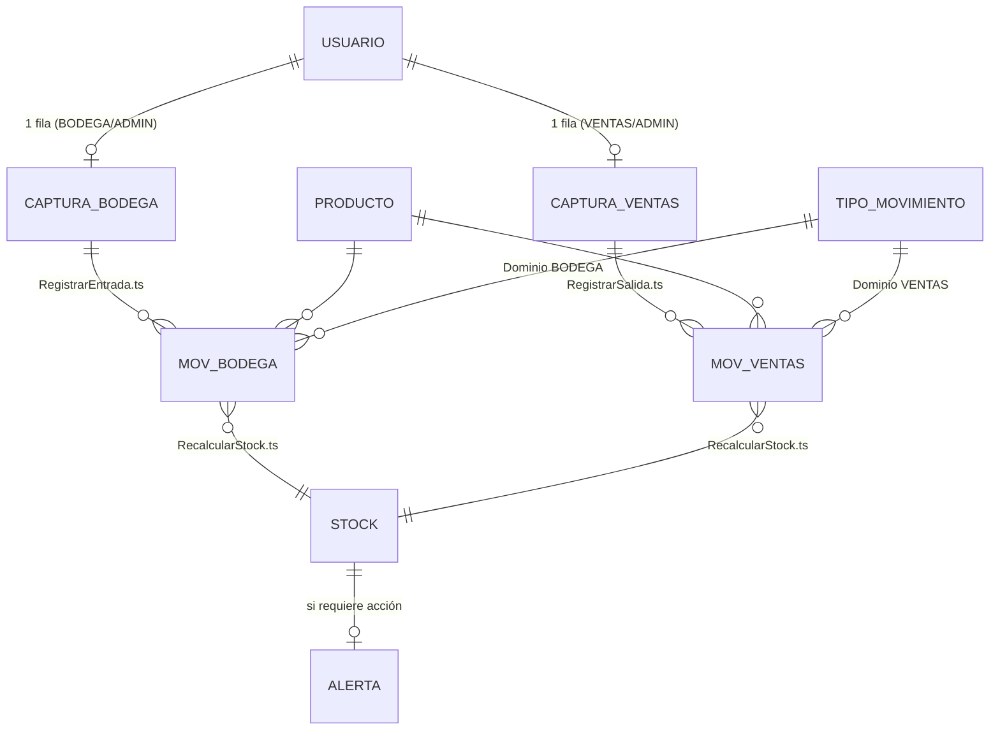

# Diccionario de datos · M-INV V2 (colaborativo)

Versión del modelo: **2.0.0** · Fuente de verdad: `tools/build_minv_v2.py` (paquete `tools/minv2/`) y
`src/office-scripts/` · Reglas: `.claude/v2-concurrency-rules.md`. Catálogo, proveedores, categorías, unidades y
semáforo son los de la V1.2 (`data-dictionary.md`), salvo lo indicado aquí.

Convenciones: ✎ ingreso · ƒx fórmula · ⚙ lo escribe un Office Script · 🔒 oculto.

## Modelo

## 1. Configuración (`01_CONFIG`, oculta)

Parámetros de la V1 (`cfgEmpresa`, `cfgNIT`, `cfgBodega`, `cfgMoneda`, `cfgMargenAlerta`, `cfgDiasSinRotacion`,
`cfgFechaMin`, `cfgVersion` = 2.0.0, `cfgEdicion` = «Colaborativa (Microsoft 365)», `cfgFechaBuild`, `cfgProveedor`) y
metadatos de la instantánea, que escribe `RecalcularStock.ts`:

| Nombre | Tipo | Contenido |
|---|---|---|
| `stkActualizado` | Fecha y hora | Momento del último cálculo (número de serie local) |
| `stkActualizadoPor` | Texto | Correo de Microsoft 365 de quien recalculó |
| `stkActualizadoNombre` | Texto | Nombre visible de quien recalculó |
| `stkMovimientos` | Entero | Movimientos consolidados procesados |

**TIPO_MOVIMIENTO** (`tblTiposMov`): `Tipo`, `FactorStock` (±1), **`Dominio`** (`BODEGA` → 10A, `VENTAS` → 10B),
`Descripción`. Valores: SALDO INICIAL (+1, BODEGA), ENTRADA (+1, BODEGA), AJUSTE (+) (+1, BODEGA), AJUSTE (-) (−1,
BODEGA), SALIDA (−1, VENTAS).

## 2. USUARIO · `tblUsuarios` (`02_USUARIOS`, 50 filas)

| Campo | Origen | Regla | SQL |
|---|---|---|---|
| `Correo` (PK) | ✎ | Correo de Microsoft 365, único, con `@`, sin espacios | `usuario.correo` UK |
| `Nombre` | ✎ | 2–60 caracteres | `nombre` |
| `Rol` | ✎ | `ADMIN`, `BODEGA`, `VENTAS`, `CONSULTA` (`lstRoles`) | `rol` |
| `Activo` | ✎ | `NO` retira el acceso (la fila se conserva para auditoría) | `activo` |
| `OrdenBodega` | ƒx | Posición entre los activos BODEGA/ADMIN = fila de captura en 10A | derivado |
| `OrdenVentas` | ƒx | Posición entre los activos VENTAS/ADMIN = fila de captura en 10B | derivado |
| `Validación` | ƒx | `✔ Autorizado` · `⚠ Faltan datos` · `✖ Correo no válido` · `✖ Correo duplicado` · `✖ Rol no válido` · `● Inactivo` | — |

Las celdas ✎ están bloqueadas: solo el ADMIN las edita (desprotegiendo la hoja).

## 3. Captura por usuario (`tblCapturaEntradas` en 10A, `tblCapturaSalidas` en 10B; 15 filas cada una)

| Campo | Origen | Regla |
|---|---|---|
| `Usuario` | ƒx | Nombre del usuario cuya posición coincide con la fila (`(sin asignar)` si no hay) |
| `Tipo` | ✎ (10A) / ƒx (10B = `SALIDA`) | 10A: lista `lstTiposBodega` |
| `Fecha` | ✎ | Opcional (vacía = hoy); entre `cfgFechaMin` y hoy |
| `Producto` | ✎ | Lista `lstProductos` (etiqueta del catálogo; filtrable escribiendo) |
| `Cantidad` | ✎ | > 0; entera si la unidad no admite decimales |
| `Documento` | ✎ | ≤ 30 caracteres |
| `Observaciones` | ✎ | ≤ 250; obligatoria en AJUSTES |
| `Disponible` | ƒx | Σ `CantidadNeta` consolidada (✔) del SKU en **las dos** bitácoras: exacto en vivo |
| `Validación` | ƒx | `✔ Lista · quedarán N` · `○ …` falta un dato · `✖ …` (stock insuficiente, producto inactivo, tipo de otro dominio, SALDO INICIAL repetido, fecha, decimales) |
| `Resultado` | ⚙ | `✔ Registrado <ID> · hh:mm · stock N` o `✖ Bloqueado: <motivo>` |
| `Unidad`, `Factor` | ƒx | Del catálogo y del tipo |
| `Correo` | ƒx 🔒 | Correo del dueño de la fila (lo busca el script) |
| `SKU` | ƒx 🔒 | Texto antes de « · » en `Producto` |
| `Queda` | ƒx 🔒 | `Disponible + Cantidad × Factor`; si < 0 activa el **poka-yoke** (rojo sangre, blanco tachado) |

Rango editable de la hoja protegida («Permitir editar rangos»): `Captura Bodega` (`C9:H23`) y `Captura Ventas`
(`D9:H23`), con contraseña opcional por rol.

## 4. Bitácoras oficiales (`tblEntradas` en 10A, `tblSalidas` en 10B)

Mismo esquema en ambos fragmentos; solo valores; append-only; las escribe exclusivamente un Office Script.

| Campo | Origen | Regla | SQL |
|---|---|---|---|
| `ID` (PK) | ⚙ | `E-AAAAMMDD-HHMMSS-XXXX` (10A) o `S-…` (10B); sin contadores compartidos | `movimiento.id` (UUID/texto) |
| `Tipo` | ⚙ | Tipo del dominio del fragmento | `tipo_movimiento_id` |
| `Fecha` | ⚙ | Fecha de negocio (de la captura o hoy) | `fecha` |
| `Producto` | ⚙ | Etiqueta `SKU · Nombre` al momento del registro | (desnormalizado) |
| `Cantidad` | ⚙ | > 0 | `cantidad` |
| `Documento`, `Observaciones` | ⚙ | De la captura | `documento`, `observaciones` |
| `CantidadNeta` | ⚙ | `Cantidad × FactorStock` (lo único que suma el stock) | calculado |
| `Estado` | ⚙ | `✔ Consolidado` o `✖ Rechazado: <motivo>` (los rechazados no suman) | `estado` |
| `Registró` | ⚙ | Nombre del usuario en `02_USUARIOS` | (join) |
| `Unidad`, `FactorStock` | ⚙ | Del catálogo y del tipo | (join) |
| `Usuario_O365` | ⚙ 🔒 | Correo de Microsoft 365 que ejecutó el script (identidad por comentario temporal) | `usuario_id` |
| `SKU` | ⚙ 🔒 | Clave del producto | `producto_id` |
| `Timestamp` | ⚙ 🔒 | Fecha y hora local del registro | `creado_en` |

## 5. Instantáneas de lectura (valores; las reescribe `RecalcularStock.ts`)

**STOCK** (`tblStock`, `15_STOCK`, 500 filas): `SKU`, `Producto`, `Categoría`, `Proveedor`, `Unidad`, `Activo`,
`Entradas` (Σ netas positivas), `Salidas` (Σ |netas negativas|), `StockActual`, `StockMin`, `StockMax`, `Nivel`
(stock ÷ máximo), `Estado` (semáforo de `tblEstados`), `CostoUnitario`, `ValorInventario`, `UltimoMov`, `DiasSinMov`.

**ALERTA** (`tblAlertas`, `16_ALERTAS`, 500 filas): `#`, `Estado`, `SKU`, `Producto`, `Categoría`, `Proveedor`,
`Stock`, `Mínimo`, `Máximo`, `Unidad`, `Faltante`, `SugeridoPedir` (hasta el máximo o 2 × mínimo; 0 en SOBRESTOCK e
INCONSISTENTE), `AcciónSugerida`, `UltimoMov`. Orden: INCONSISTENTE, AGOTADO, CRÍTICO, BAJO, SOBRESTOCK; dentro de cada
estado por cobertura (stock ÷ mínimo, en décimas) y luego por orden del catálogo.

## 6. Motor (ocultas)

| Hoja | Contenido |
|---|---|
| `90_LISTAS` | `lstTiposBodega`, `lstRoles` y series de los gráficos de las portadas |
| `91_KPIS` | Conteos livianos: instantánea (`kpiAgotados`, `kpiCriticos`, `kpiEnAlerta`, `kpiValor`…), bitácoras (`kpiRegEnt`, `kpiRegSal`, `kpiRechEnt`, `kpiRechSal`, `kpiEntradasHoy`, `kpiSalidasHoy`, `kpiUnidadesHoy`…), frescura (`kpiNuevosDesdeCalculo`) y textos (`txtFrescura`, `txtStockActualizado`, `txtPasoBodega`, `txtPasoVentas`…) |
| `92_SESION` | Sin datos ni protección: los scripts crean y borran en ella el comentario de identificación e informan el diagnóstico |

Listas dinámicas del catálogo: `lstProductos` y `lstProveedores` (DESREF sobre las filas usadas; solo en validaciones).

## 7. Invariantes verificadas

`tools/verify_minv_v2.ps1` (Excel real): hojas y protección por capa; cálculo automático; rangos editables y columnas
N:P ocultas; cero errores de fórmula; IDs únicos con formato, correo, Timestamp y signo por fragmento; instantánea =
recálculo independiente hasta `stkActualizado`; frescura = movimientos posteriores; disponible de la captura = suma
independiente; poka-yoke visible en la captura y en los rechazos; sin formas con vínculos; navegación por celdas.

`tests/office-scripts/pruebas.mts` (scripts reales contra el simulador): registro auditado, bloqueo por stock,
rechazo por registro simultáneo, validaciones de Bodega, RBAC, identidad, contraseña y protección siempre restaurada,
Release vacío, paridad de `RecalcularStock` con el generador y diagnóstico.
