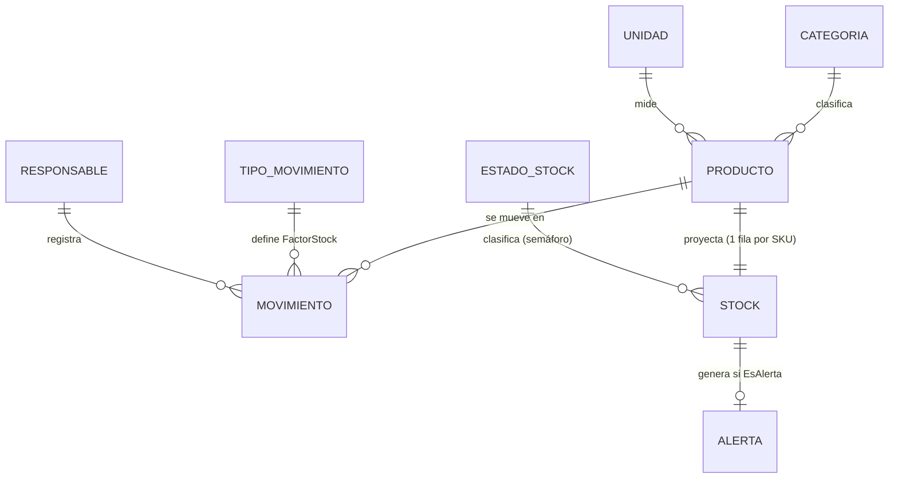

# Diccionario de datos · M-INV V1

Versión del modelo: **1.0.0** · Fuente de verdad: `tools/build_minv.py` · Reglas: `.claude/excel-architecture-rules.md`

## Convenciones

| Símbolo | Significado |
|---|---|
| ✎ | Campo de **ingreso** (celda desbloqueada, fondo blanco con borde azul) |
| ƒx | Campo **calculado** (celda bloqueada; oculta en Release) |
| ⇄ | Campo **espejo** (fórmula que copia la fila equivalente de otra hoja) |
| PK / UK / FK | Clave primaria / única / foránea (lógica en Excel, física en SQL V2) |

Tipos: `Texto(n)` longitud máxima · `Entero` · `Decimal` · `Fecha` · `Moneda` (decimal ≥ 0) · `Factor` (+1 / −1).

## Modelo entidad-relación

---

## 1. Configuración (capa oculta)

### 1.1 Parámetros del tenant · `01_CONFIG` (nombres definidos `cfg*`)

| Nombre | Descripción | Tipo | Valor por defecto |
|---|---|---|---|
| `cfgEmpresa` | Nombre del cliente mostrado en la portada | Texto | `NOMBRE DE SU EMPRESA` |
| `cfgNIT` | Identificación tributaria | Texto | vacío |
| `cfgBodega` | Sede o bodega que controla el libro (1 libro = 1 bodega en V1) | Texto | `Bodega principal` |
| `cfgMoneda` | Moneda informativa (los formatos usan `$`) | Texto(3) | `COP` |
| `cfgMargenAlerta` | Margen de alerta preventiva sobre el mínimo | Decimal 0–1 | `0,20` (20 %) |
| `cfgFechaMin` | Fecha mínima aceptada en la bitácora | Fecha | 01/01/2020 |
| `cfgVersion` | Versión del motor | Texto | `1.0.0` |
| `cfgFechaBuild` | Fecha de generación del libro | Fecha | fecha del build |
| `cfgProveedor` | Implementador | Texto | Z&P Software Fast Solutions |

### 1.2 TIPO_MOVIMIENTO · `tblTiposMov` (`01_CONFIG`)

| Campo | Tipo | Regla | SQL V2 |
|---|---|---|---|
| `Tipo` (PK) | Texto(20) | Único | `tipo_movimiento.codigo` |
| `FactorStock` | Factor | +1 suma, −1 resta. Nunca 0 | `factor_stock SMALLINT CHECK (factor_stock IN (-1,1))` |
| `Descripción` | Texto | Uso del tipo | `descripcion` |

Valores base: `SALDO INICIAL` (+1), `ENTRADA` (+1), `SALIDA` (−1), `AJUSTE (+)` (+1), `AJUSTE (-)` (−1).

### 1.3 ESTADO_STOCK · `tblEstados` (`01_CONFIG`)

| Estado | Prioridad | Alerta | Regla (evaluada en este orden) | Acción sugerida |
|---|---|---|---|---|
| `INACTIVO` | 7 | NO | `Activo = "NO"` | Sin acción |
| `INCONSISTENTE` | 1 | SI | `StockActual < 0` | Auditar la bitácora y registrar un AJUSTE |
| `AGOTADO` | 2 | SI | `StockActual = 0` | Reabastecer de inmediato |
| `CRÍTICO` | 3 | SI | `StockActual ≤ StockMin` | Emitir orden de compra |
| `BAJO` | 4 | SI | `StockActual ≤ StockMin × (1 + cfgMargenAlerta)` | Programar reposición |
| `SOBRESTOCK` | 6 | SI (informativa) | `StockMax > 0` y `StockActual > StockMax` | Frenar compras / rotar inventario |
| `ÓPTIMO` | 5 | NO | cualquier otro caso | Sin acción |

`kpiEnAlerta` cuenta INCONSISTENTE + AGOTADO + CRÍTICO + BAJO (requieren acción). `16_ALERTAS` lista además SOBRESTOCK.

### 1.4 RESPONSABLE · `tblResponsables` (`01_CONFIG`)

| Campo | Tipo | Regla |
|---|---|---|
| `Nombre` (PK) | Texto(60) | Aparece en la lista de `10_MOVIMIENTOS[Responsable]` |
| `Cargo` | Texto(60) | Informativo |

### 1.5 CATEGORIA · `tblCategorias` (`03_CATEGORIAS`)

| Campo | Tipo | Regla | SQL V2 |
|---|---|---|---|
| `Código` | Texto(5) | Abreviatura (opcional) | `categoria.codigo` UK |
| `Categoría` (PK lógica) | Texto(40) | Único; no renombrar si tiene productos | `categoria.nombre` |
| `Descripción` | Texto | — | `descripcion` |

### 1.6 UNIDAD · `tblUnidades` (`06_UNIDADES`)

| Campo | Tipo | Regla | SQL V2 |
|---|---|---|---|
| `Código` (PK) | Texto(6) | Único (`UND`, `KG`…) | `unidad.codigo` |
| `Unidad` | Texto(30) | Nombre completo | `nombre` |
| `Decimales` | SI/NO | `NO` ⇒ `Cantidad` debe ser entera | `admite_decimales BOOLEAN` |
| `Descripción` | Texto | — | `descripcion` |

---

## 2. Maestro · PRODUCTO · `tblProductos` (`05_PRODUCTOS`, 500 filas pre-asignadas)

| Campo | Origen | Tipo | Req. | Regla / validación | SQL V2 |
|---|---|---|---|---|---|
| `SKU` (PK) | ✎ | Texto(20) | Sí | 2–20 caracteres, sin espacios, único (`CONTAR.SI = 1`) | `producto.sku` UK |
| `Producto` | ✎ | Texto(60) | Sí | 3–60 caracteres | `nombre` |
| `Categoría` (FK) | ✎ | Lista | Sí | ∈ `lstCategorias` | `categoria_id` |
| `Unidad` (FK) | ✎ | Lista | Sí | ∈ `lstUniCod` | `unidad_id` |
| `StockMin` | ✎ | Decimal ≥ 0 | No | Punto de reorden (0 si vacío) | `stock_min` |
| `StockMax` | ✎ | Decimal ≥ 0 | No | 0 = sin máximo | `stock_max` |
| `CostoUnitario` | ✎ | Moneda | No | ≥ 0 | `costo_unitario NUMERIC(14,2)` |
| `Ubicación` | ✎ | Texto(20) | No | Pasillo-estante-nivel | `ubicacion` |
| `Activo` | ✎ | SI/NO | No | Vacío = SI. `NO` saca el producto de las listas | `activo BOOLEAN` |
| `Etiqueta` | ƒx | Texto | — | `SKU & " · " & Producto` (texto de la lista desplegable) | calculado en UI |
| `Movimientos` | ƒx | Entero | — | `CONTAR.SI(tblMovimientos[SKU]; [@SKU])` | consulta |
| `Validación` | ƒx | Texto | — | `✔ OK` · `⚠ Faltan datos` · `✖ SKU duplicado` · `✖ SKU con espacios` · `✖ Categoría no existe` · `✖ Unidad no existe` · `⚠ Mínimo mayor que máximo` · `● Inactivo` | reglas de dominio |

## 3. Escritura · MOVIMIENTO · `tblMovimientos` (`10_MOVIMIENTOS`, 5.000 filas pre-asignadas)

| Campo | Origen | Tipo | Req. | Regla / validación | SQL V2 |
|---|---|---|---|---|---|
| `ID` (PK) | ƒx | Entero | — | Consecutivo por posición: `FILA() − FILA(encabezado)` (estable: no se ordena ni borra) | `movimiento.id` IDENTITY |
| `Fecha` | ✎ | Fecha | Sí | Entre `cfgFechaMin` y `HOY()` | `fecha DATE` |
| `Tipo` (FK) | ✎ | Lista | Sí | ∈ `lstTiposMov` | `tipo_movimiento_id` |
| `Categoría` | ✎ | Lista | No* | ∈ `lstCategorias`; filtra la lista de `Producto` | (derivable del producto) |
| `Producto` | ✎ | Lista | Sí | Lista en cascada: `lpTodos` o sub-rango de `lpCat` para la categoría | — |
| `SKU` (FK) | ƒx | Texto | — | Texto antes de `" · "` en `Producto` | `producto_id` |
| `Unidad` | ƒx | Texto | — | `INDICE/COINCIDIR` en `tblProductos`; `?` si el SKU no existe | (join) |
| `Cantidad` | ✎ | Decimal > 0 | Sí | > 0; entera si la unidad tiene `Decimales = NO` | `cantidad NUMERIC(14,3) CHECK (> 0)` |
| `FactorStock` | ƒx | Factor | — | `INDICE/COINCIDIR` en `tblTiposMov` | (join) |
| `CantidadNeta` | ƒx | Decimal | — | `Cantidad × FactorStock` | columna calculada |
| `Saldo` | ƒx | Decimal | — | Kardex: Σ `CantidadNeta` del SKU hasta esta fila | ventana `SUM() OVER` |
| `Estado` | ƒx | Texto | — | Ver tabla de estados de registro | reglas de dominio |
| `Documento` | ✎ | Texto(30) | No | Factura, remisión u orden | `documento` |
| `Responsable` (FK) | ✎ | Lista | Sí | ∈ `lstResponsables` | `usuario_id` |
| `Observaciones` | ✎ | Texto(250) | Condic. | Obligatoria si `Tipo` empieza por `AJUSTE` | `observaciones` |

\* `Categoría` es opcional técnicamente (sin categoría la lista muestra todos los productos activos), pero si se
diligencia debe coincidir con la del producto.

**Estados de registro** (columna `Estado`, se evalúan en este orden):

| Valor | Condición |
|---|---|
| *(vacío)* | Fila sin datos |
| `⚠ Incompleto` | Falta Fecha, Tipo, Producto, Cantidad o Responsable |
| `✖ Producto no existe` | El SKU no está en `tblProductos` |
| `✖ Tipo no válido` | El tipo no está en `tblTiposMov` |
| `✖ Cantidad inválida` | No numérica o ≤ 0 |
| `⚠ Categoría no coincide` | La categoría elegida no es la del producto |
| `✖ Stock insuficiente` | El `Saldo` resultante es negativo |
| `⚠ Justifique el ajuste` | AJUSTE sin observación |
| `✔ Registrado` | Registro válido |

## 4. Lectura (proyecciones)

### 4.1 STOCK · `tblStock` (`15_STOCK`, fila *n* ↔ fila *n* de `05_PRODUCTOS`)

| Campo | Origen | Fórmula / regla |
|---|---|---|
| `SKU`, `Producto`, `Categoría`, `Unidad`, `Activo`, `StockMin`, `StockMax`, `CostoUnitario` | ⇄ | Espejo de `05_PRODUCTOS` |
| `Entradas` | ƒx | `SUMAR.SI.CONJUNTO(CantidadNeta; SKU; [@SKU]; FactorStock; 1)` |
| `Salidas` | ƒx | `−SUMAR.SI.CONJUNTO(CantidadNeta; SKU; [@SKU]; FactorStock; −1)` |
| `StockActual` | ƒx | `SUMAR.SI.CONJUNTO(CantidadNeta; SKU; [@SKU])` |
| `Nivel` | ƒx | `MAX(0; StockActual) / StockMax` (barra de datos) |
| `Estado` | ƒx | Semáforo de `tblEstados` (sección 1.3) |
| `ValorInventario` | ƒx | `MAX(0; StockActual) × CostoUnitario` |
| `UltimoMov` | ƒx | `AGREGAR(14; 6; Fecha / (SKU = [@SKU]); 1)` — detecta inventario inmovilizado |

### 4.2 ALERTA (`16_ALERTAS`, rango calculado de 500 filas)

Ordenada por `Prioridad` (tabla 1.3) y, dentro de cada prioridad, por cobertura `StockActual / StockMin` ascendente.
Campos: `#`, `Nivel` (estado), `SKU`, `Producto`, `Categoría`, `Stock`, `Mínimo`, `Máximo`, `Unidad`,
`Faltante = MAX(0; Mínimo − Stock)`, `SugeridoPedir = MAX(0; (Máximo o 2 × Mínimo) − Stock)` (0 para SOBRESTOCK
e INCONSISTENTE), `AcciónSugerida` (de `tblEstados`), `UltimoMov`.

## 5. Motor interno (capa oculta)

| Hoja | Contenido | Nombres definidos |
|---|---|---|
| `90_LISTAS` | Productos activos con categoría válida, ordenados por (orden de categoría, etiqueta) | `lpCat`, `lpBase`, `lpVacio`, `lpTodos` |
| `91_KPIS` | Indicadores, textos dinámicos, series de gráficos, ranking de alertas y claves por producto | `kpi*`, `txt*`, `irFilaLibreMov`, `irFilaLibreProd` |

Nombres de listas simples: `lstTiposMov`, `lstCategorias`, `lstUniCod`, `lstUniDec`, `lstResponsables`
(apuntan a columnas de tablas, por lo que crecen solas).

## 6. Invariantes verificadas automáticamente (`tools/verify_minv.ps1`)

1. Cero errores de fórmula tras recálculo completo.
2. Para cada SKU: `StockActual = Σ CantidadNeta` calculada de forma independiente.
3. Conservación global: `Σ StockActual = Σ CantidadNeta`.
4. Ningún `Saldo` negativo; todas las filas con datos en `✔ Registrado` (dataset demo).
5. Cada producto registrado pertenece a la lista en cascada de su categoría (salvo históricos de productos inactivos).
6. `16_ALERTAS` contiene exactamente `kpiEnAlerta + kpiSobrestock` filas.
7. Todos los botones navegan a un destino válido (incluidos los dinámicos `ir*`).
