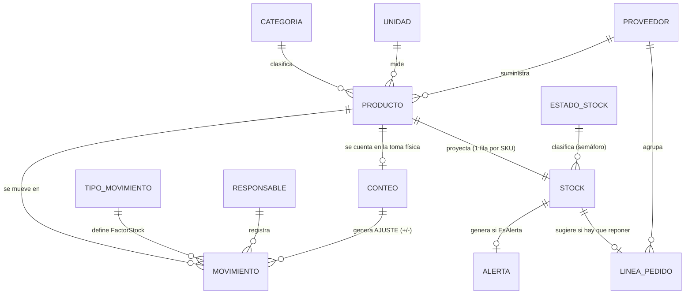

# Diccionario de datos · M-INV V1.2

Versión del modelo: **1.2.0** · Fuente de verdad: `tools/build_minv.py` (paquete `tools/minv/`) ·
Reglas: `.claude/excel-architecture-rules.md`

## Convenciones

| Símbolo | Significado |
|---|---|
| ✎ | Campo de **ingreso** (celda desbloqueada, fondo blanco con borde azul) |
| ƒx | Campo **calculado** (celda bloqueada; oculta en Release) |
| ⇄ | Campo **espejo** (fórmula que copia la fila equivalente de otra hoja) |
| PK / UK / FK | Clave primaria / única / foránea (lógica en Excel, física en SQL V2) |
| **Plus** | Solo en la edición `.xlsm` |

Tipos: `Texto(n)` longitud máxima · `Entero` · `Decimal` · `Fecha` · `Moneda` (decimal ≥ 0) · `Factor` (+1 / −1).

## Modelo entidad-relación

`CONTEO` y el formulario `12_REGISTRO` son **comandos**: escriben movimientos en la bitácora y nunca modifican el stock.

---

## 1. Configuración (capa oculta)

### 1.1 Parámetros del tenant · `01_CONFIG` (nombres definidos `cfg*`)

| Nombre | Descripción | Tipo | Valor por defecto |
|---|---|---|---|
| `cfgEmpresa` | Nombre del cliente mostrado en la portada y el pedido | Texto | `NOMBRE DE SU EMPRESA` |
| `cfgNIT` | Identificación tributaria | Texto | vacío |
| `cfgBodega` | Sede o bodega que controla el libro (1 libro = 1 bodega en V1) | Texto | `Bodega principal` |
| `cfgMoneda` | Moneda informativa (los formatos usan `$`) | Texto(3) | `COP` |
| `cfgMargenAlerta` | Margen de alerta preventiva sobre el mínimo | Decimal 0–1 | `0,20` (20 %) |
| `cfgDiasSinRotacion` | Días sin movimiento para considerar un producto con stock como inmovilizado | Entero | `60` |
| `cfgFechaMin` | Fecha mínima aceptada en la bitácora y el formulario | Fecha | 01/01/2020 |
| `cfgVersion` | Versión del motor | Texto | `1.2.0` |
| `cfgEdicion` | `Estándar` (.xlsx) o `Plus` (.xlsm) | Texto | según el build |
| `cfgFechaBuild` | Fecha de generación del libro | Fecha | fecha del build |
| `cfgProveedor` | Implementador | Texto | Z&P Software Fast Solutions |
| `cfgSelladoHasta` | Mayor ID sellado en la bitácora (lo escribe el VBA de Plus; no editar) | Entero | `0` |

### 1.2 TIPO_MOVIMIENTO · `tblTiposMov` (`01_CONFIG`)

| Campo | Tipo | Regla | SQL V2 |
|---|---|---|---|
| `Tipo` (PK) | Texto(20) | Único | `tipo_movimiento.codigo` |
| `FactorStock` | Factor | +1 suma, −1 resta. Nunca 0 | `factor_stock SMALLINT CHECK (factor_stock IN (-1,1))` |
| `Descripción` | Texto | Uso del tipo | `descripcion` |

Valores base: `SALDO INICIAL` (+1), `ENTRADA` (+1), `SALIDA` (−1), `AJUSTE (+)` (+1), `AJUSTE (-)` (−1).

### 1.3 ESTADO_STOCK · `tblEstados` (`01_CONFIG`)

| Estado | Prioridad | Alerta | Regla (evaluada en este orden) | Acción sugerida |
|---|---|---|---|---|
| `INACTIVO` | 7 | NO | `Activo = "NO"` | Sin acción |
| `INCONSISTENTE` | 1 | SI | `StockActual < 0` | Auditar la bitácora y registrar un AJUSTE |
| `AGOTADO` | 2 | SI | `StockActual = 0` | Reabastecer de inmediato |
| `CRÍTICO` | 3 | SI | `StockActual ≤ StockMin` | Emitir orden de compra |
| `BAJO` | 4 | SI | `StockActual ≤ StockMin × (1 + cfgMargenAlerta)` | Programar reposición |
| `SOBRESTOCK` | 6 | SI (informativa) | `StockMax > 0` y `StockActual > StockMax` | Frenar compras / rotar inventario |
| `ÓPTIMO` | 5 | NO | cualquier otro caso | Sin acción |

`kpiEnAlerta` cuenta INCONSISTENTE + AGOTADO + CRÍTICO + BAJO (requieren acción). `16_ALERTAS` lista además
SOBRESTOCK. El pedido sugerido (`18_PEDIDO`) incluye AGOTADO, CRÍTICO y BAJO de productos activos.

### 1.4 RESPONSABLE · `tblResponsables` (`01_CONFIG`)

| Campo | Tipo | Regla |
|---|---|---|
| `Nombre` (PK) | Texto(60) | Lista de `Responsable` en la bitácora, el formulario y el conteo |
| `Cargo` | Texto(60) | Informativo |

### 1.5 CATEGORIA · `tblCategorias` (`03_CATEGORIAS`)

| Campo | Tipo | Regla | SQL V2 |
|---|---|---|---|
| `Código` | Texto(5) | Abreviatura (opcional) | `categoria.codigo` UK |
| `Categoría` (PK lógica) | Texto(40) | Único; no renombrar si tiene productos | `categoria.nombre` |
| `Descripción` | Texto | — | `descripcion` |

### 1.6 UNIDAD · `tblUnidades` (`06_UNIDADES`)

| Campo | Tipo | Regla | SQL V2 |
|---|---|---|---|
| `Código` (PK) | Texto(6) | Único (`UND`, `KG`…) | `unidad.codigo` |
| `Unidad` | Texto(30) | Nombre completo | `nombre` |
| `Decimales` | SI/NO | `NO` ⇒ `Cantidad` debe ser entera | `admite_decimales BOOLEAN` |
| `Descripción` | Texto | — | `descripcion` |

---

## 2. Maestros

### 2.1 PROVEEDOR · `tblProveedores` (`04_PROVEEDORES`, 100 filas pre-asignadas) · *nuevo en 1.2*

| Campo | Origen | Tipo | Req. | Regla / validación | SQL V2 |
|---|---|---|---|---|---|
| `Proveedor` (PK lógica) | ✎ | Texto(60) | Sí | Único (`CONTAR.SI = 1`) | `proveedor.nombre` UK |
| `NIT` | ✎ | Texto(20) | No | — | `nit` |
| `Contacto` | ✎ | Texto(60) | No | Persona para pedidos | `contacto` |
| `Teléfono` | ✎ | Texto(20) | No | — | `telefono` |
| `Correo` | ✎ | Texto(80) | No | Debe contener `@` | `correo` |
| `DiasEntrega` | ✎ | Entero ≥ 0 | No | *Lead time*: fecha estimada de entrega del pedido | `dias_entrega` |
| `Productos` | ƒx | Entero | — | `CONTAR.SI(tblProductos[Proveedor]; [@Proveedor])` | consulta |
| `EnAlerta` | ƒx | Entero | — | Productos del proveedor en AGOTADO/CRÍTICO/BAJO/INCONSISTENTE | consulta |
| `Validación` | ƒx | Texto | — | `✔ OK` · `⚠ Falta el nombre` · `✖ Proveedor duplicado` · `⚠ Correo no válido` | reglas de dominio |

### 2.2 PRODUCTO · `tblProductos` (`05_PRODUCTOS`, 500 filas pre-asignadas)

| Campo | Origen | Tipo | Req. | Regla / validación | SQL V2 |
|---|---|---|---|---|---|
| `SKU` (PK) | ✎ | Texto(20) | Sí | 2–20 caracteres, sin espacios, único (`CONTAR.SI = 1`) | `producto.sku` UK |
| `Producto` | ✎ | Texto(60) | Sí | 3–60 caracteres | `nombre` |
| `Categoría` (FK) | ✎ | Lista | Sí | ∈ `lstCategorias` | `categoria_id` |
| `Unidad` (FK) | ✎ | Lista | Sí | ∈ `lstUniCod` | `unidad_id` |
| `StockMin` | ✎ | Decimal ≥ 0 | No | Punto de reorden (0 si vacío) | `stock_min` |
| `StockMax` | ✎ | Decimal ≥ 0 | No | 0 = sin máximo | `stock_max` |
| `CostoUnitario` | ✎ | Moneda | No | ≥ 0 | `costo_unitario NUMERIC(14,2)` |
| `Proveedor` (FK) | ✎ | Lista | No | ∈ `lstProveedores` · *nuevo en 1.2* | `proveedor_id` |
| `Ubicación` | ✎ | Texto(20) | No | Pasillo-estante-nivel | `ubicacion` |
| `Activo` | ✎ | SI/NO | No | Vacío = SI. `NO` saca el producto de las listas | `activo BOOLEAN` |
| `Etiqueta` | ƒx | Texto | — | `SKU & " · " & Producto` (texto de las listas desplegables) | calculado en UI |
| `Movimientos` | ƒx | Entero | — | `CONTAR.SI(tblMovimientos[SKU]; [@SKU])` | consulta |
| `Validación` | ƒx | Texto | — | `✔ OK` · `⚠ Faltan datos` · `✖ SKU duplicado` · `✖ SKU con espacios` · `✖ Categoría no existe` · `✖ Unidad no existe` · `✖ Proveedor no existe` · `⚠ Mínimo mayor que máximo` · `● Inactivo` | reglas de dominio |

---

## 3. Escritura

### 3.1 MOVIMIENTO · `tblMovimientos` (`10_MOVIMIENTOS`, 5.000 filas pre-asignadas)

| Campo | Origen | Tipo | Req. | Regla / validación | SQL V2 |
|---|---|---|---|---|---|
| `ID` (PK) | ƒx | Entero | — | Consecutivo por posición: `FILA() − FILA(encabezado)` (estable: no se ordena ni borra) | `movimiento.id` IDENTITY |
| `Fecha` | ✎ | Fecha | Sí | Entre `cfgFechaMin` y `HOY()` | `fecha DATE` |
| `Tipo` (FK) | ✎ | Lista | Sí | ∈ `lstTiposMov` | `tipo_movimiento_id` |
| `Categoría` | ✎ | Lista | No* | ∈ `lstCategorias`; filtra la lista de `Producto` | (derivable del producto) |
| `Producto` | ✎ | Lista | Sí | Lista en cascada: `lpTodos` o sub-rango de `lpCat` para la categoría | — |
| `SKU` (FK) | ƒx | Texto | — | Texto antes de `" · "` en `Producto` | `producto_id` |
| `Unidad` | ƒx | Texto | — | `INDICE/COINCIDIR` en `tblProductos`; `?` si el SKU no existe | (join) |
| `Cantidad` | ✎ | Decimal > 0 | Sí | > 0; entera si la unidad tiene `Decimales = NO` | `cantidad NUMERIC(14,3) CHECK (> 0)` |
| `FactorStock` | ƒx | Factor | — | `INDICE/COINCIDIR` en `tblTiposMov` | (join) |
| `CantidadNeta` | ƒx | Decimal | — | `Cantidad × FactorStock` | columna calculada |
| `Saldo` | ƒx | Decimal | — | Kardex: Σ `CantidadNeta` del SKU hasta esta fila | ventana `SUM() OVER` |
| `Estado` | ƒx | Texto | — | Ver tabla de estados de registro | reglas de dominio |
| `Documento` | ✎ | Texto(30) | No | Factura, remisión u orden (`CF-AAAAMMDD` en ajustes de conteo) | `documento` |
| `Responsable` (FK) | ✎ | Lista | Sí | ∈ `lstResponsables` | `usuario_id` |
| `Observaciones` | ✎ | Texto(250) | Condic. | Obligatoria si `Tipo` empieza por `AJUSTE` | `observaciones` |

\* `Categoría` es opcional técnicamente (sin categoría la lista muestra todos los productos activos), pero si se
diligencia debe coincidir con la del producto. El formulario y los ajustes del conteo la escriben siempre.

**Estados de registro** (columna `Estado`, se evalúan en este orden):

| Valor | Condición |
|---|---|
| *(vacío)* | Fila sin datos |
| `⚠ Incompleto` | Falta Fecha, Tipo, Producto, Cantidad o Responsable |
| `✖ Producto no existe` | El SKU no está en `tblProductos` |
| `✖ Tipo no válido` | El tipo no está en `tblTiposMov` |
| `✖ Cantidad inválida` | No numérica o ≤ 0 |
| `⚠ Categoría no coincide` | La categoría elegida no es la del producto |
| `✖ Stock insuficiente` | El `Saldo` resultante es negativo |
| `⚠ Justifique el ajuste` | AJUSTE sin observación |
| `✔ Registrado` | Registro válido |

**Sellado (Plus).** Toda fila con `ID` y `Estado = ✔ Registrado` se bloquea (celdas `Locked`) al registrar desde el
formulario, al generar los ajustes del conteo y antes de cada guardado; `cfgSelladoHasta` guarda el mayor ID sellado
y un formato condicional pinta en gris las filas selladas. Equivale a la restricción *sin UPDATE/DELETE* de la V2.

### 3.2 Comando · formulario `12_REGISTRO` (**Plus**) · *nuevo en 1.2*

Campos de captura (nombres definidos; celdas combinadas `D:G`):

| Nombre | Campo | Req. | Validación de datos | Tras registrar |
|---|---|---|---|---|
| `frmTipo` | Tipo de movimiento | Sí | ∈ `lstTiposMov` | se conserva |
| `frmFecha` | Fecha | No | `cfgFechaMin` … `HOY()`; vacía = hoy | se limpia |
| `frmCategoria` | Categoría | No | ∈ `lstCategorias` (filtra productos) | se conserva |
| `frmBuscar` | Buscar | No | ≤ 40 caracteres (filtra productos por nombre o SKU) | se limpia |
| `frmProducto` | Producto | Sí | ∈ `lfForm` (lista filtrada) | se limpia |
| `frmCantidad` | Cantidad | Sí | > 0; entera si la unidad no admite decimales | se limpia |
| `frmResponsable` | Responsable | Sí | ∈ `lstResponsables` | se conserva |
| `frmDocumento` | Documento | No | ≤ 30 caracteres | se limpia |
| `frmObservaciones` | Observaciones | Condic. | ≤ 250; obligatoria en AJUSTES | se limpia |

Cálculos de vista previa en `91_KPIS`: `frmSKU`, `frmFila`, `frmExiste`, `frmFactor`, `frmUnidad`, `frmDecimales`,
`frmActual`, `frmMin`, `frmMax`, `frmActivo`, `frmCantOK`, `frmDespues` (stock después), `frmEstadoAct`,
`frmEstadoDesp`, `frmCoinciden`, `frmMeta`, `frmChk1`…`frmChk7` (tipo, producto, cantidad, stock, responsable,
observación, fecha), `frmValido` y `frmResumen`. `frmMensaje` (`B20`) recibe el resultado que escribe el VBA.
El botón **REGISTRAR** solo actúa si `frmValido = VERDADERO`, escribe la fila en la bitácora, exige que su `Estado`
sea `✔` (si no, la borra y lo informa) y la sella.

### 3.3 Comando · CONTEO · `tblConteo` (`13_CONTEO`, fila *n* ↔ fila *n* de `05_PRODUCTOS`) · *nuevo en 1.2*

| Campo | Origen | Regla |
|---|---|---|
| `SKU`, `Producto`, `Categoría`, `Ubicación`, `Unidad`, `Activo` | ⇄ | Espejo de `05_PRODUCTOS` |
| `StockSistema` | ⇄ | `StockActual` de `15_STOCK` (ocúltela para un conteo ciego) |
| `Conteo` | ✎ | Cantidad contada; vacío = no contado |
| `Diferencia` | ƒx | `Conteo − StockSistema` |
| `ValorDiferencia` | ⇄ | `Diferencia × CostoUnitario` |
| `Resultado` | ƒx | `✔ Cuadra` · `▲ Sobrante` · `▼ Faltante` |
| `AjusteSugerido` | ƒx | `AJUSTE (+) n UND` / `AJUSTE (-) n UND` |

Encabezado: `ctFecha` (`K5`, vacía = hoy) y `ctResponsable` (`M5`). **Plus:** *Generar ajustes* registra un AJUSTE
por diferencia (`Documento = CF-AAAAMMDD`, observación con sistema y contado), los sella y vacía `Conteo`.
**Estándar:** el operador registra el `AjusteSugerido` en la bitácora y borra los conteos.

---

## 4. Lectura (proyecciones)

### 4.1 STOCK · `tblStock` (`15_STOCK`, fila *n* ↔ fila *n* de `05_PRODUCTOS`)

| Campo | Origen | Fórmula / regla |
|---|---|---|
| `SKU`, `Producto`, `Categoría`, `Proveedor`, `Unidad`, `Activo`, `StockMin`, `StockMax`, `CostoUnitario` | ⇄ | Espejo de `05_PRODUCTOS` |
| `Entradas` | ƒx | `SUMAR.SI.CONJUNTO(CantidadNeta; SKU; [@SKU]; FactorStock; 1)` |
| `Salidas` | ƒx | `−SUMAR.SI.CONJUNTO(CantidadNeta; SKU; [@SKU]; FactorStock; −1)` |
| `StockActual` | ƒx | `SUMAR.SI.CONJUNTO(CantidadNeta; SKU; [@SKU])` |
| `Nivel` | ƒx | `MAX(0; StockActual) / StockMax` (barra de datos) |
| `Estado` | ƒx | Semáforo de `tblEstados` (sección 1.3) |
| `ValorInventario` | ƒx | `MAX(0; StockActual) × CostoUnitario` |
| `UltimoMov` | ƒx | `AGREGAR(14; 6; Fecha / (SKU = [@SKU]); 1)` |
| `DiasSinMov` | ƒx | `HOY() − UltimoMov`; en ámbar si supera `cfgDiasSinRotacion` con stock > 0 · *nuevo en 1.2* |

### 4.2 ALERTA (`16_ALERTAS`, rango calculado de 500 filas)

Ordenada por `Prioridad` (tabla 1.3) y, dentro de cada prioridad, por cobertura `StockActual / StockMin` ascendente.
Campos: `#`, `Nivel` (estado), `SKU`, `Producto`, `Categoría`, `Proveedor`, `Stock`, `Mínimo`, `Máximo`, `Unidad`,
`Faltante = MAX(0; Mínimo − Stock)`, `SugeridoPedir = MAX(0; (Máximo o 2 × Mínimo) − Stock)` (0 para SOBRESTOCK
e INCONSISTENTE), `AcciónSugerida` (de `tblEstados`), `UltimoMov`.

### 4.3 CONSULTA DE PRODUCTO (`17_KARDEX`) · *nuevo en 1.2*

| Elemento | Detalle |
|---|---|
| Selectores ✎ | `kxCategoria` (`B8`), `kxBuscar` (`E8`, texto), `kxProducto` (`H8`, lista `lfKardex` filtrada) |
| Ficha | Stock actual, estado, valor, mínimo/máximo, unidad, último movimiento, días sin movimiento, proveedor y ubicación |
| Gráfico | Saldo después de cada movimiento (serie en `91_KPIS!W:X`, puntos `#N/A` no trazados) |
| Historial | Últimos 100 movimientos del SKU, del más reciente al más antiguo: `ID`, `Fecha`, `Tipo`, `Entrada (+)`, `Salida (-)`, `Saldo`, `Documento`, `Responsable`, `Observaciones` (`AGREGAR(14; 6; ID / (SKU = kxSKU); k)`) |

### 4.4 LÍNEA DE PEDIDO (`18_PEDIDO`, 500 filas calculadas) · *nuevo en 1.2*

Productos activos en AGOTADO, CRÍTICO o BAJO, agrupados por proveedor (orden del maestro) y por prioridad.
Filtro `pdProveedor` (`D10`, lista `lstFiltroProv`, `(Todos)` por defecto) con contacto y fecha estimada de entrega
(`HOY() + DiasEntrega`). Campos: `#`, `Proveedor`, `SKU`, `Producto`, `Unidad`, `Stock`, `Mínimo`, `Máximo`,
`Prioridad`, `A pedir` (= `SugeridoPedir`), `Costo unit.`, `Subtotal = A pedir × Costo`. Totales: `kpiPedidoLineas`,
`kpiPedidoTotal`, `kpiPedidoProv`.

---

## 5. Motor interno (capa oculta)

| Hoja | Contenido | Nombres definidos |
|---|---|---|
| `90_LISTAS` | Productos activos con categoría válida ordenados (cascada); resultados de la búsqueda por texto del formulario y de la consulta; proveedores | `lpCat`, `lpBase`, `lpVacio`, `lpTodos`, `lfForm`, `lfKardex`, `lstProveedores`, `lstFiltroProv` |
| `91_KPIS` | Indicadores, textos dinámicos, asistente, series de gráficos, claves y rankings (alertas, pedido), cálculos del formulario y de la consulta | `kpi*`, `txt*`, `frm*`, `kx*`, `pdProvFila` |

Nombres de listas simples: `lstTiposMov`, `lstCategorias`, `lstUniCod`, `lstUniDec`, `lstResponsables`
(apuntan a columnas de tablas, por lo que crecen solas).

**Asistente «Próximo paso»** (`kpiPaso`, primer caso que se cumple): 1 errores en la bitácora · 2 empresa sin
configurar · 3 catálogo vacío · 4 bitácora vacía (falta saldo inicial) · 5 registros incompletos · 6 conteo en curso ·
7 agotados · 8 productos por reponer · 9 sin rotación · 10 todo en orden. `kpiPasoNivel` da el color y
`irSiguientePaso` el destino del botón.

**Navegación dinámica** (`ir*`): `irBitacora` y `irRegistrar` (fila libre o formulario), `irConsultar`,
`irFilaLibreProd`, `irFilaLibreProv`, `irPrimerError`, `irPrimerAdvertencia`, `irPrimerosPasos`, `irSiguientePaso`.

---

## 6. Invariantes verificadas automáticamente

`tools/verify_minv.ps1` (los 4 entregables, macros deshabilitadas):

1. Cero errores de fórmula tras recálculo completo (salvo los `#N/A` intencionales de series de gráfico).
2. Para cada SKU: `StockActual = Σ CantidadNeta` calculada de forma independiente.
3. Conservación global: `Σ StockActual = Σ CantidadNeta`.
4. Ningún `Saldo` negativo; todas las filas con datos en `✔ Registrado` (dataset demo).
5. Cada producto registrado pertenece a la lista en cascada de su categoría (salvo históricos de inactivos) y la
   búsqueda por texto devuelve solo coincidencias.
6. `16_ALERTAS` contiene exactamente `kpiEnAlerta + kpiSobrestock` filas.
7. Consulta: el saldo del movimiento más reciente es igual al stock actual del producto.
8. Pedido: total igual a un cálculo independiente desde `15_STOCK`; el filtro por proveedor solo deja sus líneas.
9. Conteo y formulario: diferencias, resultados, stock resultante y bloqueo por stock insuficiente.
10. Todos los botones navegan a un destino válido (incluidos los dinámicos `ir*`).

`tools/build_xlsm.ps1` (edición Plus, macros habilitadas): apertura en modo app, protección reaplicada, macros de
botones, sellado, registro válido e inválido, reposición por doble clic con la cantidad sugerida, consulta,
ajustes del conteo sellados, aviso «sin macros» visible en el archivo guardado y barra de fórmulas restaurada al cerrar.
