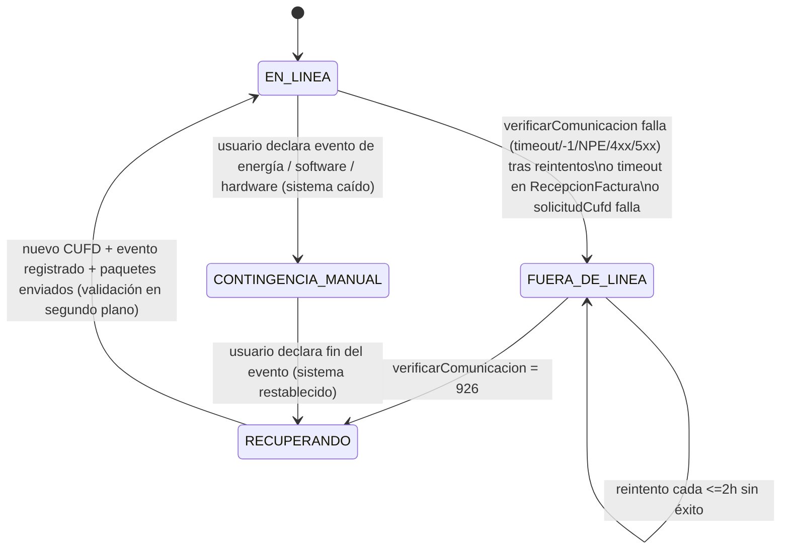

# Especificación 03: emisión, contingencia, eventos significativos, anulación y reversión

**Modalidad objetivo:** Facturación Computarizada en Línea (`codigoModalidad = 2`, sin firma digital).
**Sistema destino:** M-INV (.NET 8, Clean Architecture, EF Core + PostgreSQL, WPF, multi-sucursal).
**Convenciones de este documento**

- `[fuente: archivo.md]` indica el archivo de `siat/txt` del que sale cada dato. Los datos sin cita son decisiones de diseño y están marcados como **(diseño M-INV)**.
- **NO DOCUMENTADO** marca lo que las fuentes no dicen. No se ha rellenado de memoria.
- **⚠ ELECTRÓNICA** marca lo que solo aplica a la modalidad Electrónica en Línea (1). M-INV lo omite por ahora.
- **(ref. cruzada)** marca información de archivos que no son de este bloque. Se usó solo para dar nombres exactos de métodos y parámetros de los servicios que el bloque menciona. Los detalles completos de esos servicios los cubren otras especificaciones.

---

## 0. Fuentes leídas

### 0.1 Bloque asignado (leído completo)

| Archivo | Tema |
|---|---|
| `informacion__generalidades-sfvl.md` | Generalidades del Sistema de Facturación Virtual en Línea |
| `informacion__base-legal.md` | Base legal (leyes y RND) |
| `informacion__modalidades-facturacion__facturacion-computarizada.md` | Modalidad Computarizada en Línea y esquema de interoperabilidad |
| `facturacion-en-linea__emision-y-envio-de-facturas__emision-y-envio.md` | Emisión individual, fuera de línea, masiva y por contingencia |
| `facturacion-en-linea__emision-y-envio-de-facturas__contingencia-y-eventos-significativos.md` | Eventos significativos, acciones y reglas de CUFD |
| `facturacion-en-linea__emision-y-envio-de-facturas__ingreso-a-contingencia.md` | Cuándo y cómo entrar fuera de línea |
| `facturacion-en-linea__emision-y-envio-de-facturas__anulacion-de-documentos-fiscales.md` | Anulación. Unos 55 KB, casi todo imagen base64: la única imagen es un dibujo decorativo con la palabra "Anulado" y no aporta datos |
| `facturacion-en-linea__emision-y-envio-de-facturas__reversion-anulacion-documentos-fiscales.md` | Reversión de anulación. Unos 50 KB; la imagen base64 es decorativa (tachado) |
| `facturacion-en-linea__emision-y-envio-de-facturas__comprobante-de-transaccion.md` | Comprobante de transacción (enlace o QR) |
| `facturacion-en-linea__emision-y-envio-de-facturas__solicitud-token.md` | Token delegado. Cae dentro del filtro `emision-y-envio-de-facturas__`, así que también se leyó |
| `facturacion-en-linea__casos-especiales__manuales-contingencia.md` | Facturas manuales de contingencia (CAFC) |
| `adjuntos/CasosDePruebaEventosSignificativos.xlsx` | 14 casos de prueba de registro de eventos |

### 0.2 Referencias cruzadas (fuera del bloque, solo para exactitud)

`...operaciones__registro-evento-significativo.md`, `...operaciones__consulta-evento-significativo.md`, `...facturacion-computarizada__recepcion-factura-computarizada.md`, `...recepcion-paquete-factura-computarizada.md`, `...validacion-recepcion-paquete-factura-computarizada.md`, `...recepcion-masiva-computarizada.md`, `...validacion-recepcion-masiva-factura-computarizada.md`, `...anulacion-factura-computarizada.md`, `...reversion-anulacion-factura-computarizada.md`, `...verificacion-estado-factura-computarizada.md`, `...verifica-comunicacion-fact-comp.md`, `...codigos-error-siat.md`, `...sincronizacion-codigos-catalogos.md`, `...codigos__solicitud-cufd.md`, `informacion__codigos-de-autorizacion.md`, `...requerimientos__sistema-informatico.md`, `...algoritmos-utilizados__generacion-cuf.md`, `...algoritmos-utilizados__comprimir-gzip.md`, `...factura-de-compra-y-venta.md` (campos `codigoExcepcion`, `cafc`, `leyenda`), `...fase-i-pruebas.md`, `...fase-ii-inspeccion.md`, `...fase-iii-pruebas-piloto.md` y `versionamiento__versionamiento-2021/2022/2023/2024.md`. Adjuntos consultados: `CasosDePruebaEmisionPorPaquetes.xlsx`, `CasosDePruebaAnulacionReversion.xlsx` y los PDF de representación gráfica (para el texto de la leyenda).

---

## 1. Marco general

### 1.1 Generalidades `[fuente: informacion__generalidades-sfvl.md]`

- El SIN publica un Anexo Técnico con las modalidades de facturación y los procesos de autorización, emisión, registro y envío de facturas manuales y electrónicas, conforme a la **RND N° 102100000011**.
- La actualización publicada con fecha **10/06/2026** cambia la leyenda "Tarifa Dignidad" por "Descuento Patria" en los sectores Servicios Básicos y Servicios Básicos Zona Franca. **No afecta a M-INV**, que emite Compra-Venta.

### 1.2 Base legal `[fuente: informacion__base-legal.md]`

- Leyes: N° 2166, N° 843, N° 2492 (Código Tributario) y N° 164 (Telecomunicaciones y TIC).
- Resoluciones normativas de directorio:

| RND | Fecha de publicación | PDF (nombre en `adjuntos/`) |
|---|---|---|
| 102100000011 | 11/08/2021 | `rnd_53774273f4.pdf`. La página de generalidades enlaza además `rnd_491335f008.pdf` como la misma RND |
| 102100000017 | 28/09/2021 | `rnd_50431bd4da.pdf` |
| 102100000021 | 18/11/2021 | `rnd_51325a1730.pdf` |
| 102300000034 | 01/12/2023 | `rnd_8106777420.pdf`. Es la base de la reversión de anulación |

> ⚠ **Los 7 archivos `adjuntos/rnd_*.pdf` NO son PDF.** Son la página HTML de inicio de impuestos.gob.bo (`<title>Impuestos - SIN</title>`); la descarga falló. **El texto legal de las RND no se ha verificado.** Los plazos de este documento vienen del Anexo Técnico (siatinfo), no del texto de las RND. Ver la sección 18.

### 1.3 Modalidad Computarizada en Línea `[fuente: informacion__modalidades-facturacion__facturacion-computarizada.md]`

**Definición.** Modalidad para emitir Facturas Digitales con un **Token propio o delegado**, desde un Sistema Informático de Facturación autorizado por el SIN. Cada factura se envía después al SIN, que la registra y la valida en sus servidores.

**Características**

- La impresión de la factura digital es **opcional**.
- Envío **individual** de la factura en XML.
- Envío **agrupado en paquete por contingencia** de las facturas en XML.
- Envío **masivo por paquete** de las facturas en XML.

**Esquema de interoperabilidad (8 pasos literales de la fuente)**

1. El sistema del emisor, autorizado y con **CUIS vigente**, pide al SIN el **CUFD**. El CUFD habilita la emisión durante **24 horas**.
2. El SIN verifica al emisor y devuelve el **código de verificación** (código de control) y el CUFD, junto con la **dirección** de la sucursal o casa matriz.
3. El sistema usa el CUFD para emitir la factura en XML, obtiene el **hash** del archivo y lo envía al SIN.
4. El SIN valida la cabecera de recepción:
   - a) Si es correcta y el proceso es **individual en línea**, devuelve el código de recepción y el estado **recibido**.
   - b) Si es correcta y es **paquete de contingencia o masivo**, devuelve el código de recepción.
   - c) Si hay errores, devuelve una lista de códigos y mensajes para que el emisor corrija y **reenvíe**.
5. Si el cliente quiere un respaldo, el emisor puede **imprimir** la factura.
6. En paquetes de contingencia o masivos, el SIN valida el contenido:
   - a) Sin errores, registra y consolida.
   - b) Con errores, **marca el paquete como observado, registra las facturas correctas y rechaza las que tienen errores**. Si el tipo de documento es NIT y el número no es válido, o no se validó antes con el método de verificación de NIT, el emisor puede enviar el **código de excepción** para que la factura no se rechace.
7. El emisor usa el **código de recepción** para consultar la validación. Esto solo aplica a paquetes de contingencia y masivos.
8. El SIN devuelve el resultado del paso 6. Si hay observaciones, el emisor debe **subsanarlas y reenviar**.

**Diferencias con la electrónica**

- En computarizada **no hay firma**. El SHA-256 del archivo comprimido (`hashArchivo`) "es utilizado también como Huella Digital en la modalidad computarizada en Línea" `[ref. cruzada: requerimientos__sistema-informatico.md]`.
- ⚠ ELECTRÓNICA: firmar el XML con XMLDSig antes de validarlo y comprimirlo `[fuente: emision-y-envio.md]`.

---

## 2. Requisitos previos a la emisión `[fuente: emision-y-envio.md]`

| # | Requisito | Frecuencia | Detalle |
|---|---|---|---|
| 1 | **Token delegado** | Al inicio y al renovarlo | Se obtiene en el Portal SIAT (sección 2.1). Va en la cabecera HTTP de cada llamada |
| 2 | **CUIS** (Código Único de Inicio de Sistemas) | Una vez, y de nuevo cuando vence | Vigencia de **365 días calendario** `[ref. cruzada: informacion__codigos-de-autorizacion.md]`. Es uno por sucursal y/o punto de venta |
| 3 | **CUFD** (Código Único de Facturación Diaria) | **Diario** | Vigencia de **24 h** `[ref. cruzada: codigos__solicitud-cufd.md]`. Método `solicitudCufd`; devuelve `codigoCUFD`, `fechaVigencia`, `codigoControl`, `direccion`, `transaccion` y `codigosRespuestas` |
| 4 | **Sincronización de catálogos** | **Diaria** | Actividades, sectores, productos, fecha y hora, documento sector, etc. Si el despliegue es **centralizado**, puede hacerse una sola vez con la Casa Matriz; si no, por cada sucursal y/o punto de venta |
| 5 | **Verifica Comunicación** | Periódica (buena práctica) | Si responde con error (`Falso`, `-1`, error 4xx o 5xx), se entra **automáticamente** en modo fuera de línea. **El método existe en cada recurso (servicio), así que se implementa por recurso** |

Método de verificación en computarizada `[ref. cruzada: verifica-comunicacion-fact-comp.md]`:

| Método | Entrada | Salida |
|---|---|---|
| `verificarComunicacion` | ninguna | `return = 926` (comunicación exitosa), numérico |

**Sincronización de fecha y hora** `[ref. cruzada: requerimientos__sistema-informatico.md]`

- Es **obligatoria a diario**.
- Se usa para "los controles de plazos de envíos y registros".
- Se recomienda hacerla **antes de pedir el CUFD**.

### 2.1 Token delegado `[fuente: facturacion-en-linea__emision-y-envio-de-facturas__solicitud-token.md]`

**Obtención en el Portal SIAT**

1. Entrar al Portal SIAT con las credenciales de SIAT en línea.
2. Si se entra con credenciales de SIAT en línea **V2**, elegir **Sistema de Facturación**. Con V1 se omite este paso.
3. Elegir el ambiente:
   - Para producción: **Gestión de Autorización de Sistemas Informáticos de Facturación**.
   - Para piloto: **Gestión de Autorización de Sistemas Informáticos de Facturación (Piloto)**.
4. Elegir **Token Delegado en Producción** o **Token Delegado Piloto**.
5. Pulsar **Generar Nuevo Ticket**.
6. En el formulario "Token Delegado":
   - Sección "Validez del Token": *Desde* (fecha y hora automática), *NIT Delegado* (lista), *Sistema* (lista), *Código del Sistema* y *Hasta* (fecha `dd/mm/aaaa`).
   - Pulsar **Solicitar**. El token aparece en el campo *Token*.
   - Estos campos salen de la captura PNG embebida en base64 en la línea 37 del archivo; se decodificó y se revisó durante el análisis.

**Renovación**

- Cuando el token caduca o está por caducar, se entra a la misma opción y se **inactiva** con la **X** de la columna Opciones.
- Luego se pulsa **Generar Nuevo Token**.

**Uso**

- Se incluye en la **cabecera** de cada solicitud.
- Ejemplo Java de la fuente: `headers.put("apikey", Arrays.asList("TokenApi " + pToken));`
- En .NET se agrega la cabecera HTTP **`apikey: TokenApi <token>`** a cada llamada SOAP.

**No documentado:** la duración máxima permitida del token y el comportamiento exacto del SIN cuando el token vence (el código **989 "Token Invalido"** existe en `codigos-error-siat.md`).

---

## 3. Tipos de emisión

| Código de tipo de emisión (CUF / `codigoEmision`) | Nombre | Cuándo se usa | Servicio de envío | Máximo por envío |
|---|---|---|---|---|
| **1** | Online (en línea) | Operación normal, factura a factura, en tiempo real | `RecepcionFactura` | 1 factura |
| **2** | Offline (fuera de línea) | (a) Durante un evento significativo con el sistema operativo (eventos de internet o de acceso al SIN).<br>(b) **Al transcribir facturas manuales de contingencia (CAFC)**, que también se transcriben "con tipo de emisión 'fuera de linea' (2)" | `RecepcionPaqueteFactura` + `validacionRecepcionPaqueteFactura` | **500 facturas** por paquete |
| **3** | Masiva | Emisión por lotes (entidades financieras, telecomunicaciones, servicios básicos). Se registra antes en el portal | `recepcionMasivaFactura` + `validacionRecepcionMasivaFactura` | **1000 facturas** por paquete |

Fuentes: `emision-y-envio.md`, `generacion-cuf.md` (ref. cruzada: "TIPO DE EMISIÓN 1 = Online 2 = Offline 3 = Masiva"), `recepcion-paquete-factura-computarizada.md` ("Offline : 2") y `recepcion-masiva-computarizada.md` ("Masiva: 3").

**Reglas** `[fuente: emision-y-envio.md]`

- El tipo de emisión **"CONTINGENCIA"** que devuelve la sincronización de catálogos es **de uso exclusivo del SIN**. **M-INV nunca debe usarlo.**
- **No se pueden emitir facturas con actividades económicas de Importación.**

---

## 4. Emisión y envío individual en línea (tipo 1), paso a paso

`[fuente: emision-y-envio.md; requerimientos__sistema-informatico.md (ref. cruzada)]`

**Pasos**

1. Generar el XML del documento fiscal según la actividad económica y el documento sector. Para M-INV es Compra-Venta, sector 1.
2. ⚠ ELECTRÓNICA: firmar con XMLDSig. **En computarizada se omite.**
3. **Validar contra el XSD** del sector: que esté bien formado y cumpla la estructura.
4. **Comprimir el XML con GZIP**. El resultado va en la etiqueta **`archivo`**.
5. Calcular el **SHA-256 del archivo comprimido** (no del XML plano). Va en la etiqueta **`hashArchivo`** y es la "Huella Digital".
6. Llamar a **Recepción de Factura**.
7. Interpretar la respuesta:
   - **908 (validado):** la factura queda **VALIDADA**.
   - **904 (observado):** llega con `codigoRecepcion` y la lista de errores o advertencias. Se corrige y se reenvía (ver §1.3, punto 4c).
   - `transaccion` vale `true` o `false` según corresponda.

**Buena práctica.** Antes de emitir, llamar a `verificarComunicacion`. Si falla, pasar a fuera de línea (§5).

### 4.1 Servicio `RecepcionFactura` (computarizada) `[ref. cruzada: recepcion-factura-computarizada.md]`

Objeto de solicitud: `SolicitudServicioRecepcionFactura`. Nombre del método: **`RecepcionFactura`**. La página del servicio compra-venta (`servicio-factura-compra-venta__recepcion-factura-compra-venta.md`) describe el mismo método, publicado "de forma diferenciada por tipo de documentos sector".

> **[corregido por revisión]** Para M-INV (sector 1, Compra-Venta) el recurso SOAP al que se envía es **"Servicio Factura Compra Venta"** (grupo `servicio-factura-compra-venta__*` del menú del sitio), no el recurso "Facturación Computarizada en Línea". Las páginas de ambos recursos son idénticas en parámetros (verificado con `diff`), por lo que las tablas de esta especificación valen igual; lo que cambia es la URL/WSDL del recurso. El enrutamiento es INFERIDO (servicios "publicados de forma diferenciada por tipo de documentos sector" + error 932 "Documento Sector No Corresponde Al Servicio"); ver `02-…` §2.2. Lo mismo aplica a `RecepcionPaqueteFactura`, `validacionRecepcionPaqueteFactura`, `AnulacionFactura`, `ReversionAnulacionFactura` y `verificacionEstadoFactura` de las secciones 7, 10, 11 y 12. Las notas (sector 24) van al recurso **Documentos de Ajuste** (`…DocumentoAjuste`).

**Entrada**

| Campo | Tipo | Obligatorio | Valor o regla |
|---|---|---|---|
| `codigoAmbiente` | Numérico | Sí | 1 = Producción; 2 = Pruebas y Piloto |
| `codigoPuntoVenta` | Numérico | No | 0 si no se usa punto de venta |
| `codigoSistema` | Alfanumérico | Sí | Código asignado en la autorización |
| `codigoSucursal` | Numérico | Sí | 0 = Casa Matriz; 1..n = sucursales |
| `nit` | Numérico | Sí | NIT del emisor |
| `codigoDocumentoSector` | Numérico | Sí | Sector de la factura |
| `codigoEmision` | Numérico | Sí | **1** (Online) |
| `codigoModalidad` | Numérico | Sí | **2** (Computarizada en línea) |
| `cufd` | Alfanumérico | Sí | CUFD vigente |
| `cuis` | Alfanumérico | Sí | CUIS de la sucursal o punto de venta |
| `tipoFacturaDocumento` | Numérico | Sí | Tipo de factura |
| `archivo` | Alfanumérico | Sí | XML comprimido con GZIP. La codificación de transporte (base64 / `byte[]`) **NO DOCUMENTADA** en la página; ver la especificación de servicios |
| `fechaEnvio` | TimeStamp | Sí | Fecha y hora del envío |
| `hashArchivo` | Alfanumérico | Sí | SHA-256 de `archivo` |

**Salida**

| Campo | Tipo |
|---|---|
| `codigoEstado` | Numérico |
| `codigoRecepcion` | Alfanumérico |
| `codigosRespuestas` | `DTO[codigosRespuesta]` |
| `transaccion` | Boolean |
| `codigoDescripcion` | Alfanumérico |

Las **longitudes** de los campos **no están documentadas** en estas páginas.

---

## 5. Detección de fallos e ingreso a contingencia `[fuente: ingreso-a-contingencia.md]`

La tabla recoge los cinco casos literales. "Un par de veces" es el número de reintentos que da la fuente; el número exacto **NO DOCUMENTADO**.

| # | Situación | Síntoma | Acción documentada |
|---|---|---|---|
| A | **Verificar comunicación** antes de emitir | Time Out, `-1`, *Java Null Point* o **HTTP 500**, repetido tras un par de reintentos | Entrar **fuera de línea**. Quedarse un tiempo prudencial, **no más de dos horas**, antes de volver a verificar. Al recuperar la comunicación: **nuevo CUFD → registrar evento significativo → enviar paquetes** |
| B | **Otro servicio**, con la comunicación ya verificada | Error **400** o **404 Time Out** tras un par de reintentos | Igual que A |
| C | Durante la **emisión** (envío de una factura) | Time Out, `-1`, NPE o 500 | Al recuperar la comunicación: **nuevo CUFD**, **verificar el estado de esa factura**. Si **está registrada en el SIN, anularla**. Luego registrar el evento y enviar los paquetes |
| D | Durante la **anulación** | Time Out, `-1`, NPE o 500, tras un par de reintentos | **No se entra en contingencia.** Se espera un tiempo prudencial y, **antes de reintentar, se verifica el estado de la factura**. Si en el SIN ya figura **anulada**, se completa la anulación **solo localmente**. Si figura **válida**, se reintenta la anulación |
| E | Al pedir el **CUFD** | Time Out, `-1`, NPE o 500, tras un par de reintentos | Entrar fuera de línea y emitir con el **último CUFD válido**; "en casos como este **la duración del CUFD se amplía hasta 72 horas**". Reintentar la obtención del CUFD tras no más de 2 h. Si funciona: registrar el evento y enviar los paquetes |

**Nota de buena práctica** `[fuente: contingencia-y-eventos-significativos.md, emision-y-envio.md]`

- Hay que mantener un **registro de facturas sin código de respuesta**.
- Superada la contingencia, se verifican con **`verificacionEstadoFactura`** para saber si el SIN las registró.
- Si están registradas, se anulan si hace falta, **para evitar duplicados**.

**Criterio para M-INV (diseño M-INV):** una factura del caso C se re-emite en el paquete fuera de línea con un **CUF nuevo**. Si el SIN confirma que la emisión en línea original sí quedó registrada (908), se **anula la original** con el motivo que corresponda. Si no quedó registrada, se descarta localmente.

---

## 6. Eventos significativos

### 6.1 Definición y plazo de registro `[fuente: contingencia-y-eventos-significativos.md]`

Son "hechos inherentes al Sistema informático de Facturación que intervienen en su funcionamiento o que podrían afectar la emisión de las Facturas Digitales".

- Se **registran hasta 48 horas después de finalizada la contingencia**.
- Se registran desde el sistema autorizado y se **envían automáticamente** por el servicio web.

### 6.2 Catálogo de eventos y acción por evento

**Tabla de la página de contingencia**

La fuente es `contingencia-y-eventos-significativos.md`. Según `versionamiento-2022.md`, "Se reordenaron las causales 5, 6 y 7 … para adecuarlas a normativa vigente".

| Orden en la página | Evento | Acción documentada | Tipo de contingencia |
|---|---|---|---|
| 1 | Corte del servicio de Internet | Emitir documentos fiscales digitales **fuera de línea** | **Offline automático** (tipo 2, CUFD vigente) |
| 2 | Inaccesibilidad al Servicio Web de la Administración Tributaria | Ídem | Offline |
| 3 | Ingreso a zonas sin Internet por despliegue de puntos de venta | Ídem | Offline |
| 4 | Venta en lugares sin internet | Ídem | Offline |
| 5 | Virus informático o falla de software | Emitir **Facturas por Contingencia (CAFC)** pedidas con anterioridad, **o** emitir documentos fiscales digitales usando de forma transitoria la **Modalidad Portal Web en línea** | **Manual CAFC** (o Portal Web) |
| 6 | Cambio de infraestructura de sistema o falla de hardware | Ídem al 5 | **Manual CAFC** (o Portal Web) |
| 7 | Corte de suministro de energía eléctrica | Emitir **Facturas por Contingencia (CAFC)** pedidas con anterioridad. **Sin opción de Portal Web** | **Manual CAFC** |

> ⚠ **La numeración de eventos NO es consistente entre los documentos oficiales.** No hay que codificar números fijos.

| Evento (descripción) | Página de contingencia (orden) | `CasosDePruebaEventosSignificativos.xlsx` (columna CÓDIGO EVENTO) | `CasosDePruebaEmisionPorPaquetes.xlsx` (ref. cruzada) |
|---|---|---|---|
| CORTE DEL SERVICIO DE INTERNET | 1 | **1** | 2 |
| INACCESIBILIDAD AL SERVICIO WEB DE LA ADMINISTRACIÓN TRIBUTARIA | 2 | **2** | 5 |
| INGRESO A ZONAS SIN INTERNET POR DESPLIEGUE DE PUNTO DE VENTA EN VEHICULOS AUTOMOTORES | 3 | **3** | 6 |
| VENTA EN LUGARES SIN INTERNET | 4 | **4** | 7 |
| CORTE DE SUMINISTRO DE ENERGIA ELECTRICA | 7 | **5** | 1 |
| VIRUS INFORMÁTICO O FALLA DE SOFTWARE | 5 | **6** | 3 |
| CAMBIO DE INFRAESTRUCTURA DEL SISTEMA INFORMÁTICO DE FACTURACIÓN O FALLA DE HARDWARE | 6 | **7** | 4 |

Las páginas `manuales-contingencia.md` y `emision-y-envio.md` dicen "eventos catalogados como **5, 6 o 7**" / "código de evento (5,6 o 7)" para la contingencia manual. En la numeración del Excel de eventos (5 = energía, 6 = virus/software, 7 = hardware) y en la de la página (5 = virus, 6 = hardware, 7 = energía), el **conjunto** {5, 6, 7} coincide: son los tres eventos manuales. En el Excel de paquetes no coincide.

**Regla para M-INV**

- Los códigos se toman **siempre del catálogo** "Códigos de Eventos Significativos" que se descarga en la sincronización diaria (`sincronizacion-codigos-catalogos.md`).
- La acción (offline o manual CAFC) se asigna **por descripción**.
- El nombre SOAP exacto del método de sincronización de eventos **no aparece en este bloque**; ver la especificación de sincronización.
- Solo hay **7 eventos** en todas las fuentes leídas. No aparece un evento 8.

### 6.3 Servicio `registroEventoSignificativo` `[ref. cruzada: operaciones__registro-evento-significativo.md]`

Objeto de solicitud: `SolicitudEventoSignificativo`. Método: **`registroEventoSignificativo`**. Requiere token delegado.

**Entrada**

| Campo | Tipo | Obligatorio | Regla |
|---|---|---|---|
| `codigoAmbiente` | Numérico | Sí | 1 = Producción, 2 = Pruebas y Piloto |
| `codigoSistema` | Alfanumérico | Sí | |
| `nit` | Numérico | Sí | NIT del emisor |
| `cuis` | Alfanumérico | Sí | CUIS de la sucursal o punto de venta |
| `cufd` | Alfanumérico | (la columna está vacía en la fuente) | "Valor diario otorgado por el SIN". Es el **CUFD nuevo** ("cufd del envío"), obtenido después de superar la contingencia (§6.5) |
| `codigoSucursal` | Numérico | **No** (así lo dice la fuente) | 0 = Casa Matriz, 1..n. Recomendación: enviarlo siempre |
| `codigoPuntoVenta` | Numérico | No | 0 si no se usa punto de venta |
| `codigoEvento` | Numérico | Sí | Código del catálogo de eventos (§6.2) |
| `descripcion` | Alfanumérico | Sí | Descripción del evento. Longitud máxima **NO DOCUMENTADA** (existe el error 998 "La Descripción Excede El Limite…") |
| `fechaInicioEvento` | String | Sí | Formato `yyyy-MM-dd'T'HH:mm:ss.SSS`. Precisión mínima: **hasta el minuto** (`emision-y-envio.md`) |
| `fechaFinEvento` | String | Sí | Mismo formato. Error 960 si falta |
| `cufdEvento` | Alfanumérico | Sí | "Valor del CUFD que se uso en la contingencia", es decir, el vigente **al ingresar** en contingencia |

**Salida**

| Campo | Tipo | Nota |
|---|---|---|
| `codigoRecepcion` | Alfanumérico | **Se guarda.** Es el valor que después va en el campo `codigoEvento` de `RecepcionPaqueteFactura` |
| `transaccion` | Boolean | |
| `mensajes` | Lista | |

**Caso de prueba oficial** `[fuente: adjuntos/CasosDePruebaEventosSignificativos.xlsx]`

- 14 casos: eventos 1 a 7, cada uno con `codigoPuntoVenta` = 1 y = 0.
- Valores comunes: sucursal 0, ambiente 2, "CUFD válido" en `cufd` y "CUFD con el que se generó el evento" en `cufdEvento`.
- Fechas "en formato UTC"; en `fase-i-pruebas.md`: "formato UTC extendido sin zona horaria".
- Resultado esperado: `TRANSACCIÓN = TRUE` y "Código de recepción del evento".
- `fase-i-pruebas.md` exige **5 pruebas por cada caso**.
- Descripciones exactas del Excel: "CORTE DEL SERVICIO DE INTERNET", "INACCESIBILIDAD AL SERVICIO WEB DE LA ADMINISTRACIÓN TRIBUTARIA", "INGRESO A ZONAS SIN INTERNET POR DESPLIEGUE DE PUNTO DE VENTA EN VEHICULOS AUTOMOTORES", "VENTA EN LUGARES SIN INTERNET", "CORTE DE SUMINISTRO DE ENERGIA ELECTRICA", "VIRUS INFORMÁTICO O FALLA DE SOFTWARE" y "CAMBIO DE INFRAESTRUCTURA DEL SISTEMA INFORMÁTICO DE FACTURACIÓN O FALLA DE HARDWARE".

**Zona horaria de las fechas.** "UTC extendido sin zona horaria" es el **formato** ISO sin sufijo. **NO DOCUMENTADO** si el valor debe ir en hora de Bolivia o en UTC. Recomendación (diseño M-INV): usar la hora del SIN obtenida en la sincronización de fecha y hora, y validarlo en piloto.

### 6.4 Servicio `consultaEventoSignificativo` `[ref. cruzada: operaciones__consulta-evento-significativo.md]`

Objeto de solicitud: `SolicitudConsultaEvento`.

**Entrada**

| Campo | Tipo | Obligatorio |
|---|---|---|
| `codigoAmbiente` | Numérico | Sí |
| `codigoSistema` | Alfanumérico | Sí |
| `nit` | Numérico | Sí |
| `cuis` | Alfanumérico | Sí |
| `cufd` | Alfanumérico | (sin marcar) |
| `codigoSucursal` | Numérico | No |
| `codigoPuntoVenta` | Numérico | No |
| `fechaEvento` | **Date** | Sí. Formato **NO DOCUMENTADO** |

**Salida**

| Campo | Tipo |
|---|---|
| `listaEventos` | `Array[codigoEvento, descripción, fecha]` |
| `transaccion` | Boolean |
| `mensajes` | Lista |

Uso en M-INV: conciliar los eventos registrados y recuperar el `codigoRecepcion` si se perdió la respuesta. **NO DOCUMENTADO** si `listaEventos` devuelve el `codigoRecepcion`; solo menciona `codigoEvento`.

### 6.5 Qué CUFD usar en cada paso `[fuente: contingencia-y-eventos-significativos.md, emision-y-envio.md, manuales-contingencia.md]`

| Momento | CUFD a usar |
|---|---|
| Emitir una factura **fuera de línea** durante la contingencia (el sistema funciona) | El **CUFD vigente hasta antes del corte**. Es el que se declara como `cufdEvento` |
| **Transcribir** facturas manuales CAFC | El **CUFD que estaba vigente al ingresar en contingencia**, que "debe corresponder a la fecha en la cual se tuvo el evento" y se registró en el evento como `cufdEvento` |
| Registrar el evento (`cufd`) y enviar paquetes (`cufd`) | Un **CUFD NUEVO**, pedido **antes** de registrar el evento y enviar los paquetes. Según `versionamiento-2022.md`, esto pasó de recomendación a **necesidad** |
| El servicio `solicitudCufd` no responde | El **último CUFD válido**, ampliado **hasta 72 h** |

### 6.6 Errores del SIN relevantes para eventos `[ref. cruzada: codigos-error-siat.md]`

| Código | Descripción |
|---|---|
| 942 | El código de recepción de evento significativo no se encuentra en la base de datos del SIN |
| 950 | El parámetro código de evento significativo no puede ser vacío |
| 951 | El parámetro descripción de evento significativo no puede ser vacío |
| 957 | No existe registro de evento significativo en la base de datos del SIN |
| 960 | El parámetro fin de evento es requerido |
| 974 | El rango de fechas del evento significativo para registrar es inválido |
| 976 | El código del evento es incorrecto |
| 981 | Rango de fechas de evento significativo inválido. La página de reversión usa 981 con otro significado (§12) |
| 984 | El evento significativo no corresponde al CUFD del evento registrado |
| 1006 | El CUFD enviado no corresponde al evento asociado al paquete enviado |
| 1040 | Fecha de emisión no se encuentra en el rango de contingencia |
| 2001 | Advertencia: la fecha de emisión enviada no se encuentra dentro del rango del evento de contingencia asociado |

---

## 7. Emisión fuera de línea y envío de paquetes (tipo 2)

`[fuente: emision-y-envio.md, contingencia-y-eventos-significativos.md, ingreso-a-contingencia.md]`

Se usa cuando un evento significativo impide emitir en línea pero el sistema sigue funcionando (eventos de internet o de acceso al SIN).

### 7.1 Primera etapa: mientras dura la contingencia

1. **Registrar internamente el inicio del evento y el motivo** (fecha y hora de inicio, tipo de evento y CUFD vigente, que pasa a ser `cufdEvento`).
2. Generar el XML **en modalidad fuera de línea**: tipo de emisión **2** en el CUF, y el CUFD vigente antes del corte con su código de control para armar el CUF.
3. ⚠ ELECTRÓNICA: firma XMLDSig. **Se omite en computarizada.**
4. Validar contra el XSD.
5. **Guardar cada factura individualmente** hasta el envío.

**Reglas de contenido del XML fuera de línea** `[fuente: emision-y-envio.md, contingencia-y-eventos-significativos.md]`

- Si el tipo de documento del comprador es **NIT**, **siempre** se envía `codigoExcepcion = 1`: fuera de línea no se puede verificar el NIT.
- La **tercera leyenda** de la representación gráfica cambia de "en línea" a "fuera de línea" y viceversa `[ref. cruzada: fase-ii-inspeccion.md, punto 5]`.
  - Texto en línea, tomado de los PDF oficiales de representación gráfica: *"Este documento es la Representación Gráfica de un Documento Fiscal Digital emitido en una modalidad de facturación en línea"*.
  - El **texto exacto de la leyenda fuera de línea está NO DOCUMENTADO** en las fuentes disponibles.

### 7.2 Segunda etapa: superada la contingencia

1. Recuperar las facturas XML guardadas.
2. **Formar paquetes de hasta 500 facturas.** Todas del mismo documento sector: `manuales-contingencia.md` lo dice explícitamente, y el servicio se publica por sector y recibe `codigoDocumentoSector`, `tipoFacturaDocumento` y `codigoEvento` únicos por llamada.
3. **Comprimir con GZIP**. El resultado va en `archivo`.
   - Cómo se juntan varios XML en un solo archivo antes del GZIP (TAR u otro contenedor) está **NO DOCUMENTADO**: la página `comprimir-gzip.md` solo trae un ejemplo Java de GZIP de un archivo.
   - La respuesta de validación habla de "número de archivo", lo que confirma que el paquete contiene archivos individuales.
   - **[corregido por revisión]** Decisión consolidada: `archivo = GZIP(TAR(xml_1 … xml_n))`. El contenedor TAR no está escrito en las páginas de facturas, pero sí, con el mismo SIN y la misma redacción, en `registro-de-compras-y-ventas__registro-de-compras-serv__recepcion-paquete-compras.md` y `…__confirmacioncompras.md` ("empaquetarlos en un contenedor TAR (paquete.tar). Comprimir con Gzip al archivo del contenedor TAR (ejemplo: paquete.tar.gz)"). Ver `02-…` §5.2 y §5.5. Confirmar en piloto con los casos de la Etapa VI.
4. Calcular el **SHA-256 del archivo comprimido**. Va en `hashArchivo`.
5. **Pedir un nuevo CUFD.**
6. **Registrar el evento significativo** con fecha de inicio y fin y el CUFD usado en la emisión de contingencia (`cufdEvento`). El registro vence **48 h después del fin de la contingencia**.
7. **Enviar cada paquete** con `RecepcionPaqueteFactura`. Si todo va bien, responde **901 (pendiente)**, `codigoRecepcion` del paquete y `transaccion = true`.
8. **Validar** con `validacionRecepcionPaqueteFactura`. Estados posibles:
   - **901 (pendiente):** volver a consultar más tarde.
   - **904 (observada):** llega una lista de mensajes con **código, descripción, número de archivo y número de detalle** por factura.
   - **908 (validado).**

**Plazo de envío de paquetes offline:** "dentro las **48 horas** posteriores a la recuperación de la contingencia" `[ref. cruzada: fase-ii-inspeccion.md, punto 8]`.

**Automatización obligatoria:** "Que el ingreso y salida de fuera de linea asi como el envio de paquetes se realice de manera automática" `[ref. cruzada: fase-ii-inspeccion.md, punto 14; fase-iii-pruebas-piloto.md, punto f]`.

**Tiempo máximo recomendado fuera de línea antes de reintentar la comunicación:** 2 horas `[fuente: ingreso-a-contingencia.md]`.

### 7.3 Servicio `RecepcionPaqueteFactura` (computarizada) `[ref. cruzada: recepcion-paquete-factura-computarizada.md]`

Objeto de solicitud: `SolicitudServicioRecepcionPaquete`. Recibe "paquetes de **hasta 500** facturas".

**Entrada**

| Campo | Tipo | Obligatorio | Regla |
|---|---|---|---|
| `codigoAmbiente` | Numérico | Sí | 1 o 2 |
| `codigoPuntoVenta` | Numérico | No | 0 si no hay punto de venta |
| `codigoSistema` | Alfanumérico | Sí | |
| `codigoSucursal` | Numérico | Sí | |
| `nit` | Numérico | Sí | |
| `codigoDocumentoSector` | Numérico | Sí | |
| `codigoEmision` | Numérico | Sí | **2** (Offline) |
| `codigoModalidad` | Numérico | Sí | **2** |
| `cufd` | Alfanumérico | Sí | **CUFD nuevo** (del envío) |
| `cuis` | Alfanumérico | Sí | |
| `tipoFacturaDocumento` | Numérico | Sí | |
| `archivo` | Alfanumérico | Sí | Paquete comprimido |
| `fechaEnvio` | TimeStamp | Sí | |
| `hashArchivo` | Alfanumérico | Sí | SHA-256 de `archivo` |
| `cafc` | Alfanumérico | **No** | "Código de autorización de emisión de facturas de contingencia. **Nulo si es una factura normal**" |
| `cantidadFacturas` | Numérico | Sí | Cantidad de facturas del paquete. Si no coincide: error **985** |
| `codigoEvento` | Numérico | Sí | **"Código que devolvió el método de registro de evento"**, es decir, el **`codigoRecepcion`** del evento, **no** el código de catálogo. `fase-i-pruebas.md` lo llama "Código de recepción de Evento" |

La fuente declara `codigoEvento` como **Numérico** aunque `codigoRecepcion` se declara **Alfanumérico**. Posible inconsistencia; revisar el WSDL.

**Salida**

| Campo | Tipo |
|---|---|
| `codigoEstado` | Numérico |
| `codigoRecepcion` | Alfanumérico |
| `codigosRespuestas` | `DTO[codigosRespuesta]` |
| `transaccion` | Boolean |
| `codigoDescripcion` | Alfanumérico |

### 7.4 Servicio `validacionRecepcionPaqueteFactura` `[ref. cruzada: validacion-recepcion-paquete-factura-computarizada.md]`

Objeto de solicitud: `SolicitudServicioValidacionRecepcionPaquete`.

**Entrada**

| Campo | Tipo | Obligatorio | Regla |
|---|---|---|---|
| `codigoAmbiente` | Numérico | Sí | |
| `codigoPuntoVenta` | Numérico | No | |
| `codigoSistema` | Alfanumérico | Sí | |
| `codigoSucursal` | Numérico | Sí | |
| `nit` | Numérico | Sí | |
| `codigoDocumentoSector` | Numérico | Sí | |
| `codigoEmision` | Numérico | Sí | 2 |
| `codigoModalidad` | Numérico | Sí | 2 |
| `cufd` | Alfanumérico | Sí | |
| `cuis` | Alfanumérico | Sí | |
| `tipoFacturaDocumento` | Numérico | Sí | |
| `codigoRecepcion` | Alfanumérico | Sí | Código de recepción que devolvió el paquete |

**Salida:** `codigoEstado`, `codigoDescripcion`, `codigoRecepcion`, `transaccion` y `codigosRespuestas`.

Los campos de cada elemento de `codigosRespuestas` (código, descripción, número de archivo y número de detalle, y si es advertencia) se detallan en la especificación de servicios. El texto de este bloque solo enumera "códigos, descripciones, número de archivo y número de detalle".

**Casos de prueba de paquetes** `[ref. cruzada: CasosDePruebaEmisionPorPaquetes.xlsx]`

- Por cada evento, sector y punto de venta (0 y 1) hay un envío de **"igual a 500"** facturas y otro de **"menor a 500"**. Se espera **901 = PENDIENTE**.
- Después se valida con el `codigoRecepcion` y se espera **908 = RECEPCION VALIDADA**.
- `fechaEnvio` va "en formato UTC extendido sin zona horaria". Según `fase-i-pruebas.md`, se piden **10 pruebas por caso**.

### 7.5 Errores de paquete relevantes `[ref. cruzada: codigos-error-siat.md]`

| Código | Descripción |
|---|---|
| 901 | Recepción pendiente |
| 902 | Recepción rechazada |
| 903 | Recepción procesada |
| 904 | Recepción observada |
| 908 | Recepción validada |
| 944 | El código de recepción no se encuentra en la base de datos del SIN |
| 953 | CUFD no vigente |
| 954 | La cantidad de facturas en el paquete emitido por contingencia ha excedido el máximo permitido |
| 969 | Hash inválido |
| 971 | El tamaño del archivo excede **100 MB** |
| 972 | La cantidad de facturas en el paquete es mayor a la definida en la normativa |
| 983 | La fecha de envío del paquete está fuera de plazo |
| 985 | La cantidad de facturas es diferente a la declarada |
| 993 | La fecha de envío está fuera de plazo |
| 1000 / 952 | CUF ya registrado |
| 2000 | Advertencia de correlatividad del número de factura |
| 3009 | El tamaño del archivo es mayor al definido en la norma |

---

## 8. Facturas manuales de contingencia (CAFC)

`[fuente: casos-especiales__manuales-contingencia.md, emision-y-envio.md, contingencia-y-eventos-significativos.md]`

### 8.1 Cuándo se usan

- Cuando **el sistema de facturación no puede usarse** por un evento de los que el catálogo agrupa como 5, 6 o 7: corte de energía eléctrica, virus o falla de software, cambio de infraestructura o falla de hardware.
- Las facturas deben haberse **pedido e impreso antes en una imprenta autorizada**, "manteniendo el formato de las facturas en linea".
- **CAFC** (Código Autorización Facturas Contingencia): lo genera el SIN al pedir la impresión de facturas manuales de contingencia `[ref. cruzada: informacion__codigos-de-autorizacion.md]`.
- En **ambiente PILOTO** hay que **pedir un CAFC** para los documentos que se autorizan y para las sucursales que se probarán `[fuente: emision-y-envio.md]`.
- La inspección exige "el control o gestión de los CAFC" para esos tres eventos y que el sistema "permita su transcripción … cuando corresponda" `[ref. cruzada: fase-ii-inspeccion.md, punto 12]`.

### 8.2 Plazo

- Las facturas se **transcriben y envían en un plazo máximo de 72 horas** después de restablecida la comunicación y la conectividad con el SIN `[fuente: manuales-contingencia.md]`.
- La inspección lo confirma: "dentro de las 72 horas posteriores a la recuperación de la contingencia" (`fase-ii-inspeccion.md`, punto 9).
- El **registro del evento** sigue la regla general de **48 h** después de finalizada la contingencia (§6.1). **NO DOCUMENTADO** cómo conviven ambos plazos. Recomendación: registrar el evento dentro de las 48 h aunque la transcripción tarde hasta 72 h.

### 8.3 Pasos

**0. Registro del evento** `[fuente: emision-y-envio.md]`

Datos a informar:

- Fecha de inicio (**hasta el minuto** como mínimo).
- Fecha de fin (hasta el minuto).
- Código de evento (5, 6 o 7 en el catálogo; ver §6.2).
- **CUFD del evento**, que debe corresponder a la fecha del evento.
- **CUFD del envío** (nuevo).
- Descripción del evento ocurrido.

**Si se usaron varios CAFC, se registra un evento por cada CAFC** `[fuente: manuales-contingencia.md]`.

> La página `manuales-contingencia.md` dice que el registro del evento indica "el CAFC de las facturas manuales de contingencia utilizado", pero **`registroEventoSignificativo` no tiene un campo CAFC** (§6.3). El CAFC viaja en `RecepcionPaqueteFactura.cafc`. Por eso M-INV debe atar **1 evento ↔ 1 CAFC** en su modelo y enviar el CAFC en cada paquete.

**1. Transcripción**

1. Generar el XML transcribiendo la factura manual y completando todos los campos obligatorios:
   - Tipo de emisión **"fuera de línea" (2)**.
   - **CUFD vigente al ingresar en contingencia**, el mismo registrado en el evento.
   - Campo XML **`cafc`** con el CAFC del talonario `[ref. cruzada: factura-de-compra-y-venta.md: "cafc Alfanumérico No Código de Autorización de Facturas por Contingencia"]`.
2. ⚠ ELECTRÓNICA: firma XMLDSig. Se omite en computarizada.
3. Validar contra el XSD.
4. Guardar cada factura individualmente.

**2. Armado y envío de paquetes**

1. Recuperar las facturas transcritas.
2. **Paquetes de hasta 500 facturas, todas del mismo documento sector.**
3. GZIP en `archivo` y SHA-256 en `hashArchivo`.
4. **Pedir un nuevo CUFD.**
5. Enviar con `RecepcionPaqueteFactura`, **incluyendo el código de recepción del evento (`codigoEvento`) y el CAFC (`cafc`)**. Si va bien: **901**, `codigoRecepcion` y `transaccion = true`.
6. Validar con `validacionRecepcionPaqueteFactura` → 901, 904 o 908. Si es 904, llega la lista de mensajes con código, descripción, número de archivo y número de detalle.

**Errores de CAFC** `[ref. cruzada: codigos-error-siat.md]`

| Código | Descripción |
|---|---|
| **1045** | Valor de CAFC no válido para la factura |
| **1046** | Fecha de emisión para el CAFC enviado incorrecta |
| **1047** | Número de factura para el CAFC enviado incorrecto |

Estos errores implican que el SIN valida el **número** y la **fecha** de la factura manual contra el CAFC. El **rango de numeración y la vigencia del CAFC NO están documentados** en este bloque: la página "Guía de Autorización de Facturas de Contingencia" (`facturacion-manual/solicitud-y-emision-de-facturas-de-contingencia`) **no está en el corpus descargado**.

**Hora de emisión.** Las facturas manuales pueden no registrar la hora, y el CUF exige `yyyyMMddHHmmssSSS` (`generacion-cuf.md`). Qué hora usar al transcribir está **NO DOCUMENTADO**. Recomendación (diseño M-INV): pedir fecha y hora al transcribir y validar que caigan dentro del rango del evento (errores 1040 y 2001).

### 8.4 Alternativa Portal Web en línea

- Para los eventos de virus o falla de software y de cambio de infraestructura o falla de hardware, la normativa permite emitir **transitoriamente en la Modalidad Portal Web en línea** (`contingencia-y-eventos-significativos.md`).
- Las facturas emitidas así quedan en el SIN, **no** en M-INV.
- Integración: **NO DOCUMENTADA**. Diseño M-INV: permitir registrar su referencia (CUF, número, fecha) para conciliar ventas e inventario.

---

## 9. Emisión masiva (tipo 3), opcional para M-INV `[fuente: emision-y-envio.md; ref. cruzada: recepcion-masiva-computarizada.md, validacion-recepcion-masiva-factura-computarizada.md]`

**Para qué sirve.** Empresas que por su giro emiten en grandes lotes (entidades financieras, telecomunicaciones, servicios básicos). **Una ferretería o constructora no la necesita.** Se documenta para completar el bloque.

**Registro previo en el Portal Web del SIN**

- **Periodicidad:** diario, semanal o mensual.
- **Tamaño de los paquetes:** máximo **1000**.

**Primera etapa**

1. Generar el XML "(utilizar modalidad en linea)". Según el CUF, el tipo de emisión es **3 = Masiva**.
2. ⚠ ELECTRÓNICA: firma.
3. Validar contra el XSD.
4. Guardar cada factura.

**Segunda etapa**

1. Recuperar las facturas y formar **paquetes de hasta 1000**.
2. GZIP y SHA-256.
3. Enviar con **`recepcionMasivaFactura`** → 901, `codigoRecepcion`, `transaccion = true`.
4. Validar con **`validacionRecepcionMasivaFactura`** → 901, 904 o 908.

**`recepcionMasivaFactura`** (objeto `SolicitudServicioRecepcionMasiva`)

- Mismos campos que el paquete offline, con `codigoEmision` = **3 (Masiva)** y `cantidadFacturas` (Numérico, Sí).
- **No lleva** `cafc` ni `codigoEvento`.
- La masiva **no requiere evento significativo** ni pedir un CUFD nuevo antes del envío.

**`validacionRecepcionMasivaFactura`** (objeto `SolicitudServicioValidacionRecepcionMasiva`)

- Mismos campos que la validación de paquete, con `codigoEmision = 3` y `codigoRecepcion`.

**Errores:** 955 (no existe registro para autorizar el proceso masivo), 956 (cantidad excedida en masivo), 1039 (fecha de emisión incorrecta para envío masivo) y 2002 (advertencia de fecha no válida para masiva).

---

## 10. Verificación de estado de factura `[ref. cruzada: verificacion-estado-factura-computarizada.md]`

Objeto de solicitud: `SolicitudServicioVerificaEstadoFactura`. Método **`verificacionEstadoFactura`**. Consulta **por CUF**.

**Entrada**

| Campo | Tipo | Obligatorio | Regla |
|---|---|---|---|
| `codigoAmbiente` | Numérico | Sí | |
| `codigoPuntoVenta` | Numérico | No | |
| `codigoSistema` | Alfanumérico | Sí | |
| `codigoSucursal` | Numérico | Sí | |
| `nit` | Numérico | Sí | |
| `codigoDocumentoSector` | Numérico | Sí | |
| `codigoEmision` | Numérico | Sí | "Online: 1" |
| `codigoModalidad` | Numérico | Sí | 2 |
| `cufd` | Alfanumérico | Sí | |
| `cuis` | Alfanumérico | Sí | |
| `tipoFacturaDocumento` | Numérico | Sí | |
| `cuf` | Alfanumérico | Sí | CUF a consultar |

**Salida:** `codigoEstado`, `codigoRecepcion`, `codigosRespuestas` y `transaccion`.

**Usos**

- (a) Facturas sin respuesta por timeout (§5, caso C).
- (b) Antes de reintentar una anulación fallida (§5, caso D).
- (c) Consulta manual desde la pantalla de facturas.

**NO DOCUMENTADO**

- Qué `codigoEstado` se devuelve para una factura válida, anulada o revertida. Por analogía con la tabla de códigos: 908, 905 y 907. **Confirmar en piloto.**
- Qué `codigoEmision` enviar si la factura fue emitida offline o transcrita (la página solo permite "Online: 1").

---

## 11. Anulación de documentos fiscales

### 11.1 Reglas `[fuente: emision-y-envio-de-facturas__anulacion-de-documentos-fiscales.md]`

1. **Individual.** Se anula de una en una, consumiendo el servicio web.
2. **Plazo:** hasta el **día nueve (9) del mes siguiente al de la emisión**. Aplica a las modalidades electrónica en línea, computarizada en línea y Portal Web en línea.
   - Para los **sectores de exportación** el plazo es de **180 días** `[ref. cruzada: fase-ii-inspeccion.md, punto 11]`. No aplica a M-INV.
3. **Condiciones:**
   - El documento original debe estar registrado en la base del SIN **como válido**. El servicio de anulación exige además que esté "previamente registrada y validad[a]" (`anulacion-factura-computarizada.md`, ref. cruzada).
   - **No debe haberse usado en una Declaración Jurada.**
4. **Dónde:** desde la **misma sucursal** que originó la transacción **o desde otra sucursal habilitada**.
5. **Notificación obligatoria al comprador**, por correo electrónico u otro medio electrónico que garantice la privacidad. Debe informar **como mínimo**:
   - el **Código de Autorización**. El documento no define el término; se interpreta como el **CUF**, pero queda **NO DOCUMENTADO** explícitamente;
   - el **número de factura**;
   - el **motivo**.
6. **Timeout al anular:** ver §5, caso D. Se verifica el estado antes de reintentar y **no se entra en contingencia**.
7. **Efectos**
   - El documento pasa a estado anulado en el SIN.
   - **No se exige nota de crédito o débito** para anular: la fuente no la menciona.
   - Los efectos contables e impositivos fuera del SIN (libro de ventas, etc.) están **NO DOCUMENTADOS** en este bloque.

### 11.2 Motivos de anulación

- Salen del catálogo **"Códigos de Motivos Anulación"** de la sincronización diaria (`sincronizacion-codigos-catalogos.md`, ref. cruzada).
- Los **valores y códigos no están en este bloque.** En `CasosDePruebaAnulacionReversion.xlsx` (ref. cruzada) solo aparecen las descripciones **"FACTURA MAL EMITIDA"** (facturas) y **"NOTA DE CREDITO-DEBITO MAL EMITIDA"** (notas, tipo 3, sector 24), sin código numérico.
- M-INV debe **leer los códigos del catálogo sincronizado**.
- La fase I exige **250 anulaciones** de prueba (`fase-i-pruebas.md`).

### 11.3 Servicio `AnulacionFactura` (computarizada) `[ref. cruzada: anulacion-factura-computarizada.md]`

Objeto de solicitud: `SolicitudServicioAnulacionFactura`.

**Entrada**

| Campo | Tipo | Obligatorio | Regla |
|---|---|---|---|
| `codigoAmbiente` | Numérico | Sí | |
| `codigoPuntoVenta` | Numérico | No | |
| `codigoSistema` | Alfanumérico | Sí | |
| `codigoSucursal` | Numérico | Sí | "donde se realiza la emisión". **Ambiguo** cuando se anula desde otra sucursal (§18) |
| `nit` | Numérico | Sí | |
| `codigoDocumentoSector` | Numérico | Sí | |
| `codigoEmision` | Numérico | Sí | "Online: 1" |
| `codigoModalidad` | Numérico | Sí | 2 |
| `cufd` | Alfanumérico | Sí | CUFD vigente |
| `cuis` | Alfanumérico | Sí | |
| `tipoFacturaDocumento` | Numérico | Sí | |
| `codigoMotivo` | Numérico | Sí | Del catálogo de motivos |
| `cuf` | Alfanumérico | Sí | CUF de la factura a anular |

**Salida:** `codigosRespuesta` (`DTO[codigosRespuesta]`), `codigoEstado`, `transaccion` y `codigoDescripcion`.

### 11.4 Códigos de anulación `[ref. cruzada: codigos-error-siat.md]`

| Código | Descripción |
|---|---|
| **905** | Anulación confirmada |
| **906** | Anulación rechazada |
| 924 | La factura o nota no existe en la base de datos del SIN |
| 925 | El parámetro motivo de anulación es inválido |
| **934** | La solicitud de anulación se encuentra fuera de plazo |
| **936** | La factura o nota ya se encuentra anulada. Tratar como éxito idempotente |
| 941 | La factura o nota no se encuentra disponible para ser anulada |
| 945 | El estado de recepción de la anulación es incorrecto |
| 946 | El CUF no existe en la base de datos del SIN |
| 3010 | La factura ya se encuentra utilizada o consolidada. Posiblemente es el caso "usada en Declaración Jurada"; **NO DOCUMENTADO** explícitamente |

### 11.5 Cálculo del plazo (diseño M-INV basado en la regla documentada)

```
FechaLimiteAnulacion = new DateTime(fechaEmision.Year, fechaEmision.Month, 1).AddMonths(1).AddDays(8)
                       // día 9 del mes siguiente, hasta las 23:59:59.999 hora Bolivia (inclusivo)
```

- Que el día 9 sea **inclusivo hasta el fin del día** está **NO DOCUMENTADO**. M-INV deja intentar hasta el fin del día 9 y trata el **934** como definitivo.
- El reloj de referencia es la hora del SIN (sincronización de fecha y hora).

**Ejemplos**

| Fecha de emisión | Límite de anulación |
|---|---|
| 2026-09-25 | 2026-10-09 |
| 2026-10-01 | 2026-11-09 |
| 2026-12-31 | 2027-01-09 |
| 2027-01-31 | 2027-02-09 |

---

## 12. Reversión de la anulación

### 12.1 Reglas `[fuente: emision-y-envio-de-facturas__reversion-anulacion-documentos-fiscales.md]`

1. **Para qué:** corregir una **anulación hecha por error**. El sujeto pasivo puede, desde su sistema, **revertir por única vez** la anulación y devolver el documento al estado **"VALIDO"**.
2. **Plazo:** hasta el **día nueve (9) del mes siguiente a la emisión de la factura original**. Es la misma fecha límite que la anulación.
3. **Dónde:** desde la misma sucursal que originó la transacción o desde otra sucursal habilitada.
4. **Notificación obligatoria al comprador** por correo u otro medio electrónico que garantice la privacidad.
5. **Un documento revertido no puede volver a anularse.**
6. **Respuestas documentadas:**

| Código | Significado según la página de reversión | Significado según `codigos-error-siat.md` (ref. cruzada) |
|---|---|---|
| **907** | Reversión Anulada Conforme | "Reversión De Anulación Confirmada" |
| **981** | Factura no disponible para reversión | ⚠ "Rango De Fechas De Evento Significativo Invalido". Conflicto; ver §18 |
| **924** | Factura no existe en la base de datos | "La Factura o Nota, No Existe En La Base De Datos Del Sin" |
| **3011** | El sistema no superó las pruebas de autorización para usar la reversión | *(no figura en la tabla general, que termina en 3010)* |
| **3012** | Solicitud de reversión fuera de plazo | *(no figura en la tabla general)* |
| 909 | — | "Reversión De Anulación Rechazada" |
| 968 | — | "La Anulación … Ya Se Encuentra Revertida" |
| 978 | — | "Reversión De La Factura o Nota De Crédito/Débito Confirmada". Posible alternativa a 907 |

7. **Habilitación del servicio** `[ref. cruzada: reversion-anulacion-factura-computarizada.md]`
   - Los sistemas **ya autorizados** deben completar las pruebas de reversión en **piloto**. Al pulsar "finalizar pruebas" quedan habilitados en producción.
   - Los sistemas **en autorización** deben hacer este set de pruebas **obligatoriamente**.
   - La fase I exige **98 reversiones** (`fase-i-pruebas.md`).
   - Si no se habilita, la respuesta es **3011**.
8. **Base normativa:** RND 102300000034. El servicio SOAP se agregó en la versión 1.0.38 del 14/12/2023 (`versionamiento-2023.md`).

### 12.2 Servicio `ReversionAnulacionFactura` (computarizada) `[ref. cruzada: reversion-anulacion-factura-computarizada.md]`

Objeto de solicitud: `SolicitudServicioReversionAnulacionFactura`.

**Entrada**

| Campo | Tipo | Obligatorio | Regla |
|---|---|---|---|
| `codigoAmbiente` | Numérico | Sí | |
| `codigoPuntoVenta` | Numérico | No | |
| `codigoSistema` | Alfanumérico | Sí | |
| `codigoSucursal` | Numérico | Sí | |
| `nit` | Numérico | Sí | |
| `codigoDocumentoSector` | Numérico | Sí | |
| `codigoEmision` | Numérico | Sí | "Online: 1" |
| `codigoModalidad` | Numérico | Sí | **2** (Computarizada en línea) |
| `cufd` | Alfanumérico | Sí | |
| `cuis` | Alfanumérico | Sí | |
| `tipoFacturaDocumento` | Numérico | Sí | |
| `cuf` | Alfanumérico | Sí | CUF de la factura a revertir |

**No lleva motivo**, aunque el Excel de pruebas tiene una columna "Motivo" (`fase-i-pruebas.md`).

**Salida:** `codigoEstado`, `codigosRespuesta`, `transaccion` y `codigoDescripcion`.

---

## 13. Comprobante de transacción y entrega al comprador `[fuente: emision-y-envio-de-facturas__comprobante-de-transaccion.md]`

**Obligación de base (art. 26 de la RND 102100000011).** Enviar el **XML** y la **Representación Gráfica** al **correo electrónico del comprador**, o por otros medios electrónicos que garanticen la privacidad (se citan **WhatsApp** e **Instagram**).

**Alternativa admitida: comprobante de transacción.** Un documento, impreso o digital, que el comprador recibe y que muestra **de forma visible** una de estas dos cosas:

- un **enlace web** al portal del sistema de facturación (propio o del proveedor), **o**
- un **código QR** con acceso directo, ágil y seguro a ese enlace.

El enlace o QR debe permitir al comprador **consultar el XML y la Representación Gráfica** del documento fiscal emitido, "asegurando la disponibilidad, integridad y confidencialidad".

**Recomendaciones técnicas**

- El QR **no debe medir menos de 3 × 3 cm**.
- Debe estar visible, en un área accesible del comprobante impreso o digital.
- Debe leerse bien con dispositivos de gama media (móvil, tableta).
- Si se usa un enlace: legible y funcional, **sin redirecciones innecesarias** y con **disponibilidad permanente**.

**Relación con la inspección** `[ref. cruzada: fase-ii-inspeccion.md, punto 13]`: la Representación Gráfica y el XML "se envíen al correo del Comprador o esten disponibles a través de algún medio electrónico que garantice su privacidad".

**Gestor de envío e impresión** `[ref. cruzada: requerimientos__sistema-informatico.md, punto f]`

- Imprimir no es obligatorio.
- Si el sistema **no puede enviar** la representación gráfica y el XML, **debe poder imprimir** la representación gráfica y enviar después ambos "a través de algún medio tecnológico".
- Puede además publicarlos en un **portal web** para que el cliente los consulte.

---

## 14. Plazos consolidados

| Concepto | Plazo | Fuente |
|---|---|---|
| Vigencia del CUFD | 24 h | `facturacion-computarizada.md`; `solicitud-cufd.md` (ref.) |
| Vigencia ampliada del CUFD si `solicitudCufd` falla | hasta **72 h** | `ingreso-a-contingencia.md` |
| Vigencia del CUIS | 365 días calendario | `codigos-de-autorizacion.md` (ref.) |
| Tiempo máximo recomendado fuera de línea antes de reintentar | **2 h** | `ingreso-a-contingencia.md` |
| Registro del evento significativo | hasta **48 h** después del **fin** de la contingencia | `contingencia-y-eventos-significativos.md` |
| Envío de paquetes offline | dentro de **48 h** después de recuperada la contingencia | `fase-ii-inspeccion.md` (ref.) |
| Transcripción y envío de facturas manuales CAFC | máximo **72 h** después de restablecida la conectividad | `manuales-contingencia.md`; `fase-ii-inspeccion.md` |
| Anulación | hasta el **día 9 del mes siguiente** a la emisión (exportación: 180 días) | `anulacion-de-documentos-fiscales.md`; `fase-ii-inspeccion.md` |
| Reversión de anulación | una sola vez, hasta el **día 9 del mes siguiente** a la emisión original | `reversion-anulacion-documentos-fiscales.md` |
| Sincronización de catálogos y de fecha y hora | diaria | `emision-y-envio.md`; `sistema-informatico.md` (ref.) |
| Máximo por paquete de contingencia | 500 facturas | `emision-y-envio.md`, `manuales-contingencia.md` |
| Máximo por paquete masivo | 1000 facturas | `emision-y-envio.md` |
| Tamaño máximo de archivo | 100 MB (error 971) | `codigos-error-siat.md` (ref.) |

**Ejemplos numéricos (diseño M-INV, aplicando las reglas documentadas)**

1. **Corte de internet** en la sucursal CM, punto de venta 1, de 2026-09-25 10:15:00.000 a 2026-09-25 12:40:00.000, con 1 234 facturas Compra-Venta emitidas offline.
   - Límite para registrar el evento: **2026-09-27 12:40**.
   - Límite para enviar los paquetes: 48 h desde la recuperación, **2026-09-27 12:40**.
   - Paquetes: 500 + 500 + 234, es decir **3 llamadas** a `RecepcionPaqueteFactura` con el mismo `codigoEvento` (el `codigoRecepcion` del evento) y el mismo CUFD nuevo, con `cantidadFacturas` = 500, 500 y 234.
   - `fechaInicioEvento = "2026-09-25T10:15:00.000"` y `fechaFinEvento = "2026-09-25T12:40:00.000"`.
2. **Corte de energía** en SC de 2026-09-25 09:00 a 15:30, con 37 facturas manuales del talonario CAFC "X". El evento se registra hasta el 2026-09-27 15:30 (48 h) y la transcripción y el envío van hasta el **2026-09-28 15:30** (72 h). Resultado: 1 evento, 1 paquete con `cafc = X` y `cantidadFacturas = 37`.
3. **Mismo corte con dos talonarios CAFC (X e Y):** 2 eventos y al menos 2 paquetes, uno por CAFC.
4. **`solicitudCufd` falla el 2026-09-25 a las 08:00** y el último CUFD se obtuvo el 2026-09-24 a las 08:05. Ese CUFD puede usarse hasta el **2026-09-27 08:05** (72 h). M-INV reintenta como máximo cada 2 h.
   - **[corregido por revisión]** El punto de partida de las 72 h es **NO DOCUMENTADO**: `ingreso-a-contingencia.md` solo dice "la duración del CUFD se amplía hasta a 72 horas". Contarlas desde la **obtención** del CUFD (como en este ejemplo) es la interpretación más conservadora y la que adopta M-INV; no debe presentarse como regla oficial.

---

## 15. Códigos de estado a manejar (resumen) `[ref. cruzada: codigos-error-siat.md]`

| Código | Descripción | Qué hace M-INV |
|---|---|---|
| 901 | Recepción pendiente | Consultar la validación más tarde |
| 902 | Recepción rechazada | Paquete rechazado |
| 903 | Recepción procesada | |
| 904 | Recepción observada | Revisar la lista de mensajes por factura |
| 905 | Anulación confirmada | |
| 906 | Anulación rechazada | |
| 907 | Reversión de anulación confirmada | |
| 908 | Recepción validada | |
| 909 | Reversión de anulación rechazada | |
| 926 | Comunicación exitosa | |
| 123 | CUFD fuera de tolerancia | Pedir un CUFD nuevo |
| 914 / 953 | CUFD inválido / no vigente | Pedir un CUFD nuevo |
| 913 / 929 / 973 / 988 | Errores de CUIS | |
| 3008 | Advertencia: el CUIS está a punto de caducar | Renovar el CUIS |
| 989 | Token inválido | |
| 995 / 999 / 991 / 967 | Errores del servicio del SIN | Candidatos a disparar el modo offline, además de timeout, 4xx y 5xx. La fuente solo nombra timeout, `-1`, NPE, 400, 404 y 500; **incluir estos es decisión de diseño** |

---

## 16. Máquinas de estado para M-INV (derivadas)

### 16.1 Modo de operación por sucursal y punto de venta



- **FUERA_DE_LINEA:**
  - Se registra localmente el evento: inicio, tipo de catálogo y `cufdEvento = CUFD vigente`.
  - Se emite con `tipoEmision = 2`, `codigoExcepcion = 1` si el documento es NIT, y la leyenda fuera de línea.
  - La ventanilla **no se bloquea**.
- **CONTINGENCIA_MANUAL:** en la práctica M-INV está apagado. El estado se registra al volver, con fecha y hora de inicio y fin que ingresa el usuario.
- **RECUPERANDO:** secuencia automática, en este orden:
  1. `solicitudCufd` (nuevo CUFD).
  2. `registroEventoSignificativo` (`cufd` = nuevo, `cufdEvento` = anterior). Guardar `codigoRecepcion`.
  3. Verificar las facturas sin respuesta (§5, caso C) y anular los duplicados.
  4. Armar los paquetes (≤ 500, por sector y tipo de factura, y por CAFC) y enviar con `RecepcionPaqueteFactura`.
  5. Consultar `validacionRecepcionPaqueteFactura` hasta tener 908 o 904.

### 16.2 Evento significativo (entidad `EventoSignificativo`)

`ABIERTO → CERRADO (fechaFin) → REGISTRADO (codigoRecepcion) → PAQUETES_ENVIADOS → CONCILIADO (todos 908) | CON_OBSERVACIONES (algún 904 o rechazo)`

Alertas:

- En **CERRADO**, alarma si faltan **< 12 h** para las **48 h** (diseño M-INV).
- Si la contingencia es manual, alarma también para el límite de transcripción de **72 h**.
- Si vence el plazo sin registrar, estado **VENCIDO**. Qué hacer entonces está **NO DOCUMENTADO**; requiere gestión manual.

### 16.3 Paquete (entidad `PaqueteEnvio`)

`ARMADO → ENVIADO (901 + codigoRecepcion) → VALIDANDO (901) → VALIDADO (908) | OBSERVADO (904) | RECHAZADO (902 o error de cabecera)`

- Si hay error de cabecera (953, 969, 985, 972, 983…), se corrige y **se reenvía el paquete** con un nuevo `fechaEnvio`, `hashArchivo`, etc.
- En **OBSERVADO**, las facturas correctas quedan registradas y las erróneas rechazadas (§1.3, punto 6b). Se marcan una por una según el **número de archivo** y el **número de detalle**.

### 16.4 Factura (entidad `FacturaSiat`)

| Estado | Entra por | Sale a |
|---|---|---|
| `BORRADOR` | Venta en curso | `EMITIENDO` / `EMITIDA_OFFLINE` / `TRANSCRITA_CAFC` |
| `EMITIENDO` | Se genera XML, GZIP y hash y se llama a `RecepcionFactura` | `VALIDADA` (908) · `OBSERVADA` (904) · `SIN_RESPUESTA` (timeout) |
| `OBSERVADA` | 904 en línea con lista de errores | Corregir y **reenviar** (§1.3, 4c). Si se reusa el número o el CUF: **NO DOCUMENTADO**; diseño M-INV: nueva emisión con nuevo CUF y la original queda `DESCARTADA` |
| `SIN_RESPUESTA` | Timeout, `-1`, NPE o 500 al enviar | Al recuperar: `verificacionEstadoFactura` → `VALIDADA` (registrada y no reemitida) o `DUPLICADA_A_ANULAR` (registrada y reemitida offline) o `DESCARTADA` (no registrada y reemitida) |
| `EMITIDA_OFFLINE` | Emitida con `tipoEmision = 2` durante el evento | `EN_PAQUETE` |
| `TRANSCRITA_CAFC` | Transcripción de una manual con CAFC y el CUFD del evento | `EN_PAQUETE` |
| `EN_PAQUETE` | Incluida en un paquete enviado (901) | `VALIDADA` (paquete 908 o sin error propio en un 904) · `RECHAZADA_EN_PAQUETE` (error propio en un 904) |
| `RECHAZADA_EN_PAQUETE` | Error propio en la validación del paquete | Corregir y reenviar en un paquete nuevo |
| `VALIDADA` | 908 | `ANULANDO` (si hoy ≤ día 9 del mes siguiente y `revertida = false`) |
| `ANULANDO` | Llamada a `AnulacionFactura` en curso | `ANULADA` (905 o 936) · `VALIDADA` (906, 934, 941, 3010…) · `ANULACION_INCIERTA` (timeout) |
| `ANULACION_INCIERTA` | Timeout al anular | `verificacionEstadoFactura` → `ANULADA` (cierre local) o reintentar `ANULANDO` |
| `ANULADA` | 905 | `REVIRTIENDO` (si `revertida = false` y hoy ≤ día 9 del mes siguiente a la emisión) |
| `REVIRTIENDO` | Llamada a `ReversionAnulacionFactura` | `VALIDADA` con `revertida = true` (907 o 978) · `ANULADA` (909, 981, 3011, 3012, 968) |
| `DUPLICADA_A_ANULAR` | Duplicado detectado en §5, caso C | `ANULANDO` |

**Invariantes**

- `revertida = true` impide volver a `ANULANDO`.
- En `VALIDADA`, `ANULADA` y en la reversión, M-INV guarda el XML, el hash, el `codigoRecepcion` y todos los mensajes del SIN.

---

## 17. Qué debe implementar M-INV

### Configuración y credenciales

1. **Configuración SIAT por empresa**:
   - `codigoAmbiente` (1 o 2), `codigoSistema`, `nit` y `codigoModalidad = 2` (fijo).
   - **Token delegado** cifrado en reposo, con su fecha "Hasta" y una alerta de vencimiento.
   - Cabecera `apikey: TokenApi <token>` en **todas** las llamadas.
   - Pantalla solo para Administrador.
2. **Mapa sucursal ↔ `codigoSucursal`** (CM = 0 si es casa matriz; EA y SC = 1..n según el padrón) y **puntos de venta ↔ `codigoPuntoVenta`** (0 si no se usan).
3. **CUIS por sucursal y punto de venta**, con vigencia de 365 días y alerta ante la advertencia 3008.
4. **CUFD por sucursal y punto de venta**: guardar `codigo`, `codigoControl`, `direccion`, `fechaVigencia` y `fechaObtencion`, y conservar el **histórico**, porque las facturas offline y CAFC usan CUFD anteriores.
   - Renovación diaria automática.
   - Si falla la solicitud: modo fuera de línea con vigencia ampliada hasta 72 h.
   - **Siempre pedir un CUFD nuevo antes de registrar un evento o enviar paquetes.**
5. **Sincronización diaria** de catálogos y de fecha y hora, antes de pedir el CUFD.
   - Guardar en tablas locales el catálogo de **Eventos Significativos**, **Motivos de Anulación** y **Tipos de Emisión**.
   - **No codificar los números de evento ni de motivo**: se resuelven por descripción, con una tabla de mapeo a la acción offline o CAFC.
   - Excluir el tipo de emisión **"CONTINGENCIA"**.

### Comunicación y emisión

6. **Monitor de comunicación** (`IHostedService`):
   - `verificarComunicacion` periódico **en cada servicio SOAP usado** (códigos, compra-venta u operaciones); se espera `926`.
     **[corregido por revisión]** Solo hay página documentada de `verificarComunicacion` para los recursos **Facturación Computarizada** (`verifica-comunicacion-fact-comp.md`), **Documentos de Ajuste** y Electrónica. Para Compra Venta, Códigos, Operaciones y Sincronización su existencia es NO DOCUMENTADA, aunque `emision-y-envio.md` dice que "existe en cada recurso". Confirmar en el WSDL; si un recurso no lo publica, usar como sonda la operación más liviana de ese recurso o el `verificarComunicacion` de otro recurso del mismo host.
   - Política de reintentos: 2 reintentos, configurable.
   - Si hay fallo (timeout, `-1`, NPE, 4xx o 5xx), pasa el punto de venta a **FUERA_DE_LINEA** automáticamente.
   - Reintenta como máximo cada 2 h (configurable ≤ 2 h).
   - Al recuperar, dispara la **secuencia de recuperación automática** (§16.1).
7. **Emisión en línea**, en este orden:
   1. Generar el XML Compra-Venta.
   2. Validar contra el XSD embebido.
   3. Comprimir con GZIP.
   4. Calcular el SHA-256 del GZIP.
   5. Llamar a `RecepcionFactura` con `codigoEmision = 1` y `codigoModalidad = 2`.
   6. Guardar `codigoEstado`, `codigoRecepcion` y todos los `codigosRespuestas`.
8. **Emisión fuera de línea automática**, sin intervención del cajero:
   - `tipoEmision = 2` en el CUF.
   - CUFD vigente antes del corte.
   - `codigoExcepcion = 1` si el documento es NIT.
   - Leyenda fuera de línea en la representación gráfica.
   - Guardar el XML individual.
9. **Registro de "facturas sin respuesta"** (timeouts) y verificación automática con `verificacionEstadoFactura` al recuperar la comunicación. Si hay duplicado registrado en el SIN: **anulación automática** con el motivo correspondiente del catálogo (a confirmar con el usuario o por política).

### Eventos, paquetes y contingencia manual

10. **Entidad `EventoSignificativo`** con:
    - sucursal, punto de venta, código y descripción de catálogo;
    - fecha de inicio y fin con milisegundos, en formato `yyyy-MM-dd'T'HH:mm:ss.SSS`;
    - `cufdEvento`, `cufdEnvio`, `codigoRecepcion`, estado, CAFC asociado (si es manual) y usuario.
    - **Un evento por CAFC** en la contingencia manual.
11. **Registro del evento** con `registroEventoSignificativo`, **validando antes de enviar**:
    - `fin > inicio`;
    - rango dentro de la vigencia del `cufdEvento`;
    - plazo ≤ 48 h desde el fin;
    - descripción no vacía.
12. **Armado de paquetes**:
    - Agrupar por (sucursal, punto de venta, evento, `codigoDocumentoSector`, `tipoFacturaDocumento`, CAFC).
    - **≤ 500 facturas** por paquete y archivo **≤ 100 MB**.
    - GZIP del contenedor de XML (formato del contenedor a confirmar, §18) y SHA-256.
    - Envío con `RecepcionPaqueteFactura`: `codigoEmision = 2`, `cufd` nuevo, `codigoEvento = codigoRecepcion del evento`, `cafc` (null si no es manual) y `cantidadFacturas` exacta.
    - Guardar el **orden o número de archivo** de cada factura dentro del paquete, para mapear los errores de validación.
13. **Consulta de validación** (`validacionRecepcionPaqueteFactura`) en segundo plano, con reintentos mientras la respuesta sea 901.
    - Procesar el 904 factura por factura (número de archivo y número de detalle).
    - Permitir **corregir y reenviar** las rechazadas en un paquete nuevo.
14. **Alertas de plazo** en el panel y por notificación:
    - evento sin registrar (48 h);
    - paquetes sin enviar (48 h);
    - transcripción CAFC pendiente (72 h);
    - CUFD ampliado próximo a las 72 h;
    - CUIS o token por vencer.
15. **Talonarios CAFC**: alta de CAFC por sucursal y documento sector.
    - Rango numérico y vigencia: **pedir al usuario**, porque la fuente no lo documenta.
    - Control de números usados y no usados.
16. **Pantalla de transcripción de facturas manuales CAFC**:
    - Elegir evento y CAFC.
    - Capturar número manual, fecha y hora, cliente (tipo y número de documento, `codigoExcepcion`) y detalle con productos del catálogo homologado.
    - Validar que la fecha esté dentro del evento (errores 1040/2001) y que el número esté dentro del talonario (errores 1047/1046).
    - Generar el XML con `tipoEmision = 2`, el CUFD del evento y el campo `cafc`.
    - **Descontar el inventario** de lo transcrito (diseño M-INV) si la venta aún no se registró.
17. **Contingencia manual iniciada por el usuario**: botón "Declarar contingencia manual" (energía, software o hardware) con inicio y fin editables. Si no se puede usar el sistema, se registra al volver.
18. **Emisión masiva**: **no se implementa** en V4.1 (no aplica al giro). Dejar una interfaz `IRecepcionMasiva` para el futuro.

### Anulación y reversión

19. **Anulación**:
    - Permiso para Administrador y Gerencia; el Cajero solo solicita (diseño M-INV).
    - Validar localmente: estado `VALIDADA`; hoy ≤ día 9 del mes siguiente, con la hora del SIN; `revertida = false`; motivo elegido del catálogo sincronizado.
    - Llamar a `AnulacionFactura` con `cuf`, `codigoMotivo` y el CUFD y CUIS vigentes del punto de venta que anula.
    - Tratar 905 y 936 como éxito, y 934/941/906 como rechazo con mensaje claro.
    - Si hay timeout: `verificacionEstadoFactura` antes de reintentar; no entrar en contingencia.
20. **Anulación desde otra sucursal habilitada**: permitido por norma. Qué `codigoSucursal`, CUIS y CUFD enviar queda por confirmar en piloto (§18).
21. **Notificación de anulación al comprador**, por correo u otro medio privado, con **CUF ("código de autorización"), número de factura y motivo**. Registrar en bitácora que se envió.
22. **Reversión de la anulación**:
    - Solo desde `ANULADA`, si nunca se revirtió y hoy ≤ día 9 del mes siguiente a la emisión.
    - `ReversionAnulacionFactura` (sin motivo).
    - Si responde 907 o 978: `VALIDADA` con `revertida = true`, lo que **bloquea anulaciones futuras**.
    - Si responde 3011: aviso de "servicio no habilitado; completar pruebas piloto".
    - Si responde 3012: fuera de plazo.
    - **Notificar al comprador.**
23. **Inventario y anulación** (diseño M-INV, no SIN):
    - Anular la factura **no** revierte el stock automáticamente.
    - Se ofrece "Anular y devolver mercadería", que genera una entrada de inventario, o "Anular y reemitir", que genera una factura nueva con los mismos ítems.
    - La reversión deshace el movimiento de devolución si se hizo.

### Entrega al comprador y trazabilidad

24. **Entrega al comprador**:
    - Envío por correo del **XML + PDF de representación gráfica**.
    - **Comprobante de transacción** impreso en el ticket, con un **QR ≥ 3 × 3 cm** y el enlace a un endpoint público de M-INV que sirva el XML y el PDF por un token opaco (sin datos personales en la URL).
    - El endpoint debe tener disponibilidad permanente y **no redirigir**. Requiere un componente web en la nube V4 (API mínima de solo lectura).
25. **Pantalla "Estado SIAT"** por sucursal y punto de venta:
    - modo (en línea, fuera de línea o contingencia manual);
    - CUFD vigente y su vencimiento;
    - CUIS y token con sus vencimientos;
    - última comunicación correcta;
    - facturas offline pendientes, eventos abiertos o cerrados sin registrar, y paquetes por estado;
    - cuenta regresiva de plazos.
26. **Pantallas de administración**:
    - Eventos significativos: listar, registrar, reintentar y **consultar en el SIN** con `consultaEventoSignificativo` por fecha.
    - Paquetes: detalle con errores por factura y reenvío.
    - Facturas: filtros por estado SIAT y consulta de estado en el SIN con `verificacionEstadoFactura`.
27. **Bitácora SIAT inmutable**: cada request y response (sin el token), con fecha, servicio, método, duración, `codigoEstado` y mensajes. Sirve para la inspección y para depurar.
28. **Persistencia por factura**:
    - XML original, GZIP, `hashArchivo`, CUF, número;
    - CUFD usado (FK al histórico de CUFD), `tipoEmision`, `codigoExcepcion`, CAFC;
    - `eventoId`, `paqueteId` y número de archivo;
    - `codigoRecepcion` individual o de paquete, estado SIAT y mensajes;
    - datos de anulación (motivo, fecha, usuario, código, notificación);
    - datos de reversión (fecha, usuario, código, `revertida`).
29. **Validaciones del documento del comprador** `[fuente: emision-y-envio.md]`:
    - Si el tipo es CI o NIT, **el número debe ser numérico**.
    - `codigoExcepcion = 0` por defecto; **1** solo si el tipo es NIT y se pide no validarlo; **siempre 1 fuera de línea con NIT**.
    - Códigos especiales **99001** (consulados, embajadas), **99002** (control tributario) y **99003** (ventas menores del día) van con **tipo de documento NIT** y `codigoExcepcion = 1`.
30. **Bloqueo**: no emitir con actividades económicas de **Importación**.
31. **Soporte de piloto**:
    - Selector de ambiente 2.
    - Script de casos de prueba de eventos: 7 eventos × punto de venta 0 y 1 × 5 repeticiones = 70 registros.
    - Paquetes: 10 pruebas por caso.
    - 250 anulaciones y 98 reversiones.
    - Contadores de progreso por etapa.
32. **Todo el flujo de contingencia debe funcionar sin intervención humana**: entrada y salida de fuera de línea, registro del evento, envío y validación de paquetes. Es un requisito de inspección (`fase-ii-inspeccion.md`, punto 14). El usuario solo interviene en la contingencia manual (CAFC) y en las correcciones.

---

## 18. Dudas y huecos de la documentación

1. **Numeración de los eventos significativos inconsistente** en tres fuentes oficiales: la página de contingencia, `CasosDePruebaEventosSignificativos.xlsx` y `CasosDePruebaEmisionPorPaquetes.xlsx` (§6.2). Se resuelve con el catálogo sincronizado y hay que confirmarlo en piloto.
2. **Los PDF de las RND** (102100000011, 017, 021 y 102300000034) **no se descargaron** (son HTML) y **el texto legal no se verificó**: art. 26 y artículos de plazos, anulación y contingencia. Hay que volver a descargarlos desde `https://www.impuestos.gob.bo/ckeditor/plugins/imageuploader/uploads/<id>.pdf`; no se hizo aquí por la restricción de acceso a internet.
3. **Imágenes de flujo no revisadas:** `contingencia.jpg`, `contingencia1/2/3/5.png` (falta la 4), `computarizada.png`, `registroEvento.jpg` y otras. Se referencian por ruta relativa y no están en el corpus; pueden contener detalles del flujo.
4. **Formato del contenedor del paquete** (cómo se agrupan N XML antes del GZIP, por ejemplo TAR) → **NO DOCUMENTADO** en el corpus.
5. **Codificación de `archivo`** en SOAP (base64 / `byte[]`), **namespaces**, **URL de los WSDL** y **longitudes** de los campos → **NO DOCUMENTADOS** en estas páginas.
6. **Texto exacto de la leyenda "fuera de línea"** en la representación gráfica → NO DOCUMENTADO; solo se tiene la de "en línea".
7. **`registroEventoSignificativo` no tiene campo CAFC**, aunque `manuales-contingencia.md` dice que el evento indica el CAFC. Hipótesis: el vínculo se hace por el paquete (`cafc` + `codigoEvento`).
8. **`codigoEvento` en `RecepcionPaqueteFactura`** se declara **Numérico**, pero recibe el `codigoRecepcion` del evento, que es **Alfanumérico**. Hay que confirmarlo con el WSDL.
9. **Orden de pasos en contingencia manual**: `emision-y-envio.md` pone el registro del evento como paso 0 (con el "cufd del envío") y pide el CUFD nuevo más adelante. La página de contingencia exige pedir el CUFD nuevo **antes** de registrar el evento. Se adopta: CUFD nuevo → evento → paquetes.
10. **Zona horaria** de `fechaInicioEvento`, `fechaFinEvento`, `fechaEnvio` y `fechaEmision`: "UTC extendido sin zona horaria" describe el formato, no si la hora es de Bolivia (UTC−4) o UTC.
11. **Plazos**: la fuente dice "hasta el día nueve" sin aclarar si incluye todo el día. Tampoco dice qué pasa si se vence el plazo de 48 h o 72 h (¿el SIN rechaza con 983 o 993? ¿hay sanción?). Si la contingencia dura más que la vigencia del CUFD (salvo el caso de fallo de `solicitudCufd`, que da 72 h), no se sabe qué CUFD usar.
12. **Registro de evento vs. plazo de transcripción CAFC (48 h vs. 72 h):** no se aclara cuál manda para el registro del evento en la contingencia manual.
13. **Código 981** con dos significados: "factura no disponible para reversión" en la página de reversión y "rango de fechas de evento inválido" en la tabla general. Los **códigos 3011 y 3012** no están en la tabla general. **907 vs. 978** para "reversión confirmada".
14. **Motivos de anulación**: los códigos numéricos no están en este bloque; solo hay descripciones de ejemplo.
15. **"Código de Autorización"** en la notificación de anulación: se asume que es el CUF.
16. **Anulación o reversión desde otra sucursal**: no se dice qué `codigoSucursal`, CUIS y CUFD enviar (los de la sucursal que anula o los de la que emitió).
17. **`codigoEmision` en anulación, reversión y verificación de estado** solo permite "Online: 1". No se dice qué enviar para facturas emitidas offline o transcritas CAFC.
18. **Online 904**: no se dice si al corregir se reutiliza el número de factura o el CUF, ni si la factura observada queda registrada.
19. **Rango y vigencia del CAFC**, y cómo se piden: la página de facturación manual de contingencia no está en el corpus.
20. **Hora de emisión** al transcribir facturas manuales que no registran hora.
21. **Uso en Declaración Jurada** como bloqueo de anulación: el SIN no documenta cómo lo informa (¿3010 o 941?).
22. **Número de reintentos** ("un par de veces") y **tiempo de espera** antes de declarar timeout: no están documentados.
23. **Consulta de evento**: no se dice si `listaEventos` devuelve el `codigoRecepcion` necesario para reenviar paquetes.
24. **Evento que corresponde al fallo de `solicitudCufd`**: no está documentado; lo razonable es "Inaccesibilidad al Servicio Web de la Administración Tributaria".
25. **Efectos contables y tributarios de la anulación** fuera del SIN (Registro de Ventas, notas de crédito): no los trata este bloque; la anulación no exige nota.
