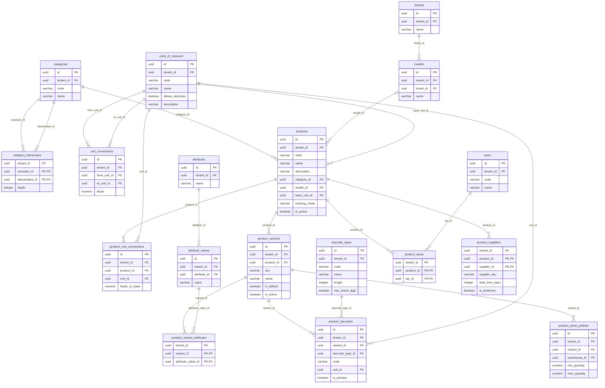
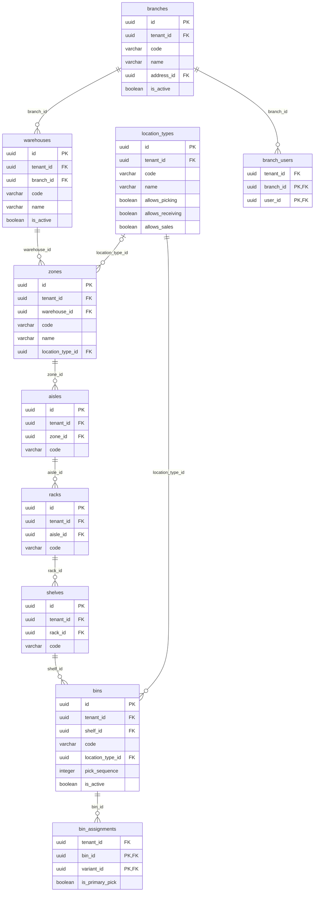
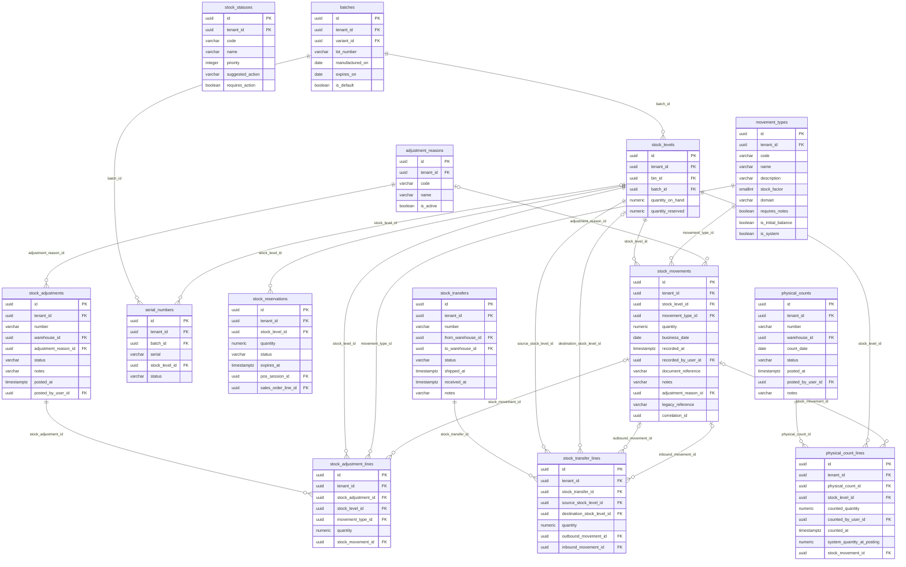
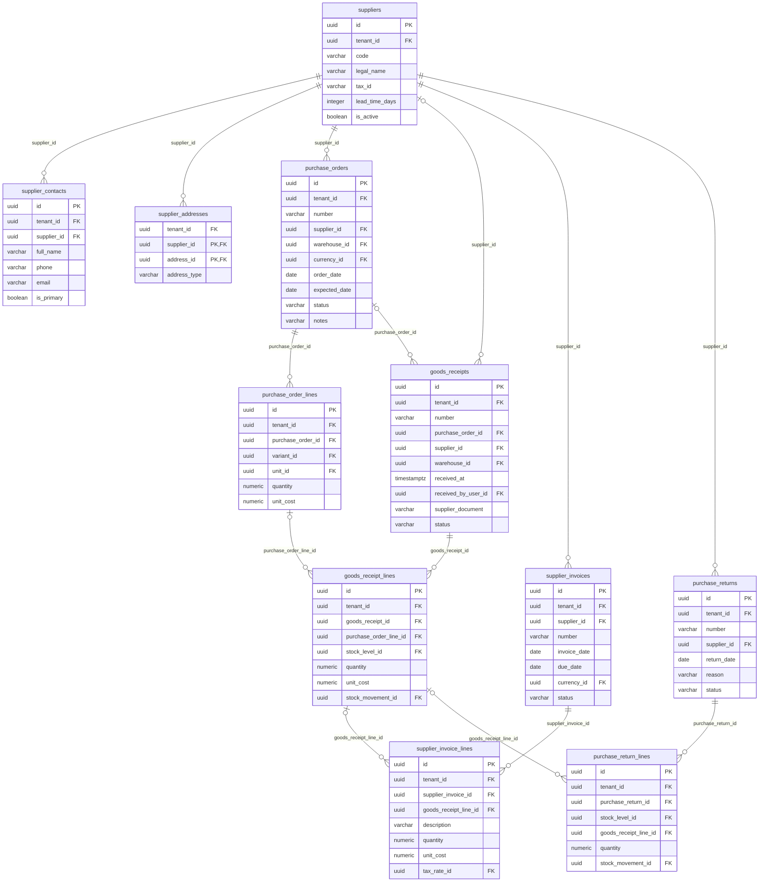
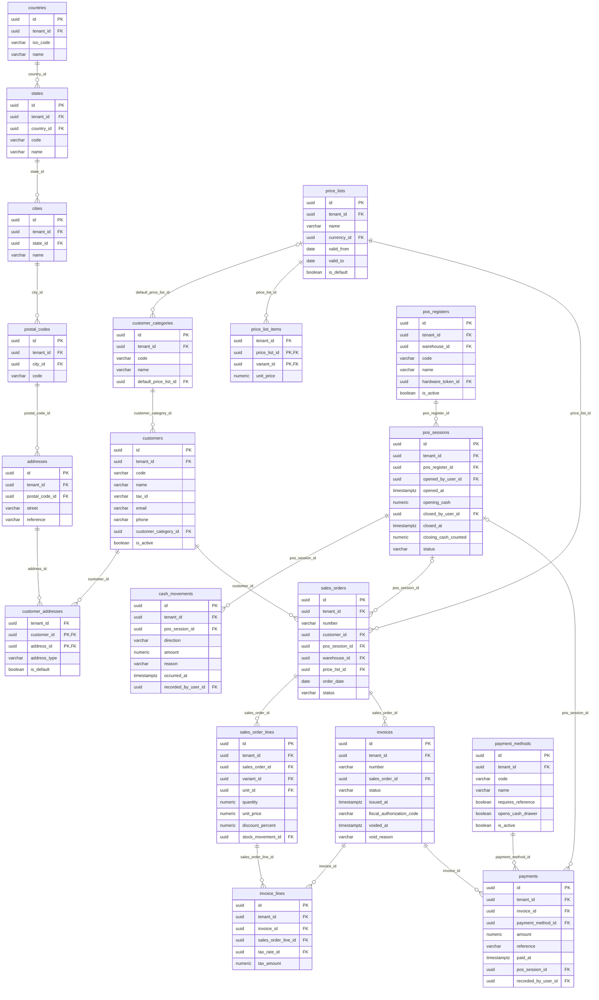
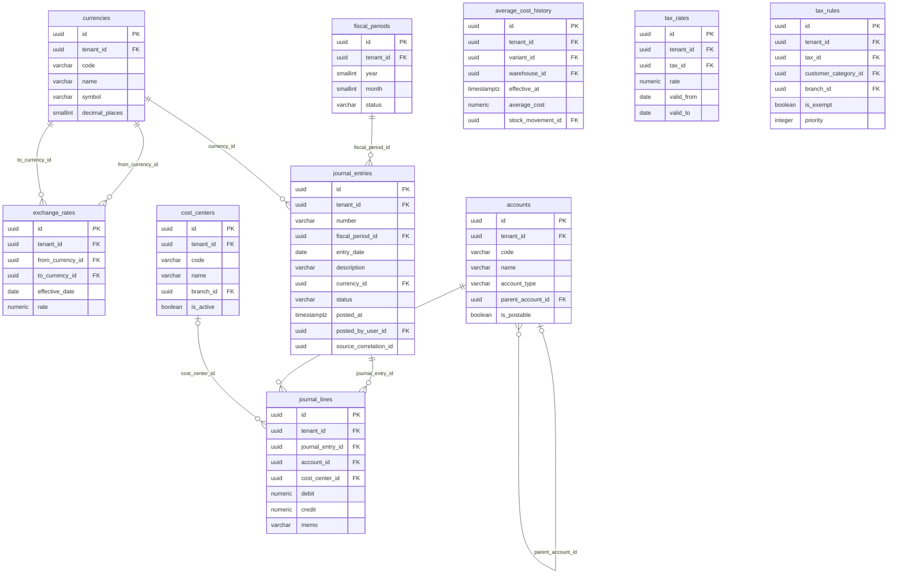

# M-INV V3 · Modelo relacional (ERD) · PostgreSQL 15+

Fuente de verdad: el modelo Code-First de `src/2. Infrastructure/MINV.Infrastructure` (entidades en
`src/1. Core/MINV.Domain`, configuraciones en `Persistence/Configurations`, migraciones en `Persistence/Migrations`).
Script equivalente: `scripts/db_init.sql`. La prueba `MINV.Infrastructure.Tests.ModelTests` verifica este documento
contra el modelo real (96 tablas, 7 esquemas, FK compuestas por tenant, xmin, append-only).

## 1. Resumen

| Contexto delimitado | Esquema | Tablas |
|---|---|---|
| IAM y tenants (identidad, RBAC, licencias, auditoría) | `iam` | 14 |
| Catálogo y datos maestros | `catalog` | 18 |
| Topología de almacén | `warehouse` | 10 |
| Motor transaccional de stock | `inventory` | 14 |
| Compras y proveedores | `purchasing` | 11 |
| Ventas y POS | `sales` | 19 |
| Costos y contabilidad | `accounting` | 10 |
| **Total** | 7 | **96** |

## 2. Convenciones comunes a todas las tablas

| Regla | Implementación |
|---|---|
| Nombres | `snake_case`; restricciones `pk_`, `ak_`, `fk_`, `ux_` (únicos), `ix_`, `ck_`; ≤ 63 caracteres |
| Clave primaria | `id uuid` (UUID v7 generado en el cliente, creciente en el tiempo; sin secuencias ni contadores compartidos). Las tablas de relación usan clave compuesta natural |
| Multi-tenant | Toda tabla (salvo `iam.tenants` e `iam.modules`) tiene `tenant_id uuid NOT NULL` → `iam.tenants(id)`, filtro global en EF Core y **Row Level Security** (`tenant_id = iam.current_tenant_id()`) |
| Integridad entre empresas | Cada entidad expone la clave alterna `(tenant_id, id)` y **toda FK es compuesta** `(tenant_id, x_id) → (tenant_id, id)`: una fila no puede referenciar datos de otra empresa (lo garantiza PostgreSQL) |
| Concurrencia optimista | Las tablas transaccionales usan la columna de sistema `xmin` como token (`RowVersion` en C#); un conflicto aborta la transacción y el caso de uso reintenta con los valores actuales |
| Append-only | `inventory.stock_movements`, `iam.audit_logs`, `iam.access_logs`, `sales.cash_movements`, `sales.payments`, `accounting.exchange_rates`, `accounting.average_cost_history`: triggers que rechazan UPDATE, DELETE y TRUNCATE; el rol `minv_app` no tiene esos privilegios |
| Auditoría técnica | `created_at` (default `now()`), `created_by`; en las tablas no append-only también `updated_at`, `updated_by` |
| Tipos | cantidades `numeric(18,6)` (regla `r6` de la V2.1), dinero `numeric(19,4)`, tasas `numeric(18,8)`, porcentajes `numeric(9,4)`, fechas de negocio `date`, instantes `timestamptz` (UTC), estados como texto (`varchar(20)`) |

## 3. Normalización hasta 5FN

- **Sin dependencias transitivas**: la variante se deriva del lote (`stock_levels.batch_id → batches.variant_id`), el
  almacén de la posición (`bins → shelves → racks → aisles → zones → warehouses`), la sucursal del almacén, el cliente y
  la sesión POS del pedido, la moneda de la lista de precios, la marca del modelo. `stock_movements` no guarda la
  cantidad con signo: el signo lo da `movement_types.stock_factor`.
- **Lote y código postal por defecto**: toda variante tiene el lote `SIN-LOTE` y toda ciudad el código postal `S/N`;
  así la existencia es siempre (posición, lote) y la dirección siempre apunta a un código postal, sin columnas nulas que
  romperían la normalización.
- **Relaciones N:M en tablas propias** con clave compuesta: `user_roles`, `role_permissions`, `product_taxes`,
  `product_suppliers`, `product_variant_attributes`, `branch_users`, `bin_assignments`, `supplier_addresses`,
  `customer_addresses`, `price_list_items`, `tenant_modules`. No hay dependencias de reunión que no se deriven de las
  claves (5FN).
- **Reglas que exigen más de una tabla** (y que en 5FN no se expresan con una FK) se garantizan con triggers: un solo
  valor por atributo en cada variante (`trg_variant_single_value`) y asientos contabilizados cuadrados e inmutables.
- **Arcos exclusivos** con `CHECK num_nonnulls(...)`: la recepción viene de una orden **o** de un proveedor; el pedido
  de venta sale de una sesión POS **o** de un almacén; la línea de factura de proveedor es de una recepción **o**
  libre; la reserva es de una sesión POS **o** de una línea de pedido.
- **Redundancia controlada (documentada)**: `tenant_id` en cada tabla (lo exige el aislamiento multi-tenant; su
  coherencia la garantizan las FK compuestas) y `stock_levels.quantity_on_hand` / `quantity_reserved`, estado
  materializado del agregado para el control de concurrencia; la vista `inventory.v_conservation_breaches` verifica que
  Σ movimientos = existencia (invariante de conservación de la V1).

## 4. Tablas por contexto

Además de las relaciones dibujadas, **todas** las tablas con `tenant_id` referencian `iam.tenants(id)` y las FK entre
contextos se listan en la columna «Referencias» de cada diccionario.

### IAM y tenants · esquema `iam` (14 tablas)

```mermaid
erDiagram
    tenants {
        uuid id PK
        varchar code
        varchar legal_name
        varchar tax_id
        boolean is_active
    }
    modules {
        uuid id PK
        varchar code
        varchar name
        varchar description
        numeric setup_price_bs
        numeric monthly_fee_bs
    }
    tenant_modules {
        uuid tenant_id PK, FK
        uuid module_id PK, FK
        timestamptz activated_at
        timestamptz expires_at
        boolean is_active
    }
    tenant_configs {
        uuid tenant_id PK, FK
        uuid default_currency_id FK
        uuid default_warehouse_id FK
        numeric alert_margin
        integer days_without_rotation
        date min_business_date
        varchar time_zone_id
    }
    users {
        uuid id PK
        uuid tenant_id FK
        varchar email
        varchar display_name
        boolean is_active
    }
    user_credentials {
        uuid tenant_id FK
        uuid user_id PK, FK
        varchar password_hash
        varchar algorithm
        integer iterations
        timestamptz changed_at
        boolean must_change_password
        integer failed_attempts
        timestamptz locked_until
    }
    roles {
        uuid id PK
        uuid tenant_id FK
        varchar code
        varchar name
        boolean is_system
    }
    user_roles {
        uuid tenant_id FK
        uuid user_id PK, FK
        uuid role_id PK, FK
    }
    permissions {
        uuid id PK
        uuid tenant_id FK
        varchar code
        varchar description
    }
    role_permissions {
        uuid tenant_id FK
        uuid role_id PK, FK
        uuid permission_id PK, FK
    }
    sessions {
        uuid id PK
        uuid tenant_id FK
        uuid user_id FK
        uuid hardware_token_id FK
        timestamptz started_at
        timestamptz last_seen_at
        timestamptz ended_at
        varchar machine_name
        varchar client_version
    }
    hardware_tokens {
        uuid id PK
        uuid tenant_id FK
        uuid branch_id FK
        varchar name
        varchar kind
        varchar fingerprint
        timestamptz registered_at
        timestamptz revoked_at
    }
    access_logs {
        uuid id PK
        uuid tenant_id FK
        uuid user_id FK
        varchar attempted_email
        boolean succeeded
        varchar failure_reason
        timestamptz occurred_at
        varchar machine_name
        uuid hardware_token_id FK
    }
    audit_logs {
        uuid id PK
        uuid tenant_id FK
        uuid user_id FK
        timestamptz occurred_at
        varchar action
        varchar outcome
        varchar entity_type
        uuid entity_id
        jsonb details
        uuid correlation_id
        varchar legacy_reference
    }
    modules ||--o{ tenant_modules : "module_id"
    users ||--o{ user_credentials : "user_id"
    users ||--o{ user_roles : "user_id"
    roles ||--o{ user_roles : "role_id"
    roles ||--o{ role_permissions : "role_id"
    permissions ||--o{ role_permissions : "permission_id"
    users ||--o{ sessions : "user_id"
    hardware_tokens |o--o{ sessions : "hardware_token_id"
    users |o--o{ access_logs : "user_id"
    hardware_tokens |o--o{ access_logs : "hardware_token_id"
    users |o--o{ audit_logs : "user_id"
```

| Tabla | Descripción | Clave | Referencias (FK) | Únicos / CHECK |
|---|---|---|---|---|
| `iam.tenants` | Inquilino (empresa cliente): raíz del aislamiento multi-tenant. Única tabla sin TenantId. | (id) | — | único (code) |
| `iam.modules` | Módulo comercial licenciable (matriz de valor B2B): precio de implantación y mensualidad en bolivianos. | (id) | — | único (code) CHECK setup_price_bs >= 0 AND monthly_fee_bs >= 0 |
| `iam.tenant_modules` | Módulos que la empresa tiene licenciados (habilitan funciones: POS y hardware, RBAC…). | (tenant_id, module_id) | module_id → iam.modules | CHECK expires_at IS NULL OR expires_at > activated_at |
| `iam.tenant_configs` | Parámetros de la empresa (una fila por tenant). · OCC xmin | (tenant_id) | default_currency_id → accounting.currencies default_warehouse_id → warehouse.warehouses | CHECK alert_margin >= 0 AND alert_margin <= 1 CHECK days_without_rotation > 0 |
| `iam.users` | Persona que opera el sistema (identidad = correo). · OCC xmin | (id) | — | único (tenant_id, email) CHECK email = lower(email) |
| `iam.user_credentials` | Credencial de inicio de sesión (hash PBKDF2), separada del perfil del usuario. · OCC xmin | (user_id) | user_id → iam.users | CHECK iterations >= 100000 CHECK failed_attempts >= 0 |
| `iam.roles` | Rol de acceso (RBAC). | (id) | — | único (tenant_id, code) |
| `iam.user_roles` | Roles asignados a cada usuario. | (user_id, role_id) | user_id → iam.users role_id → iam.roles | — |
| `iam.permissions` | Permiso granular (p. ej. inventory.movements.register). | (id) | — | único (tenant_id, code) CHECK code = lower(code) |
| `iam.role_permissions` | Permisos de cada rol. | (role_id, permission_id) | role_id → iam.roles permission_id → iam.permissions | — |
| `iam.sessions` | Sesión de trabajo en el cliente de escritorio. · OCC xmin | (id) | user_id → iam.users hardware_token_id → iam.hardware_tokens | CHECK ended_at IS NULL OR ended_at >= started_at |
| `iam.hardware_tokens` | Equipo autorizado (estación o terminal POS) identificado por la huella de su hardware. | (id) | branch_id → warehouse.branches | único (tenant_id, fingerprint) CHECK revoked_at IS NULL OR revoked_at >= registered_at |
| `iam.access_logs` | Intentos de inicio de sesión (append-only). · **append-only** | (id) | user_id → iam.users hardware_token_id → iam.hardware_tokens | — |
| `iam.audit_logs` | Auditoría inmutable de cada comando (sucesora de 14_ACTIVIDAD de la V2.1). · **append-only** | (id) | user_id → iam.users | único (tenant_id, legacy_reference) WHERE legacy_reference IS NOT NULL |

### Catálogo y datos maestros · esquema `catalog` (18 tablas)

| Tabla | Descripción | Clave | Referencias (FK) | Únicos / CHECK |
|---|---|---|---|---|
| `catalog.categories` | Categoría del catálogo (árbol en CategoryHierarchies). | (id) | — | único (tenant_id, code) |
| `catalog.category_hierarchies` | Tabla de clausura del árbol de categorías (ancestro, descendiente, profundidad). | (ancestor_id, descendant_id) | ancestor_id → catalog.categories descendant_id → catalog.categories | CHECK depth >= 0 CHECK (depth = 0) = (ancestor_id = descendant_id) |
| `catalog.brands` | Marca. | (id) | — | único (tenant_id, name) |
| `catalog.models` | Modelo de una marca. | (id) | brand_id → catalog.brands | único (brand_id, name) |
| `catalog.units_of_measure` | Unidad de medida. | (id) | — | único (tenant_id, code) |
| `catalog.unit_conversions` | Conversión genérica entre unidades. | (id) | from_unit_id → catalog.units_of_measure to_unit_id → catalog.units_of_measure | único (from_unit_id, to_unit_id) CHECK from_unit_id <> to_unit_id CHECK factor > 0 |
| `catalog.products` | Producto del catálogo (agregado con variantes, impuestos y empaques). · OCC xmin | (id) | category_id → catalog.categories model_id → catalog.models base_unit_id → catalog.units_of_measure | único (tenant_id, code) |
| `catalog.product_unit_conversions` | Empaque propio de un producto (p. ej. CAJA = 100 UND). | (id) | product_id → catalog.products unit_id → catalog.units_of_measure | único (product_id, unit_id) CHECK factor_to_base > 0 |
| `catalog.attributes` | Atributo de variante (Color, Talla…). | (id) | — | único (tenant_id, name) |
| `catalog.attribute_values` | Valor de un atributo (Rojo, M…). | (id) | attribute_id → catalog.attributes | único (attribute_id, value) |
| `catalog.product_variants` | Variante vendible de un producto (lleva el SKU). Un producto simple tiene una variante por defecto. | (id) | product_id → catalog.products | único (tenant_id, sku) único (product_id) WHERE is_default |
| `catalog.product_variant_attributes` | Valores de atributo de cada variante (un valor por atributo: lo exige un trigger). | (variant_id, attribute_value_id) | variant_id → catalog.product_variants attribute_value_id → catalog.attribute_values | — |
| `catalog.barcode_types` | Simbología de código de barras (EAN-13, UPC-A…). | (id) | — | único (tenant_id, code) CHECK length IS NULL OR (length >= 1 AND length <= 64) |
| `catalog.product_barcodes` | Códigos de barras de una variante (1:N). | (id) | variant_id → catalog.product_variants barcode_type_id → catalog.barcode_types unit_id → catalog.units_of_measure | único (tenant_id, code) único (variant_id) WHERE is_primary |
| `catalog.taxes` | Impuesto (las tasas vigentes están en TaxRates). | (id) | — | único (tenant_id, code) |
| `catalog.product_taxes` | Impuestos que aplican a cada producto. | (product_id, tax_id) | product_id → catalog.products tax_id → catalog.taxes | — |
| `catalog.product_suppliers` | Proveedores de cada producto (uno preferido). | (product_id, supplier_id) | product_id → catalog.products supplier_id → purchasing.suppliers | único (product_id) WHERE is_preferred CHECK lead_time_days IS NULL OR lead_time_days >= 0 |
| `catalog.product_stock_policies` | Mínimo y máximo de una variante en un almacén (semáforo y pedido sugerido). · OCC xmin | (id) | variant_id → catalog.product_variants warehouse_id → warehouse.warehouses | único (variant_id, warehouse_id) CHECK min_quantity >= 0 CHECK max_quantity >= 0 AND (max_quantity = 0 OR max_quantity >= min_quantity) |

### Topología de almacén · esquema `warehouse` (10 tablas)

| Tabla | Descripción | Clave | Referencias (FK) | Únicos / CHECK |
|---|---|---|---|---|
| `warehouse.branches` | Sucursal. | (id) | address_id → sales.addresses | único (tenant_id, code) |
| `warehouse.warehouses` | Almacén de una sucursal. | (id) | branch_id → warehouse.branches | único (tenant_id, code) |
| `warehouse.location_types` | Tipo de posición (picking, reserva, recepción, despacho, góndola POS…). | (id) | — | único (tenant_id, code) |
| `warehouse.zones` | Zona de un almacén. | (id) | warehouse_id → warehouse.warehouses location_type_id → warehouse.location_types | único (warehouse_id, code) |
| `warehouse.aisles` | Pasillo de una zona. | (id) | zone_id → warehouse.zones | único (zone_id, code) |
| `warehouse.racks` | Estantería de un pasillo. | (id) | aisle_id → warehouse.aisles | único (aisle_id, code) |
| `warehouse.shelves` | Nivel (estante) de una estantería. | (id) | rack_id → warehouse.racks | único (rack_id, code) |
| `warehouse.bins` | Posición física donde vive el stock (ruteo de picking por PickSequence). | (id) | shelf_id → warehouse.shelves location_type_id → warehouse.location_types | único (tenant_id, code) CHECK pick_sequence >= 0 |
| `warehouse.branch_users` | Usuarios habilitados en cada sucursal. | (branch_id, user_id) | branch_id → warehouse.branches user_id → iam.users | — |
| `warehouse.bin_assignments` | Posición fija de picking de una variante. | (bin_id, variant_id) | bin_id → warehouse.bins variant_id → catalog.product_variants | — |

### Motor transaccional de stock · esquema `inventory` (14 tablas)

| Tabla | Descripción | Clave | Referencias (FK) | Únicos / CHECK |
|---|---|---|---|---|
| `inventory.movement_types` | Tipo de movimiento con su factor de stock (+1/−1) y su dominio. | (id) | — | único (tenant_id, code) único (tenant_id) WHERE is_initial_balance CHECK stock_factor IN (-1, 1) |
| `inventory.stock_statuses` | Estados del semáforo de stock con su prioridad y acción sugerida. | (id) | — | único (tenant_id, code) único (tenant_id, priority) |
| `inventory.adjustment_reasons` | Motivo de ajuste (merma, daño…). | (id) | — | único (tenant_id, code) |
| `inventory.batches` | Lote de una variante (con caducidad). Toda variante tiene un lote por defecto «SIN-LOTE». | (id) | variant_id → catalog.product_variants | único (variant_id, lot_number) único (variant_id) WHERE is_default CHECK expires_on IS NULL OR manufactured_on IS NULL OR expires_on >= manufactured_on |
| `inventory.stock_levels` | Existencia de un lote en una posición: estado materializado con control optimista (xmin). · OCC xmin | (id) | bin_id → warehouse.bins batch_id → inventory.batches | único (bin_id, batch_id) CHECK quantity_on_hand >= 0 CHECK quantity_reserved >= 0 AND quantity_reserved <= quantity_on_hand |
| `inventory.stock_movements` | Movimiento de inventario: event store inmutable (append-only). · **append-only** | (id) | stock_level_id → inventory.stock_levels movement_type_id → inventory.movement_types recorded_by_user_id → iam.users adjustment_reason_id → inventory.adjustment_reasons | único (tenant_id, legacy_reference) WHERE legacy_reference IS NOT NULL CHECK quantity > 0 |
| `inventory.serial_numbers` | Número de serie (trazabilidad 1 a 1). · OCC xmin | (id) | batch_id → inventory.batches stock_level_id → inventory.stock_levels | único (batch_id, serial) |
| `inventory.stock_reservations` | Reserva temporal de stock (carrito del POS o pedido). · OCC xmin | (id) | stock_level_id → inventory.stock_levels pos_session_id → sales.pos_sessions sales_order_line_id → sales.sales_order_lines | CHECK quantity > 0 CHECK num_nonnulls(pos_session_id, sales_order_line_id) <= 1 |
| `inventory.stock_adjustments` | Documento de ajuste de inventario. · OCC xmin | (id) | warehouse_id → warehouse.warehouses adjustment_reason_id → inventory.adjustment_reasons posted_by_user_id → iam.users | único (tenant_id, number) |
| `inventory.stock_adjustment_lines` | Línea de un ajuste. | (id) | stock_adjustment_id → inventory.stock_adjustments stock_level_id → inventory.stock_levels movement_type_id → inventory.movement_types stock_movement_id → inventory.stock_movements | único (stock_movement_id) WHERE stock_movement_id IS NOT NULL CHECK quantity > 0 |
| `inventory.physical_counts` | Toma física (sucesora de 13_CONTEO de la V2.1). · OCC xmin | (id) | warehouse_id → warehouse.warehouses posted_by_user_id → iam.users | único (tenant_id, number) único (warehouse_id) WHERE status = 'Open' |
| `inventory.physical_count_lines` | Conteo de una existencia. · OCC xmin | (id) | physical_count_id → inventory.physical_counts stock_level_id → inventory.stock_levels counted_by_user_id → iam.users stock_movement_id → inventory.stock_movements | único (physical_count_id, stock_level_id) CHECK counted_quantity >= 0 |
| `inventory.stock_transfers` | Traslado entre almacenes. · OCC xmin | (id) | from_warehouse_id → warehouse.warehouses to_warehouse_id → warehouse.warehouses | único (tenant_id, number) CHECK from_warehouse_id <> to_warehouse_id |
| `inventory.stock_transfer_lines` | Línea de un traslado. | (id) | stock_transfer_id → inventory.stock_transfers source_stock_level_id → inventory.stock_levels destination_stock_level_id → inventory.stock_levels outbound_movement_id → inventory.stock_movements inbound_movement_id → inventory.stock_movements | CHECK quantity > 0 |

### Compras y proveedores · esquema `purchasing` (11 tablas)

| Tabla | Descripción | Clave | Referencias (FK) | Únicos / CHECK |
|---|---|---|---|---|
| `purchasing.suppliers` | Proveedor. | (id) | — | único (tenant_id, code) único (tenant_id, legal_name) CHECK lead_time_days >= 0 |
| `purchasing.supplier_contacts` | Contacto de un proveedor. | (id) | supplier_id → purchasing.suppliers | único (supplier_id) WHERE is_primary |
| `purchasing.supplier_addresses` | Direcciones de un proveedor. | (supplier_id, address_id) | supplier_id → purchasing.suppliers address_id → sales.addresses | — |
| `purchasing.purchase_orders` | Orden de compra. · OCC xmin | (id) | supplier_id → purchasing.suppliers warehouse_id → warehouse.warehouses currency_id → accounting.currencies | único (tenant_id, number) CHECK expected_date IS NULL OR expected_date >= order_date |
| `purchasing.purchase_order_lines` | Línea de una orden de compra. | (id) | purchase_order_id → purchasing.purchase_orders variant_id → catalog.product_variants unit_id → catalog.units_of_measure | único (purchase_order_id, variant_id, unit_id) CHECK quantity > 0 CHECK unit_cost >= 0 |
| `purchasing.goods_receipts` | Recepción de mercancía. · OCC xmin | (id) | purchase_order_id → purchasing.purchase_orders supplier_id → purchasing.suppliers warehouse_id → warehouse.warehouses received_by_user_id → iam.users | único (tenant_id, number) CHECK num_nonnulls(purchase_order_id, supplier_id) = 1 |
| `purchasing.goods_receipt_lines` | Línea de una recepción. | (id) | goods_receipt_id → purchasing.goods_receipts purchase_order_line_id → purchasing.purchase_order_lines stock_level_id → inventory.stock_levels stock_movement_id → inventory.stock_movements | único (stock_movement_id) WHERE stock_movement_id IS NOT NULL CHECK quantity > 0 CHECK unit_cost >= 0 |
| `purchasing.supplier_invoices` | Factura de proveedor. · OCC xmin | (id) | supplier_id → purchasing.suppliers currency_id → accounting.currencies | único (supplier_id, number) CHECK due_date IS NULL OR due_date >= invoice_date |
| `purchasing.supplier_invoice_lines` | Línea de factura de proveedor. | (id) | supplier_invoice_id → purchasing.supplier_invoices goods_receipt_line_id → purchasing.goods_receipt_lines tax_rate_id → accounting.tax_rates | CHECK num_nonnulls(goods_receipt_line_id, description) = 1 CHECK quantity > 0 CHECK unit_cost >= 0 |
| `purchasing.purchase_returns` | Devolución a proveedor. · OCC xmin | (id) | supplier_id → purchasing.suppliers | único (tenant_id, number) |
| `purchasing.purchase_return_lines` | Línea de una devolución. | (id) | purchase_return_id → purchasing.purchase_returns stock_level_id → inventory.stock_levels goods_receipt_line_id → purchasing.goods_receipt_lines stock_movement_id → inventory.stock_movements | CHECK quantity > 0 |

### Ventas y POS · esquema `sales` (19 tablas)

| Tabla | Descripción | Clave | Referencias (FK) | Únicos / CHECK |
|---|---|---|---|---|
| `sales.countries` | País. | (id) | — | único (tenant_id, iso_code) CHECK iso_code ~ '^[A-Z]{2}$' |
| `sales.states` | Departamento o estado. | (id) | country_id → sales.countries | único (country_id, code) |
| `sales.cities` | Ciudad. | (id) | state_id → sales.states | único (state_id, name) |
| `sales.postal_codes` | Código postal de una ciudad («S/N» para zonas sin código). | (id) | city_id → sales.cities | único (city_id, code) |
| `sales.addresses` | Dirección normalizada (calle → código postal → ciudad → estado → país). | (id) | postal_code_id → sales.postal_codes | — |
| `sales.customer_categories` | Categoría de cliente. | (id) | default_price_list_id → sales.price_lists | único (tenant_id, code) |
| `sales.customers` | Cliente. · OCC xmin | (id) | customer_category_id → sales.customer_categories | único (tenant_id, code) |
| `sales.customer_addresses` | Direcciones de un cliente. | (customer_id, address_id) | customer_id → sales.customers address_id → sales.addresses | único (customer_id, address_type) WHERE is_default |
| `sales.price_lists` | Lista de precios. | (id) | currency_id → accounting.currencies | único (tenant_id, name) único (tenant_id) WHERE is_default CHECK valid_to IS NULL OR valid_to >= valid_from |
| `sales.price_list_items` | Precio de una variante en una lista. | (price_list_id, variant_id) | price_list_id → sales.price_lists variant_id → catalog.product_variants | CHECK unit_price >= 0 |
| `sales.pos_registers` | Caja del punto de venta (toma stock de un almacén). | (id) | warehouse_id → warehouse.warehouses hardware_token_id → iam.hardware_tokens | único (tenant_id, code) único (hardware_token_id) WHERE hardware_token_id IS NOT NULL |
| `sales.pos_sessions` | Turno de caja (apertura y cierre con arqueo). · OCC xmin | (id) | pos_register_id → sales.pos_registers opened_by_user_id → iam.users closed_by_user_id → iam.users | único (pos_register_id) WHERE status = 'Open' CHECK opening_cash >= 0 CHECK (status = 'Closed') = (closed_at IS NOT NULL) CHECK closed_at IS NULL OR closed_at >= opened_at |
| `sales.cash_movements` | Ingreso o retiro de efectivo de la caja (append-only). · **append-only** | (id) | pos_session_id → sales.pos_sessions recorded_by_user_id → iam.users | CHECK amount > 0 |
| `sales.sales_orders` | Pedido o venta (POS o back-office). · OCC xmin | (id) | customer_id → sales.customers pos_session_id → sales.pos_sessions warehouse_id → warehouse.warehouses price_list_id → sales.price_lists | único (tenant_id, number) CHECK num_nonnulls(pos_session_id, warehouse_id) = 1 |
| `sales.sales_order_lines` | Línea de un pedido de venta. | (id) | sales_order_id → sales.sales_orders variant_id → catalog.product_variants unit_id → catalog.units_of_measure stock_movement_id → inventory.stock_movements | único (stock_movement_id) WHERE stock_movement_id IS NOT NULL CHECK quantity > 0 CHECK unit_price >= 0 CHECK discount_percent >= 0 AND discount_percent <= 100 |
| `sales.invoices` | Factura de venta (una por pedido). · OCC xmin | (id) | sales_order_id → sales.sales_orders | único (tenant_id, number) único (sales_order_id) CHECK (status = 'Draft') = (issued_at IS NULL) CHECK (status = 'Voided') = (voided_at IS NOT NULL) |
| `sales.invoice_lines` | Línea fiscal de una factura (impuesto aplicado). | (id) | invoice_id → sales.invoices sales_order_line_id → sales.sales_order_lines tax_rate_id → accounting.tax_rates | único (sales_order_line_id) CHECK tax_amount >= 0 |
| `sales.payment_methods` | Medio de pago (efectivo, tarjeta, QR…). | (id) | — | único (tenant_id, code) |
| `sales.payments` | Pago de una factura (append-only). · **append-only** | (id) | invoice_id → sales.invoices payment_method_id → sales.payment_methods pos_session_id → sales.pos_sessions recorded_by_user_id → iam.users | CHECK amount > 0 |

### Costos y contabilidad · esquema `accounting` (10 tablas)

| Tabla | Descripción | Clave | Referencias (FK) | Únicos / CHECK |
|---|---|---|---|---|
| `accounting.currencies` | Moneda (ISO 4217). | (id) | — | único (tenant_id, code) CHECK code ~ '^[A-Z]{3}$' CHECK decimal_places BETWEEN 0 AND 4 |
| `accounting.exchange_rates` | Tipo de cambio diario (append-only). · **append-only** | (id) | from_currency_id → accounting.currencies to_currency_id → accounting.currencies | único (from_currency_id, to_currency_id, effective_date) CHECK from_currency_id <> to_currency_id CHECK rate > 0 |
| `accounting.cost_centers` | Centro de costo. | (id) | branch_id → warehouse.branches | único (tenant_id, code) |
| `accounting.accounts` | Cuenta del plan contable. | (id) | parent_account_id → accounting.accounts | único (tenant_id, code) CHECK parent_account_id IS NULL OR parent_account_id <> id |
| `accounting.fiscal_periods` | Período contable mensual. · OCC xmin | (id) | — | único (tenant_id, year, month) CHECK month BETWEEN 1 AND 12 CHECK year BETWEEN 2000 AND 2100 |
| `accounting.journal_entries` | Asiento contable (partida doble). · OCC xmin | (id) | fiscal_period_id → accounting.fiscal_periods currency_id → accounting.currencies posted_by_user_id → iam.users | único (tenant_id, number) |
| `accounting.journal_lines` | Línea de un asiento (debe o haber). | (id) | journal_entry_id → accounting.journal_entries account_id → accounting.accounts cost_center_id → accounting.cost_centers | CHECK (debit > 0 AND credit = 0) OR (credit > 0 AND debit = 0) |
| `accounting.average_cost_history` | Historial del costo promedio ponderado por variante y almacén (append-only). · **append-only** | (id) | variant_id → catalog.product_variants warehouse_id → warehouse.warehouses stock_movement_id → inventory.stock_movements | CHECK average_cost >= 0 |
| `accounting.tax_rates` | Tasa de un impuesto con vigencia. | (id) | tax_id → catalog.taxes | único (tax_id, valid_from) CHECK rate >= 0 AND rate <= 100 CHECK valid_to IS NULL OR valid_to >= valid_from |
| `accounting.tax_rules` | Regla de aplicación de un impuesto por categoría de cliente y sucursal. | (id) | tax_id → catalog.taxes customer_category_id → sales.customer_categories branch_id → warehouse.branches | único (tax_id, customer_category_id, branch_id) NULLS NOT DISTINCT CHECK priority >= 0 |

## 5. Trazabilidad V2.1 → V3

La V3 se construyó a partir del modelo de la V2.1 (rama `Inventario-V2.1`). El importador
(`MINV.Infrastructure.Importing.V21`, comando `minv import-v21`) lleva cada tabla del libro colaborativo a su tabla
de la V3 y verifica la paridad (stock, semáforo, cobertura, ranking, alertas y pedido idénticos a la instantánea de la
V2.1).

| V2.1 (libro colaborativo) | V3 (PostgreSQL) |
|---|---|
| 01_CONFIG: cfgEmpresa, cfgNIT | `iam.tenants` |
| 01_CONFIG: cfgMargenAlerta, cfgDiasSinRotacion, cfgFechaMin, cfgMoneda, cfgBodega | `iam.tenant_configs` |
| 02_USUARIOS (tblUsuarios): Correo, Nombre, Activo | `iam.users` |
| 02_USUARIOS: Rol (ADMIN, BODEGA, VENTAS, CONSULTA) | `iam.roles` |
| 14_ACTIVIDAD (tblActividad): ID, Timestamp, Usuario_O365, Script, Resultado, Detalle | `iam.audit_logs` |
| 03_CATEGORIAS (tblCategorias): Código, Categoría | `catalog.categories` |
| 06_UNIDADES (tblUnidades): Código, Unidad, Decimales, Descripción | `catalog.units_of_measure` |
| 05_PRODUCTOS (tblProductos): SKU, Producto, Categoría, Unidad, Activo | `catalog.products` |
| tblProductos: SKU (la V2.1 no tenía variantes: cada producto migra con una variante por defecto) | `catalog.product_variants` |
| tblProductos: Proveedor | `catalog.product_suppliers` |
| tblProductos: StockMin, StockMax | `catalog.product_stock_policies` |
| 01_CONFIG: cfgBodega | `warehouse.branches` |
| tblProductos: Ubicación (A-01-01) | `warehouse.bins` |
| tblProductos: Ubicación | `warehouse.bin_assignments` |
| 01_CONFIG (tblTiposMov): Tipo, FactorStock, Dominio, Descripción | `inventory.movement_types` |
| 01_CONFIG (tblEstados) | `inventory.stock_statuses` |
| 15_STOCK (instantánea) → estado transaccional | `inventory.stock_levels` |
| 10A_ENTRADAS + 10B_SALIDAS (tblEntradas, tblSalidas) | `inventory.stock_movements` |
| 13_CONTEO: ctFecha, ctConfirmar | `inventory.physical_counts` |
| tblConteo: Conteo, Sistema, Diferencia | `inventory.physical_count_lines` |
| 04_PROVEEDORES (tblProveedores): Proveedor, NIT, DiasEntrega | `purchasing.suppliers` |
| tblProveedores: Contacto, Teléfono, Correo | `purchasing.supplier_contacts` |
| 18_PEDIDO (tblPedido) → orden de compra real | `purchasing.purchase_orders` |
| 10B_SALIDAS (tipo SALIDA) | `sales.sales_orders` |
| tblProductos: CostoUnitario | `accounting.average_cost_history` |
| 15_STOCK · 16_ALERTAS · 18_PEDIDO (instantáneas) | Proyección al consultar (`GetStockProjectionQuery`) y vista `inventory.v_stock_by_variant` |
| Estado «✖ Rechazado» de 10A/10B | Los rechazos no son movimientos: se migran a `iam.audit_logs` (resultado `Rejected`) |
| IDs `E-…`, `S-…`, `A-…` | `legacy_reference` (único por tenant) en `stock_movements` y `audit_logs` |

## 6. Objetos de PostgreSQL además de las tablas

| Objeto | Propósito |
|---|---|
| `iam.minv_append_only()` + `trg_append_only`, `trg_append_only_truncate` | Libros mayores inmutables |
| `catalog.minv_variant_single_value()` | Un valor por atributo en cada variante |
| `accounting.minv_journal_*` | Asiento contabilizado inmutable y cuadrado (constraint trigger diferido) |
| `iam.current_tenant_id()` + políticas `tenant_isolation` | Row Level Security por tenant (`SET minv.tenant_id`) |
| `inventory.v_stock_by_variant` | Stock por variante y almacén (entradas, salidas, stock, último movimiento) |
| `inventory.v_conservation_breaches` | Existencias cuya cantidad no coincide con la suma de sus movimientos (debe estar vacía) |
| `iam.v_activity` | Actividad con usuario (sucesora de 14_ACTIVIDAD) |
