# Cliente de escritorio M-INV V3.1 · guía de la interfaz

La V3.1 reemplaza las tablas «tipo Excel» de la V3 por una aplicación de escritorio completa: pantalla de carga, inicio
de sesión con demostración, menú lateral según el rol, tablero con gráficos, registro guiado con vista previa y
poka-yoke, toma física, alertas y pedido por proveedor, ficha del producto con kardex, actividad, configuración y ayuda,
en tema claro y oscuro. El ejecutable se llama **`M-INV.exe`**.

Todas las imágenes de esta guía las genera la propia aplicación (`M-INV.exe --capturas`, ver al final) con la
demostración: los datos reales del libro colaborativo de la V2.1 migrados a memoria.

## 1. Arranque

| Pantalla | Qué hace |
|---|---|
| 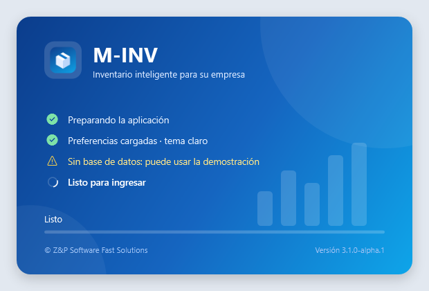 | **Pantalla de carga**: prepara la aplicación, carga las preferencias de la estación (tema, periféricos) y comprueba en menos de 5 segundos si PostgreSQL responde y si su versión es 15 o superior. |
| 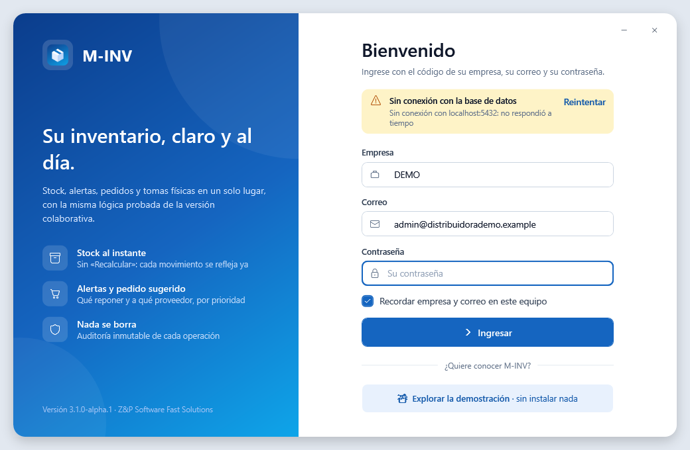 | **Inicio de sesión**: empresa, correo y contraseña (recuerda empresa y correo, nunca la contraseña), aviso de Bloq Mayús y estado de la base de datos con «Reintentar». Si no hay base, sugiere la demostración. |
| 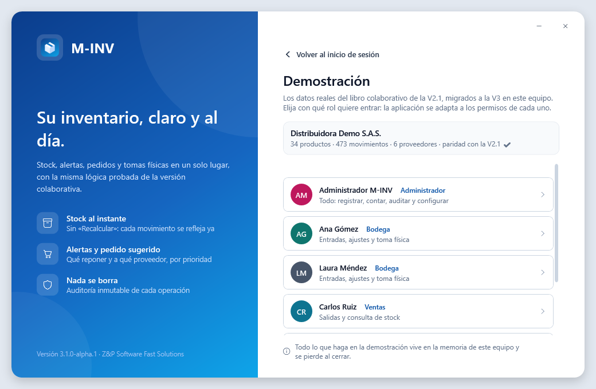 | **Explorar la demostración**: migra el libro de la V2.1 a memoria (34 productos, 473 movimientos, auditoría) con el mismo importador de `minv import-v21`, verifica la paridad y deja elegir con qué persona y rol entrar. Nada se guarda en disco. |

## 2. Ventana principal


- **Menú lateral por secciones** (General, Ventas, Inventario, Compras y reposición, Análisis, Administración) que
  muestra solo lo que el rol puede usar (matriz RBAC). Se contrae a solo íconos con el botón ☰ o `Ctrl+B`; la preferencia se recuerda.
- **Barra superior**: búsqueda global de productos (`Ctrl+K`, por nombre, SKU o código de barras, sin importar tildes),
  aviso de **DEMOSTRACIÓN**, fecha y hora, tema claro/oscuro y campana con el número de alertas.
- **Cuenta** (abajo a la izquierda): nombre, rol, empresa y conexión; cambiar contraseña, configuración y cerrar sesión.
- **Avisos** en la esquina inferior derecha (✔ verde, ⚠ ámbar, ✖ rojo: los mismos significados de la V2.1) y
  **confirmaciones** dentro de la ventana para lo que no se puede deshacer.

## 3. Pantallas

| Pantalla | Qué hace |
|---|---|
| **Inicio** | Saludo y próximo paso sugerido según el rol; valor del inventario, alertas, pedido sugerido y movimientos de hoy (tarjetas que llevan a su pantalla); entradas y salidas de 14 días (pase el mouse por las columnas); semáforo en dona (clic en un estado filtra el stock); alertas urgentes, más vendidos, últimos movimientos y actividad reciente. |
|  | **Stock** al instante (sin «Recalcular»), en **galería** (una tarjeta con la imagen de cada producto, semáforo, stock, nivel, mínimo/máximo y valor) o en **tabla**: búsqueda por SKU, nombre o proveedor; chips por estado con contador; filtro por categoría; columnas ordenables; exportación a Excel (CSV en español); clic, doble clic o 👁 abre la ficha y ＋ registra un movimiento del producto. |
|  | **Registrar movimiento** en tres pasos: tipo (solo los que permite el rol), producto (buscador o escáner) y posición, cantidad (± y Enter para registrar), documento y observaciones (obligatorias en ajustes y devoluciones). La **vista previa** muestra el stock total, el de la posición y lo que quedará. |
|  | **Poka-yoke visual de la V2.1**: si una salida dejaría la posición en negativo, la vista previa se pinta de **rojo sangre `#8A0303` con el número tachado** y el botón se deshabilita. La validación definitiva la hace el dominio al guardar (con reintento optimista si otra caja se adelantó). |
| 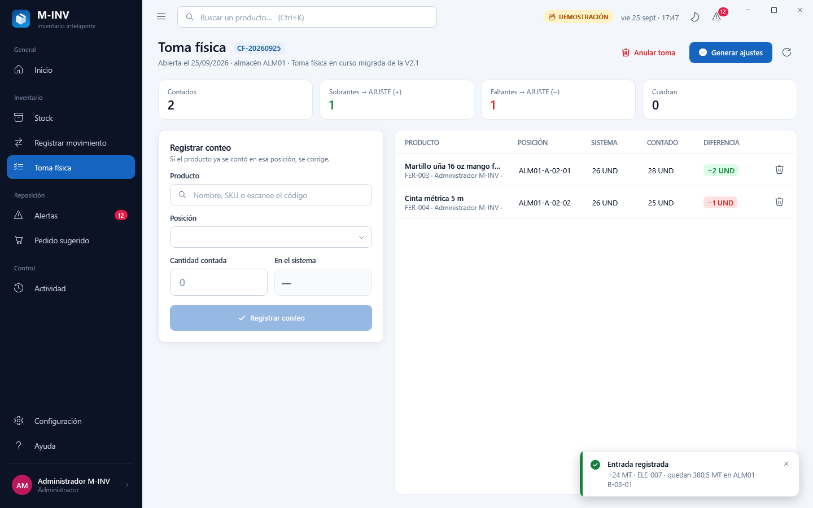 | **Toma física**: iniciar (una por almacén), contar producto por producto (a mano o con el escáner: el foco pasa solo a la cantidad), ver sobrantes y faltantes contra el stock exacto, quitar un conteo equivocado, anular, y **Generar ajustes** con confirmación: todos los AJUSTE (+)/(−) en una operación. |
| 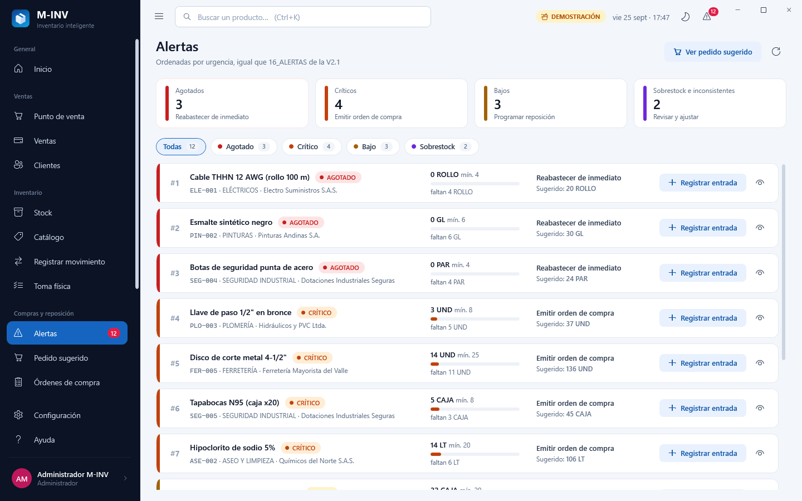 | **Alertas** priorizadas como 16_ALERTAS de la V2.1: resumen por severidad, chips por estado, acción sugerida, cantidad sugerida y «Registrar entrada» con el producto ya elegido. |
| 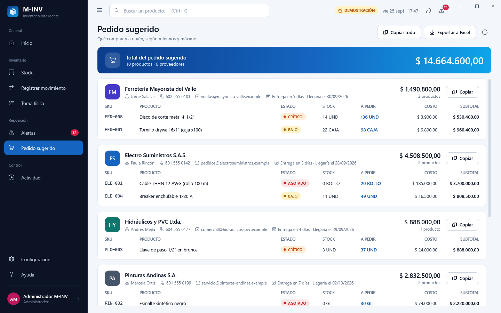 | **Pedido sugerido** por proveedor (18_PEDIDO): contacto, teléfono, correo, plazo y fecha estimada de entrega, líneas con cantidad a pedir y subtotal; **Copiar** (para correo o WhatsApp) y **Exportar a Excel**. |
| 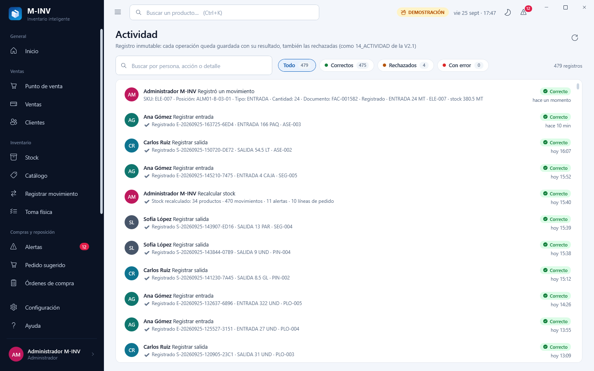 | **Actividad** (auditoría inmutable, 14_ACTIVIDAD): quién hizo qué y cuándo, con su resultado (correcto, rechazado, con error), búsqueda y filtros. Incluye la actividad migrada de la V2.1. |
| 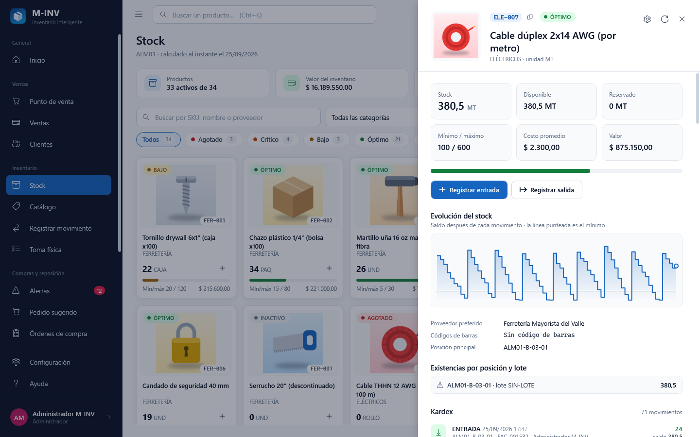 | **Ficha del producto** (panel lateral, `Esc` la cierra): imagen, semáforo, stock, disponible, reservado, mínimo/máximo, costo y valor, gráfico de la evolución del saldo con la línea del mínimo, existencias por posición y lote, y el **kardex** con saldo acumulado. |
| 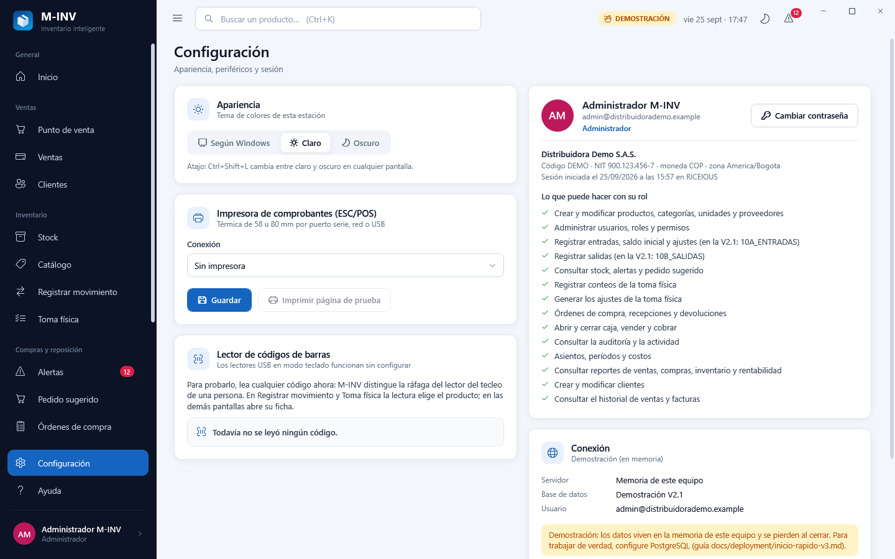 | **Configuración** de la estación: tema (según Windows, claro, oscuro), impresora ESC/POS (serie, red o USB de Windows) con **página de prueba**, prueba del lector de códigos, sesión y permisos del rol, conexión y versión. |
| 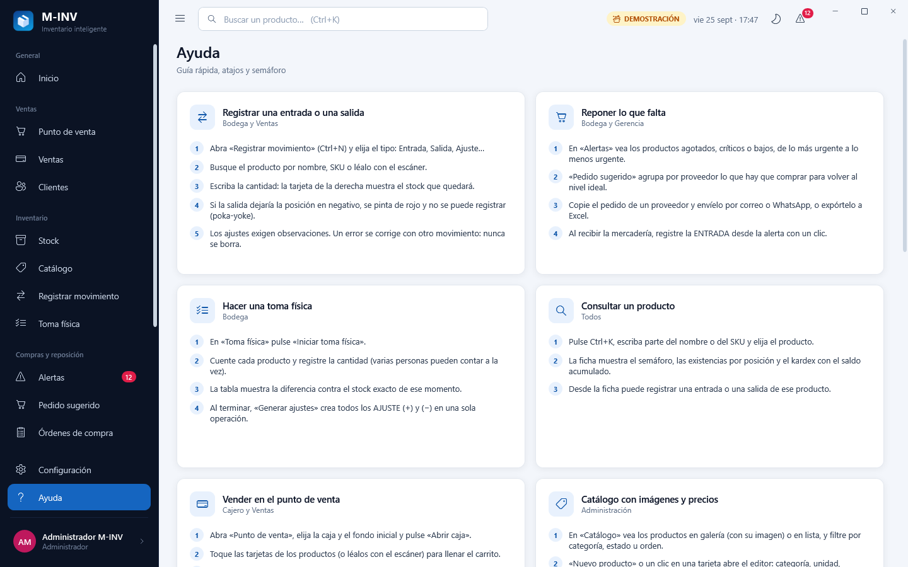 | **Ayuda**: guías paso a paso por tarea, atajos de teclado y el significado de cada estado del semáforo. |

**Tema oscuro** (sigue al de Windows o se elige en Configuración; `Ctrl+Shift+L` alterna):

| | |
|---|---|
|  | 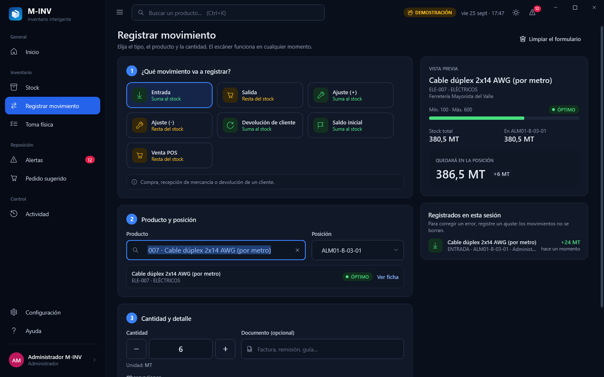 |

**Según el rol** (Ventas no ve la toma física ni la auditoría y solo registra salidas, ventas y devoluciones):

| | |
|---|---|
| 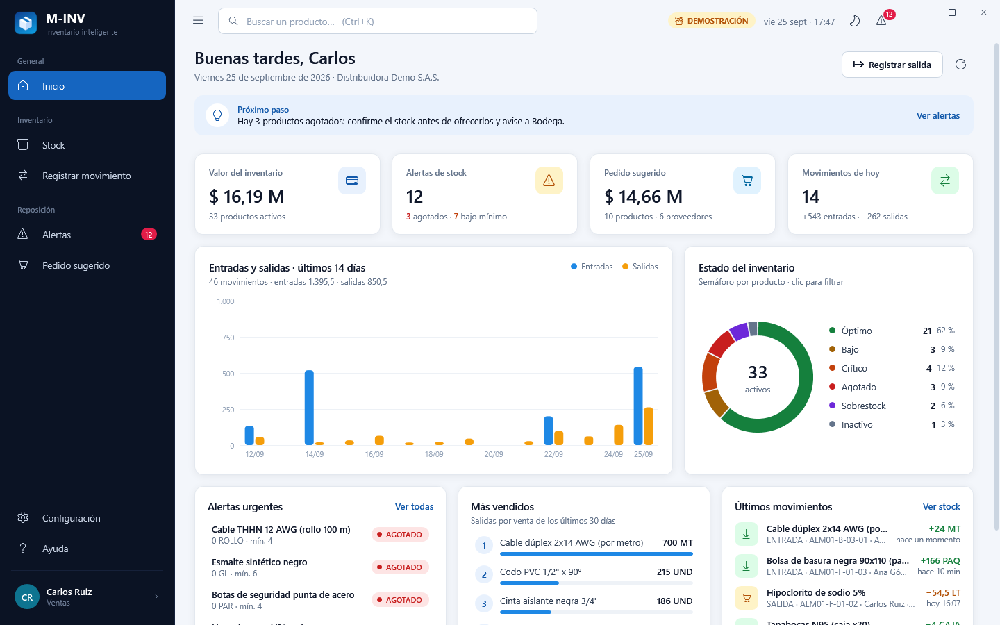 | 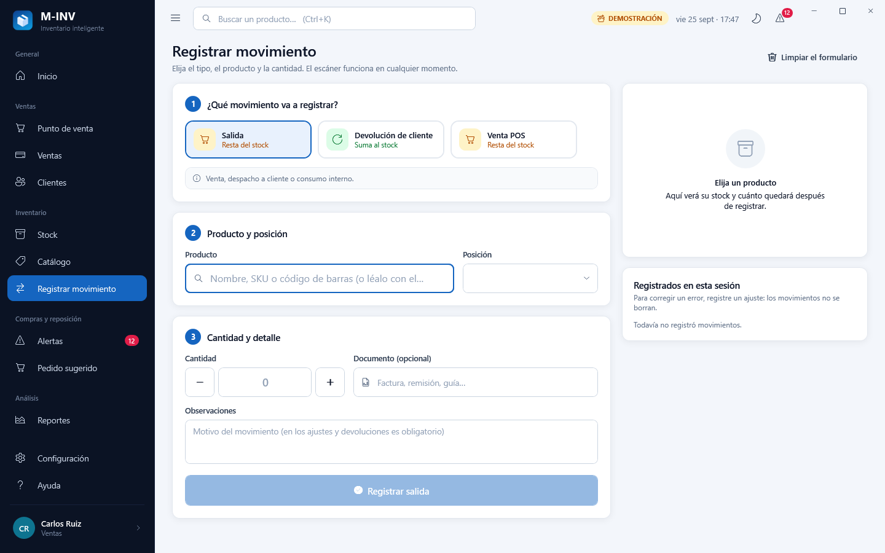 |

## 3.1 Pantallas de negocio (base de datos local)

Con la base LOCAL de prueba (`tools\bd_local.ps1`, ver `docs/deployment/inicio-rapido-v3.md`) cada rol tiene muchas más
funciones. Todo lo que viene de una lista se elige con **combos** (categoría, unidad, proveedor, posición, cliente,
medio de pago, período, agrupación, estado, rol, cuenta contable, plantilla, fecha).

| Pantalla | Qué hace |
|---|---|
|  | **Catálogo** con **imágenes**: galería o lista, filtros por categoría, estado (activos, sin imagen, con alerta, margen bajo) y orden (nombre, precio, stock, margen); indicadores de productos, imágenes, precio y margen promedio; exportación. |
| 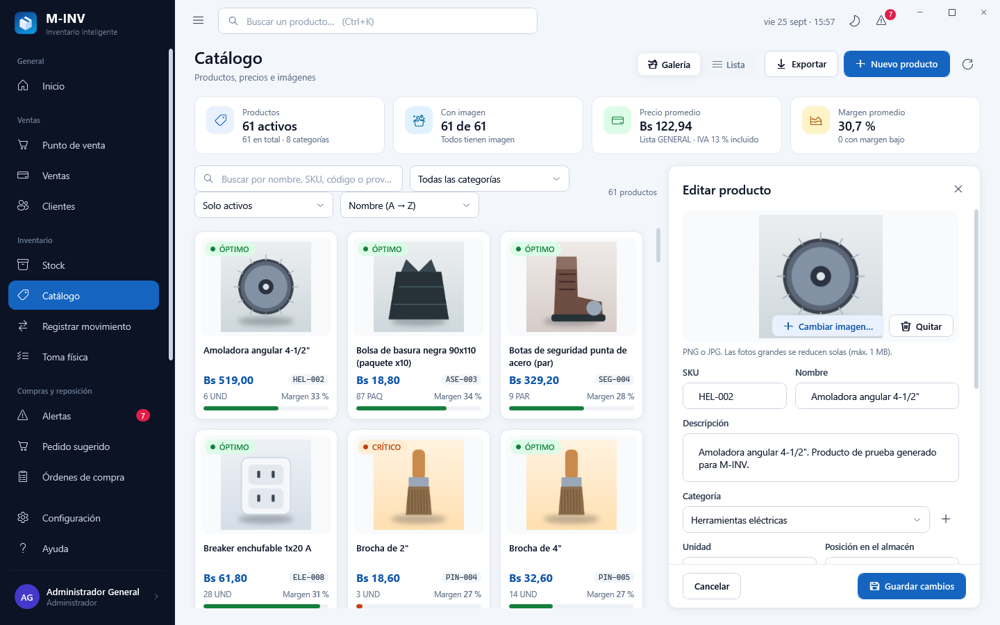 | **Editor de producto** (Administración): imagen (**Cambiar imagen…** acepta PNG/JPG y reduce solas las fotos grandes a ≤ 1 MB), SKU, nombre, descripción, categoría (+ crear una nueva), unidad, posición, proveedor, costo, precio con IVA, **combo de margen** que calcula el precio, mínimo, máximo, código de barras (+ generar EAN-13) y activo. |
|  | **Punto de venta** (Cajero, Ventas, Administración): abrir caja con fondo; productos en tarjetas con imagen, precio y disponible (búsqueda, categorías, escáner); carrito con − / +, descuento por línea y aviso si supera lo disponible; cliente y medio de pago en combos; efectivo recibido con botones rápidos y vuelto; referencia para QR/tarjeta; **Cobrar** emite la factura, descuenta el stock y contabiliza; ticket en pantalla o impreso (ESC/POS); **Cerrar caja** con arqueo. |
| 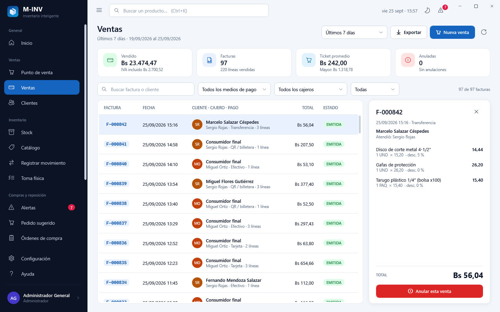 | **Ventas**: facturas del período (combo), filtros por medio de pago, cajero y estado; indicadores (vendido, facturas, ticket promedio, anuladas); detalle de la factura y **Anular** con motivo (combo editable): devuelve el stock y registra el asiento inverso. |
| 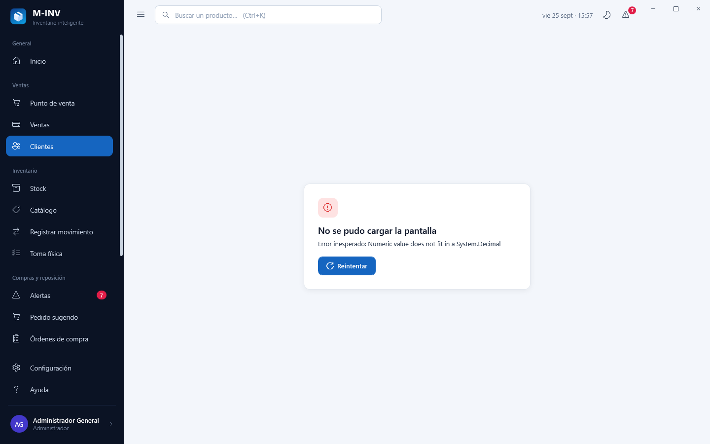 | **Clientes**: cartera con categoría (combo), NIT, contacto, compras, total y última compra; editor lateral; exportación. |
|  | **Órdenes de compra** (Bodega, Gerencia, Administración): **desde el pedido sugerido** o nueva (proveedor, fecha de entrega y productos en combos); **Aprobar**, **Recibir** (entra el stock, costo promedio ponderado y asiento contra proveedores) y **Anular**; estado y avance de la recepción. |
| 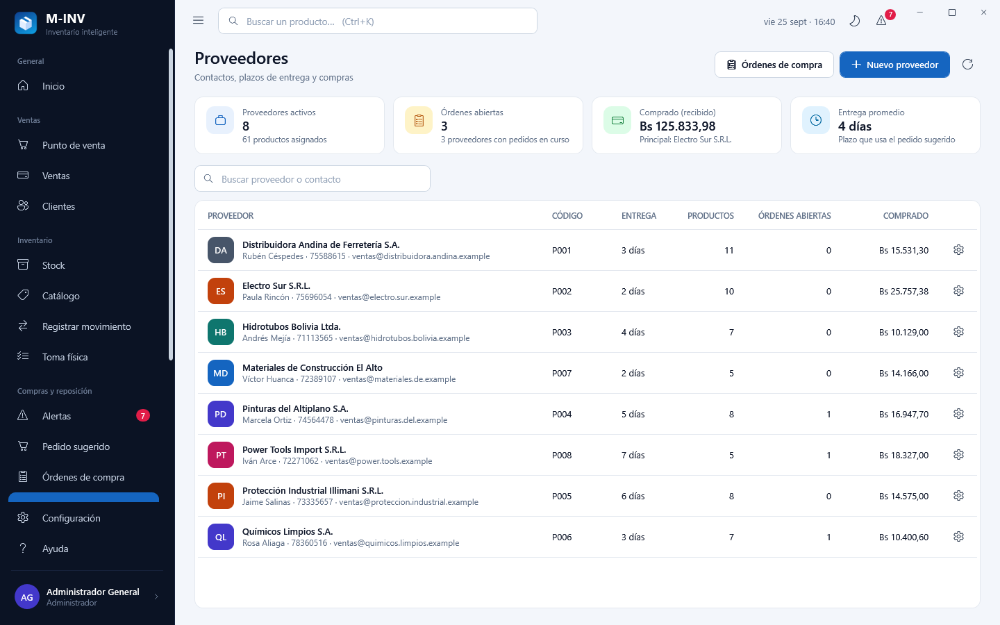 | **Proveedores**: contacto, días de entrega (combo), productos, órdenes abiertas y lo comprado; editor lateral. |
|  | **Reportes** (Gerencia, Ventas, Bodega, Consulta, Administración): ventas (ingresos, utilidad bruta, margen, ticket promedio, ventas por día, medios de pago y ranking **por producto, categoría, cajero, cliente o medio de pago**), compras por proveedor, movimientos por tipo e **inventario** valorizado por categoría. Todo se exporta. |
|  | **Contabilidad** (Gerencia, Administración): estado de resultados del período; **libro diario** con los asientos automáticos de ventas, compras y anulaciones; **plan de cuentas** jerárquico con saldos y alta de cuentas; **nuevo asiento** con plantillas (depósito, sueldos, alquiler, servicios, pago a proveedores, aporte) y control del cuadre. |
| 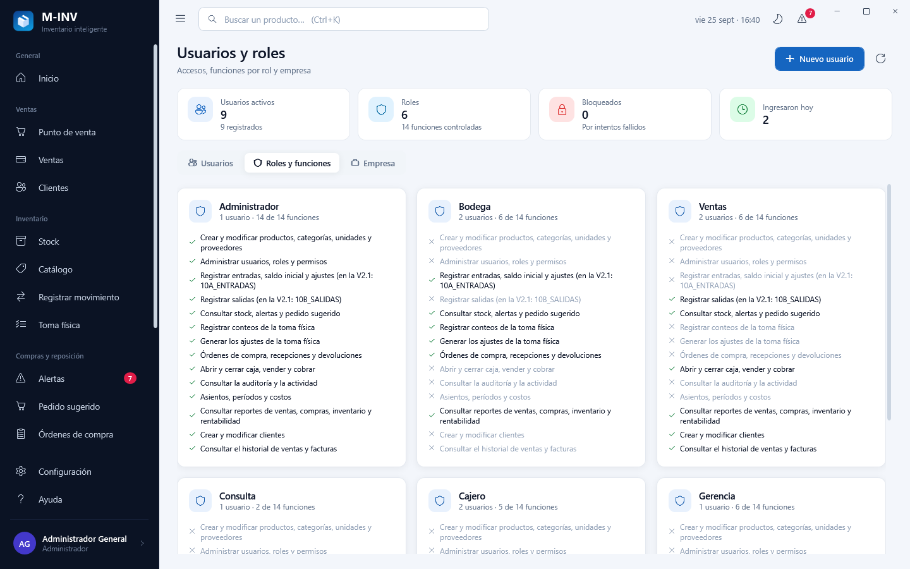 | **Usuarios y roles** (Administración): alta y edición (rol en combo, activo), contraseña temporal generada, **restablecer contraseña** (desbloquea la cuenta), matriz de funciones por rol y parámetros de la empresa (margen de alerta y días sin rotación en combos). |

**Funciones por rol** (la tubería de la aplicación vuelve a verificar cada permiso):

| Rol | Ve y hace |
|---|---|
| Administrador | Todo: catálogo e imágenes, usuarios, POS, ventas, clientes, stock, registro, toma física, compras, proveedores, reportes, contabilidad y auditoría. |
| Gerencia | Tablero, ventas, clientes (consulta), stock, catálogo (consulta), alertas, pedido, órdenes de compra (aprobar), proveedores, reportes, contabilidad y actividad. |
| Bodega | Stock, catálogo (consulta), entradas y ajustes, toma física, alertas, pedido, órdenes de compra (crear y recibir), proveedores y reportes. |
| Ventas | Punto de venta, ventas y anulaciones, clientes, stock, salidas y devoluciones, alertas, pedido y reportes. |
| Cajero | Punto de venta (caja, cobro, ticket), ventas del día, clientes, stock y salidas. |
| Consulta | Tablero, stock, catálogo, alertas, pedido y reportes (solo lectura). |

| | |
|---|---|
| 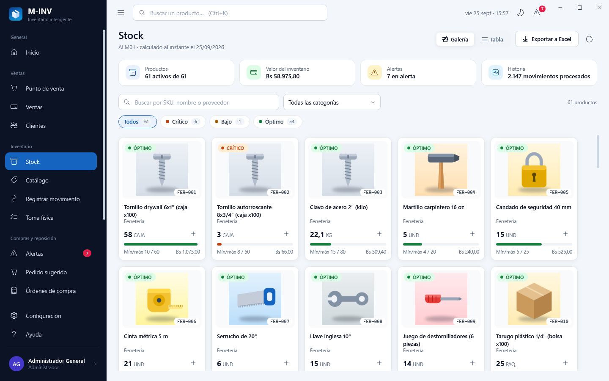 | 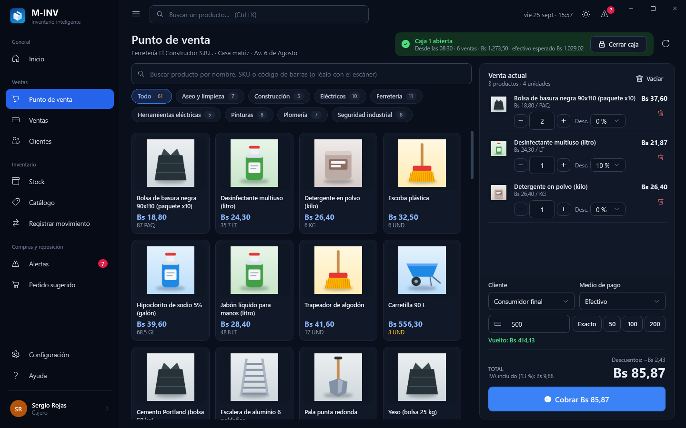 |
| 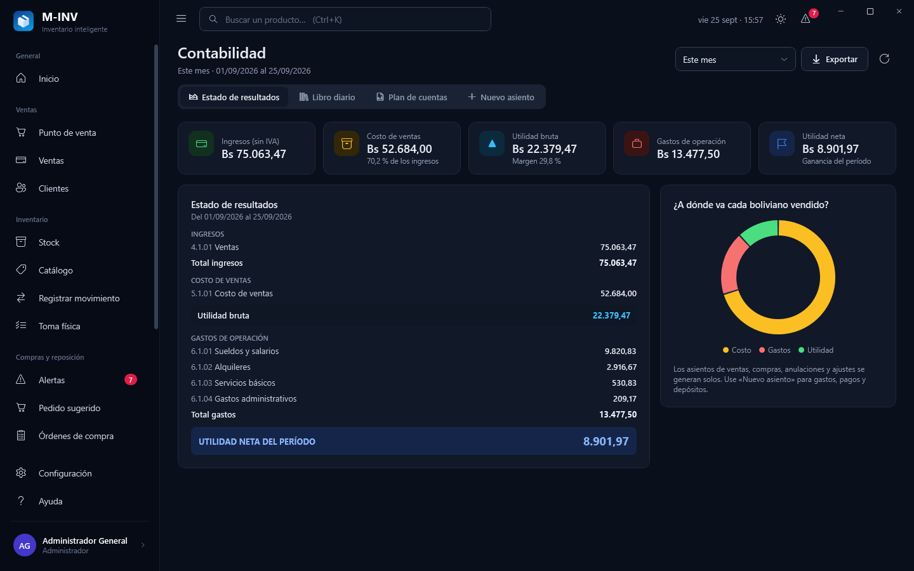 | 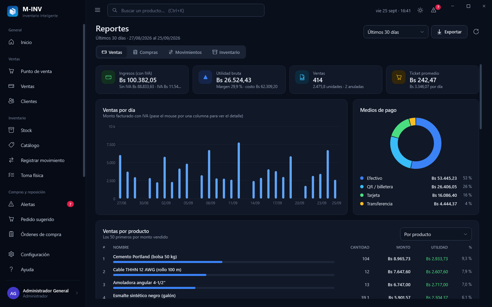 |

## 4. Teclado y lector de códigos

| Atajo | Acción |
|---|---|
| `Ctrl+K` | Buscar un producto y abrir su ficha |
| `Ctrl+1` … `Ctrl+9` | Ir a las primeras pantallas del menú |
| `Ctrl+N` | Registrar un movimiento |
| `F5` | Actualizar la pantalla |
| `Ctrl+B` | Contraer o expandir el menú |
| `Ctrl+Shift+L` | Tema claro / oscuro |
| `Esc` | Cerrar la ficha o la confirmación |
| `F1` | Ayuda |
| ↑ ↓ `Enter` | Moverse y elegir en las sugerencias del buscador |

El **lector de códigos en modo teclado** funciona sin configurar en cualquier pantalla: la aplicación distingue la
ráfaga del lector (teclas a menos de 35 ms + Enter) del tecleo de una persona, quita la lectura del campo donde se
escribió y la entrega a la pantalla: en *Registrar movimiento* y *Toma física* elige el producto; en el *Punto de venta*
lo agrega al carrito; en las demás abre su ficha; en *Configuración* muestra la lectura para probar el lector.

## 5. Sistema visual

- **Paletas** `Theme/Palette.Light.xaml` y `Theme/Palette.Dark.xaml` con las mismas claves (superficies, texto, marca
  `#1565C0`, semánticos y los siete colores del semáforo). Todo usa `DynamicResource`: el tema cambia sin reiniciar.
- **Estilos** en `Theme/Controls.xaml`: botones (primario, secundario, suave, fantasma, peligro, ícono, enlace, tarjeta),
  campos con ícono, texto de ayuda y anillo de foco, combos, casillas e interruptor, chips de filtro, control
  segmentado, tablas sin cuadrícula con filas de 46–58 px, barras de desplazamiento finas, tooltips, barra y anillo de
  carga, insignia del semáforo y barra de nivel.
- **Controles propios** (`Controls/`): gráfico de dona, columnas dobles con detalle al pasar el mouse y línea en
  escalón del kardex, dibujados con WPF (sin librerías externas).
- **Íconos**: Segoe Fluent Icons (Windows 11) con respaldo en Segoe MDL2 Assets (Windows 10). **Tipografía**: Segoe UI.
- **Ícono de la aplicación**: `Assets/minv.ico`, generado con `tools/generar_icono_escritorio.py`.
- **Español** en toda la interfaz: números y dinero con la cultura de Windows si es española (si no, es-BO), fechas
  `dd/MM/aaaa`, tiempo relativo («hace 5 min») y cantidades que aceptan coma o punto decimal.

## 6. Capturas y ejecutable

```powershell
powershell -ExecutionPolicy Bypass -File tools\build_v3.ps1 -Capturas     # regenera docs\product\capturas\v3.1 (46 imágenes)
powershell -ExecutionPolicy Bypass -File tools\publicar_escritorio.ps1    # dist\M-INV-<versión>-win-x64\M-INV.exe
```

`M-INV.exe --capturas <carpeta>` abre la demostración fuera de la pantalla visible, recorre todas las pantallas en tema
claro y oscuro y con dos roles, y guarda las imágenes y un `capturas.log`. Las pantallas de negocio (40 a 63) se
capturan con la base LOCAL de prueba si la variable `MINV_CAPTURAS_USUARIOS` apunta a `usuarios-prueba.txt` (lo hace
`build_v3.ps1`); si no, con la demostración. No toca las preferencias del usuario ni
muestra cuadros de diálogo: si algo falla, lo escribe en el registro y termina con código 1.
