# Cliente de escritorio M-INV V4.1 · guía de la interfaz (facturación SIAT)

La V4.1 conserva todo el escritorio de la V4 (ver [`escritorio-v4.md`](escritorio-v4.md)) y agrega la **facturación del
SIN de Bolivia** en la modalidad **computarizada en línea**: la **factura de compra venta** (sector 1) y la **nota
crédito-débito** (sector 24) para las devoluciones.

- Sección nueva del menú lateral **Facturación**: **Documentos fiscales**, **Estado SIAT**, **Homologación** y **Libros
  fiscales**. En **Administración** aparece **Facturación SIAT** (la configuración).
- La **caja** factura al cobrar: pide los datos del comprador, envía la factura al SIN en el momento, imprime el rollo
  fiscal y muestra el resultado. Si la empresa no factura, la caja funciona exactamente como en la V4.
- **Clientes** guarda el tipo de documento y el complemento, y verifica el NIT; **Ventas** muestra la factura del SIN de
  cada venta y agrega las **devoluciones**.

El menú **Facturación** solo aparece si la empresa tiene licenciado el módulo **FISCAL_SIAT**, y cada pantalla y acción
depende de los permisos `billing.*` (la tubería los vuelve a comprobar en cada caso de uso: el menú solo evita mostrar lo
que no se puede usar).

Las imágenes de esta guía las genera la propia aplicación (`M-INV.exe --capturas`). Las pantallas de negocio y de
facturación salen de la **base local de prueba** (`toolsd_local.ps1 -Accion recrear`: 25 días de facturas con el
simulador del SIN, sin valor legal); la del resultado fiscal de la caja (76) sale de la **demostración en memoria**, que
cobra dos ventas con el simulador del SIN en memoria. Nada de eso toca el SIN real. Carpeta:
[`capturas/v4.1`](capturas/v4.1).

## 1. Punto de venta: vender con factura

| Pantalla | Qué hace |
|---|---|
| 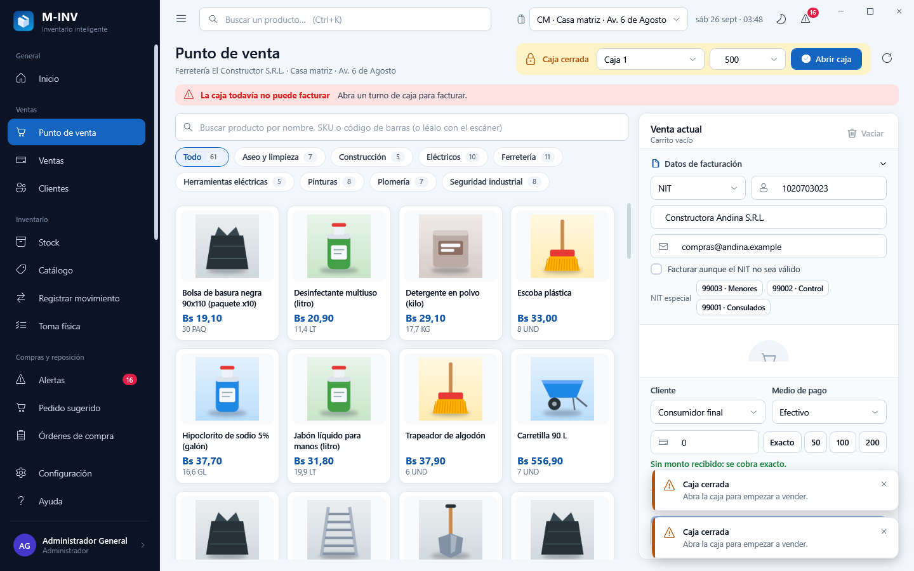 | **Banda de estado fiscal** sobre el catálogo: verde «Facturación en línea · PV n» con el vencimiento del CUFD; ámbar «FUERA DE LÍNEA · las facturas se envían solas al volver la conexión»; roja «Contingencia manual: use el talonario CAFC» o «La caja todavía no puede facturar» con lo que falta configurar. **Datos de facturación** (se pueden plegar): tipo de documento (CI, CEX, PAS, OD, NIT del catálogo del SIN), número, **complemento** (solo con CI), nombre o razón social y correo. Al salir del número, si el comprador ya compró antes, se completan solos su nombre, su correo y el cliente. Con NIT: **Verificar NIT** (consulta el Padrón y muestra el resultado) y la casilla **Facturar aunque el NIT no sea válido** (excepción que el SIN acepta). Botones de los **NIT especiales** 99003 (ventas menores del día), 99002 (control tributario) y 99001 (consulados y organismos internacionales), con su explicación. Si el medio de pago es **tarjeta**, se pide el número: viaja al caso de uso, que lo guarda enmascarado (4 primeros y 4 últimos dígitos), y la pantalla lo borra al cobrar. |
| 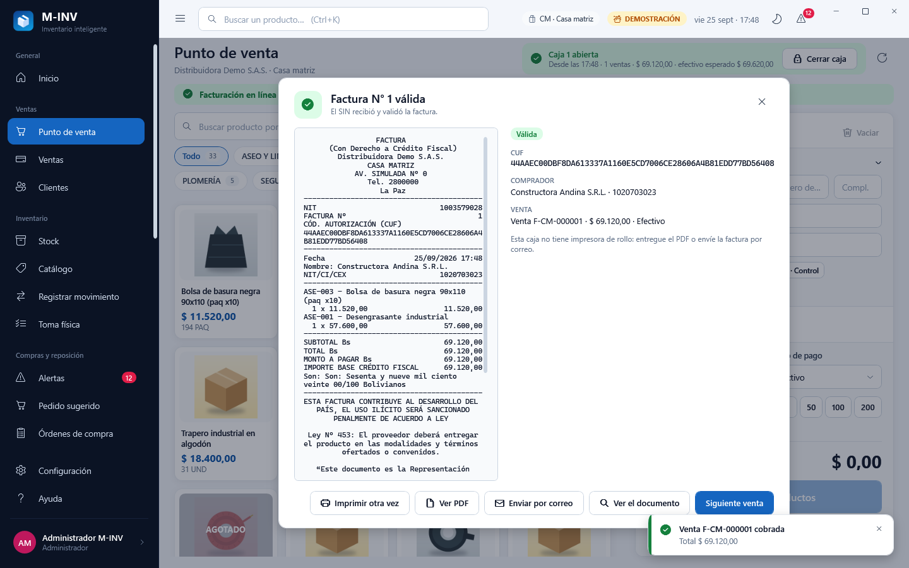 | **Al cobrar**: la venta se registra, la factura se envía al SIN en ese momento y se imprime el **rollo fiscal** del documento **definitivo** (si hubo que re-emitirla fuera de línea, se imprime esa). El panel muestra el número, el CUF, el estado y la vista previa del ticket (con «SIN VALOR LEGAL» en el ambiente de pruebas), y permite **Imprimir otra vez**, **Ver PDF**, **Enviar por correo**, **Ver el documento** y **Siguiente venta**. Si el SIN **rechaza** la factura, se ven sus mensajes y **Corregir y re-emitir** abre los datos del comprador para emitir una nueva. Sin comunicación, la caja pasa sola a fuera de línea: la venta no se detiene y la factura se envía después. |

Sin impresora de rollo configurada en la estación, el panel lo avisa y ofrece el PDF o el correo.

## 2. Documentos fiscales

| Pantalla | Qué hace |
|---|---|
| 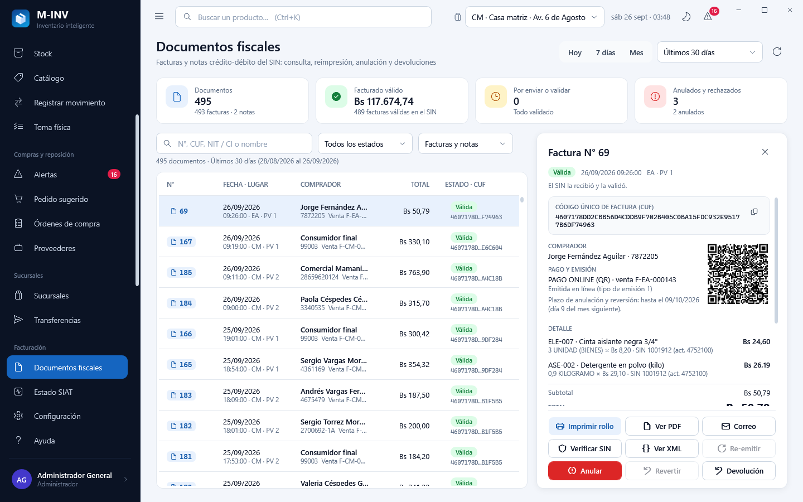 | **Filtros**: período con atajos **Hoy / 7 días / Mes**, estado ante el SIN, tipo (facturas, notas) y búsqueda por número, CUF, NIT/CI o nombre. **Grilla**: número, fecha y hora fiscal con sucursal y punto de venta, comprador y documento con la venta, total, **estado con color** (Válida, Pendiente, Fuera de línea, En paquete, Rechazada, Anulada, Sin respuesta…, con ícono si se emitió fuera de línea) y el CUF abreviado. **Detalle**: estado y fecha fiscal, **CUF completo con botón copiar**, código QR de la consulta del SIN, comprador, pago y tipo de emisión, **plazo de anulación**, líneas con su código del SIN, totales con el **IVA 13 %**, leyendas, la **bitácora del SIN** como línea de tiempo (cada envío con su código y mensaje), las **entregas** (impresión, PDF, correo), el documento reemplazado o su reemplazo y, en una nota, la factura original. |
| 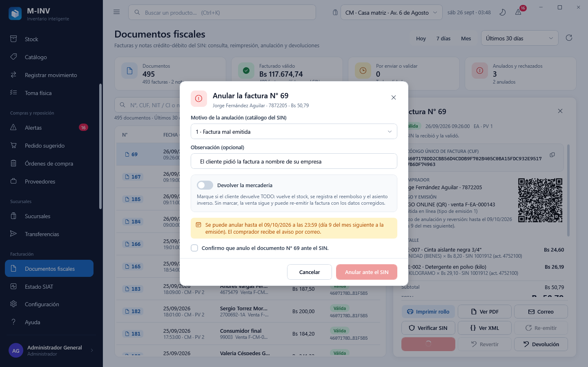 | **Anular**: motivo del catálogo del SIN, observación, casilla **Devolver la mercadería** (vuelve el stock, el reembolso y el asiento inverso; sin marcarla, la venta sigue y se puede re-emitir la factura corregida), **fecha límite** visible (día 9 del mes siguiente) y confirmación expresa. El comprador recibe el aviso por correo. |

Otras acciones del detalle: **Imprimir rollo** (en la impresora de la caja; sin impresora, un aviso), **Ver PDF** (se
guarda en la carpeta temporal y se abre con el visor de Windows; queda registrada la entrega), **Correo**, **Verificar
SIN** (consulta el estado del documento en el SIN), **Ver XML** (texto monoespaciado con copiar), **Revertir** una
anulación (se explica que el SIN lo permite **una sola vez**), **Devolución** (nota crédito-débito con las líneas que
todavía se pueden devolver) y **Re-emitir** (nueva factura con los datos del comprador editables, para un documento
rechazado o anulado).

## 3. Estado SIAT

| Pantalla | Qué hace |
|---|---|
| 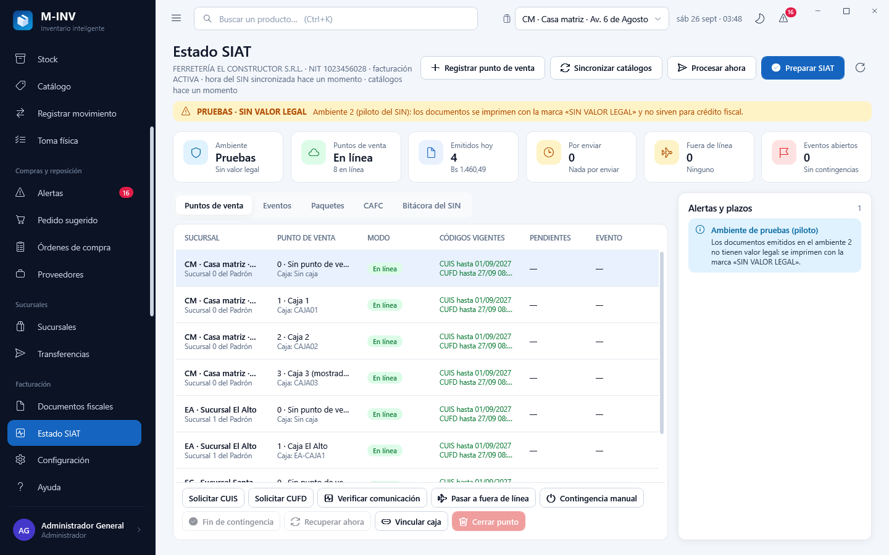 | **Tarjetas**: ambiente (con la franja **PRUEBAS · SIN VALOR LEGAL** en el piloto), modo de los puntos de venta, documentos y monto de hoy, por enviar, fuera de línea y eventos abiertos. **Alertas y plazos** con su severidad (información, atención, urgente) y **cuenta regresiva** hasta cada plazo, que se actualiza sola. **Puntos de venta**: sucursal, código, caja vinculada, modo (chip de color y desde cuándo), vencimiento del CUIS y del CUFD, pendientes y evento abierto. |

- **Acciones por punto de venta**: Solicitar CUIS, Solicitar CUFD, Verificar comunicación, Pasar a fuera de línea,
  **Contingencia manual** (evento del catálogo —solo corte de energía, virus o falla de software, falla de hardware—,
  talonario CAFC de la sucursal y hora de inicio), Fin de contingencia, Recuperar ahora, **Vincular caja** y **Cerrar
  punto** (el cierre en el SIN es definitivo: doble confirmación).
- **Acciones generales**: **Preparar SIAT** (hora del SIN, CUIS y CUFD del día en cada punto), **Sincronizar
  catálogos**, **Procesar ahora** (envía lo pendiente, recupera lo que está fuera de línea y renueva códigos) y
  **Registrar punto de venta**.
- **Pestañas**: **Eventos** (últimos 45 días con período, plazo y código de recepción) con **Transcribir factura
  manual** (evento, número del talonario, fecha y hora, comprador, medio de pago y líneas con el buscador de productos);
  **Paquetes** (envíos de contingencia con su validación); **CAFC** (talonarios con su rango y uso, y **Registrar
  talonario**); **Bitácora del SIN** (cada llamada al SIN con su servicio, resultado y duración; solo quien configura la
  facturación).

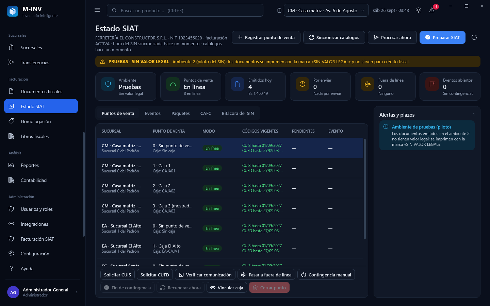

## 4. Homologación

| Pantalla | Qué hace |
|---|---|
| 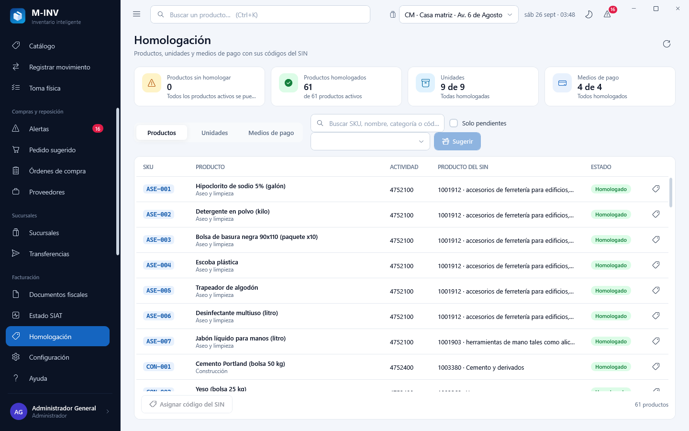 | Cada producto, unidad y medio de pago de M-INV necesita su código del SIN antes de facturar. **Productos**: SKU, nombre, categoría, actividad económica y producto del SIN con su descripción; filtro **Solo pendientes**; **Asignar código del SIN** busca en el catálogo del SIN de la actividad; **Sugerir** propone el código del SIN para los pendientes de la actividad elegida y las propuestas se aceptan en lote. **Unidades** y **Medios de pago**: un combo con el catálogo del SIN por fila. Las tarjetas cuentan lo pendiente. |

## 5. Libros fiscales

| Pantalla | Qué hace |
|---|---|
| 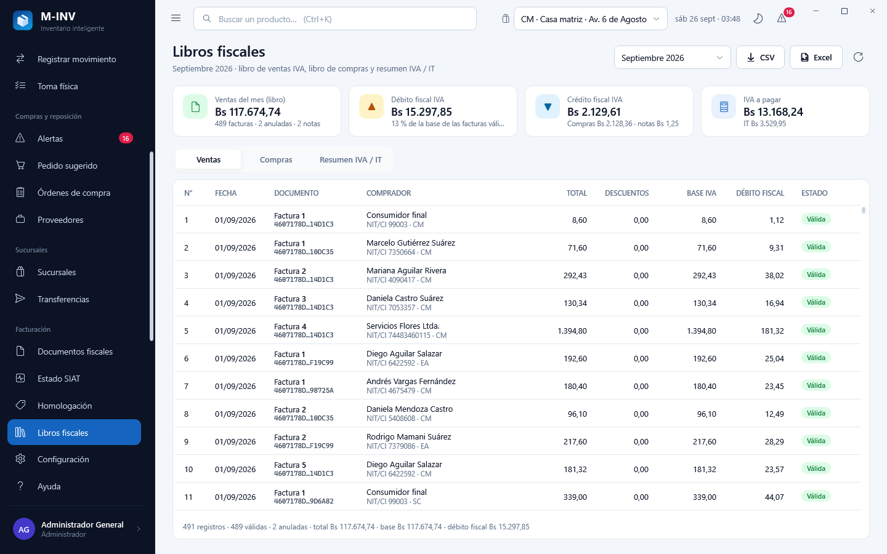 | Selector de **mes**. **Ventas**: libro de ventas IVA (número, fecha, documento del comprador, total, descuentos, base del IVA, débito fiscal y estado). **Compras**: libro de compras con las facturas de los proveedores y, al lado, **Recepciones sin factura**: **Registrar factura del proveedor** (número, código de autorización o CUF, fecha, total, descuentos, importes no sujetos y código de control) la agrega al libro con su crédito fiscal. **Exportar** a CSV o Excel con el cuadro «Guardar como». |
| 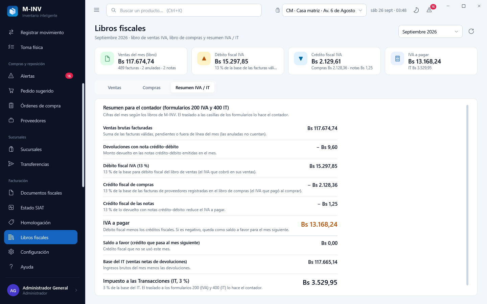 | **Resumen IVA / IT** para el contador (formularios 200 y 400): ventas brutas, devoluciones con nota, débito fiscal, crédito fiscal de compras y de notas, **IVA a pagar** (o saldo a favor que pasa al mes siguiente), base del IT e **IT 3 %**. Cada línea explica de dónde sale. |

## 6. Administración › Facturación SIAT (configuración)

| Pantalla | Qué hace |
|---|---|
| 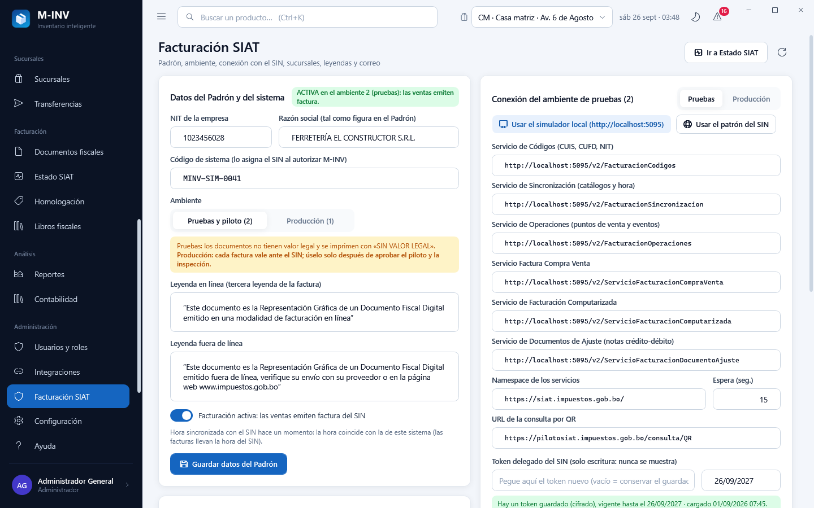 | **Datos del Padrón**: NIT, razón social, código de sistema, **ambiente** Pruebas (2) o Producción (1) con su advertencia, leyendas de la factura en línea y fuera de línea, y el interruptor **Facturación activa**; se ve cuándo se sincronizó la hora con el SIN. **Conexión** de cada ambiente: **Usar el simulador local (http://localhost:5095)** y **Usar el patrón del SIN** completan todas las direcciones; cada una se puede editar, igual que el namespace, la dirección de la consulta por QR y la espera. El **token delegado** se pega en un campo de solo escritura con su vigencia: **nunca se muestra** (se guarda cifrado; la pantalla solo dice que hay uno y hasta cuándo vale). **Probar conexión** verifica la comunicación con el SIN. **Sucursales del Padrón**: código de sucursal (0 = casa matriz), municipio y teléfono de cada sucursal de M-INV. **Correo**: servidor SMTP, usuario, contraseña de solo escritura y remitente, para enviar el XML y el PDF al comprador. Botón **Ir a Estado SIAT**. |

Orden recomendado la primera vez: datos del Padrón y conexión → sucursales → **Estado SIAT › Preparar SIAT** (CUIS,
CUFD, hora y catálogos) → **Homologación** → activar la facturación.

## 7. Clientes y ventas

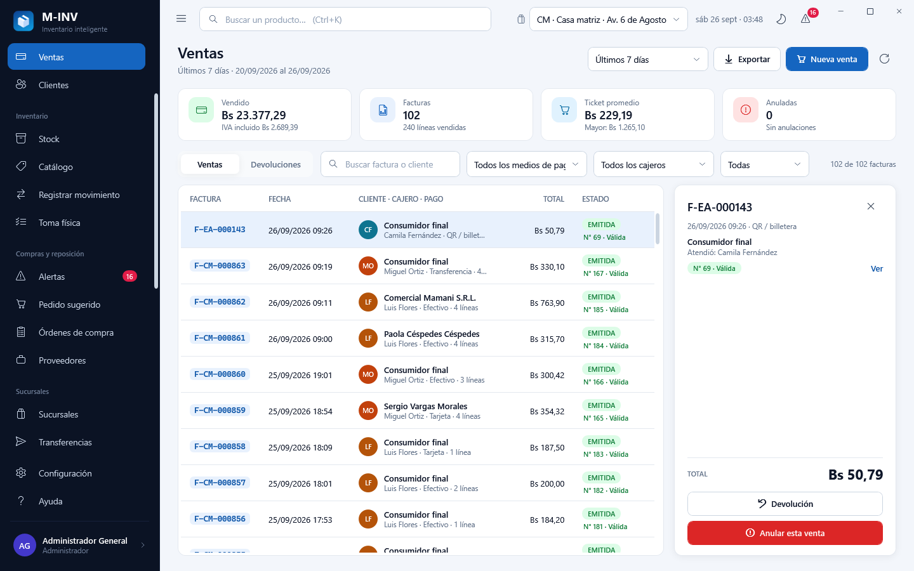

- **Clientes**: el editor agrega el **tipo de documento** del SIN, el **complemento** (solo con CI) y **Verificar NIT
  en el Padrón**. La caja usa esos datos al elegir el cliente.
- **Ventas**: debajo del estado de cada venta aparece su **factura del SIN** (número y estado ante el SIN, con color; en
  el detalle, **Ver** abre el documento). **Anular** una
  venta facturada lleva a la anulación fiscal en Documentos fiscales (la anulación antigua ya no se permite para una
  venta con factura). **Devolución** abre el diálogo con las líneas devolvibles: vuelve el stock, se registra el
  reembolso y, si la venta tenía factura, se emite la **nota crédito-débito**. La pestaña **Devoluciones** lista las
  devoluciones del período con su nota.

## 8. Trabajo automático y claves en cada modo

- **Base local y demostración**: si el usuario puede emitir (`billing.issue`) y la facturación está activa, el
  escritorio envía cada **20 segundos** los documentos pendientes y recupera los puntos fuera de línea; cada tercera
  vuelta además mantiene los códigos (CUFD/CUIS, hora del SIN, catálogos) y los correos. No interrumpe a nadie: los
  errores van al registro y, si se repiten, a un aviso discreto; la banda de la caja se actualiza sola.
- **Nube**: ese trabajo lo hace el servidor (`MINV.CloudServer`); el escritorio solo muestra el estado.
- **Clave maestra en modo Base local**: para descifrar el token del SIN y la contraseña del correo, el escritorio
  necesita `MINV_INTEGRATION_KEYS`. Si la variable no está definida, la toma de la línea `MINV_INTEGRATION_KEYS=…` del
  archivo `%LOCALAPPDATA%\M-INV\claves-integracion.txt` (lo escribe `tools\bd_local.ps1`) antes de conectarse. La clave
  nunca se muestra ni se registra; en modo nube el escritorio no la necesita.

## 9. Qué ve cada rol en la V4.1

| Rol | Caja | Documentos fiscales · Estado SIAT · Libros | Anular, devolver, contingencias | Configuración y homologación |
|---|---|---|---|---|
| Administrador | factura | todo | todo | sí |
| Gerencia | — | consulta | anula y revierte; contingencias, CAFC y transcripción (la devolución la hace la caja) | no |
| Ventas, Cajero | factura | consulta; re-emite, reimprime y envía por correo | no | no |
| Consulta | — | consulta | no | no |
| Bodega | — | no | no | no |

## 10. Capturas

```powershell
powershell -ExecutionPolicy Bypass -File tools\build_v3.ps1 -Capturas   # genera todas las capturas (01 a 80)
```

Las pantallas de la facturación son las **69 a 80**; se copian en `docs\product\capturas\v4.1`. Con la base local de
prueba se captura lo que haya (sin cobrar nada: por eso la 76 se toma de la demostración); con la demostración, la
aplicación configura el simulador y cobra dos ventas antes de capturar.
