# Cliente de escritorio M-INV V4.2 · guía de la interfaz (edición Tecnología)

La V4.2 conserva todo el escritorio de la V4.1 (ver [`escritorio-v4.1.md`](escritorio-v4.1.md): facturación del SIN,
sucursales, integraciones) y lo especializa para tiendas de **computadoras, componentes, periféricos y consolas**. Cada
equipo se vende, se garantiza y vuelve por su **serie o IMEI**; las fichas técnicas, las plataformas y la compatibilidad
del armador salen de los datos (especificaciones por categoría), no de listas escritas en las pantallas.

- Sección nueva del menú lateral **Tecnología**: **Armador de PC**, **Series e IMEI** y **Garantías y RMA**.
- **Catálogo**: pestaña **Ficha técnica** en el editor, insignias **Serie** / **IMEI** y **Garantía** en la galería,
  filtros por **plataforma** y por **especificación** (facetas) y la administración de **Especificaciones** por categoría.
- **Punto de venta**: chips de categoría y de plataforma, **elegir la unidad** (serie o IMEI) al agregar un equipo, series
  y garantía en el ticket y en la factura, y **Desde armado** para cobrar una cotización del armador.
- **Compras**, **Registrar movimiento**, **Transferencias** y **Devoluciones** piden las series de los productos
  serializados.
- El **tablero** agrega la sección **Tecnología**. El tema **oscuro** (gaming) es el predeterminado; el claro sigue a un
  clic (ícono de luna o sol de la barra superior) y las dos paletas tienen las mismas claves y contraste AA (regla T-08).

Cada pantalla y acción depende de los permisos de la edición (`catalog.specs.manage`, `inventory.serials.view`,
`inventory.serials.manage`, `service.rma.open`, `service.rma.manage`, `sales.pcbuild.manage`); la tubería los vuelve a
comprobar en cada caso de uso: el menú solo evita mostrar lo que no se puede usar. Los colores y avisos de las pantallas
(IMEI inválido, serie repetida, pieza incompatible) son **guía**: la validación que manda es la del dominio al guardar.

Las imágenes de esta guía las genera la propia aplicación (`M-INV.exe --capturas`) con la empresa de prueba de la
edición, **Tech Zone Gaming S.R.L.** (demostración en memoria o base local de prueba). La aplicación elige un ejemplo real
de sus datos para cada pantalla (una cotización vigente, una unidad vendida, un caso abierto); con una empresa sin
productos serializados, cotizaciones o casos, las pantallas se capturan con sus estados vacíos (no se inventan datos).
Las publicadas salen de la **base local de prueba** (`tools\bd_local.ps1 -Accion recrear`, 60 días de operación), salvo
la 76 (resultado fiscal de la caja), que sale de la demostración porque con la base local no se cobra nada al capturar.
Carpeta: [`capturas/v4.2`](capturas/v4.2).

## 1. Tablero: sección Tecnología

| Pantalla | Qué hace |
|---|---|
| 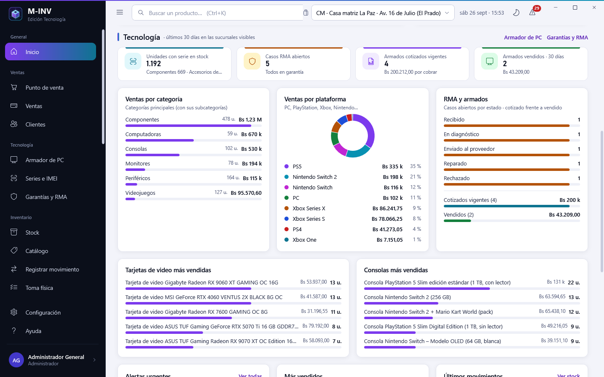 | Últimos **30 días** en las sucursales visibles. **Tarjetas**: unidades con serie en stock (por categoría), casos RMA abiertos (y cuántos fuera de garantía), armados cotizados vigentes con su valor por cobrar y armados vendidos. **Ventas por categoría** (categorías principales con sus subcategorías, unidades y monto), **Ventas por plataforma** (anillo con PC, PlayStation, Xbox, Nintendo… según la especificación «Plataforma»), **RMA y armados** (casos abiertos por estado; cotizado frente a vendido), **Tarjetas de video más vendidas** y **Consolas más vendidas**. Si hay productos serializados con unidades en stock sin serie, un aviso lo señala (se registran en **Series e IMEI**). Enlaces directos al **Armador de PC** y a **Garantías y RMA**. |

## 2. Catálogo técnico

| Pantalla | Qué hace |
|---|---|
| 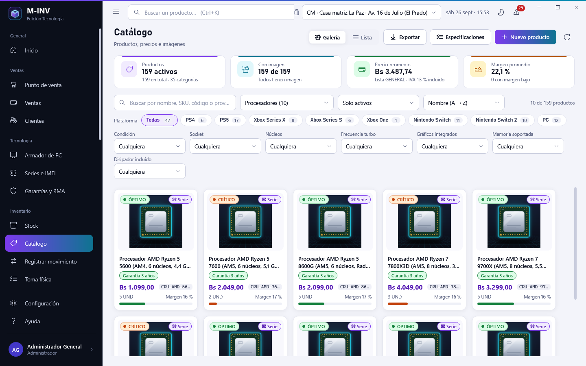 | **Galería** con las insignias **Serie** o **IMEI** (el producto se vende por unidad), **Garantía N meses** y las **plataformas** del producto (PS5, Xbox Series X, Nintendo Switch 2…). **Filtros**: chips de **Plataforma** (sus opciones, con la cantidad de productos; regla T-07) y, al elegir una categoría, sus **especificaciones filtrables** (propias y heredadas) con la cantidad por valor: socket, tipo de RAM, interfaz, condición… Una categoría madre muestra también los productos de sus subcategorías. |
| 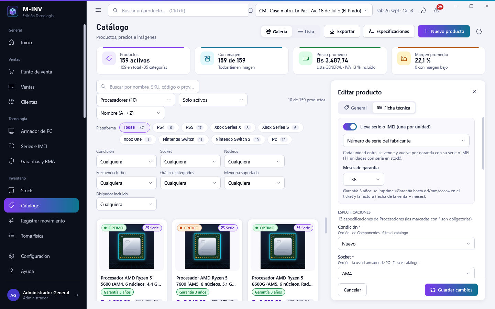 | Pestaña **Ficha técnica** del editor de producto. **Perfil**: **Lleva serie o IMEI (una por unidad)**, el tipo (número de serie del fabricante o **IMEI** de 15 dígitos con dígito de control) y los **meses de garantía** (0, 3, 6, 12, 18, 24, 36 o los que se escriban), que se imprimen como «Garantía hasta dd/mm/aaaa» (fecha de la venta + meses; regla T-04). **Especificaciones** de la categoría con el control según su tipo: número con su unidad, texto, opción (lista) o varios valores (casillas); las obligatorias llevan `*` y cada una dice si es heredada, si la usa el armador de PC y si filtra el catálogo. Para pasar a «lleva serie» un producto con existencias, primero se registran las series de las unidades en stock (**Series e IMEI › Registrar series de stock**). |
| 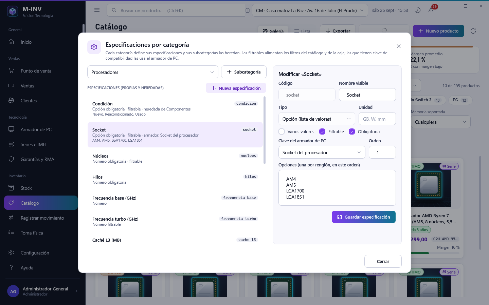 | **Especificaciones** (botón del catálogo, permiso `catalog.specs.manage`): categoría con sus especificaciones **propias y heredadas**, **Subcategoría** (las hijas heredan las especificaciones de la madre) y el formulario: código, nombre visible, tipo (texto, número con unidad, opción), **varios valores**, **filtrable**, **obligatoria**, **clave del armador de PC** (solo las constantes de compatibilidad del dominio, con su nombre en español: socket del procesador, tipo de RAM, potencia de la fuente…), orden y las opciones (una por renglón). |

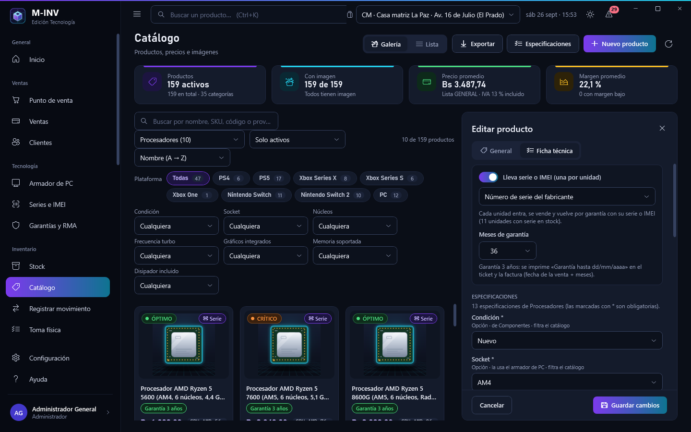

## 3. Punto de venta con series e IMEI

| Pantalla | Qué hace |
|---|---|
| 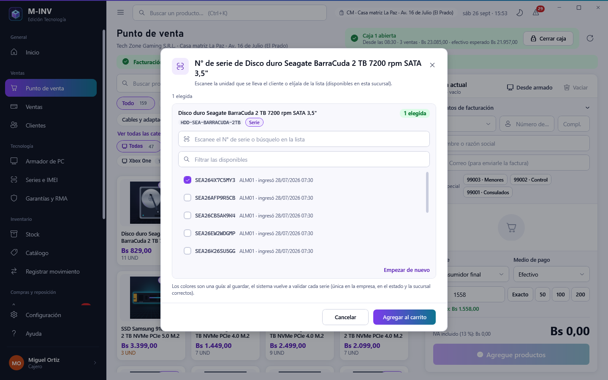 | Al agregar un producto con la insignia **Serie** o **IMEI** se abre **N° de serie de…**: se **escanea** la unidad que se lleva el cliente (el escáner en modo teclado funciona aunque el foco esté en otro lado) o se marca en la lista de **disponibles de la sucursal**, con búsqueda y la fecha en que ingresó cada una. El contador («1 elegida») y los colores guían; la caja no deja agregar una serie que no está en la sucursal. |
| 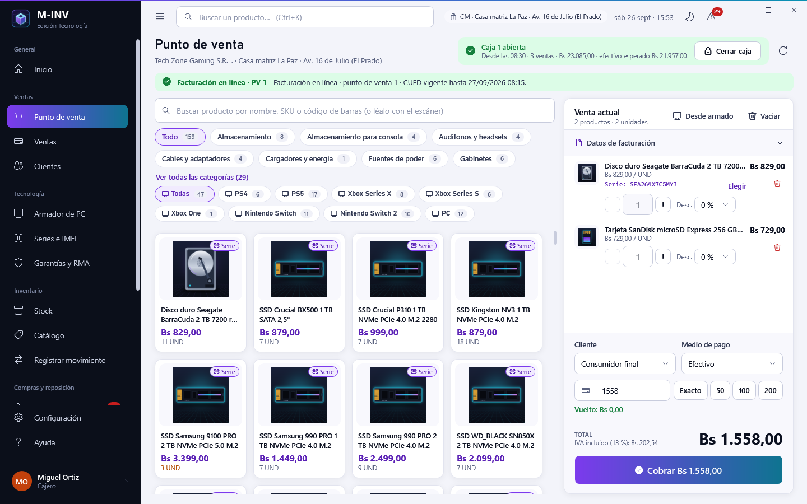 | Cada línea serializada muestra **Serie:** o **IMEI:** con sus unidades y **Elegir** para cambiarlas; la cantidad es la de las unidades elegidas. **Chips de categoría** (con muchas categorías se muestran dos filas y **Ver todas las categorías** despliega el resto) y **chips de plataforma** para filtrar rápido. Al cobrar, el **ticket**, el **rollo fiscal** y la **factura del SIN** llevan la serie o el IMEI de cada unidad (`numeroSerie` / `numeroImei`, regla T-03) y «Garantía hasta dd/mm/aaaa». |
| 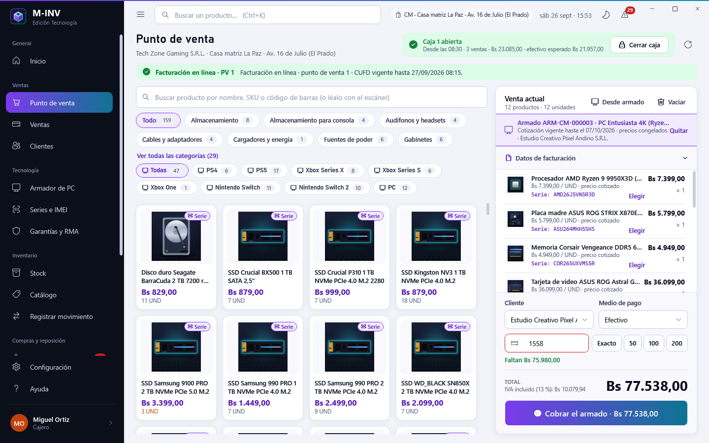 | **Desde armado** (o **Vender en caja** en el armador) carga una **cotización vigente**: una línea fija por pieza al **precio cotizado**, con la banda del armado (número, vigencia, **Quitar**) y la elección de la serie de cada pieza serializada. El botón pasa a **Cobrar el armado**; al cobrar, la cotización queda **Vendida** con la venta y la factura vinculadas (regla T-06). |

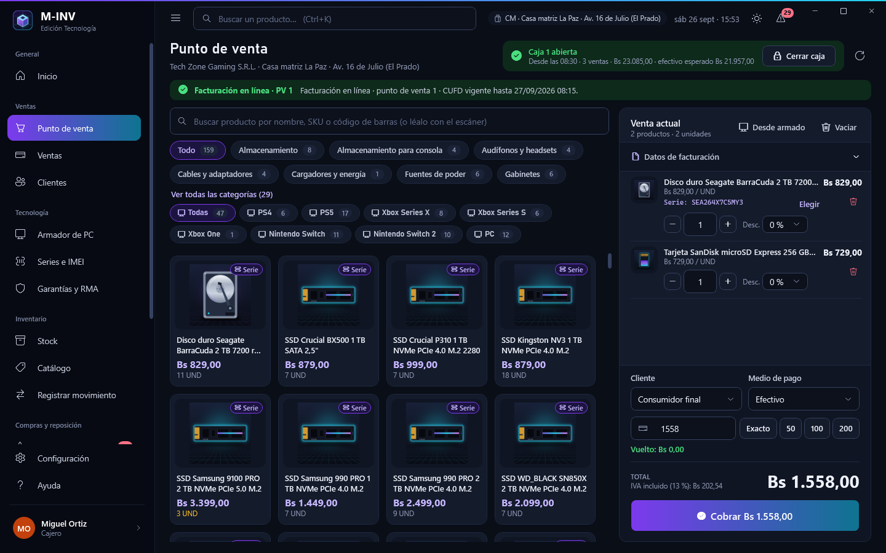

## 4. Armador de PC

| Pantalla | Qué hace |
|---|---|
| 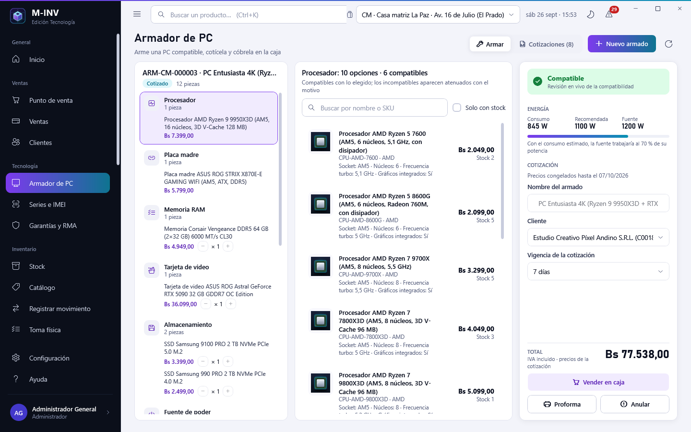 | **Ranuras**: procesador, placa madre, memoria RAM, tarjeta de video, almacenamiento, fuente de poder, gabinete y refrigeración (las obligatorias se marcan) y **Extras** por categoría (monitor, periféricos, software, servicios). **Candidatos** de la ranura elegida con su stock en la sucursal, sus especificaciones clave y sus **plataformas**; los **incompatibles aparecen atenuados con el motivo** («El procesador es LGA1700 y la placa AM5: el socket no coincide»). **Revisión en vivo** (solo `PcCompatibility`, regla T-06): errores y avisos, **consumo estimado**, **fuente recomendada** y la carga de la fuente elegida. **Cotización**: nombre, **cliente**, **vigencia** (3, 7, 15 o 30 días) y el **total** con IVA incluido. **Borrador** guarda sin congelar precios; **Guardar cotización** congela los precios con su vigencia y, si hay errores de compatibilidad, pide confirmarlo expresamente (queda marcada). Una cotización guardada ofrece **Vender en caja**, **Proforma** y **Anular**. |
| 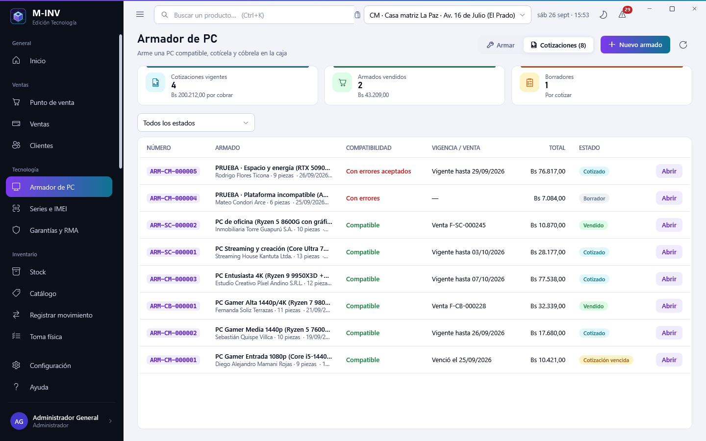 | **Cotizaciones**: tarjetas de vigentes (monto por cobrar), vendidas y borradores; filtro por estado y la lista con número `ARM-<sucursal>-000001`, armado y cliente, compatibilidad, **vigencia** (o la venta que la cobró), total y estado (Borrador, Cotizado, Vencido, Vendido, Anulado). **Abrir** la carga en la pestaña Armar. |
| 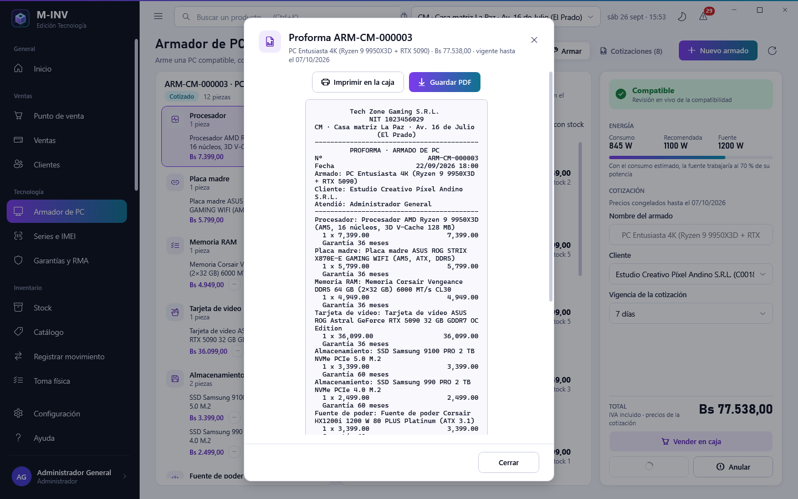 | **Proforma** de la cotización: empresa y sucursal, número, fecha, cliente y vendedor, cada pieza con su precio cotizado y su **garantía**, total, la vigencia y «Documento sin valor fiscal: no es una factura». **Imprimir en la caja** (impresora de rollo de la estación) o **Guardar PDF**. |

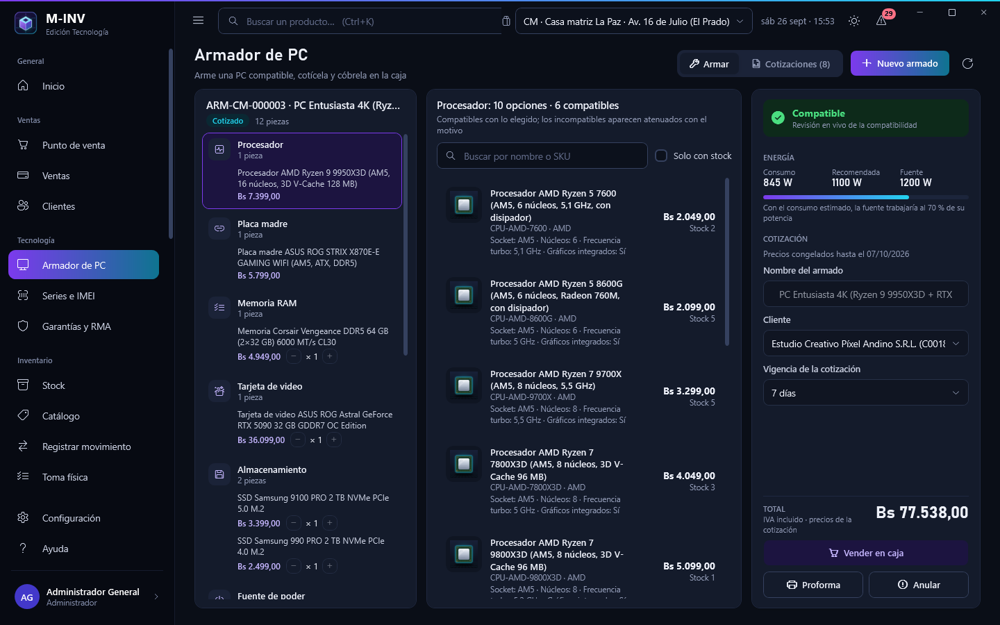

## 5. Series e IMEI

| Pantalla | Qué hace |
|---|---|
| 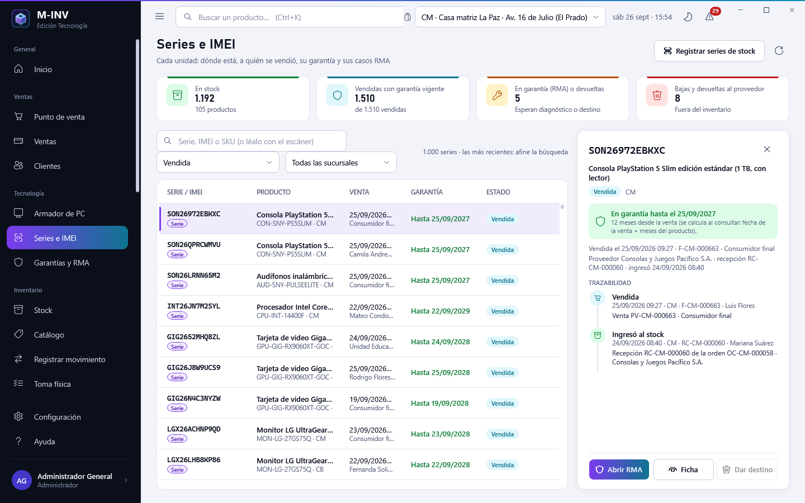 | **Tarjetas**: en stock (y de cuántos productos), vendidas con garantía vigente, en garantía (RMA) o devueltas, y bajas o devueltas al proveedor; cuentan **todas** las series de la empresa, mientras la grilla muestra las 1.000 que ingresaron más recientemente (con más, se afina con la búsqueda). **Búsqueda** por serie, IMEI o SKU (se puede leer con el escáner), **estado** y **sucursal**. **Grilla**: serie o IMEI, producto con su ubicación, venta (fecha y factura, cliente), **garantía** («Hasta dd/mm/aaaa» o «Venció…») y estado con color. **Detalle**: la garantía vigente **derivada** (fecha de la venta + meses del producto, calculada al consultar; regla T-04), la venta y la recepción, y la **trazabilidad** como línea de tiempo (ingresó al stock, transferencias, vendida, devuelta, en garantía, repuesta…) con documento, sucursal y usuario de cada hecho. Acciones: **Abrir RMA** (unidad vendida), **Ficha** del producto y **Dar destino** (devolver al proveedor o dar de baja una unidad devuelta o en garantía). **Registrar series de stock** carga las series de unidades que ya estaban en stock sin serie (inventario inicial). |

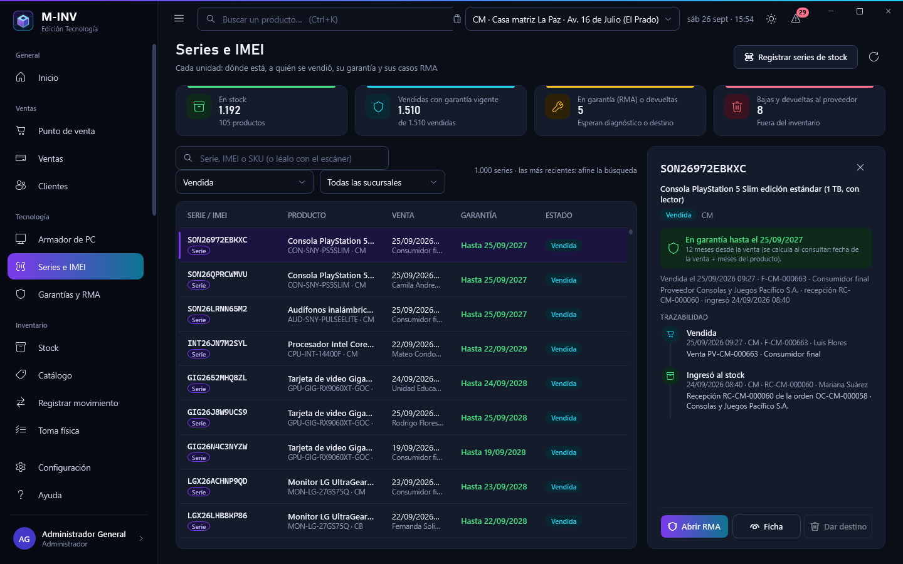

## 6. Garantías y RMA

| Pantalla | Qué hace |
|---|---|
| 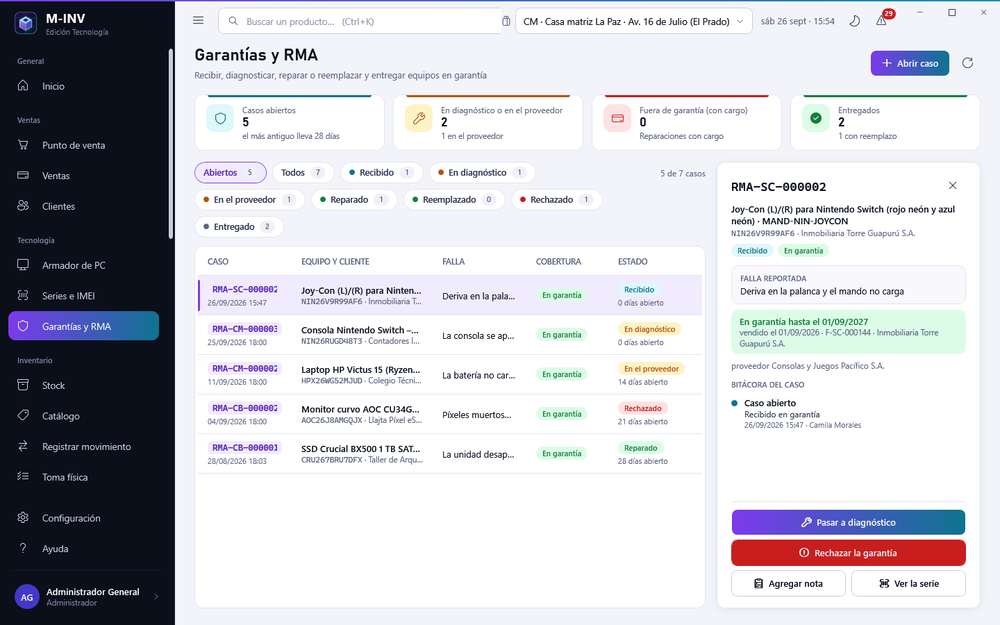 | **Tarjetas**: casos abiertos (y cuántos días lleva el más antiguo), en diagnóstico o en el proveedor, fuera de garantía (con cargo) y entregados. **Chips por estado** con su cantidad (Abiertos, Todos, Recibido, En diagnóstico, En el proveedor, Reparado, Reemplazado, Rechazado, Entregado). **Grilla**: caso `RMA-<sucursal>-000001` y fecha, equipo y cliente, falla, **cobertura** (en garantía o con cargo) y estado con los días abierto. **Detalle**: falla reportada, garantía de la unidad, la **bitácora del caso** (cada cambio con su nota, fecha y usuario; regla T-05) y las **acciones según el estado**: pasar a diagnóstico, enviar al proveedor, marcar reparado, **reemplazar con otra unidad** (se escanea o elige la serie que se entrega: sale del stock con su asiento), rechazar la garantía (con la resolución) y **entregar**; además **Agregar nota** y **Ver la serie**. |
| 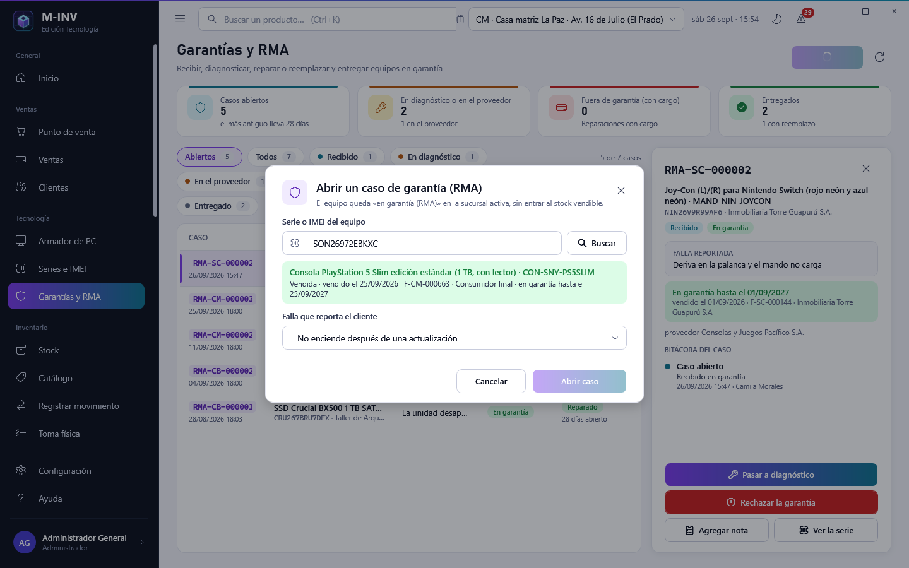 | **Abrir caso** (o **Abrir RMA** desde Series e IMEI): se escanea o escribe la serie o el IMEI, **Buscar** muestra el equipo, la venta y si está **en garantía**; se describe la falla (o se elige una frecuente). La unidad queda **en garantía (RMA)** en la sucursal activa, fuera del stock vendible. Fuera de garantía el caso solo se abre como **reparación con cargo**, marcado así. |

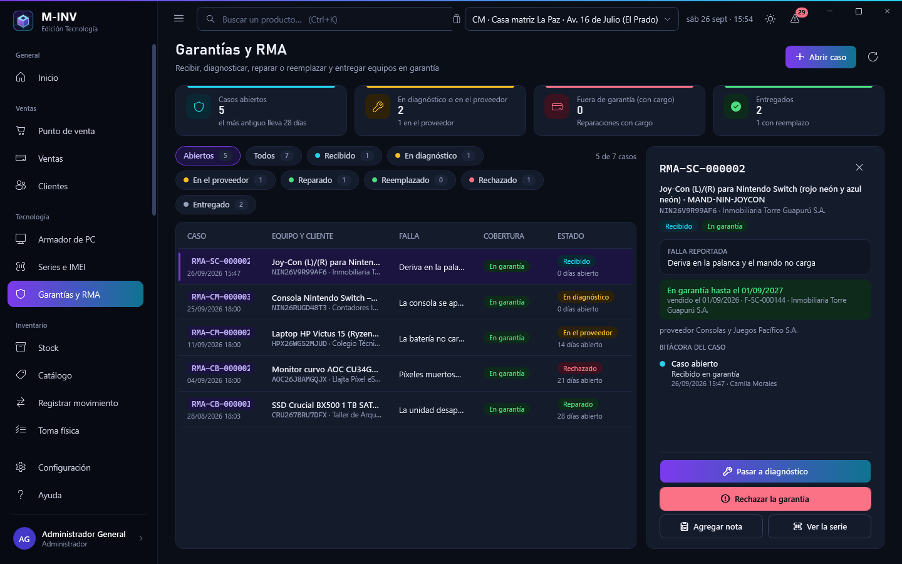

## 7. Series al recibir compras, en los movimientos, en las transferencias y en las devoluciones

Todas usan el mismo formulario de series (sin captura propia en esta guía):

- **Órdenes de compra › Recibir**: si la orden tiene productos serializados, después del documento del proveedor se pide
  una línea por producto con el contador «3 de 5». Las series se **escanean** (modo teclado: cada lectura termina con
  Enter), se **escriben** o se **pegan como lista** («Pegar una lista»: una por renglón o separadas por comas, copiadas de
  la guía del proveedor o de una planilla). En vivo se marcan el **IMEI inválido** (15 dígitos y dígito de Luhn) y las
  **repetidas**; si el dominio rechaza una serie al guardar (por ejemplo, ya existe en la empresa), el formulario sigue
  abierto con el motivo para corregirla.
- **Registrar movimiento**: el **saldo inicial** y los **ajustes positivos** de un producto serializado piden las series que
  entran; las salidas y los ajustes negativos, elegir las unidades que salen. La cantidad debe ser entera (una serie por
  unidad) y la pantalla indica cuántas unidades con serie hay en stock. Los **AJUSTE (±)** (mermas, sobrantes) y los de la
  **toma física** dejan su asiento al costo promedio (5.1.09 Mermas / 4.1.02 Sobrantes contra 1.1.05) y el mensaje dice su
  número; así el mayor 1.1.05 sigue al valor del stock.
- **Transferencias**: al solicitar una transferencia con un producto serializado se eligen (o se escanean) las unidades
  que viajan, disponibles en el almacén de origen; el detalle muestra las series de cada línea. Al **recibir** con
  faltante, se marcan las series que **no llegaron** (quedan como faltante en tránsito) y las demás entran al stock del
  destino.
- **Ventas › Devolución**: un producto serializado se devuelve **marcando sus series** (solo las de esa venta que siguen
  vendidas). **Devolución por falla** reembolsa al cliente pero la mercadería **no vuelve al stock vendible**: queda en
  garantía para devolverla al proveedor, repararla o darla de baja desde Series e IMEI. La nota crédito-débito lleva las
  series devueltas.

Otros detalles del cierre de la V4.2 en pantallas de la V4.1 (capturas 13, 41, 60 y 73):

- **Catálogo › galería**: el precio de la tarjeta se ve siempre completo («Bs 6.899,00»); el SKU usa lo que queda y se
  recorta con «…» (entero en la ayuda al pasar el mouse). El margen es sobre el precio neto (el 87 % del precio en
  Bolivia).
- **Actividad**: los importes del detalle (importe total, descuentos, costo, precio, fondo y arqueo de caja) se muestran con
  el formato de dinero del escritorio («Bs 35.212,54»), no como los guarda la bitácora («35212.54»).
- **Libros fiscales › Registrar factura del proveedor**: propone el importe con IVA de la recepción (recepción ÷ 0,87: la
  compra entró al costo neto) y muestra el asiento que dejará; con ese importe el inventario no cambia.

## 8. Impresión

- **Ticket de venta** y **rollo fiscal** (ESC/POS) y **PDF de la factura**: debajo de cada línea serializada, `S/N:` o
  `IMEI:` con las unidades vendidas y «Garantía hasta dd/mm/aaaa» (fecha de la venta + meses del producto, derivada al
  imprimir, nunca guardada).
- **Proforma del armado**: texto de ticket (impresora de rollo) y PDF, con la garantía de cada pieza en meses y la leyenda
  de que no es una factura.

## 9. Qué ve cada rol en la V4.2

| Rol | Armador de PC | Series e IMEI | Garantías y RMA | Especificaciones y ficha técnica |
|---|---|---|---|---|
| Administrador | arma, cotiza, anula y cobra | consulta, registra series de stock y da destino | abre y avanza casos | sí |
| Gerencia | arma, cotiza y anula | consulta, registra series de stock y da destino | abre y avanza casos | sí |
| Ventas, Cajero | arma, cotiza, anula y cobra en la caja | consulta | abre casos y agrega notas | no (ve las insignias y filtros) |
| Bodega | — | consulta, registra series de stock y da destino | abre y avanza casos | sí |
| Consulta | — | consulta | consulta | no |

## 10. Capturas

```powershell
powershell -ExecutionPolicy Bypass -File tools\build_v3.ps1 -Capturas   # genera todas las capturas en docs\product\capturas\v4.2
```

Las pantallas de la edición Tecnología son las **81 a 98** (las 94 a 98 en el otro tema: «oscuro» con la base clara,
«claro» si se pide `--tema oscuro`); las 01 a 80 son las de la V4.1 con los datos de la empresa de prueba. Para revisar el
diseño sin tocar el repositorio se puede capturar en una carpeta temporal:

```powershell
& "src\3. Presentation\MINV.DesktopClient\bin\Release\net8.0-windows\M-INV.exe" --capturas "$env:TEMP\minv-capturas" [--tema oscuro]
```
