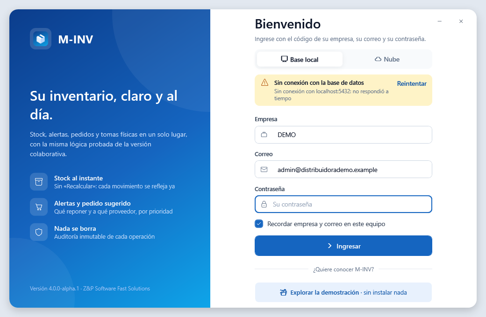
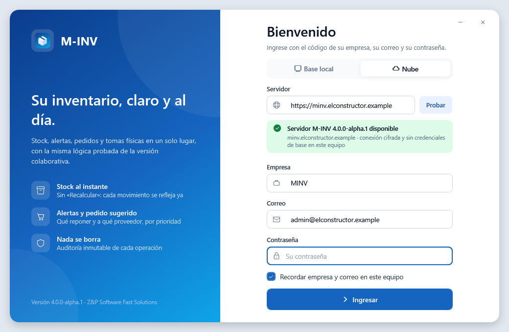
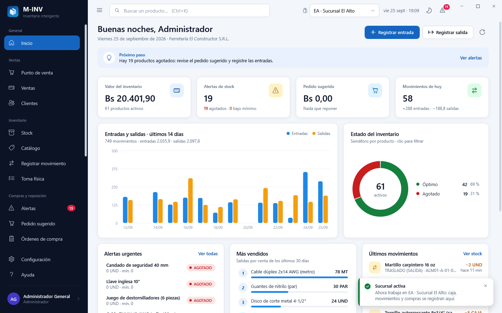
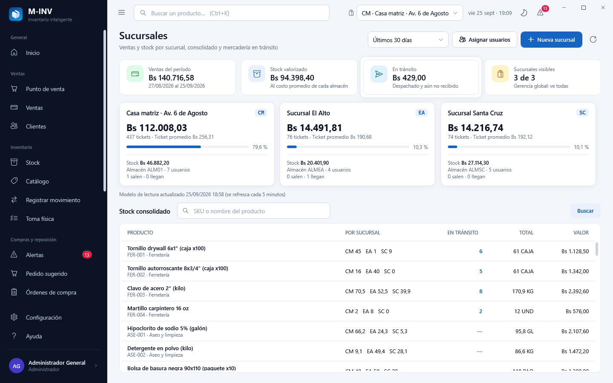
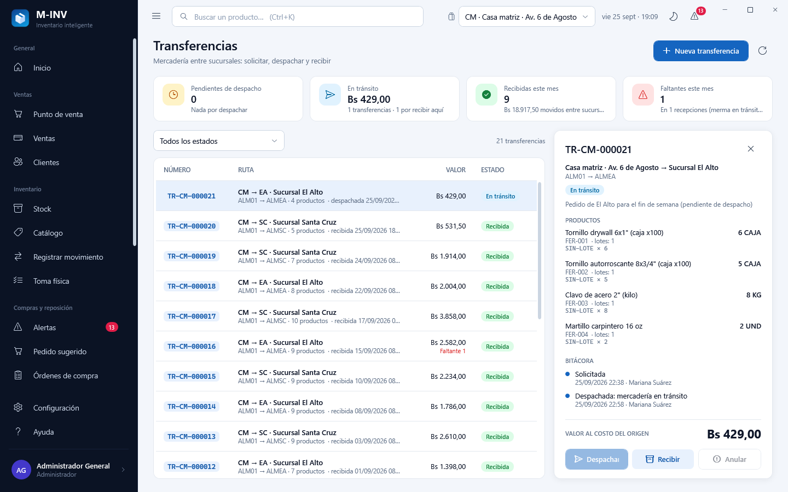
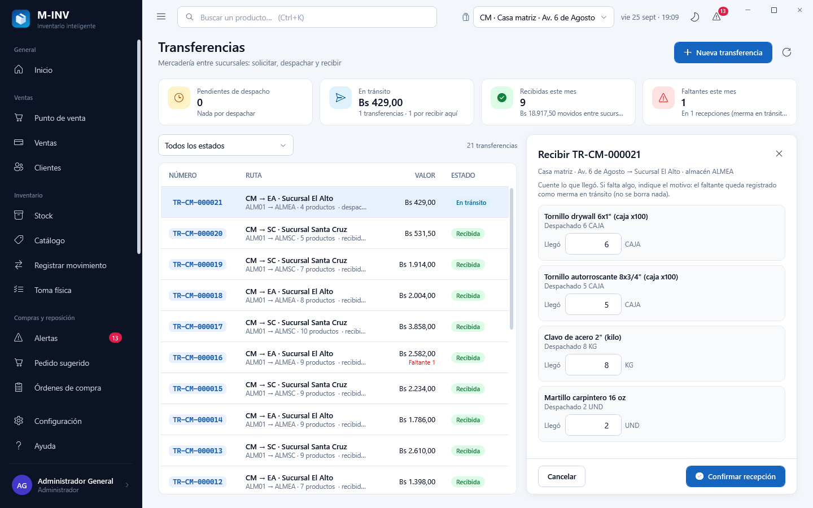
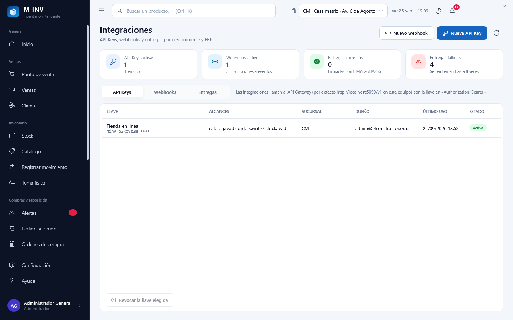
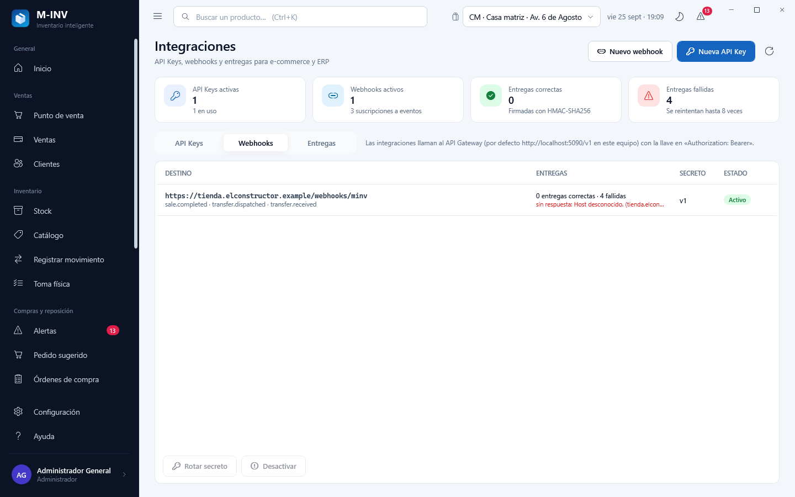

# Cliente de escritorio M-INV V4 · guía de la interfaz (multi-sucursal y nube)

La V4 conserva todo el escritorio de la V3.1 (ver [`escritorio-v3.1.md`](escritorio-v3.1.md)) y agrega lo necesario para
trabajar con **varias sucursales** y **por internet**:

- **Modo de conexión** en el inicio de sesión: **Base local** (PostgreSQL directo, como en la V3) o **Nube** (servidor
  M-INV): el equipo solo conoce la dirección del servidor; no tiene la contraseña de la base de datos. La demostración
  en memoria se ofrece en el modo Base local.
- **Sucursal activa** en la barra superior: todo lo que se registra (caja, movimientos, compras, transferencias) queda
  en esa sucursal, y cada usuario ve solo las suyas. La gerencia global puede elegir **Todas las sucursales**.
- Tres pantallas nuevas: **Sucursales**, **Transferencias** e **Integraciones**.

Las imágenes de esta guía las genera la propia aplicación (`M-INV.exe --capturas`) con la base local de prueba
multi-sucursal (`tools\bd_local.ps1 -Accion recrear`): empresa MINV con las sucursales CM (casa matriz), EA (El Alto) y
SC (Santa Cruz). Carpeta: [`capturas/v4`](capturas/v4).

## 1. Inicio de sesión: base local o nube

| Pantalla | Qué hace |
|---|---|
|  | **Base local**: como en la V3, el escritorio se conecta directo a PostgreSQL (este equipo o la red de la oficina) con el rol `minv_app`, sujeto a la seguridad por filas. |
|  | **Nube**: escriba la dirección del servidor (`https://…`; `http://` solo se admite en este mismo equipo) y pulse **Probar**. El servidor valida la contraseña, calcula los permisos y las sucursales del usuario y entrega un token de sesión (vence a las 12 horas sin actividad). El escritorio exige la misma versión mayor que el servidor. |

La elección (y la dirección del servidor) se recuerda en el equipo. En modo nube la barra superior muestra el distintivo
**NUBE**; si la sesión vence o la cierran en el servidor, el escritorio vuelve solo al inicio de sesión. Un corte de red
durante una venta no la duplica: el reintento lleva el mismo identificador y el servidor devuelve la respuesta ya
registrada.

## 2. Sucursal activa



- El selector de la barra superior lista las sucursales del usuario (las asignadas en **Sucursales › Asignar usuarios**;
  la gerencia global ve todas y además **Todas las sucursales**). Si el usuario trabaja en una sola, se muestra su
  nombre sin selector.
- Al cambiar de sucursal, el servidor vuelve a calcular el alcance y todas las pantallas recargan: el tablero, el stock,
  las alertas, el pedido sugerido y las ventas pasan a ser los de esa sucursal. La caja, los movimientos y las compras
  se registran en ella y los documentos se numeran con su código (`F-EA-000001`, `TR-CM-000021`, `AS-SC-000131`).
- Con **Todas las sucursales** (vista consolidada) no se puede vender ni mover stock: elija una sucursal.

## 3. Pantallas nuevas

| Pantalla | Qué hace |
|---|---|
|  | **Sucursales** (Gerencia, Administración, Consulta): ventas del período por sucursal (tickets, ticket promedio, participación), valor del stock de cada una, transferencias que salen y llegan, y el **stock consolidado** por producto con la columna **en tránsito** (lo despachado que aún no se recibió se cuenta una sola vez). Los números de ventas salen del **modelo de lectura** (se refresca cada 5 minutos: la pantalla indica cuándo) para no cargar la base de las cajas. El Administrador crea sucursales (con su almacén, su posición GENERAL y su caja) y asigna los usuarios a sus sucursales. |
|  | **Transferencias** (Bodega, Gerencia, Administración): el ORIGEN solicita (almacén de salida y de llegada, productos y cantidades) y **despacha**: la mercadería sale ya (lotes que vencen primero) y queda **en tránsito**, con el asiento de envío en la sucursal de origen. El detalle muestra la ruta, el valor al costo del origen, las líneas con el **manifiesto por lote**, los faltantes y la **bitácora** (quién hizo cada paso y cuándo). Una pendiente se puede anular con motivo. |
|  | **Recibir** (lo hace el DESTINO): por cada producto, lo que llegó (por defecto, todo lo despachado). Si llegó menos, el faltante exige motivo y queda registrado como **merma en tránsito** (no se borra ni se edita nada); nunca se puede recibir más de lo despachado. La recepción entra con los mismos lotes y registra el asiento del destino. |
|  | **Integraciones › API Keys** (Administración): llaves para la tienda en línea o el ERP con sus **alcances** (catálogo, stock, pedidos, transferencias, webhooks, reportes), sucursal opcional y vencimiento. El token se muestra **una sola vez** (en M-INV solo queda su huella SHA-256); se ve el último uso y se puede **revocar**. |
|  | **Integraciones › Webhooks y Entregas**: registrar una URL https y los eventos (venta, anulación, compra recibida, transferencia despachada o recibida, faltante); el secreto de la firma se muestra una vez y se puede **rotar** (24 horas con doble firma). **Entregas** lista cada intento con su resultado y duración (hasta 8 reintentos con espera creciente). |

## 4. Qué ve cada rol en la V4

| Rol | Sucursales | Transferencias | Integraciones |
|---|---|---|---|
| Administrador | todas; crea sucursales y asigna usuarios | todas las acciones | sí |
| Gerencia | todas (gerencia global): tablero y consolidado | todas las acciones | no |
| Bodega | tablero y stock de su sucursal | crea y despacha desde su sucursal; recibe en su sucursal | no |
| Ventas, Consulta | tablero y stock de sus sucursales | — | no |
| Cajero | — | — | no |

La tubería vuelve a comprobar el permiso, el módulo licenciado y la sucursal en cada acción: el menú solo evita
mostrar lo que no se puede usar.

## 5. Capturas y ejecutable

```powershell
powershell -ExecutionPolicy Bypass -File tools\build_v3.ps1 -Capturas -Publicar   # capturas en docs\product\capturas\v4 y dist\M-INV-<versión>-win-x64
```

Con la base local de prueba (`usuarios-prueba.txt`), las pantallas de negocio y las de la V4 se capturan con el
Administrador; sin ella, con la demostración en memoria (una sola sucursal).
