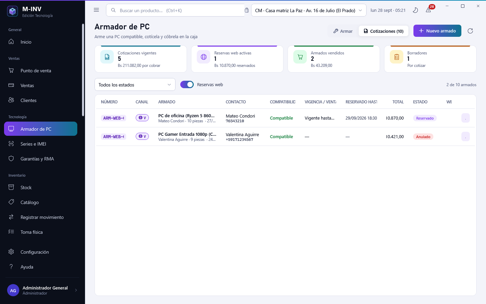
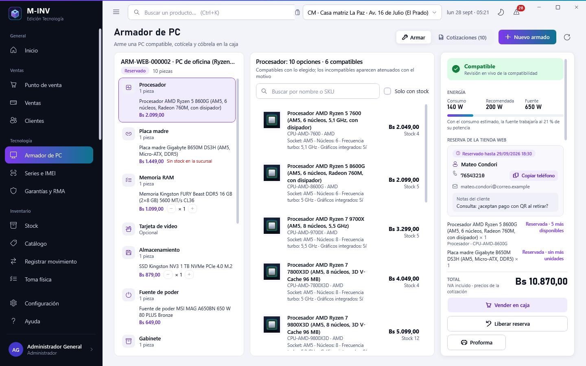
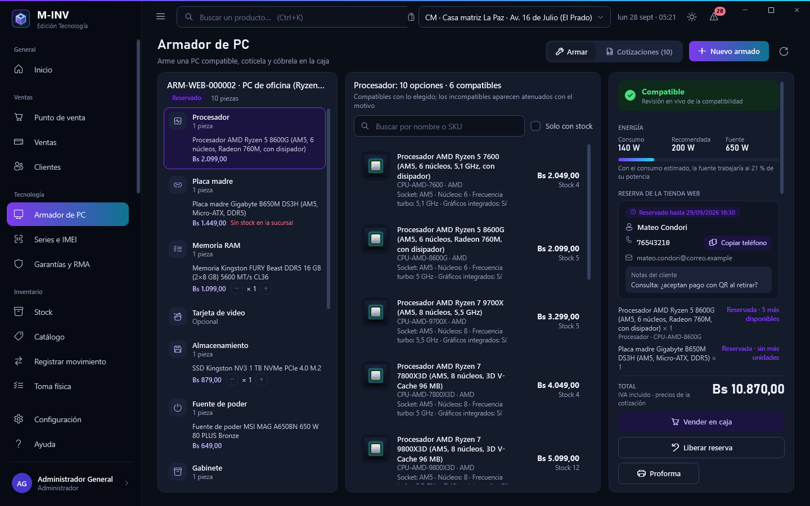
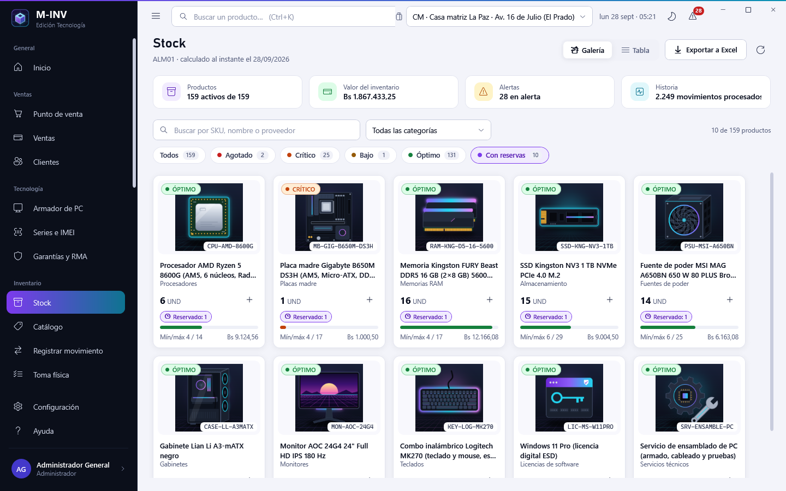

# Cliente de escritorio M-INV V6 · guía de la interfaz (tienda web conectada)

La V6 conserva todo el escritorio de la V4.2 (ver [`escritorio-v4.2.md`](escritorio-v4.2.md): armador de PC, series e
IMEI, garantías y RMA, tema gaming) y lo conecta con la **tienda web**: lo que un cliente **reserva** desde el armador de la
web aparece en el escritorio como una cotización **reservada** (con su contacto y su vencimiento), el stock reservado deja de
estar disponible en todas las pantallas y la caja **cobra la reserva** consumiéndola. El vendedor también puede reservar sus
propias cotizaciones y **publicar** armados sugeridos en la web. Reglas S-01 a S-10: `.claude/v6-storefront-rules.md`;
diseño: `docs/architecture/tienda-web-conectada-v6.md`.

- **Armador de PC › Cotizaciones**: columnas **Canal** (insignia «Web»), **Contacto**, **Reservado hasta** (resaltado si
  vence en menos de 6 h o ya venció) y **Web** (publicado); filtro rápido **Reservas web**, estado **Reservados** y la tarjeta
  **Reservas web activas**. Acciones según el estado y el permiso `sales.pcbuild.manage`: **Reservar stock**, **Liberar
  reserva**, **Vender en caja** (consume la reserva), **Publicar en la web** / **Quitar de la web**.
- **Stock, Catálogo y Punto de venta**: «Reservado: n» junto a las existencias; disponible = existencias − reservado; la caja
  muestra «Disponible n (reservado m)» y no deja cobrar más que lo disponible (el dominio lo rechaza; la pantalla lo avisa).
- **Inicio › Tecnología**: tarjeta **Reservas web activas** (cantidad y Bs) que abre el armador filtrado.

Las capturas nuevas de la V6 son las **99 a 102** (a continuación de las 81 a 98 de la V4.2) y salen de la empresa de prueba
Tech Zone Gaming: de la **base local** (`tools\build_v3.ps1 -Capturas` la usa cuando existe `usuarios-prueba.txt`, variable
`MINV_CAPTURAS_USUARIOS`) o, si no hay base, de la **demostración en memoria**; las dos traen armados publicados y reservas
web de ejemplo (una vigente y una vencida). Carpeta:
[`capturas/v6`](capturas/v6). Como en la V4.2, la aplicación elige un ejemplo real de sus datos para cada pantalla: sin
reservas web la lista se captura con su estado vacío y no hay detalle.

## 1. Armador de PC: reservas web

| Pantalla | Qué hace |
|---|---|
|  | **Cotizaciones** con el filtro rápido **Reservas web**: solo los armados que nacieron en la tienda web. Tarjetas: cotizaciones vigentes (incluye las reservadas), **Reservas web activas** (cantidad, Bs reservados y cuántas vencen en menos de 6 h), vendidos y borradores. Columnas nuevas: **Canal** (insignia «Web» con ícono; «Escritorio» para las del vendedor), **Contacto** (nombre y teléfono del cliente; el teléfono solo lo ve quien tiene `sales.pcbuild.manage`, regla S-06), **Reservado hasta** (ámbar con aviso si vence en menos de 6 h, rojo si ya venció y el trabajo automático todavía no la cerró) y **Web** («Publicado» para los armados sugeridos). El estado **Reservado** se filtra en la lista de estados. |
|  | **Abrir** una reserva web: las piezas quedan en sus ranuras con los **precios cotizados** (no se editan). El panel derecho muestra **Reserva de la tienda web**: vigencia («Reservado hasta…», «vence pronto» o «Reserva vencida el…»), el **contacto** (nombre, teléfono con **Copiar teléfono** para llamar o escribir por WhatsApp, correo) y las **notas del cliente**; debajo, cada pieza con su disponibilidad actual en la sucursal («Reservada · 2 más disponibles», «Reservada · sin más unidades»). Acciones: **Vender en caja** (la caja carga la reserva y avisa que la venta la consume: el stock reservado sale una sola vez, regla S-04), **Liberar reserva** (pide el motivo: el stock vuelve y el armado queda anulado) y **Proforma**. Una reserva web no se publica (es la reserva de un cliente). |



Sobre una **cotización propia** (canal Escritorio, cotizada y vigente) el panel ofrece además **Reservar stock**: pide las
horas (48 por defecto; 24, 72 o 168 sugeridas, de 1 a 720) y reserva cada pieza en la sucursal del armado, **todo o nada**:
si falta stock de alguna pieza no se reserva nada y el aviso dice qué piezas y cuánto hay (regla S-03). **Publicar en la web**
/ **Quitar de la web** publica un armado cotizado, reservado o vendido como **armado sugerido** de la tienda (la web muestra la
disponibilidad de cada pieza); la columna **Web** lo marca. Cada acción deja su fila en la bitácora del armado (reservado,
liberado, vencido, vendido, publicado, retirado).

## 2. Stock, catálogo y caja con lo reservado

| Pantalla | Qué hace |
|---|---|
|  | **Stock** con el chip **Con reservas** (cuenta los productos con unidades reservadas) y, en cada tarjeta, la insignia **Reservado: n** (la ayuda muestra lo disponible). En la tabla, la columna **Reservado** trae la insignia y «Disponible m» (existencias − reservado). La exportación a Excel agrega **Reservado** y **Disponible**. Las reservas son de armados web y del escritorio y de la caja; la **ficha del producto** ya mostraba Stock, Disponible y Reservado. |

- **Catálogo**: la galería y la tabla muestran «n UND · reservado m» en los productos con reservas.
- **Punto de venta**: la tarjeta del producto dice **«Disponible n (reservado m)»** (o «Agotado · reservado m»); al agregar
  más unidades que las disponibles la línea se marca «Supera lo disponible: hay n (m reservadas para armados)» y **Cobrar**
  avisa **Stock insuficiente** sin enviar la venta (la validación que manda sigue siendo la del dominio). **Desde armado** y
  **Vender en caja** también cargan **reservas** vigentes (web o escritorio): la banda del armado dice «Reserva … vigente hasta
  … · al cobrar se consume la reserva», sus líneas no se marcan como «supera lo disponible» (las unidades ya están apartadas)
  y el aviso de la venta cobrada agrega «reserva consumida: el stock reservado salió con la venta».

## 3. Inicio › Tecnología

La sección **Tecnología** del tablero (captura 81) suma la tarjeta **Reservas web activas**: cantidad de reservas web
vigentes y el total reservado en Bs; el clic (o el enlace **Reservas web** de la cabecera) abre **Armador de PC ›
Cotizaciones** con el filtro «Reservas web» puesto. La tarjeta **Armados cotizados vigentes** cuenta también los reservados.

## 4. Qué ve cada rol en la V6

| Rol | Reservas web en el armador | Reservar / liberar / publicar | Teléfono y correo del cliente | Reservado en stock, catálogo y caja |
|---|---|---|---|---|
| Administrador, Gerencia, Ventas, Cajero | ve la lista y el detalle | sí (`sales.pcbuild.manage`) | sí | sí |
| Bodega, Consulta | — (sin acceso al armador) | — | — | sí (stock y catálogo) |

## 5. Capturas

```powershell
powershell -ExecutionPolicy Bypass -File tools\build_v3.ps1 -Capturas   # genera todas las capturas en docs\product\capturas\v6
& "src\3. Presentation\MINV.DesktopClient\bin\Release\net8.0-windows\M-INV.exe" --capturas "$env:TEMP\minv-capturas" [--tema oscuro]   # en una carpeta temporal
```

Las 99 a 102 son las de la V6 (la 102 en el otro tema); las 01 a 98 son las de las versiones anteriores con los datos de la
empresa de prueba. En el repositorio solo se publican las nuevas de la V6; las demás siguen en `capturas/v4.2`.
