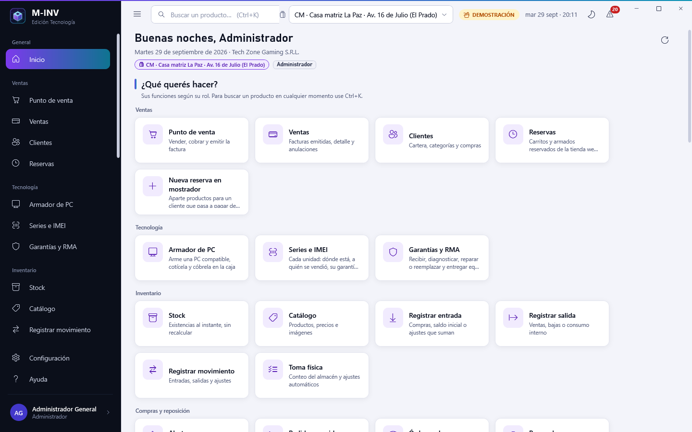
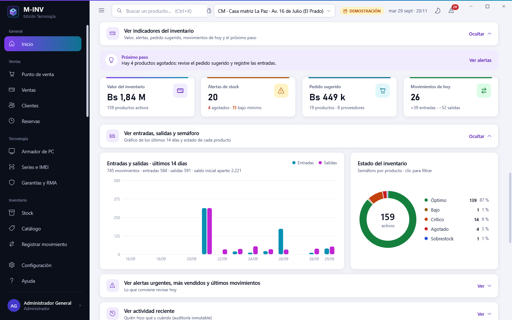
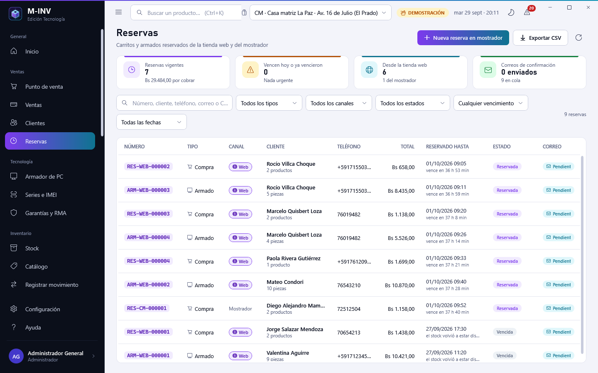
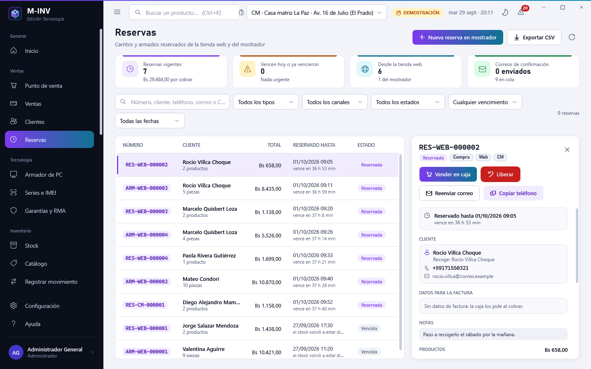
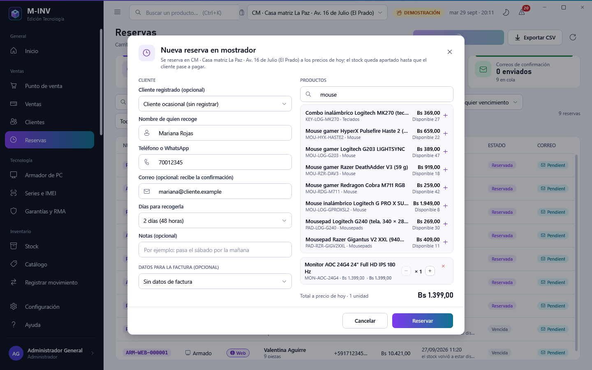
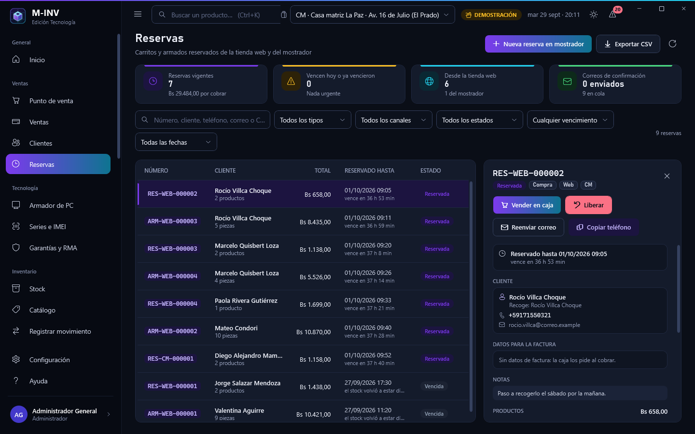
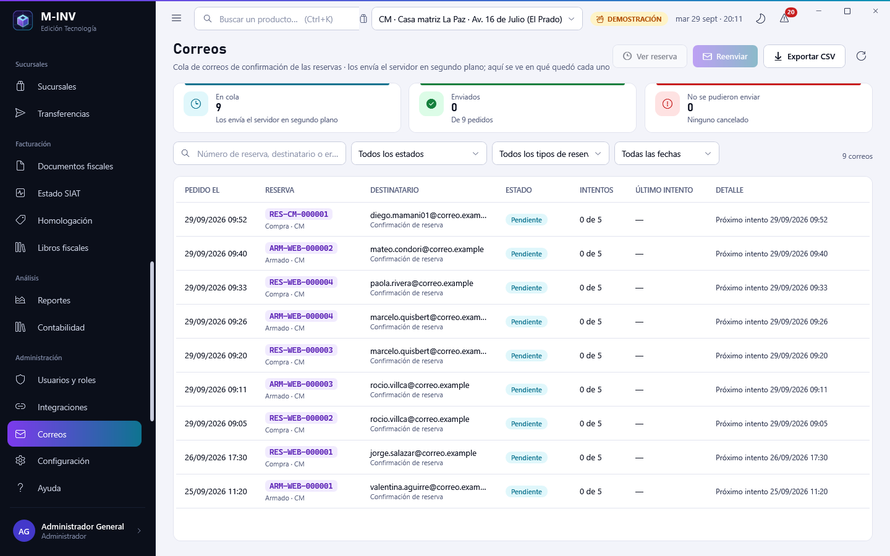
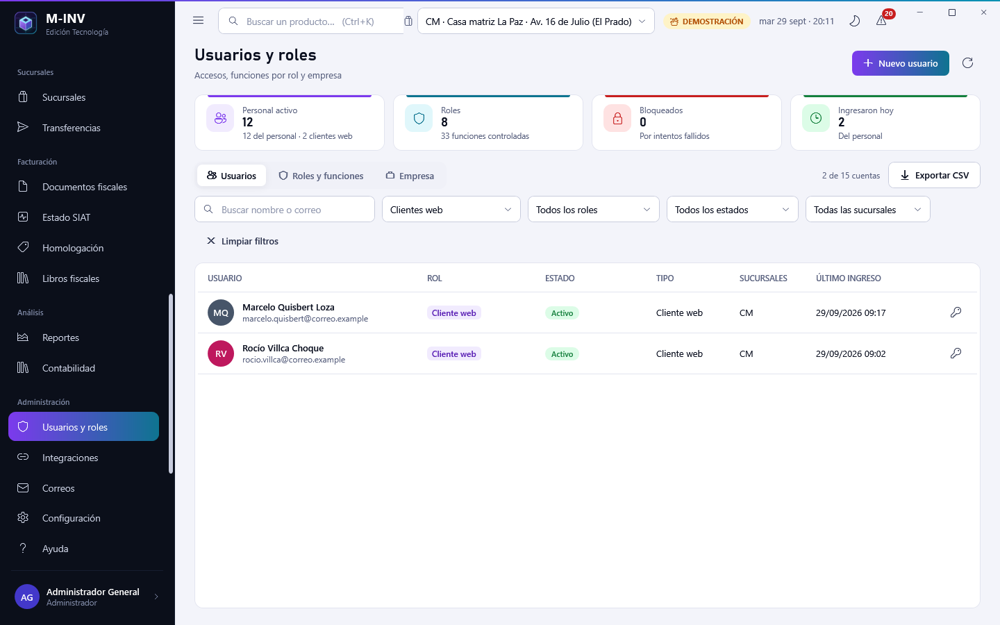

# Cliente de escritorio M-INV V7 · guía de la interfaz (reservas, inicio simplificado y filtros)

La V7 conserva todo el escritorio de la V6 (ver [`escritorio-v6.md`](escritorio-v6.md): armador de PC, reservas web del
armador, stock y caja con lo reservado) y agrega lo que el personal necesita para atender la **tienda web con carritos y
cuentas de cliente**: una pantalla **Reservas** para los carritos `RES-…` y los armados `ARM-…` reservados (de la web y del
mostrador), la **cola de correos** de confirmación, un **inicio simplificado** con botones grandes según el rol y **filtros en
listas desplegables con «Limpiar filtros» y «Exportar CSV»** en todas las listas de trabajo.

Reglas de la tienda: `.claude/v6-storefront-rules.md` (S-01 a S-10). Casos de uso de las reservas y el correo:
`docs/architecture/v7-notas/ventas-reservas.md` y `docs/architecture/v7-notas/correo-eventos.md`. Informe del paquete:
`docs/architecture/v7-notas/informe-D1-escritorio.md`.

Las capturas nuevas son las **103 a 110** (carpeta [`capturas/v7`](capturas/v7)); salen con
`M-INV.exe --capturas <carpeta>` de la demostración de Tech Zone Gaming (o de la base local con `MINV_CAPTURAS_USUARIOS`).

## 1. Inicio: «¿Qué querés hacer?»

| Pantalla | Qué hace |
|---|---|
|  | Saludo, fecha, **sucursal activa** y el rol. Debajo, **«¿Qué querés hacer?»**: un **botón grande** por cada función que el rol puede usar, agrupados como el menú (Ventas, Tecnología, Inventario, Compras y reposición, Sucursales, Facturación, Análisis, Administración y «Ayuda y preferencias»). Además de las pantallas hay atajos: **Nueva reserva en mostrador** (Ventas, con `sales.pcbuild.manage`: abre Reservas con el formulario listo), **Registrar entrada** y **Registrar salida** (Inventario, según el permiso de cada tipo). Un rol ve solo lo suyo: Ventas no ve Usuarios, Compras ni «Registrar entrada». |
|  | **Estadísticas**: los indicadores y gráficos de antes, en secciones plegables **«Ver … ⌄»** que empiezan **CERRADAS** y **no leen nada hasta abrirse** (el inicio abre al instante): *Ver indicadores del inventario* (valor, alertas, pedido sugerido, movimientos de hoy y el próximo paso), *Ver entradas, salidas y semáforo*, *Ver alertas urgentes, más vendidos y últimos movimientos*, *Ver actividad reciente* (con permiso de auditoría) y *Ver tablero Tecnología* (series, garantías, armados, reservas web y ventas de 30 días). El botón **«Ocultar ^»** la cierra y conserva lo leído; si los datos cambiaron mientras estaba cerrada, se vuelve a leer al abrirla. Una sección que falla muestra el aviso y **Reintentar** sin afectar al resto. |

La tarjeta **Reservas web activas** del tablero Tecnología cuenta todas las reservas vigentes de la tienda (carritos y
armados) y ahora abre **Ventas › Reservas** con el canal Web y las reservadas. «Armados cotizados» y «armados vendidos» cuentan
solo armados de PC (antes sumaban también los carritos).

## 2. Ventas › Reservas

Permiso: `sales.pcbuild.manage` (el teléfono, el correo y los datos de factura solo los ve ese permiso, regla S-06).

| Pantalla | Qué hace |
|---|---|
|  | Lista de **carritos `RES-…`** (siempre) y **armados `ARM-…`** que llegaron a reservarse, de la **web** y del **mostrador**. Primero las reservadas (la que vence antes arriba) y después las demás, de la más nueva a la más vieja. Columnas: **número**, **tipo** (Compra / Armado), **canal** (Web / Mostrador), **cliente** (y el contacto si es otro), **teléfono**, **total**, **reservado hasta** (ámbar si vence hoy o en menos de 6 h, rojo si ya venció y el trabajo automático todavía no la cerró), **estado** (Reservada, Vencida por cerrar, Vendida, Liberada, Vencida) y **estado del correo** de confirmación (En cola, Enviado, No se pudo enviar…). Tarjetas: reservas vigentes (Bs por cobrar), las que vencen hoy o ya vencieron, las de la tienda web y los correos. **Filtros** en listas desplegables: tipo, canal, estado, **vence** (hoy, mañana, vencidas), sucursal (si hay más de una), **fecha** de la reserva y búsqueda por número, cliente, teléfono (sin espacios), correo o documento; **Limpiar filtros** y **Exportar CSV**. |
|  | **Detalle**: productos con cantidad, precio congelado y subtotal; **datos para la factura** que dejó quien reservó (documento, complemento y razón social); **notas** del cliente; **bitácora** de la reserva (creada, reservada, correo, liberada, vendida…) y los **correos** enviados o en cola con sus intentos. Botones: **Vender en caja** (la caja carga la reserva y la venta la consume: el stock sale una sola vez, regla S-04), **Liberar** (pide el motivo; sin motivo avisa y no libera; el stock vuelve), **Reenviar correo** (propone el correo de la reserva y admite **otro** si el cliente escribió mal el suyo), **Copiar teléfono** (para llamar o escribir por WhatsApp). |
|  | **Nueva reserva en mostrador** (`ReserveCartCommand`, en la sucursal activa): cliente registrado (completa nombre, teléfono y correo) u ocasional, **nombre** y **teléfono** obligatorios, correo opcional (si hay, sale la confirmación), **productos con buscador** (SKU, nombre, categoría o código de barras; cantidades con + y −, aviso si se pide más que lo disponible), **días para recoger** (1, 2 o 3) y, opcional, los **datos para la factura**. La reserva es **todo o nada**: si falta stock de algo no se reserva nada y el aviso lo dice. Al guardar, la nueva queda elegida en la lista. |

**Caja con los datos de la reserva**: al cobrar una reserva que trae datos de factura, la caja **precarga el comprador** (tipo y
número de documento, complemento y nombre) si el cajero no había escrito otro; si el cajero los cambia, manda lo que escribió.
Si el cajero quita la reserva del carrito sin haber tocado el comprador, el formulario se limpia.

## 3. Administración › Correos

| Pantalla | Qué hace |
|---|---|
|  | La **cola de correos** de confirmación de las reservas (`GetOutgoingMailsQuery`): reserva, tipo de correo, destinatario, estado, intentos, último intento y el error si lo hubo. Tarjetas: en cola, enviados y los que no se pudieron enviar. Filtros: **estado** (pendientes, enviados, agotados, cancelados), tipo de reserva, sucursal, fecha y búsqueda; **Limpiar filtros** y **Exportar CSV**. Botones: **Reenviar** (a ese u otro correo; solo si la reserva sigue vigente) y **Abrir la reserva** (va a Reservas con esa reserva elegida). |

## 4. Usuarios: personal y clientes web

| Pantalla | Qué hace |
|---|---|
|  | Filtro **Tipo de cuenta**: **Personal** (por defecto), **Clientes web** (las cuentas que los clientes crean en la tienda) y **Cuenta técnica de la tienda**; además rol, estado (activos, inactivos, bloqueados, deben cambiar la clave) y sucursal en listas, búsqueda, **Limpiar filtros** y **Exportar CSV** (sin contraseñas). Columnas nuevas **Tipo** y **Sucursales**. Solo el personal se **edita**; a la cuenta técnica no se le cambia la clave (la usa el servidor de la tienda). El alta de usuarios **no ofrece** los roles «Cliente web» ni «Tienda web». Los indicadores cuentan al personal. El escritorio **no deja entrar** con una cuenta de cliente web (aviso claro en el inicio de sesión). |

## 5. Filtros y exportación en todas las listas

Todas las listas de trabajo tienen sus atributos en **listas desplegables** (no hay que escribir para filtrar), un botón
**Limpiar filtros** que aparece cuando hay algo filtrado y **Exportar CSV** con lo que la lista muestra:

| Pantalla | Filtros (listas desplegables) |
|---|---|
| Stock | categoría, **proveedor**, chips de estado y «Con reservas», búsqueda |
| Catálogo | categoría, estado, **proveedor**, **marca**, alerta; columnas Marca, Reservado y Disponible en el CSV |
| Ventas | período, **cliente**, medio de pago, cajero, estado, **estado fiscal**; la pestaña Devoluciones también se filtra con la búsqueda |
| Clientes | **estado** (activos, inactivos), **tipo de comprador** (con NIT, con CI, sin documento…) |
| Proveedores | **estado**, **órdenes abiertas** (con, sin), búsqueda por nombre, código, NIT o contacto; columna Estado |
| Órdenes de compra | estado, proveedor, **fecha de la orden**, búsqueda por número o proveedor |
| Transferencias | estado, **sucursal de origen**, **sucursal de destino**, **fecha de la solicitud**, búsqueda |
| Series e IMEI | estado, sucursal, **garantía** (vigente, vencida, sin venta), búsqueda |
| Garantías y RMA | chips de estado, **sucursal**, **cobertura** (en garantía, con cargo), búsqueda por caso, serie, producto, cliente o falla |
| Documentos fiscales | período, estado, tipo, **sucursal**, **punto de venta**, **tipo de emisión** (en línea, fuera de línea), búsqueda |
| Actividad | chips de resultado, **usuario**, **acción** (en español), **fecha**, búsqueda |
| Usuarios | **tipo de cuenta**, rol, **estado**, **sucursal**, búsqueda |
| Reservas y Correos | ver las secciones 2 y 3 |

**El archivo CSV** (servicio compartido `Services/CsvExport.cs`): **UTF-8 con BOM** (Excel muestra bien los acentos y la «ñ»),
separador **«;»** (Excel en español lo abre en columnas), números con la coma decimal y sin separador de miles, fechas
`dd/MM/aaaa` y horas locales, «Sí/No». Los textos que empiezan como una fórmula (`=`, `+`, `-`, `@`, tabulador, retorno o sus
variantes de ancho completo) se escriben con un **apóstrofo delante**, así Excel nunca los evalúa (regla de OWASP contra la
inyección en CSV). Si el archivo está abierto en Excel, el aviso pide cerrarlo o elegir otra carpeta; si la lista está vacía,
avisa que no hay nada que exportar.

## 6. Arreglos visibles

- **Transferencias**: «Nueva transferencia» vuelve a abrir su panel; «Recibir» ya no usa el detalle de la transferencia
  anterior; la bitácora muestra la hora local (antes la UTC, cuatro horas adelantada); anular sin motivo avisa.
- **Garantías**: las acciones ya no se aplican al caso anterior mientras carga el nuevo; agregar una nota confirma y avisa si
  está vacía; «Sin garantía» ya no aparece en rojo como si hubiera vencido.
- **Series**: al llegar desde un caso RMA o la caja se quitan los demás filtros (la serie buscada aparecía oculta).
- **Documentos fiscales**: «Ver documento» y «Anular» desde Ventas funcionan también si el documento no estaba en la lista.
- **Armador › Cotizaciones**: solo armados de PC (los carritos están en Reservas); el bloque «Reserva y contacto» se ve en
  toda reserva, también las del mostrador sin contacto.
- **Caja**: textos de «Reserva o armado» para carritos; precarga del comprador de la reserva.
- **Registrar movimiento**: al llegar con un producto (Alertas, ficha) queda ese producto, no el anterior; muestra lo reservado
  para clientes.
- **Alertas**: «Registrar entrada» solo para quien puede registrarla.
- **Actividad**: las acciones de la tienda web y las reservas tienen su nombre en español.
- **Sucursales**: la asignación de usuarios muestra el nombre del rol (no el código) y solo al personal.
- Mensajes para personas en vez de textos técnicos en la impresión de la proforma, el PDF y el rollo fiscal.
